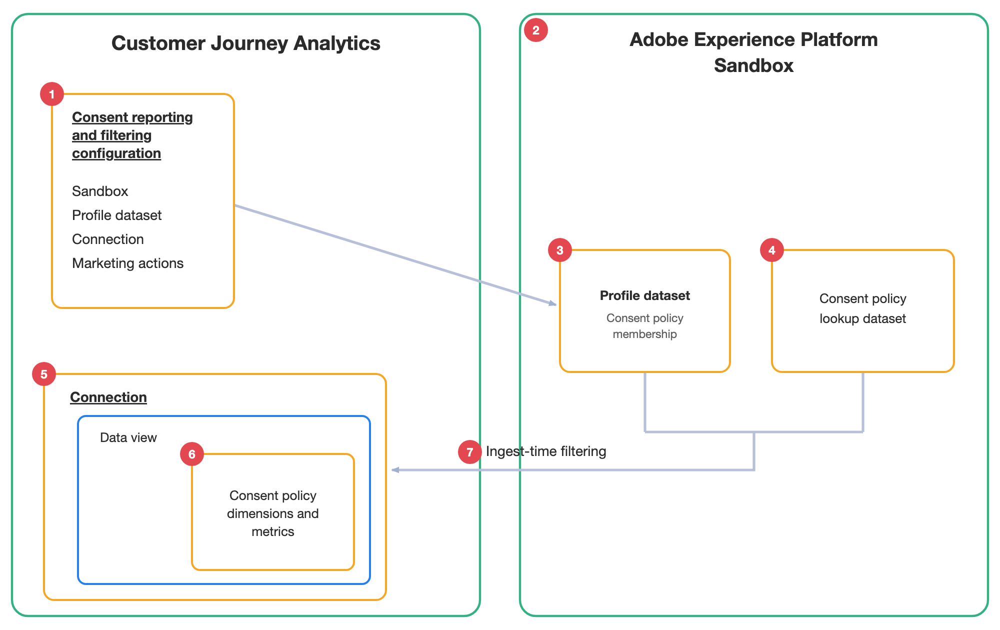

# 同意报告和筛选概述

同意报告和筛选使用存储在您的Adobe Experience Platform配置文件数据集中的同意策略成员资格数据来帮助您报告访客同意，并可以选择在未经同意的访客数据被摄取到Customer Journey Analytics之前排除这些访客。

## 先决条件

在配置同意报告和筛选之前，请确保：

* 您的组织已获得许可Adobe Healthcare Shield或Privacy &amp; Security Shield。
* 您在Customer Journey Analytics中拥有系统管理员权限。
* 您要使用的沙盒包含在`consentPoliciesIDMap`字段中具有同意策略成员资格数据的配置文件数据集。
* 要配置的连接已存在。 有关详细信息，请参阅[创建或编辑连接](/help/connections/create-connection.md)。

下图和相关表从较高层面说明了同意报告和筛选如何使同意策略数据在Analysis Workspace中可用并在引入时筛选访客数据：

| 数值 | 功能 | 功能 |
|---------|----------|---------|
| 1 | 同意报告和筛选配置 | Customer Journey Analytics中的配置界面用于启用同意报表和（可选）同意过滤。 |
| 2 | 沙盒 | 必须包含用户档案数据集，该数据集包含要报告的同意策略成员资格数据。 |
| 3 | 轮廓数据集 | 包括每个访客的同意策略成员资格数据。 同意策略成员资格存储在用户档案数据集的`consentPoliciesIDMap`字段中。 此用户档案数据集将添加到您选择的连接。 
每个访客的配置文件均列出访客匹配的同意策略。 Customer Journey Analytics会读取此字段以使同意策略可用于报告，并评估在摄取期间要包括哪些访客。
 |
| 4 | 同意策略查找数据集 | 为报表提供友好的策略名称和描述。 查找数据集是自动创建的，并与Experience Platform保持同步。 每个沙盒最多存在一个同意策略查找数据集。 |
| 5 | 连接 | 应用同意报告和筛选的连接。 连接下的所有数据视图都继承配置。 |
| 6 | 同意策略组件 | 表示同意策略成员资格的新维度、量度和派生字段。 这些组件是自动创建的，可以在Analysis Workspace中生成报表。 |
| 7 | 摄取时间过滤 | 启用筛选后，将根据您配置的营销操作，在摄取期间排除非同意访客。 |

## 同意报表与筛选

同意报告和筛选是两项单独的功能。 您可以自行启用同意报告，也可以同时启用报告和过滤。

### 同意报告

当您启用同意报告时，Customer Journey Analytics会根据配置的连接，将一组同意策略组件添加到数据视图。 通过这些组件，您可以使用Analysis Workspace配置文件数据集中的同意策略成员资格数据，报告哪些访客匹配各种同意策略。

为了保持报表可读性，Customer Journey Analytics会将Experience Platform中的策略名称和描述同步到同意策略查找数据集中。 在Experience Platform中创建、更新、重命名或删除策略时，查找数据集会自动更新。

有关同意报告创建的组件的信息，请参阅[分析同意策略数据](/help/connections/consent-reporting-filtering/consent-analyze.md)。

### 同意筛选

>[!IMPORTANT]
>
>过滤（排除）的同意数据不会存储在Customer Journey Analytics中，并且无法通过更新配置恢复过去日期的同意数据。

当您启用同意过滤时，Customer Journey Analytics会在引入时排除非同意访客。 由于过滤发生在摄取时，因此排除的访客的数据不会进入Customer Journey Analytics，并且无法用于报表。

使用同意过滤时，请考虑以下事项：

* Customer Journey Analytics确定适用于您配置的营销操作的同意政策。

  营销活动表示数据使用的类别。 Customer Journey Analytics确定哪些同意策略适用于每个营销操作，并且您在[创建配置](/help/connections/consent-reporting-filtering/consent-configure.md#create-a-configuration)时独立地为每个营销操作启用筛选。

  | 营销操作 | 描述 |
  |---------|----------|
  | **[!UICONTROL Analytics]** | Analysis Workspace中的标准Customer Journey Analytics报表。 |
  | **[!UICONTROL 数据科学]** | 高级分析、机器学习和数据科学用例。 |

* 仅当访客与&#x200B;**所有**&#x200B;适用的同意策略匹配时才会摄取访客的数据。 如果访客缺少任何适用的策略，则会排除该访客的数据。

## 配置同意报告和筛选

在配置同意报告和筛选时，您可以选择包含同意策略成员资格数据的沙盒和配置文件数据集，选择要配置的连接或连接，并选择是否筛选每个营销操作的数据。 然后，Customer Journey Analytics会自动创建同意策略查找数据集和同意策略组件。

有关详细信息，请参阅[配置同意报告和筛选](/help/connections/consent-reporting-filtering/consent-configure.md)。

## 管理同意报告和筛选配置

您可以在创建同意报告和筛选配置后对其进行管理。 您可以查看、编辑和删除配置。

有关管理现有配置的信息，请参阅[管理同意报告和筛选配置](/help/connections/consent-reporting-filtering/consent-manage.md)。

## 分析同意策略数据

利用Customer Journey Analytics中提供的同意策略数据，您可以报告哪些访客与哪些同意策略匹配，并使用该insight了解报告中的同意受众。

有关详细信息，请参阅[分析同意策略数据](/help/connections/consent-reporting-filtering/consent-analyze.md)。

## 同意报告和筛选角色和权限要求

同意报告和筛选需要以下Customer Journey Analytics角色和Experience Platform权限：

| 功能 | Customer Journey Analytics角色或权限要求 | Experience Platform权限要求 |
|---------|----------|----------|
| [创建同意报告和筛选配置](/help/connections/consent-reporting-filtering/consent-configure.md) | 系统管理员 | <ul><li>数据集：读取、写入</li><li>架构：读取、写入</li></ul> 
包含同意策略成员资格数据的用户档案数据集需要读取权限。 需要写入权限，因为会创建同意策略查找数据集并保持同步。
 |
| 在数据视图中查看同意策略组件 | 数据视图所分配到的产品配置文件的产品配置文件管理员 
有关详细信息，请参阅[访问控制](/help/technotes/access-control.md)。
 | 不适用 |
| 在Analysis Workspace中使用同意策略组件 | 访问添加了同意策略组件的数据视图 | 不适用 |

## 同意报告和筛选用例

例如，突出显示同意报告和筛选提供的值的用例，请参阅[同意报告和筛选用例](/help/connections/consent-reporting-filtering/consent-use-cases.md)。

## 同意报告和筛选限制

在[配置同意报告和筛选](/help/connections/consent-reporting-filtering/consent-configure.md)时，请考虑以下限制：

* 单个沙盒只能有一个同意策略查找数据集。 同一沙盒中的多个配置共享该查找数据集。

* 一个连接只能与一个同意报告和筛选配置相关联。
