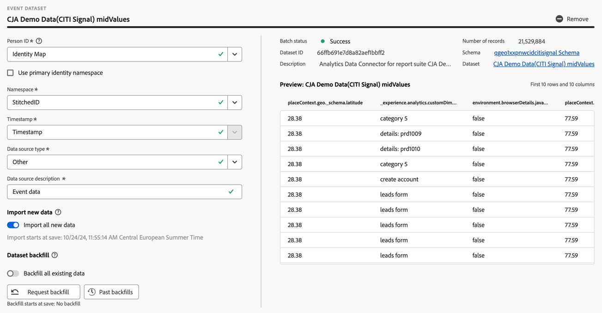
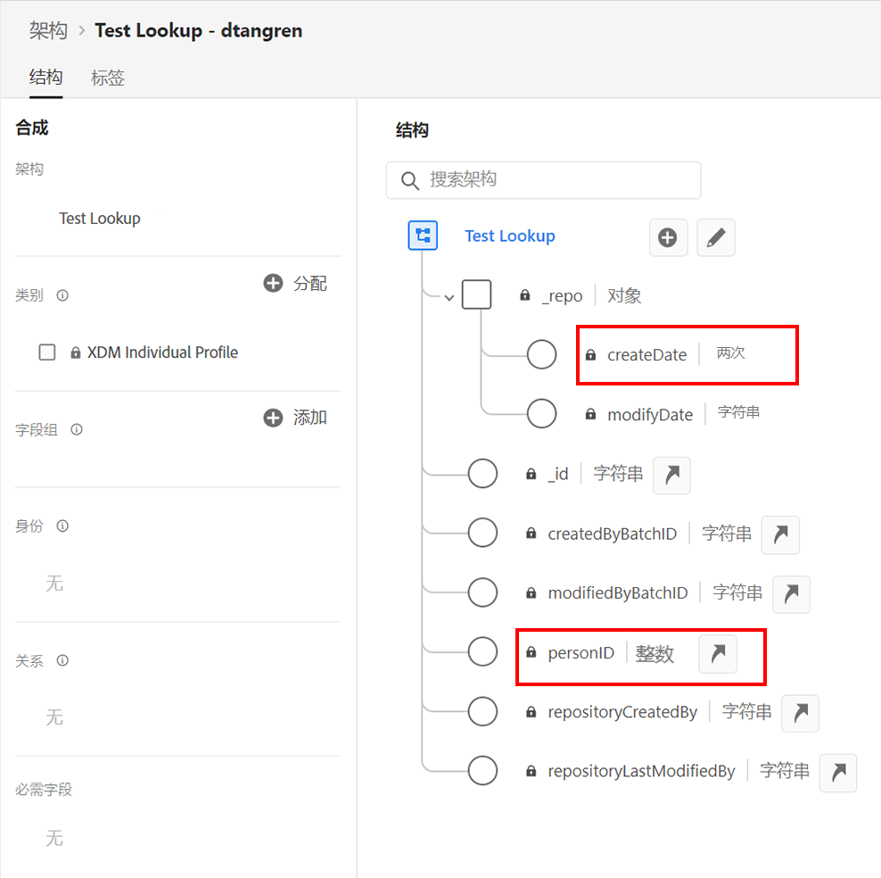
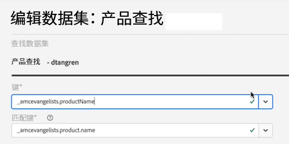

# 创建或编辑连接 {#create-or-edit-a-connection}

>[!CONTEXTUALHELP]
>id="cja_connections_recordsadded"
>title="添加的记录数"
>abstract="在所选数据集的所选时间间隔期间添加到连接的记录数（行数）。"

>[!CONTEXTUALHELP]
>id="cja_connections_recordsskipped"
>title="跳过的记录数"
>abstract="在所选数据集的所选时间间隔期间为连接传输数据期间跳过的记录数（行数）。"

>[!CONTEXTUALHELP]
>id="cja_connections_recordsdeleted"
>title="删除的记录数"
>abstract="在所选时间间隔期间为所选数据集从连接删除的记录数（行数）。"

>[!CONTEXTUALHELP]
>id="cja_connection_lastadded"
>title="上次添加"
>abstract="从任何数据集传输到连接的最新批次的时间戳。"

>[!CONTEXTUALHELP]
>id="cja_connection_enablerollingdatawindow"
>title="启用滚动数据窗口"
>abstract="在连接级别将数据保留定义为以月为单位的滚动窗口。"

>[!CONTEXTUALHELP]
>id="cja_connection_averagenumberofdailyuses"
>title="平均每日使用次数"
>abstract="选择整个连接的预期每日事件数的范围。"

>[!CONTEXTUALHELP]
>id="connections_recordsadded"
>title="添加的记录数"
>abstract="在所选数据集的所选时间间隔期间添加到连接的记录数（行数）。"

>[!CONTEXTUALHELP]
>id="connections_recordsskipped"
>title="跳过的记录数"
>abstract="在所选数据集的所选时间间隔期间为连接传输数据期间跳过的记录数（行数）。"

>[!CONTEXTUALHELP]
>id="connections_recordsdeleted"
>title="删除的记录数"
>abstract="在所选数据集在所选时间间隔期间从连接删除的记录数（行数）"

>[!CONTEXTUALHELP]
>id="connection_lastadded"
>title="上次添加"
>abstract="从任何数据集传输到连接的最新批次的时间戳。"

>[!CONTEXTUALHELP]
>id="connection_enablerollingdatawindow"
>title="启用滚动数据窗口"
>abstract="在连接级别将数据保留定义为以月为单位的滚动窗口。"

>[!CONTEXTUALHELP]
>id="connection_averagenumberofdailyuses"
>title="平均每日使用次数"
>abstract="选择整个连接的预期每日事件数的范围。"

>[!CONTEXTUALHELP]
>id="connection_change_personid"
>title="更改人员 ID"
>abstract="在应用更改后，修改数据集上的身份拼接设置将影响人员ID设置。 更改人员 ID 会删除连接中的所有现有数据。您必须基于新的人员 ID 重新从数据集摄取数据。<br/><br/>当您选择&#x200B;**[!UICONTROL 继续]**&#x200B;时，在删除过程完成之前，报表可能会出现延迟。"

>[!CONTEXTUALHELP]
>id="connection_change_accountid"
>title="更改帐户 ID"
>abstract="更改帐户 ID 会删除连接中的所有现有数据，并根据新的帐户 ID 重新提取数据集中的所有数据。此操作可能会产生成本影响。<br/><br/>当您选择&#x200B;**[!UICONTROL 继续]**&#x200B;时，报告可能会延迟，直到该过程完成。"

>[!CONTEXTUALHELP]
>id="connection_change_globalaccountid"
>title="更改全局帐户 ID"
>abstract="更改全局 ID 会删除连接中的所有现有数据，并根据新的全局 ID 重新提取数据集中的所有数据。此操作可能会产生成本影响。<br/><br/>当您选择&#x200B;**[!UICONTROL 继续]**&#x200B;时，报告可能会延迟，直到该过程完成。"

>[!CONTEXTUALHELP]
>id="connection_change_opportunityid"
>title="更改机会 ID"
>abstract="更改机会 ID 会删除连接中的所有现有数据，并根据新的机会 ID 重新提取数据集中的所有数据。此操作可能会产生成本影响。<br/><br/>当您选择&#x200B;**[!UICONTROL 继续]**&#x200B;时，报告可能会延迟，直到该过程完成。"

>[!CONTEXTUALHELP]
>id="connection_change_buyinggroupid"
>title="更改购买群组 ID"
>abstract="更改购买群组 ID 会删除连接中的所有现有数据，并根据新的购买群组 ID 重新提取数据集中的所有数据。此操作可能会产生成本影响。<br/><br/>当您选择&#x200B;**[!UICONTROL 继续]**&#x200B;时，报告可能会延迟，直到该过程完成。"

>[!CONTEXTUALHELP]
>id="connection_change_persistentid"
>title="更改持久 ID"
>abstract="更改永久性 ID 会删除连接中的所有现有数据，并根据新的永久性 ID 重新摄取数据集中的所有数据。此操作可能会产生成本影响。<br/><br/>当您选择&#x200B;**[!UICONTROL 继续]**&#x200B;时，报告可能会延迟，直到该过程完成。"


<!-- Start of contextual help entries for CJA connection dialogs -->

>[!CONTEXTUALHELP]
>id="connections_useincja_exl_ajo"
>title="在 Customer Journey Analytics 中使用此连接"
>abstract="此选项允许您将 Customer Journey Analytics 的高级报告功能与 Journey Optimizer 连接结合使用。这些功能允许您：<ul><li>在 Customer Journey Analytics 中对 Journey Optimizer 数据进行深入分析。</li><li>编辑 Journey Optimizer 连接和相关联的数据视图。</li><li>分析历程事件、对话路径和营销活动绩效。</li></ul>**启用此选项后，连接中的每一行数据每月都会计入您的 Customer Journey Analytics 的许可数据行，并显示在连接使用情况 UI 中。**<br><br/>&#x200B;只有在您熟悉关于在 Customer Journey Analytics 中额外使用数据行的情况下，才浏览此选项。[了解详情](https://experienceleague.adobe.com/zh-hans/docs/analytics-platform/using/integrations/ajo)。"

>[!CONTEXTUALHELP]
>id="connections_disableuseincja_exl_ajo"
>title="从 Customer Journey Analytics 中移除此连接"
>abstract="此 Journey Optimizer 连接目前正在 Customer Journey Analytics 中使用。这类连接允许您：<ul><li>在 Customer Journey Analytics 中对 Journey Optimizer 数据进行深入分析。</li><li>编辑 Journey Optimizer 连接和相关联的数据视图。</li><li>分析历程事件、对话路径和营销活动绩效。</li></ul>**如果您移除此连接，就无法在 Customer Journey Analytics 中进行深入分析。此连接和任何相关联的数据视图都被重置为其默认状态，无法再编辑。**<br/><br/>**Customer Journey Analytics 中此连接的计费包括此连接被移除的整月。**<br/><br/>&#x200B;此连接在 Journey Optimizer 中保持启用状态。[了解详情](https://experienceleague.adobe.com/zh-hans/docs/analytics-platform/using/integrations/ajo)。"

>[!CONTEXTUALHELP]
>id="connections_useincja_exl_brand_concierge"
>title="在 Customer Journey Analytics 中使用此连接"
>abstract="此选项允许您将 Customer Journey Analytics 的高级报告功能与您的 Brand Concierge 连接一起使用。这些功能允许您：<ul><li>在 Customer Journey Analytics 中对 Brand Concierge 数据进行深入分析。</li><li>编辑 Brand Concierge 连接和相关联的数据视图。</li><li>分析对话式参与度、情绪和转化量度。</li></ul>**启用此选项后，连接中的每一行数据每月都会计入您的 Customer Journey Analytics 的许可数据行，并显示在连接使用情况 UI 中。**<br><br/>&#x200B;只有在您熟悉关于在 Customer Journey Analytics 中额外使用数据行的情况下，才浏览此选项。[了解详情](https://experienceleague.adobe.com/zh-hans/docs/analytics-platform/using/cja-workspace/templates/use-templates#brand-concierge-templates)。"

>[!CONTEXTUALHELP]
>id="connections_disableuseincja_exl_brand_concierge"
>title="从 Customer Journey Analytics 中移除此连接"
>abstract="此 Brand Concierge 连接当前用于 Customer Journey Analyics。这类连接允许您：<ul><li>在 Customer Journey Analytics 中对 Brand Concierge 数据进行深入分析。</li><li>编辑 Brand Concierge 连接和相关联的数据视图。</li><li>分析对话式参与度、情绪和转化量度。</li></ul>**如果您移除此连接，就无法在 Customer Journey Analytics 中进行深入分析。此连接和任何相关联的数据视图都被重置为其默认状态，无法再编辑。**<br/><br/>**Customer Journey Analytics 中此连接的计费包括此连接被移除的整月。**<br/><br/>&#x200B;此连接在 Brand Concierge 中保持启用状态。[了解详情](https://experienceleague.adobe.com/zh-hans/docs/analytics-platform/using/cja-workspace/templates/use-templates#brand-concierge-templates)。"

>[!CONTEXTUALHELP]
>id="connections_useincja_exl_product_usage"
>title="在 Customer Journey Analytics 中使用此连接"
>abstract="此选项允许您将 Customer Journey Analytics 的高级报告功能与您的产品使用情况连接一起使用。这些功能允许您：<ul><li>在 Customer Journey Analytics 中对产品使用情况数据进行深入分析。</li><li>编辑产品使用情况连接和相关数据视图。</li></ul>**启用此选项后，连接中的每一行数据每月都会计入您的 Customer Journey Analytics 的许可数据行，并显示在连接使用情况 UI 中。**<br><br/>&#x200B;只有在您熟悉关于在 Customer Journey Analytics 中额外使用数据行的情况下，才浏览此选项。[了解详情](https://experienceleague.adobe.com/zh-hans/docs/analytics-platform/using/tools/product-usage/usage-overview)。"

>[!CONTEXTUALHELP]
>id="connections_disableuseincja_exl_product_usage"
>title="从 Customer Journey Analytics 中移除此连接"
>abstract="此产品使用情况连接当前用于 Customer Journey Analyics。这类连接允许您：<ul><li>在 Customer Journey Analytics 中对产品使用情况数据进行深入分析。</li><li>编辑产品使用情况连接和相关数据视图。</li></ul>**如果您移除此连接，就无法在 Customer Journey Analytics 中进行深入分析。此连接和任何相关联的数据视图都被重置为其默认状态，无法再编辑。**<br/><br/>**Customer Journey Analytics 中此连接的计费包括此连接被移除的整月。**<br/><br/>&#x200B;此连接为产品使用情况保持启用状态。[了解详情](https://experienceleague.adobe.com/zh-hans/docs/analytics-platform/using/tools/product-usage/usage-overview)。"

>[!CONTEXTUALHELP]
>id="connections_useincja_legal_section_section"
>title="法律影响"
>abstract="使用 Customer Journey Analytics 可能会基于集成数据量而产生额外费用。请查看[关于 Customer Journey Analytics 计费和使用的详细信息](https://experienceleague.adobe.com/zh-hans/docs/analytics-platform/using/cja-connections/manage-connections#connections-usage)"


>[!CONTEXTUALHELP]
>id="connections_useincja_exl_ajo_learn_more"
>title="了解详情"
>abstract="[了解详情](https://experienceleague.adobe.com/zh-hans/docs/analytics-platform/using/cja-connections/manage-connections#connections-usage)。"

>[!CONTEXTUALHELP]
>id="connections_useincja_exl_brand_concierge_learn_more"
>title="了解详情"
>abstract="[了解详情](https://experienceleague.adobe.com/zh-hans/docs/analytics-platform/using/cja-workspace/templates/use-templates#brand-concierge-templates)。"

>[!CONTEXTUALHELP]
>id="connections_useincja_exl_product_usage_learn_more"
>title="了解详情"
>abstract="[了解详情](https://experienceleague.adobe.com/zh-hans/docs/analytics-platform/using/tools/product-usage/usage-overview)。"

<!-- End of contextual help entries for CJA connection dialogs -->


连接创建和编辑工作流体验通过辅助工作流将所有数据集和连接配置设置引入屏幕中心。它提供详细的数据集选择、配置和审查体验。并允许您指定关键信息，如[数据集类型](#dataset-types)、大小、架构、数据集 ID、批处理状态、回填状态、身份标识等，以降低错误连接配置的风险。以下是功能概述：

* 您可以在创建连接时启用滚动数据保留窗口。
* 您可以在连接中添加和删除数据集。（删除数据集会将其从连接中删除，并影响任何关联的数据视图和基础 Analysis Workspace 项目。）
* 您可以为每个数据集启用和请求回填数据。
* 您可以编辑数据集，例如请求另一个回填。
* 您可以按数据集导入现有数据。


>[!BEGINSHADEBOX]

请参阅  [创建并编辑连接](https://video.tv.adobe.com/v/343044/?quality=12&learn=on){target="_blank"}以获取演示视频。

>[!ENDSHADEBOX]


## 先决条件

可添加到连接的数据集数量上限为 100。具体的混合方式取决于您公司购买的 Customer Journey Analytics 包。

如果您不确定您拥有的是哪个 Customer Journey Analytics 包，请联系您的管理员。

| **Select** 包 | **Foundation** 包 |
| --- | --- |
| 事件、轮廓、查找或摘要数据集（最多 100 个）的任意组合 | 每个连接一个事件数据集 |
|  | 每个连接最多 99 个轮廓、查看或摘要数据集 |

{style="table-layout:auto"}

## 创建连接 {#create-connection}

要创建连接：

1. 在 Customer Journey Analytics 的顶部菜单中选择&#x200B;**[!UICONTROL 连接]**，也可以从&#x200B;**[!UICONTROL 数据管理]**&#x200B;中选择。
1. 选择&#x200B;**[!UICONTROL 创建新连接]**。

您现在可以[编辑连接的详细信息](#edit-a-connection)。

## 编辑连接 {#edit-connection}

如何编辑连接取决于您获得许可证的 Customer Journey Analytics 包：

* [Customer Journey Analytics](#customer-journey-analytics)
* [Customer Journey Analytics B2B Edition](#customer-journey-analytics-b2b-edition)

### Customer Journey Analytics

在&#x200B;**[!UICONTROL 连接]** > **[!UICONTROL *连接的名称&#x200B;*]**屏幕中：


1. 配置连接设置。

   | 设置 | 描述 |
   | --- | --- |
   | **[!UICONTROL 连接名称]** | 输入连接的唯一名称。 |
   | **[!UICONTROL 连接说明]** | 描述这种连接的目的。 |
   | **[!UICONTROL 标记]** | 指定标记，将标记添加到您的连接，这样您就可以稍后使用这些标记搜索连接。 |
   | **[!UICONTROL 启用滚动数据窗口]** | 如果选中此复选框，那么您可以在连接级别将 Customer Journey Analytics 数据保留定义为以月计的时段（1 个月、3 个月、6 个月等）。<p>数据保留基于事件数据集时间戳并且仅适用于事件数据集。由于没有适用的时间戳，因此轮廓或查找数据集不存在滚动数据窗口设置。但是，如果您的连接包括任何轮廓或查找数据集（一个或多个事件数据集除外），则该数据会在相同的时段内进行保存。<p> 主要好处是，您只需存储或报告适用且有用的数据，并且可删除不再有用的旧数据。它可以帮助您保持在合同限制范围内，并减少超出预期成本的风险。<p><ul><li>如果您保留默认值（未选中），Adobe Experience Platform 数据保留设置将取代保留期。如果您在 Experience Platform 中有 25 个月的数据，那么 Customer Journey Analytics 会通过回填获取 25 个月的数据。如果您在 Experience Platform 中删除了其中的 10 个月，Customer Journey Analytics 会保留剩余的 15 个月。</li><li>如果启用了一个滚动数据窗口，请在&#x200B;**[!UICONTROL 选择月数]**&#x200B;中指定您启用此滚动数据窗口的月数。 |
   | **[!UICONTROL 沙盒]** | 在 Experience Platform 中选择一个其中包含了您想为其创建连接的数据集的沙盒。<p>Adobe Experience Platform 提供了可将单个 Platform 实例划分为多个单独的虚拟环境的[沙盒](https://experienceleague.adobe.com/zh-hans/docs/experience-platform/sandbox/home)，以帮助开发和改进数字体验应用程序。您可以将沙盒视为包含数据集的“数据孤岛”。沙盒可用于控制对数据集的访问。<p>选择沙盒后，左边栏会显示可从该沙盒中提取的所有数据集。 |
   | **[!UICONTROL 添加数据集]** | 选择 **[!UICONTROL 添加数据集]**，以添加数据集。如果连接还没有数据集，您也可以选择&#x200B;**[!UICONTROL 添加数据集表中的数据集]**。 |


   对于您已配置的数据集，数据集表显示以下列：

   | 列 | 描述 |
   |---|---|
   | **[!UICONTROL 数据集名称]** | 选择您要提取到 Customer Journey Analytics 的一个或多个数据集，并选择&#x200B;**[!UICONTROL 添加。]**<p>（如果您有许多数据集可供选择，可以使用数据集列表上方的搜索数据集搜索栏搜索正确的数据集。） |
   |  | 选择，可打开选定数据集的上下文菜单。根据数据集（的类型），您可以选择：<ul><li>  **[!UICONTROL 删除数据集]**，以[删除一个数据集](#delete-a-dataset)。</li><li> **[!UICONTROL 编辑数据集]**，以[编辑一个数据集](#edit-a-dataset)。</li><li> **[!UICONTROL 过去的回填]**，以显示](#past-backfills)数据集过去的回填[。 |
   | **[!UICONTROL 上次更新时间]** | 仅对于事件数据集，此设置会自动设置为 Experience Platform 中基于事件的架构的默认时间戳字段。“N/A”表示该数据集不包含数据。 |
   | **[!UICONTROL 记录数]** | Experience Platform 中数据集上个月的总记录数。 |
   | **[!UICONTROL 架构]** | 在 Adobe Experience Platform 中创建数据集所依据的[架构。](https://experienceleague.adobe.com/zh-hans/docs/experience-platform/xdm/schema/composition) |
   | **[!UICONTROL 数据集类型]** | 对于您添加到此连接的每个数据集，Customer Journey Analytics 都会根据传入的数据自动设置[数据集类型](#dataset-types)。有 3 种不同的数据集类型：事件数据、轮廓数据和查找数据。有关数据集类型的说明，请参见下表。 |
   | **[!UICONTROL 已拼接]** | 如果数据集[在连接 UI 中启用了拼接](/help/stitching/use-stitching-ui.md)，则该值为&#x200B;**[!UICONTROL 真]**。 否则，该值为&#x200B;**[!UICONTROL 假]**。 通过[请求拼接流程](/help/stitching//use-stitching.md)生成的已拼接数据集不会在此表中标识为已拼接，默认值为&#x200B;**[!UICONTROL 假]**。 |
   | **[!UICONTROL 粒度]** | 数据集中数据的粒度；仅适用于摘要数据集。 |
   | **[!UICONTROL 数据源类型]** | 数据集的数据源类型。不适用于摘要数据集。 |
   | **[!UICONTROL 人员 ID]** | 用于支持基于人员的数据集报告的人员 ID。 |
   | **[!UICONTROL 键]** | 用于一个查找数据集的键。 |
   | **[!UICONTROL 匹配键]** | 用于一个查找数据集的匹配键。 |
   | **[!UICONTROL 导入新数据]** | 数据集导入新数据的状态： <p>如果数据集已配置为导入新数据，则   **[!UICONTROL _x _开启]**，以及<p>如果数据集已配置为不导入新数据，则   **[!UICONTROL _x 关闭_]**。 |
   | **[!UICONTROL 回填数据]** | 数据集的回填数据的状态。<p>   **[!UICONTROL _x _回填失败]**，表示回填失败的次数，<p>   **[!UICONTROL _x _正在处理回填]**，正在处理的回填次数，<p>   **[!UICONTROL _x _回填完成]**，已完成的回填次数，以及<p>如果没有配置回填，则   **[!UICONTROL _关闭_]**。 |

   您可以使用字段搜索特定的数据集。

### Customer Journey Analytics B2B Edition

[!BADGE B2B Edition]{type=Informative url="https://experienceleague.adobe.com/zh-hans/docs/analytics-platform/using/cja-overview/cja-b2b/cja-b2b-edition" newtab=true tooltip="Customer Journey Analytics B2B Edition"}

在&#x200B;**[!UICONTROL 连接]** > **[!UICONTROL *连接的名称&#x200B;*]**屏幕中：


1. 配置连接设置。

   | 设置 | 描述 |
   | --- | --- |
   | **[!UICONTROL 连接名称]** | 输入连接的唯一名称。 |
   | **[!UICONTROL 连接说明]** | 描述这种连接的目的。 |
   | **[!UICONTROL 标记]** | 指定标记，将标记添加到您的连接，这样您就可以稍后使用这些标记搜索连接。 |
   | **[!UICONTROL 主要 ID]** | 为您的连接选择正确的主要 ID： <ul><li> **[!UICONTROL 人员]**，用于通常在 B2C 场景中使用的基于人员的连接。</li><li>  **[!UICONTROL 帐户]**，用于通常在 B2B 场景中使用的基于帐户的连接。</li></ul>将一个或多个数据集添加到连接后，您就无法再更改主要 ID。<br/>主要 ID 的选择定义了这是基于人员还是基于帐户的连接。连接库决定了某些类型数据集可用的[设置](#dataset-settings)。 |
   | **[!UICONTROL 可选容器]** | 如果选择了 **[!UICONTROL 帐户]**&#x200B;作为&#x200B;**[!UICONTROL 主要 ID]**，请选择附加容器。<ul><li>**[!UICONTROL 全球帐户]**：启用连接中的全球帐户配置。</li><li>**[!UICONTROL 机会]**：启用连接中的机会配置。</li><li>**[!UICONTROL 购买群组]**：启用连接中的购买群组配置。</li><ul> |
   | **[!UICONTROL 沙盒]** | 在 Experience Platform 中选择一个其中包含了您要为其创建连接的数据集的沙盒。<p>Adobe Experience Platform 提供了可将单个 Platform 实例划分为多个单独的虚拟环境的[沙盒](https://experienceleague.adobe.com/zh-hans/docs/experience-platform/sandbox/home)，以帮助开发和改进数字体验应用程序。您可以将沙盒视为包含数据集的“数据孤岛”。沙盒可用于控制对数据集的访问。<p>选择沙盒后，左边栏会显示可从该沙盒中提取的所有数据集。 |
   | **[!UICONTROL 启用滚动数据窗口]** | 如果选中此复选框，那么您可以在连接级别将 Customer Journey Analytics 数据保留定义为以月计的时段（1 个月、3 个月、6 个月等）。<p>数据保留基于事件数据集时间戳并且仅适用于事件数据集。由于没有适用的时间戳，因此轮廓或查找数据集不存在滚动数据窗口设置。但是，如果您的连接包括任何轮廓或查找数据集（一个或多个事件数据集除外），则该数据会在相同的时段内进行保存。<p> 主要好处是，您只需存储或报告适用且有用的数据，并且可删除不再有用的旧数据。它可以帮助您保持在合同限制范围内，并减少超出预期成本的风险。<p><ul><li>如果您保留默认值（未选中），Adobe Experience Platform 数据保留设置将取代保留期。如果您在 Experience Platform 中有 25 个月的数据，那么 Customer Journey Analytics 会通过回填获取 25 个月的数据。如果您在 Platform 中删除了其中的 10 个月，则 Customer Journey Analytics 将会保留剩余的 15 个月。</li><li>如果启用了一个滚动数据窗口，请在&#x200B;**[!UICONTROL 选择月数]**&#x200B;中指定您启用此滚动数据窗口的月数。 |
   | **[!UICONTROL 添加数据集]** | 选择 **[!UICONTROL 添加数据集]**，以[添加数据集](#add-datasets)。如果连接还没有数据集，您也可以选择&#x200B;**[!UICONTROL 添加数据集表中的数据集]**。 |


   对于您已配置的数据集，数据集表显示以下列：

   | 列 | 描述 |
   |---|---|
   | **[!UICONTROL 数据集名称]** | 选择您要提取到 Customer Journey Analytics 的一个或多个数据集，并选择&#x200B;**[!UICONTROL 添加。]**<p>（如果您有许多数据集可供选择，可以使用数据集列表上方的搜索数据集搜索栏搜索正确的数据集。） |
   |  | 选择，可打开选定数据集的上下文菜单。根据数据集（的类型），您可以选择：<ul><li>  **[!UICONTROL 删除数据集]**，以[删除一个数据集](#delete-a-dataset)。</li><li> **[!UICONTROL 编辑数据集]**，以[编辑一个数据集](#edit-a-dataset)。</li><li> **[!UICONTROL 过去的回填]**，以显示](#past-backfills)数据集过去的回填[。 |
   | **[!UICONTROL 上次更新时间]** | 仅对于事件数据集，此设置会自动设置为 Experience Platform 中基于事件的架构的默认时间戳字段。“N/A”表示该数据集不包含数据。 |
   | **[!UICONTROL 记录数]** | Experience Platform 中数据集上个月的总记录数。 |
   | **[!UICONTROL 架构]** | 在 Adobe Experience Platform 中创建数据集所依据的[架构。](https://experienceleague.adobe.com/zh-hans/docs/experience-platform/xdm/schema/composition) |
   | **[!UICONTROL 数据集类型]** | 对于您添加到此连接的每个数据集，Customer Journey Analytics 都会根据传入的数据自动设置[数据集类型](#dataset-types)。 |
   | **[!UICONTROL 粒度]** | 数据集中数据的粒度；仅适用于摘要数据集。 |
   | **[!UICONTROL 数据源类型]** | 数据集的数据源类型。不适用于摘要数据集。 |
   | **[!UICONTROL 帐户 ID]** | （仅为基于帐户的连接显示）用于支持为数据集进行基于帐户的报告的帐户 ID。 |
   | **[!UICONTROL 全球帐户 ID]** | （仅为基于帐户的连接显示）用于支持为数据集进行基于帐户的报告的全球帐户 ID。 |
   | **[!UICONTROL 购买群组 ID]** | （仅为基于帐户的连接显示）用于查找购买群组数据的购买群组 ID。 |
   | **[!UICONTROL 机会 ID]** | （仅为基于帐户的连接显示）用于查找机会数据的机会 ID。 |
   | **[!UICONTROL 人员 ID]** | 用于支持基于人员的数据集报告的人员 ID。 |
   | **[!UICONTROL 键]** | 用于一个查找数据集的键。 |
   | **[!UICONTROL 匹配键]** | 用于一个查找数据集的匹配键。 |
   | **[!UICONTROL 导入新数据]** | 数据集导入新数据的状态： <p>如果数据集已配置为导入新数据，则   **[!UICONTROL _x _开启]**，以及<p>如果数据集已配置为不导入新数据，则   **[!UICONTROL _x 关闭_]**。 |
   | **[!UICONTROL 回填数据]** | 数据集的回填数据的状态。<p>   **[!UICONTROL _x _回填失败]**，表示回填失败的次数，<p>   **[!UICONTROL _x _正在处理回填]**，正在处理的回填次数，<p>   **[!UICONTROL _x _回填完成]**，已完成的回填次数，以及<p>如果没有配置回填，则   **[!UICONTROL _关闭_]**。 |

   您可以使用字段搜索特定的数据集。

## 数据集 {#datasets}

您[添加一个或多个数据集](#add-datasets)或[编辑现有数据集](#edit-a-dataset)作为连接工作流的一部分。

>[!NOTE]
>
>任何类型数据集的某一行中的日期和日期时间字段中早于 1900 年的值，都会在该行摄取之前替换为 `null`。<br/>事件或摘要数据集中时间戳的值早于 1900 年的行，将从数据摄取中删除。


{{relational-model-based}}


>[!CONTEXTUALHELP]
>id="cja_connection_primaryid"
>title="主 ID"
>abstract="为您的连接选择正确的主要 ID：B2C 场景的人员。B2B 场景帐户。"

>[!CONTEXTUALHELP]
>id="cja_connection_optionalcontainers"
>title="可选容器"
>abstract="选择其他容器。<br/><br/>**[!UICONTROL 全球帐户&#x200B;]**：启用连接中的全球帐户配置。<br/>**[!UICONTROL 机会]**：启用连接中的机会配置。<br/>**[!UICONTROL 购买群组&#x200B;]**：启用连接中的购买群组配置。"

>[!CONTEXTUALHELP]
>id="cja_connection_accountid"
>title="帐户 ID"
>abstract="从 Experience Platform 的数据集架构中定义的可用身份标识中选择一个帐户 ID（帐户的唯一标识符）。"

>[!CONTEXTUALHELP]
>id="cja_connection_accountfield"
>title="帐户字段"
>abstract="选择代表帐户 ID（帐户的唯一标识符）的字段。"

>[!CONTEXTUALHELP]
>id="cja_connection_globalaccountid"
>title="全球帐户 ID"
>abstract="从 Experience Platform 的数据集架构中定义的可用身份标识中选择一个全球帐户 ID（全球帐户的唯一标识符）。"

>[!CONTEXTUALHELP]
>id="cja_connection_opportunityid"
>title="机会 ID"
>abstract="从 Experience Platform 的数据集架构中定义的可用身份标识中选择一个机会 ID（机会的唯一标识符）。"

>[!CONTEXTUALHELP]
>id="cja_connection_buyinggroupid"
>title="购买群组 ID"
>abstract="从 Experience Platform 的数据集架构中定义的可用身份标识中选择一个购买群组 ID（购买群组的唯一标识符）。"

>[!CONTEXTUALHELP]
>id="cja_connection_personid"
>title="人员 ID"
>abstract="从 Experience Platform 的数据集架构中定义的可用身份标识中选择一个人员 ID（人员的唯一标识符）。"

>[!CONTEXTUALHELP]
>id="cja_connection_matchingkey"
>title="匹配键"
>abstract="选择要与其中一个事件数据集连接的字段。如果此列表为空，则可能尚未添加或配置事件数据集。"

>[!CONTEXTUALHELP]
>id="cja_connection_importnewdata"
>title="导入新数据"
>abstract="任何添加到 Experience Platform 数据集中的新批次都会自动被添加到此连接中，并可用于分析。"

>[!CONTEXTUALHELP]
>id="cja_connection_datasetbackfill"
>title="数据集回填"
>abstract="此选项会为连接中的此数据集从 Experience Platform 回填现有（历史）数据。"

>[!CONTEXTUALHELP]
>id="cja_connection_transformdataset"
>title="转换数据集"
>abstract="此选项会转换数据集，使其可用于 B2B 场景中的基于人员的查找。启用后，数据集的转换是不可逆的。"

>[!CONTEXTUALHELP]
>id="cja_connection_connectionmap"
>title="连接图"
>abstract="连接图显示事件、人员、帐户和相关查找数据集（如机会、营销活动成员等）之间的关系。"

>[!CONTEXTUALHELP]
>id="connection_primaryid"
>title="主 ID"
>abstract="为您的连接选择正确的主要 ID：B2C 场景的人员。B2B 场景帐户。"

>[!CONTEXTUALHELP]
>id="connection_optionalcontainers"
>title="可选容器"
>abstract="选择其他容器。<br/><br/>**[!UICONTROL 全球帐户&#x200B;]**：启用连接中的全球帐户配置。<br/>**[!UICONTROL 机会]**：启用连接中的机会配置。<br/>**[!UICONTROL 购买群组&#x200B;]**：启用连接中的购买群组配置。"

>[!CONTEXTUALHELP]
>id="connection_personid"
>title="人员 ID"
>abstract="在 Experience Platform 中，从在数据集架构中定义的可用身份标识中选择人员 ID。"

>[!CONTEXTUALHELP]
>id="connection_accountid"
>title="帐户 ID"
>abstract="从 Experience Platform 的数据集架构中定义的可用身份标识中选择一个帐户 ID（帐户的唯一标识符）。"

>[!CONTEXTUALHELP]
>id="connection_accountfield"
>title="帐户字段"
>abstract="选择代表帐户 ID（帐户的唯一标识符）的字段。"

>[!CONTEXTUALHELP]
>id="connection_globalaccountid"
>title="全球帐户 ID"
>abstract="从 Experience Platform 的数据集架构中定义的可用身份标识中选择一个全球帐户 ID（全球帐户的唯一标识符）。"

>[!CONTEXTUALHELP]
>id="connection_opportunityid"
>title="机会 ID"
>abstract="从 Experience Platform 的数据集架构中定义的可用身份标识中选择一个机会 ID（机会的唯一标识符）。"

>[!CONTEXTUALHELP]
>id="connection_buyinggroupid"
>title="购买群组 ID"
>abstract="从 Experience Platform 的数据集架构中定义的可用身份标识中选择一个购买群组 ID（购买群组的唯一标识符）。"

>[!CONTEXTUALHELP]
>id="connection_matchingkey"
>title="匹配键"
>abstract="选择要与其中一个事件数据集连接的字段。如果此列表为空，则可能尚未添加或配置事件数据集。"

>[!CONTEXTUALHELP]
>id="connection_matchingkeytype"
>title="匹配键类型"
>abstract="选择如何加入：基于按字段匹配或按容器匹配。<br/><br/>**[!UICONTROL 按字段匹配&#x200B;]**：选择要与某个事件数据集连接的字段如果此列表为空，则可能尚未添加或配置事件数据集。<br/>**[!UICONTROL 按容器匹配]**：选择要与某个事件数据集连接的容器。"

>[!CONTEXTUALHELP]
>id="connection_importnewdata"
>title="导入新数据"
>abstract="任何添加到 Experience Platform 数据集中的新批次都会自动被添加到此连接中，并可用于分析。"

>[!CONTEXTUALHELP]
>id="connection_datasetbackfill"
>title="数据集回填"
>abstract="此选项会为连接中的此数据集从 Experience Platform 回填现有（历史）数据。"

>[!CONTEXTUALHELP]
>id="connection_transformdataset"
>title="转换数据集"
>abstract="此选项会转换数据集，使其可用于 B2B 场景中的基于人员的查找。启用后，数据集的转换是不可逆的。"

>[!CONTEXTUALHELP]
>id="connection_connectionmap"
>title="连接图"
>abstract="连接图显示事件、人员、帐户和相关查找数据集（如机会、营销活动成员等）之间的关系。"

>[!CONTEXTUALHELP]
>id="connection_stitching_enable"
>title="启用身份标识拼接"
>abstract="启用身份标识拼接，为跨渠道分析提升此事件数据集。"
>additional-url="https://experienceleague.adobe.com/zh-hans/docs/analytics-platform/using/stitching/overview" text="拼接概述"

>[!CONTEXTUALHELP]
>id="connection_stitching_dialog"
>title="启用身份标识拼接"
>abstract="启用身份拼接将从数据集或身份图获取拼接ID。 此过程可能包括将来自已验证和未验证会话的用户数据合并起来。<br/><br/>您有责任遵守适用的法律和法规。此合规性包括您在激活数据集上的拼合之前获得必要的最终用户权限。"
>additional-url="https://experienceleague.adobe.com/zh-hans/docs/analytics-platform/using/stitching/overview" text="拼接概述"

>[!CONTEXTUALHELP]
>id="connection_persistentid"
>title="持久 ID"
>abstract="从可用的身份标识中选择一个持久 ID。持久 ID 是事件数据集中所有事件都可用的一个标识符。"
>additional-url="https://experienceleague.adobe.com/zh-hans/docs/analytics-platform/using/stitching/overview" text="拼接概述"

>[!CONTEXTUALHELP]
>id="connection_lookbackwindow"
>title="重放时段"
>abstract="为重放窗口选择在拼合中使用的适当时段。"
>additional-url="https://experienceleague.adobe.com/zh-hans/docs/analytics-platform/using/stitching/overview" text="拼接概述"

>[!CONTEXTUALHELP]
>id="connection_namespace_map"
>title="身份标识图命名空间"
>abstract="选择用于从身份标识图中挑选标识符的命名空间。"
>additional-url="https://experienceleague.adobe.com/zh-hans/docs/analytics-platform/using/stitching/overview" text="拼接概述"

>[!CONTEXTUALHELP]
>id="connection_namespace_graph"
>title="身份标识图命名空间"
>abstract="选择用于从身份标识图中挑选标识符的命名空间。"
>additional-url="https://experienceleague.adobe.com/zh-hans/docs/analytics-platform/using/stitching/overview" text="拼接概述"


### 数据集类型 {#dataset-types}

对于您已添加到此连接的每个数据集，[!UICONTROL Customer Journey Analytics] 会根据传入的数据自动设置数据集类型。

>[!IMPORTANT]
>
>将至少一个事件或摘要数据集（标准型、临时型或关系型数据集）添加到您的连接。

有不同的数据集类型：[!UICONTROL 事件]数据、[!UICONTROL 轮廓]数据、[!UICONTROL 查找]数据和[!UICONTROL 摘要]数据，每一种都基于其相应的基于 XDM 的架构。

| 数据集类型 | 描述 | 时间戳 | 架构 | 人员 ID <br/> 帐户 ID [!BADGE B2B 版]{type=Informative url="https://experienceleague.adobe.com/zh-hans/docs/analytics-platform/using/cja-overview/cja-b2b/cja-b2b-edition" newtab=true tooltip="Customer Journey Analytics B2B Edition"} |
|---|---|---|---|---|
| **[!UICONTROL 事件]** | 表示时间事件的数据。例如，网站访问量、互动量、交易量、POS 数据、调查数据、广告展示数据等等。该数据可能是典型的点击流数据，带有客户 ID 或 Cookie ID 以及时间戳。使用事件数据，您可以灵活地选择将哪个 ID 用作人员 ID。 | 设置为 [!UICONTROL Experience Platform] 中基于事件的架构的默认时间戳字段。 | 任何一个基于 XDM 类且具有&#x200B;*时间序列*&#x200B;行为的内置或自定义架构。示例包括 *XDM 体验事件*&#x200B;或&#x200B;*XDM 决策事件*。 | 您可以选取您想要包含的人员 ID 或帐户 ID [!BADGE B2B Edition]{type=Informative url="https://experienceleague.adobe.com/zh-hans/docs/analytics-platform/using/cja-overview/cja-b2b/cja-b2b-edition" newtab=true tooltip="Customer Journey Analytics B2B Edition"}。Experience Platform 中定义的每个数据集架构都可以拥有自己定义的一个或多个身份标识集，并与身份标识命名空间相关联。这些标识中的任何一个都可以用作人员 ID 或帐户 ID [!BADGE B2B Edition]{type=Informative url="https://experienceleague.adobe.com/zh-hans/docs/analytics-platform/using/cja-overview/cja-b2b/cja-b2b-edition" newtab=true tooltip="Customer Journey Analytics B2B Edition"}。示例包括 Cookie ID、拼接 ID、用户 ID、跟踪代码、帐户 ID [!BADGE B2B Edition]{type=Informative url="https://experienceleague.adobe.com/zh-hans/docs/analytics-platform/using/cja-overview/cja-b2b/cja-b2b-edition" newtab=true tooltip="Customer Journey Analytics B2B Edition"}等。 |
| **[!UICONTROL 查找]** | 您可以将数据集添加为所有数据集类型中的字段查找：轮廓、查找和事件数据集（后者始终受支持）。此附加功能扩展了 Customer Journey Analytics 的能力，以支持包括 B2B 在内的复杂数据模型。此数据用于查找在“事件”、“轮廓”或“查找”数据中找到的值或键。您最多可以添加三级查找。（注意[派生字段](/help/data-views/derived-fields/derived-fields.md)不能用作”连接“内的查找的匹配键。）例如，您可以上传将事件数据中的数字 ID 映射到产品名称的查找数据。有关示例，请参阅 [B2B 示例](/help/use-cases/b2b/example.md)。 | 不适用 | 任何基于 XDM 类且具有&#x200B;*记录*&#x200B;行为的内置或自定义架构，*XDM 个体轮廓*&#x200B;类除外。 | 不适用 |
| **[!UICONTROL 轮廓]** | [!UICONTROL 事件]数据中应用于您的帐户、人员、用户或客户的数据。例如，允许您上传关于客户的 CRM 数据。 | 不适用 | 任何基于 *XDM 个体轮廓*&#x200B;类的内置或自定义架构。 | 您可以选取您想要包含的人员 ID/帐户 ID [!BADGE B2B Edition]{type=Informative url="https://experienceleague.adobe.com/zh-hans/docs/analytics-platform/using/cja-overview/cja-b2b/cja-b2b-edition" newtab=true tooltip="Customer Journey Analytics B2B Edition"}。在 [!DNL Experience Platform] 中定义的每个数据集（摘要数据集除外）都定义了自己的一组或多组人员 ID 或帐户 ID [!BADGE B2B Edition]{type=Informative url="https://experienceleague.adobe.com/zh-hans/docs/analytics-platform/using/cja-overview/cja-b2b/cja-b2b-edition" newtab=true tooltip="Customer Journey Analytics B2B Edition"}。例如，Cookie ID、拼接 ID、用户 ID、跟踪代码、帐户 ID 等。<br>**注意**：如果您创建的连接包含具有不同 ID 的数据集，报告会反映这一点。要合并数据集，您需要使用相同的人员 ID 或帐户 ID [!BADGE B2B Edition]{type=Informative url="https://experienceleague.adobe.com/zh-hans/docs/analytics-platform/using/cja-overview/cja-b2b/cja-b2b-edition" newtab=true tooltip="Customer Journey Analytics B2B Edition"}。 |
| **摘要** | 不与任何个人 ID 相关联的时间序列数据。摘要数据代表不同聚合级别的聚合数据，例如活动。您可以在 Customer Journey Analytics 中使用这些数据来支持各种用例。有关更多信息，请参阅[摘要数据](/help/data-views/summary-data.md)。 | 自动设置为 Experience Platform 中基于事件的摘要量度架构的默认时间戳字段。仅支持每小时或每天的粒度。 | 任何基于 *XDM 摘要量度*&#x200B;类的内置或自定义架构。 | 不适用 |

或者，上面列出的数据集类型也可以基于一个临时架构或关系架构，而不是基于 XDM 的一般架构。

| 数据集类型 | 描述 | 时间戳 | 架构 | 人员 ID |
|---|---|---|---|---|
| **[!UICONTROL 临时]** | 基于[临时架构](https://experienceleague.adobe.com/zh-hans/docs/experience-platform/xdm/api/ad-hoc)的临时数据，其字段的命名空间仅供一个数据集使用。 | 取决于您为临时数据集选择的数据集类型。 | 任何基于一个类且基于&#x200B;*临时*&#x200B;行为的临时架构 | 取决于您为临时数据集选择的数据集类型。 |
| **[!UICONTROL 模型]** | 基于关系架构的关系数据。 | 取决于您为关系数据集选择的数据集类型。 | 任何一个关系架构。 | 取决于您为关系数据集选择的数据集类型。 |


### 添加数据集

您可以在创建或编辑连接时添加一个或多个 Experience Platform 数据集。


1. 在&#x200B;**[!UICONTROL 连接]** > **[!UICONTROL _连接的名称_]**&#x200B;界面中，选择 **[!UICONTROL 添加数据集]**。

1. 在➊ **[!UICONTROL 选择数据集]**&#x200B;步骤中，您会看到一个 Experience Platform 数据集的列表。

   

   对于每个数据集，列表显示：

   | 列 | 描述 |
   |---|---|
   | **[!UICONTROL 数据集]** | 数据集的名称。选择名称即可将您定向到 Experience Platform 中的数据集。选择  以显示一个包含数据集更多详细信息的弹出窗口。您可以选择 **[!UICONTROL 在 Platform 中编辑]** 以直接在 Experience Platform 中编辑数据集。 |
   | **[!UICONTROL 数据集类型]** | 数据集的类型：[事件](#event-dataset)、[轮廓](#profile-dataset)、[查找](#lookup-dataset)、[摘要](#summary-dataset)、[临时](#ad-hoc-dataset)或[关系](#relational-dataset)。 |
   | **[!UICONTROL 记录数]** | Experience Platform 中数据集上个月的总记录数。 |
   | **[!UICONTROL 架构]** | 数据集的架构。选择名称即可将您定向到 Experience Platform 中的架构。 |
   | **[!UICONTROL 上一批次]** | Experience Platform 中最后提取的批次的状态。查看 [批次状态](https://experienceleague.adobe.com/zh-hans/docs/experience-platform/ingestion/batch/troubleshooting#batch-states) 更多信息。 |
   | **[!UICONTROL 数据集 ID]** | 数据集 ID 的名称。 |
   | **[!UICONTROL 上次更新时间]** | 数据集的最后更新时间戳。 |

   * 要更改为数据集列表显示的列，请选择 ，然后选择要在[!UICONTROL 自定义表]对话框中显示的列。
   * 要搜索特定数据集，请使用  搜索字段。
   * 要在显示或隐藏所选数据集之间切换，请选择  **[!UICONTROL 隐藏所选项]**&#x200B;或&#x200B;**[!UICONTROL 显示所选项]**。
   * 要从所选数据集的列表中删除数据集，请使用 。要删除所有所选的数据集，请选择&#x200B;**[!UICONTROL 全部清除]**。
   * 要显示数据集的详细信息，请选择 。


1. 选择一个或多个数据集并选择&#x200B;**[!UICONTROL 下一个]**。必须有至少一个事件或摘要数据集是该连接的一部分。

1. 在&#x200B;**[!UICONTROL 添加数据集]**&#x200B;对话框的➋ **[!UICONTROL 数据集设置]**&#x200B;步骤中，一个接一个地配置[每一个选定数据集的设置](#dataset-settings)。

   

1. 选择&#x200B;**[!UICONTROL 添加数据集]**，将配置好的数据集添加到连接。如果您没有为要添加的每个数据集提供所有必需的设置，您就会收到通知。

   或者，您也可以选择&#x200B;**[!UICONTROL 取消]**，取消将数据集添加到连接。或者选择&#x200B;**[!UICONTROL 返回]**，回到➊ **[!UICONTROL 选择数据集]**&#x200B;步骤。


### 编辑数据集

要编辑一个已为连接配置好的数据集，请在&#x200B;**[!UICONTROL 连接]** > **[!UICONTROL _连接的名称_]**&#x200B;界面中：

1. 为您想编辑的数据集表中列出的数据集选择
1. 选择 **[!UICONTROL 编辑数据集]**。

1. 在&#x200B;**[!UICONTROL 编辑数据集：_数据集名称_]**对话框中配置[数据集设置](#dataset-settings)。

   

   >[!NOTE]
   >
   >如果一个[临时](#ad-hoc-dataset)或[关系](#relational-dataset)数据集是某个已保存连接的一部分，您就无法编辑这类数据集的&#x200B;**[!UICONTROL 数据集类型]**、**[!UICONTROL 人员 ID]**、**[!UICONTROL 身份标识命名空间]**&#x200B;和&#x200B;**[!UICONTROL 时间戳]**。要更改这些设置：
   >
   >1. 从连接中删除现有的临时或关系数据集。
   >1. 更新这个数据集的设置，然后添加到连接。
   >

1. 选择&#x200B;**[!UICONTROL 应用]**，应用数据集设置。选择&#x200B;**[!UICONTROL 取消]**&#x200B;即可取消。


### 数据集设置

添加数据集或编辑现有数据集后，您要为每个数据集配置数据集设置。 可用的设置取决于[数据集类型](#dataset-types)，对于某些数据集类型来说取决于连接类型（基于人员或基于 [!BADGE B2B edition]{type=Informative url="https://experienceleague.adobe.com/zh-hans/docs/analytics-platform/using/cja-overview/cja-b2b/cja-b2b-edition" newtab=true tooltip="Customer Journey Analytics B2B Edition"} 帐户）。

所有数据集和数据集类型都具有[一般设置和详细信息](#general-dataset-settings-and-details)，例如是否要导入新数据以及请求回填。

#### 事件数据集

事件数据集的具体设置取决于连接的类型。

##### 基于人员的连接



对于基于人员的连接中的事件数据集，您可以指定：

| 设置 | 描述 |
| --- | --- |
| **[!UICONTROL 人员 ID]** | 从可用身份标识的下拉菜单中选择一个人员 ID。这些身份标识在 Experience Platform 的数据集架构中定义。请参阅[将身份标识图用作人员 ID](#use-identity-map-as-a-person-id)，了解如何将身份标识图用作人员 ID。<p>如果没有可供选择的人员 ID，就意味着架构中尚未定义人员 ID。请参阅[在 UI 中定义身份标识字段](https://experienceleague.adobe.com/zh-hans/docs/experience-platform/xdm/ui/fields/identity)以了解更多信息。 <p>所选人员 ID 的值区分大小写。例如，`abc123` 和 `ABC123` 是两个不同的值。<p>如果记录中不包含您已选择用作事件数据集的人员 ID 的身份标识值，就会跳过该记录。 |
| **[!UICONTROL 启用身份标识拼接]** | 选择此选项可为该事件数据集[启用身份标识拼接](/help/stitching/overview.md)。 |
| **[!UICONTROL 时间戳]** | 这个设置会自动设为 Experience Platform 中基于事件的架构的默认时间戳字段。 |
| **[!UICONTROL 数据源类型]** | 选择数据源类型。数据源的类型包括： <ul><li>[!UICONTROL Web 数据]</li><li>[!UICONTROL 移动应用程序数据]</li><li>[!UICONTROL POS 数据]</li><li>[!UICONTROL CRM 数据]</li><li>[!UICONTROL 调查数据]</li><li>[!UICONTROL 呼叫中心数据]</li><li>[!UICONTROL 产品数据]</li><li> [!UICONTROL 帐户数据]</li><li> [!UICONTROL 事务数据]</li><li>[!UICONTROL 客户反馈数据]</li><li> [!UICONTROL 其他]</li></ul>该字段用于调查正在使用的数据源的类型。 |
| **[!UICONTROL 数据源描述]** | 这是在您选择“其他”作为数据源类型后对数据源的描述。 |


##### 基于帐户的连接

[!BADGE B2B Edition]{type=Informative url="https://experienceleague.adobe.com/zh-hans/docs/analytics-platform/using/cja-overview/cja-b2b/cja-b2b-edition" newtab=true tooltip="Customer Journey Analytics B2B Edition"}

对于基于帐户的连接中的事件数据集，您可以指定：


| 设置 | 描述 |
| --- | --- |
| **[!UICONTROL 全球帐户 ID]** | 从 Experience Platform 的数据集架构中定义的可用身份标识中选择一个全球帐户 ID（帐户的唯一标识符）。适用于已将全球帐户作为容器添加到连接的情况。 <p>如果记录中不包含您已选择用作事件数据集的帐户 ID 的身份标识值，就会跳过该记录。 |
| **[!UICONTROL 帐户 ID]** | 从 Experience Platform 的数据集架构中定义的可用身份标识中选择一个帐户 ID（帐户的唯一标识符）。适用于未将全球帐户作为容器添加到连接的情况。 |
| **[!UICONTROL 机会 ID]** | 从 Experience Platform 的数据集架构中定义的可用身份标识中选择一个机会 ID（机会的唯一标识符）。 |
| **[!UICONTROL 购买群组 ID]** | 从 Experience Platform 的数据集架构中定义的可用身份标识中选择一个购买群组 ID（购买群组的唯一标识符）。 |
| **[!UICONTROL 人员 ID]** | 从可用身份标识的下拉菜单中选择一个人员 ID。这些身份标识已在 Experience Platform 的数据集架构中定义。请参阅[将身份标识图用作人员 ID](#id-map)，了解如何将身份标识图用作人员 ID。<p>如果没有可供选择的人员 ID，则意味着架构中尚未定义一个或多个人员 ID。请参阅[在 UI 中定义身份标识字段](https://experienceleague.adobe.com/zh-hans/docs/experience-platform/xdm/ui/fields/identity)以了解更多信息。 <p>所选人员 ID 的值区分大小写。例如，`abc123` 和 `ABC123` 是两个不同的值。 |
| **[!UICONTROL 时间戳]** | 这个设置会自动设为 Experience Platform 中基于事件的架构的默认时间戳字段。 |
| **[!UICONTROL 数据源类型]** | 选择数据源类型。数据源的类型包括： <ul><li>[!UICONTROL Web 数据]</li><li>[!UICONTROL 移动应用程序数据]</li><li>[!UICONTROL POS 数据]</li><li>[!UICONTROL CRM 数据]</li><li>[!UICONTROL 调查数据]</li><li>[!UICONTROL 呼叫中心数据]</li><li>[!UICONTROL 产品数据]</li><li> [!UICONTROL 帐户数据]</li><li> [!UICONTROL 事务数据]</li><li>[!UICONTROL 客户反馈数据]</li><li> [!UICONTROL 其他]</li></ul>该字段用于调查正在使用的数据源的类型。 |
| **[!UICONTROL 数据源描述]** | 这是在您选择“其他”作为数据源类型后对数据源的描述。 |

#### 轮廓数据集

轮廓数据集的具体设置取决于连接的类型。

##### 基于人员的连接


对于基于人员的连接中的轮廓数据集，您需要指定：

| 设置 | 描述 |
| --- | --- |
| **[!UICONTROL 人员 ID]** | 从可用身份标识的下拉菜单中选择一个人员 ID。这些身份标识在 Experience Platform 的数据集架构中定义。请参阅[将身份标识图用作人员 ID](#id-map)，了解如何将身份标识图用作人员 ID。<p>如果没有可供选择的人员 ID，就说明架构中尚未定义人员 ID。请参阅[在 UI 中定义身份标识字段](https://experienceleague.adobe.com/zh-hans/docs/experience-platform/xdm/ui/fields/identity)以了解更多信息。 <p>所选人员 ID 的值区分大小写。例如，`abc123` 和 `ABC123` 是两个不同的值。 <p>如果记录中不包含您已选择用作轮廓数据集的人员 ID 的身份标识值，就会跳过该记录。 |
| **[!UICONTROL 数据源类型]** | 选择数据源类型。数据源的类型包括： <ul><li>[!UICONTROL Web 数据]</li><li>[!UICONTROL 移动应用程序数据]</li><li>[!UICONTROL POS 数据]</li><li>[!UICONTROL CRM 数据]</li><li>[!UICONTROL 调查数据]</li><li>[!UICONTROL 呼叫中心数据]</li><li>[!UICONTROL 产品数据]</li><li> [!UICONTROL 帐户数据]</li><li> [!UICONTROL 事务数据]</li><li>[!UICONTROL 客户反馈数据]</li><li> [!UICONTROL 其他]</li></ul>该字段用于调查正在使用的数据源的类型。 |
| **[!UICONTROL 数据源描述]** | 这是在您选择“其他”作为数据源类型后对数据源的描述。 |

#### 基于帐户的连接


对于基于帐户的连接中的轮廓数据集，您可以指定：

| 设置 | 描述 |
| --- | --- |
| **[!UICONTROL 人员 ID]** | 从可用身份标识的下拉菜单中选择一个人员 ID。这些身份标识在 Experience Platform 的数据集架构中定义。请参阅[将身份标识图用作人员 ID](#id-map)，了解如何将身份标识图用作人员 ID。<p>如果没有可供选择的人员 ID，就说明架构中尚未定义人员 ID。请参阅[在 UI 中定义身份标识字段](https://experienceleague.adobe.com/zh-hans/docs/experience-platform/xdm/ui/fields/identity)以了解更多信息。 <p>所选人员 ID 的值区分大小写。例如，`abc123` 和 `ABC123` 是两个不同的值。 <p>如果记录中不包含您已选择用作轮廓数据集的人员 ID 的身份标识值，就会跳过该记录。 |
| **[!UICONTROL 全球帐户字段]** | 从可用身份标识的下拉菜单中选择一个全球帐户字段，以支持为数据集生成基于帐户的报告。适用于已将全球帐户作为容器添加到连接的情况。 |
| **[!UICONTROL 帐户字段]** | 从可用身份标识的下拉菜单中选择一个帐户字段，以支持为数据集生成基于帐户的报告。适用于未将全球帐户作为容器添加到连接的情况。 |
| **[!UICONTROL 数据源类型]** | 选择数据源类型。数据源的类型包括： <ul><li>[!UICONTROL Web 数据]</li><li>[!UICONTROL 移动应用程序数据]</li><li>[!UICONTROL POS 数据]</li><li>[!UICONTROL CRM 数据]</li><li>[!UICONTROL 调查数据]</li><li>[!UICONTROL 呼叫中心数据]</li><li>[!UICONTROL 产品数据]</li><li> [!UICONTROL 帐户数据]</li><li> [!UICONTROL 事务数据]</li><li>[!UICONTROL 客户反馈数据]</li><li> [!UICONTROL 其他]</li></ul>该字段用于调查正在使用的数据源的类型。 |
| **[!UICONTROL 数据源描述]** | 这是在您选择“其他”作为数据源类型后对数据源的描述。 |

#### 查找数据集

查找数据集的具体设置取决于连接的类型。

##### 基于人员的连接


对于基于人员的连接中的查找数据集，您可以指定：

| 设置 | 描述 |
|---|---|
| **[!UICONTROL 键]** | 用于查找数据集的键。 <p>如果记录中不包含您为查找数据集选择的键值，就会跳过该记录。 |
| **[!UICONTROL 匹配键]** | 某个事件数据集中要按其连接在一起的匹配键。如果此列表为空，则可能尚未添加或配置事件数据集。 |
| **[!UICONTROL 数据源类型]** | 选择数据源类型。数据源的类型包括： <ul><li>[!UICONTROL Web 数据]</li><li>[!UICONTROL 移动应用程序数据]</li><li>[!UICONTROL POS 数据]</li><li>[!UICONTROL CRM 数据]</li><li>[!UICONTROL 调查数据]</li><li>[!UICONTROL 呼叫中心数据]</li><li>[!UICONTROL 产品数据]</li><li> [!UICONTROL 帐户数据]</li><li> [!UICONTROL 事务数据]</li><li>[!UICONTROL 客户反馈数据]</li><li> [!UICONTROL 其他]</li></ul>该字段用于调查正在使用的数据源的类型。 |
| **[!UICONTROL 数据源描述]** | 这是在您选择“其他”作为数据源类型后对数据源的描述。 |
| **[!UICONTROL 转换数据集]** | 对于特定的 B2B 查找数据集，您可以启用数据集转换以适应适当的 B2B 基于人员的报告场景。 参见[转换数据集以进行 B2B 查找](transform-datasets-b2b-lookups.md)了解更多信息。 |


##### 基于帐户的连接

[!BADGE B2B Edition]{type=Informative url="https://experienceleague.adobe.com/zh-hans/docs/analytics-platform/using/cja-overview/cja-b2b/cja-b2b-edition" newtab=true tooltip="Customer Journey Analytics B2B Edition"}


对于基于帐户的连接中的查找数据集，您可以指定：

| 设置 | 描述 |
|---|---|
| **[!UICONTROL 键]** | 用于查找数据集的键。 <p>如果记录中不包含您为查找数据集选择的键值，就会跳过该记录。 |
| **[!UICONTROL 匹配键类型]** | 选择如何连接数据集：基于&#x200B;**[!UICONTROL 按字段匹配]**&#x200B;或&#x200B;**[!UICONTROL 按容器匹配]**。请参阅[按字段容器匹配](/help/getting-started/cja-b2b-concepts-features.md#match-by-container-or-field)，了解更多信息。 |
| **[!UICONTROL 匹配键]** | 某个事件数据集中要按其连接在一起的匹配键。如果此列表为空，则可能尚未添加或配置事件数据集。<br/><br/>根据您选择的&#x200B;**[!UICONTROL 匹配键类型]**，选择适当的值：<ul><li>**[!UICONTROL 按字段匹配]**：<br/>从&#x200B;**[!UICONTROL 匹配键]**&#x200B;下拉菜单中选择一个字段，将其与某个事件数据集连接。如果此列表为空，则可能尚未添加或配置事件数据集。</li><li>**[!UICONTROL 按容器匹配]**： <br/>从&#x200B;**[!UICONTROL 匹配键]**&#x200B;下拉菜单中选择一个容器，将其与某个事件数据集连接。您在设置连接时包含进去的容器决定了有哪些可用容器可供选择。</li></ul> |
| **[!UICONTROL 全球帐户字段]** | 用于基于帐户的报告的全球帐户 ID。 |


#### 摘要数据集

摘要数据集的具体设置包括：

| 设置 | 描述 |
|---|---|
| **[!UICONTROL 时间戳]** | 这个设置会自动设为 Experience Platform 中基于事件的架构的默认时间戳字段。 |
| **[!UICONTROL 时区]** | 为时间序列摘要数据选择适当的时区。 |
| **[!UICONTROL 粒度]** | 表示用于（当前以小时或天）汇总摘要数据的时间范围。从数据集中的数据派生。 |


#### 临时数据集

>[!NOTE]
>
>虽然可以配置和选择，但出于性能原因，您应该避免将临时数据集用于时间序列（事件、摘要）数据。基于关系型或一般 XDM 的数据集比临时数据集更适合用于时间序列数据。

临时数据集的具体设置包括：

| 设置 | 选定的数据集类型 | 描述 |
|---|---|---|
| **[!UICONTROL 数据集类型]** | 不适用 | 临时数据集中的数据类型。可能的值包括：**[!UICONTROL 事件]**、**[!UICONTROL 轮廓]**、**[!UICONTROL 查找]**&#x200B;和&#x200B;**[!UICONTROL 摘要]**。 |
| **[!UICONTROL 人员 ID]** | 事件、轮廓 | 从临时或关系架构中选择表示人员 ID 的字段。此字段可以是数据集中的任何字段。从&#x200B;**[!UICONTROL 身份标识命名空间字段]**&#x200B;或从&#x200B;**[!UICONTROL 非身份标识字段]**&#x200B;中选择。<br/>如果临时架构中的一个或多个字段标记为身份标识并具有身份标识命名空间，就只能从&#x200B;**[!UICONTROL 身份标识命名空间]**&#x200B;中选择一个标识符。 |
| **[!UICONTROL 身份标识命名空间]** | 事件 | 如果您从&#x200B;**[!UICONTROL 非身份标识]**&#x200B;字段中选择了人员 ID，请选择一个身份标识命名空间。 |
| **[!UICONTROL 时间戳]** | 事件、摘要 | 从临时架构中选择一个表示时间戳字段的字段。此字段可以是任何类型为 `DateTime` 的可用字段。 |
| **[!UICONTROL 键]** | 查找 | 用于查找数据集的键。<br/>如果记录中不包含您为查找数据集选择的键值，就会跳过该记录。 |
| **[!UICONTROL 匹配键]** | 查找 | 要在某一个事件或查找数据集中连接的匹配键。如果此列表为空，您可能尚未添加或配置事件或查找数据集。 |


#### 关联型数据集

>[!NOTE]
>
>关联型数据集主要用于支持即将推出的用于 Customer Journey Analytics 的 Experience Platform Data Mirror 功能。
>

关联型数据集的具体设置包括：

| 设置 | 选定的数据集类型 | 描述 |
|---|---|---|
| **[!UICONTROL 数据集类型]** | 不适用 | 关联型数据集中的数据类型。<br/>如果数据集中包含时间序列数据，那么可能的值包括：**[!UICONTROL 事件]**&#x200B;和&#x200B;**[!UICONTROL 摘要]**。<br/>如果数据集中包含记录数据，那么可能的值包括：**[!UICONTROL 轮廓]**&#x200B;和&#x200B;**[!UICONTROL 查找]**。 |
| **[!UICONTROL 人员 ID]** | 事件、轮廓 | 从关系架构中选择表示人员 ID 的字段。此选择仅限于在关系架构中标记为身份标识并具有身份标识命名空间的字段的列表。 |
| **[!UICONTROL 时间戳]** | 事件、摘要 | 在架构中定义为时间戳描述符的字段。此字段会自动填充。 |
| **[!UICONTROL 键]** | 查找 | 用于查找数据集的键。<br/>如果记录中不包含您为查找数据集选择的键值，就会跳过该记录。 |
| **[!UICONTROL 匹配键]** | 查找 | 某个事件数据集中要按其连接在一起的匹配键。如果此列表为空，您可能尚未添加或配置事件或查找数据集。 |


#### 一般数据集设置和详细信息

每一个（数据集类型）都具有以下常见设置：

{{common-dataset-settings}}


### 重新摄取数据

有时您需要将数据从一个或多个数据集重新摄取到连接中。对于临时或关联型数据集，您需要[删除该数据集，然后再重新添加](#edit-a-dataset)。对于其他数据集，您可以更新设置。操作方法：

1. 对于要为其重新摄取数据的数据集：

   1. 更改以下任何一项：

      * 已经摄取的事件数据集的标识符（人员 ID、帐户 ID 或其他 ID）。
      * 已经摄取的轮廓或查找数据集的键、匹配键或匹配键类型（字段或容器）。

      或者，您也可以切换&#x200B;**[!UICONTROL 回填数据集上的所有现有数据回填]**。

   1. **[!UICONTROL 应用]**&#x200B;数据集的这些更改。


1. **[!UICONTROL 保存]**&#x200B;连接。为特定数据集重新摄取数据。


### 删除数据集

删除数据集后，您会收到有关删除后果的通知。删除数据集可能会影响所有相关联的连接、数据视图和项目。此外，如果您删除了连接中唯一的一个事件或摘要数据集，就会提示您应添加另一个事件或摘要数据集。只有至少包含一个事件或摘要数据集的连接才能保存。


### 过去的回填

在界面中选择 **[!UICONTROL 过去的回填]**&#x200B;后，**[!UICONTROL 过去的回填： _数据集名称_]**对话框就会显示该数据集中最近的回填。


## 连接预览 {#preview}

要预览您创建的连接，在连接设置对话框中选择**[!UICONTROL 连接预览]**。


此预览包含某些列，其中列出了连接配置。显示的列类型取决于您的个人数据集。


## 连接图

要查看作为连接一部分的数据集之间的关系图，请在连接设置对话框中选择 **[!UICONTROL 连接图]**。


该图可帮助您更好地理解您如何定义了连接，以及如何使用容器和标识符设置事件、轮廓、查找和摘要数据集之间的关系。


## 使用数字字段作为查找键和查找值 {#numeric}

如果要将数值字段（如成本或利润）添加到基于字符串的键字段，则此查找功能会非常有用。它允许数值以键或值的形式作为查找的一部分。在查找架构中，您可能有与产品名称、COG、营销活动成本或利润率等相关的数值。以下是 Adobe Experience Platform 中的查找架构示例：



您现在支持将这些值作为量度或维度引入 Customer Journey Analytics 报告中。设置连接和拉入查找数据集时，可以编辑数据集以选择[!UICONTROL 键]和[!UICONTROL 匹配键]：



基于此连接设置数据视图时，可以将数值作为组件添加到数据视图中。基于此数据视图的任何项目都可以报告这些数值。

## 使用身份标识映射作为个人 ID {#id-map}

Customer Journey Analytics 支持将身份标识映射作为个人 ID。身份标识图是一种映射数据结构，它允许您上传键值对。键是身份标识命名空间，值是包含身份标识值的结构。在上传的每一行/每个事件中，都存在身份标识映射，并且身份标识映射会相应地填充到每一行中。

身份标识映射适用于任何满足以下要求的数据集：使用基于 [ExperienceEvent XDM](https://experienceleague.adobe.com/zh-hans/docs/experience-platform/xdm/home) 类的架构。当您要将此类数据集包含在 Customer Journey Analytics 连接中时，您既可以选择主要 ID，也可以选择身份标识映射来作为字段：


如果选择身份标识映射，您会另外再获得两个配置选项：

| 选项 | 描述 |
|---|---|
| **[!UICONTROL 使用主标识命名空间]** | 该选项会指示 Customer Journey Analytics 在“身份标识映射”中查找标记了`primary=true`属性的身份标识，并将该身份标识用作该行的人员 ID。该身份标识是 Experience Platform 中用于分区时使用的主键。此身份标识也是用作 Customer Journey Analytics 人员 ID 的主要候选项（取决于数据集在 Customer Journey Analytics 连接中如何配置）。 |
| **[!UICONTROL 命名空间]** | （此选项仅适用于未使用主要 ID 命名空间的情况。）标识命名空间是 [Experience Platform 身份标识服务的](https://experienceleague.adobe.com/zh-hans/docs/experience-platform/identity/features/namespaces)一个组件。命名空间充当与身份标识相关的上下文的指示器。如果指定了命名空间，Customer Journey Analytics 会在每行的“身份标识图”中搜索此命名空间密钥，并将该命名空间下的身份标识用作该行的人员 ID。由于 Customer Journey Analytics 无法对所有行执行完整数据集扫描以确定存在哪些命名空间，因此下拉菜单中会显示所有可能的命名空间。必须知道数据中指定了哪些命名空间；系统不会自动检测这些命名空间。 |

{style="table-layout:auto"}

### 身份标识映射边缘情况 {#id-map-edge}

下表显示了当存在边缘情况时两种配置方案及其处理方式：

| 选项 | 身份标识映射中不存在 ID。 | 多个 ID，没有一个标记为主要 ID | 多个 ID 均标记为主要 ID | 单个 ID，是否标记为主要 ID | 一个 ID 标记为主要 ID 的无效命名空间 |
|---|---|---|---|---|---|
| **[!UICONTROL 使用主标识命名空间]已选中**<br/> | Customer Journey Analytics 删除了该行。 | Customer Journey Analytics 删除了该行，因为未指定主要 ID。 | 所有命名空间下标记为主要 ID 的 ID 都将被提取到列表中，随后，这些 ID 会按字母顺序排序；根据这种新的排序方式，排在第一个命名空间中的首个 ID 将被用作人员 ID。 | 单个 ID 用作个人 ID。 | 即使命名空间可能无效（Adobe Experience Platform 中不存在），Customer Journey Analytics 也会使用该命名空间下的主要 ID 作为人员 ID。 |
| 已选择&#x200B;**[!UICONTROL 特定的身份映射命名空间]**<br/> | Customer Journey Analytics 删除了该行。 | 选定命名空间下的所有 ID 都将被提取到列表中，并且首个 ID 将会用作人员 ID。 | 选定命名空间下的所有 ID 都将被提取到列表中，并且首个 ID 将会用作人员 ID。 | 选定命名空间下的所有 ID 都将被提取到列表中，并且首个 ID 将会用作人员 ID。 | 选定命名空间下的所有 ID 都将被提取到列表中，并且首个 ID 将会用作人员 ID。（由于在创建连接时，只能选择有效的命名空间，因此无效的命名空间/ID 不可能用作人员 ID） |

{style="table-layout:auto"}

## 计算平均每日事件数 {#average-number}

连接中的每个数据集都会进行此计算。

1. 转到 [Adobe Experience Platform 查询服务](https://experienceleague.adobe.com/zh-hans/docs/experience-platform/query/home)，并创建一个查询。

   创建的查询将如下所示：

   ```
   Select AVG(A.total_events) from (Select DISTINCT COUNT (*) as total_events, date(TIMESTAMP) from analytics_demo_data GROUP BY 2 Having total_events>0) A;
   ```

   在此示例中，“analytics_demo_data”是数据集的名称。

2. 要显示 Adobe Experience Platform 中存在的所有数据集，请执行 `Show Tables` 查询。


>[!MORELIKETHIS]
>
>* [数据摄取概述](/help/data-ingestion/data-ingestion.md)
>* 博客：[如何利用 Adobe Customer Journey Analytics 中的事件、查找和轮廓数据集](https://experienceleaguecommunities.adobe.com/t5/adobe-analytics-blogs/how-to-leverage-event-lookup-and-profile-datasets-in-adobe/ba-p/681478)

