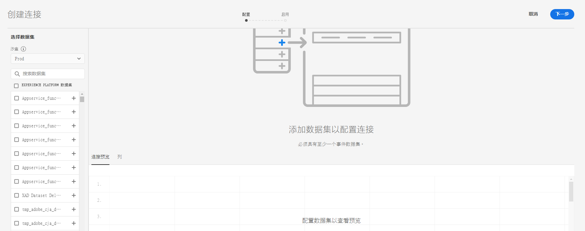
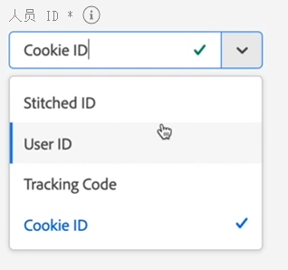
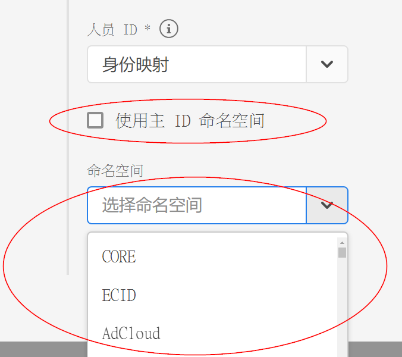
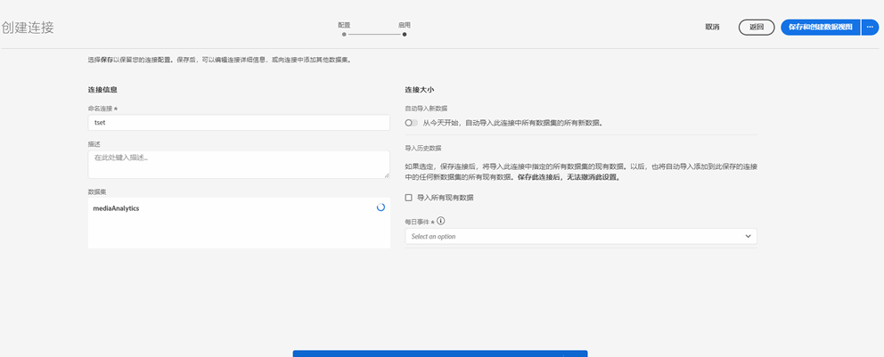

# 创建连接

通过连接，您可以将源自 [!DNL Adobe Experience Platform] 的数据集集成到[!UICONTROL 工作区]中。为了报告 [!DNL Experience Platform] 数据集，您必须首先在 [!DNL Experience Platform] 和[!UICONTROL 工作区]中的数据集之间建立连接。

单击[此处](https://experienceleague.adobe.com/docs/customer-journey-analytics-learn/tutorials/connecting-customer-journey-analytics-to-data-sources-in-platform.html?lang=en)，查看视频概述。

## 所需权限

要创建CJA连接，您需要在[Adobe Admin Console](https://helpx.adobe.com/enterprise/admin-guide.html/enterprise/using/manage-permissions-and-roles.ug.html)中拥有以下权限：

Adobe Experience Platform:
* 数据建模：查看架构，管理架构
* 数据管理：查看数据集，管理数据集
* 数据摄取：管理源

Customer Journey Analytics
* 产品管理员访问权限

>[!IMPORTANT]
>
>您可以将多个 [!DNL Experience Platform] 数据集合并到单个连接中。

## 选择沙盒和数据集

1. 转到[https://analytics.adobe.com](https://analytics.adobe.com)并使用您的Adobe ID登录。

1. 单击[!DNL Customer Journey Analytics]图标。

1. 单击&#x200B;**[!UICONTROL 连接]**&#x200B;选项卡。

1. 单击右上方的&#x200B;**[!UICONTROL 新建连接]**。

   

1. 在 Experience Platform 中选择一个沙盒，其中包含要创建连接的数据集。

   Adobe Experience Platform 提供了可将单个 Platform 实例划分为多个单独的虚拟环境的[沙盒](https://experienceleague.adobe.com/docs/experience-platform/sandbox/home.html?lang=zh-Hans)，以帮助开发和改进数字体验应用程序。您可以将沙盒视为包含数据集的“数据孤岛”。沙盒可用于控制对数据集的访问。选择沙盒后，左边栏会显示可从该沙盒中提取的所有数据集。

   >[!IMPORTANT]
   >
   >您不能跨沙盒访问数据，换言之，您只能合并位于同一沙盒中的数据集。

1. 选择您要提取到 [!UICONTROL Customer Journey Analytics] 的一个或多个数据集，并单击&#x200B;**[!UICONTROL 添加]**。

   （如果您有许多数据集可供选择，可以使用数据集列表上方的&#x200B;**[!UICONTROL 搜索数据集]**&#x200B;搜索栏搜索正确的数据集。）

## 2.配置数据集

在右侧，您现在可以配置已添加的数据集。

1. **[!UICONTROL 数据集类型]**：对于您添加到此连接的每个数据集，[!UICONTROL Customer Journey Analytics] 会根据传入的数据自动设置数据集类型。

   有 3 种不同的数据集类型：[!UICONTROL 事件]数据、[!UICONTROL 配置文件]数据和[!UICONTROL 查找]数据。

   | 数据集类型 | 描述 | 时间戳 | 架构 | 人员 ID |
   |---|---|---|---|---|
   | [!UICONTROL 事件] | 表示及时事件的数据（例如 Web 访问、互动、交易、POS 数据、调查数据、广告展示数据等）。例如，这可能是典型的点击流数据，包含客户 ID 或 Cookie ID 以及时间戳。使用“事件”数据，您可以灵活地选择将哪个 ID 用作人员 ID。 | 自动设置为 [!UICONTROL Experience Platform] 中基于事件的架构的默认时间戳字段。 | 任何基于 XDM 类且具有“时间序列”行为的内置或自定义架构。示例包括“XDM 体验事件”或“XDM 决策事件”。 | 您可以选择想要包含的人员 ID。Experience Platform 中定义的每个数据集架构，可以拥有自己定义的一个或多个标识集，并与命名空间关联。其中任何标识都可用作人员 ID。示例包括 Cookie ID、拼接 ID、用户 ID、跟踪代码等。 |
   | [!UICONTROL 查找] | 此数据用于查找在“事件”或“配置文件”数据中找到的值或键。例如，您可以上传将事件数据中的数字 ID 映射到产品名称的查找数据。有关示例，请参阅[此用例](/help/use-cases/b2b.md)。 | 不适用 | 任何基于 XDM 类且具有“记录”行为的内置或自定义架构，“XDM 个人资料”类除外。 | 不适用 |
   | [!UICONTROL 配置文件] | [!UICONTROL 事件]数据中应用于访客、用户或客户的数据。例如，允许您上传关于客户的 CRM 数据。 | 不适用 | 任何基于“XDM 个人资料”类的内置或自定义架构。 | 您可以选择想要包含的人员 ID。[!DNL Experience Platform] 中定义的每个数据集，都拥有自己定义的一个或多个人员 ID 集，例如 Cookie ID、拼合 ID、用户 ID、跟踪代码等。 **注意**：如果您创建的连接包含具有不同 ID 的数据集，报告将反映这一点。要真正合并数据集，您需要使用相同的人员 ID。 |

1. **[!UICONTROL 数据集 ID]**：此 ID 将自动生成。

1. **[!UICONTROL 时间戳]**：仅对于事件数据集，此设置会自动设置为 [!UICONTROL Experience Platform] 中基于事件的架构的默认时间戳字段。

1. **[!UICONTROL 架构]**：这个[架构](https://experienceleague.adobe.com/docs/experience-platform/xdm/schema/composition.html?lang=zh-Hans)是以其中创建了数据集的 Adobe Experience Platform 为基础。

1. **[!UICONTROL 人员 ID]**：从可用身份的下拉列表中选择一个人员 ID。这些身份已在 Experience Platform 的数据集架构中定义。有关如何将身份映射用作人员 ID 的信息，请参见下文。

   >[!IMPORTANT]
   >
   >如果没有可供选择的人员 ID，则意味着架构中尚未定义一个或多个人员 ID。请观看[这个视频](https://youtu.be/G_ttmGl_LRU)，以了解如何在 Experience Platform 中定义身份。

1. 单击&#x200B;**[!UICONTROL 下一步]**，转到[!UICONTROL 启用连接]对话框。

### 将身份映射用作人员 ID

现在，Customer Journey Analytics 支持将身份映射用作人员 ID。身份映射是一种允许人员上传键值对的映射数据结构。键是身份命名空间，值是包含身份值的结构。在上传的每一行/每个事件中，都存在身份映射，并且身份映射会相应地填充到每一行中。

身份映射适用于任何满足以下要求的数据集：使用基于 [ExperienceEvent XDM](https://experienceleague.adobe.com/docs/experience-platform/xdm/home.html?lang=zh-Hans) 类的架构。当您要将此类数据集包含在 CJA 连接中时，您既可以选择主 ID，也可以选择身份映射来作为字段：

如果选择身份映射，您会另外再获得两个配置选项：

| 选项 | 描述 |
|---|---|
| [!UICONTROL 使用主 ID 命名空间] | 它会指示 CJA 逐行在“身份映射”中查找标记了“primary=true”属性的身份，并将该身份用作相应行的人员 ID。这意味着，它是 Experience Platform 中用于分区时使用的主密钥。此外，它还是用作 CJA 访客 ID 的主要候选项（取决于 CJA 连接中数据集的配置方式）。 |
| [!UICONTROL 命名空间] | （此选项仅适用于未使用主 ID 命名空间的情况。）身份命名空间是 [Adobe Experience Platform Identity Service](https://experienceleague.adobe.com/docs/experience-platform/identity/namespaces.html) 的组件，充当与身份相关的上下文指示器。如果指定了命名空间，CJA 会在每行的“身份映射”中搜索此命名空间密钥，并将该命名空间下的身份用作该行的人员 ID。请注意，由于 CJA 无法对所有行执行全方位数据集扫描以确定哪些命名空间实际存在，因此下拉列表中会列出所有可能的命名空间。您需要知道数据中指定了哪些命名空间；这些信息无法自动检测。 |

### 身份映射边缘情况

下表显示了当存在边缘情况时两种配置方案及其处理方式：

| 方案 | “身份映射”中不存在 ID | 没有 ID 标记为主 ID | 多个 ID 均标记为主 ID | 单个 ID 标记为主 ID | 一个 ID 标记为主 ID 的无效命名空间 |
|---|---|---|---|---|---|
| **选中“使用主 ID 命名空间”** | 该行将被 CJA 删除。 | 该行将被 CJA 删除，因为未指定主 ID。 | 所有命名空间下标记为主 ID 的 ID 都将被提取到列表中，随后，这些 ID 将按字母顺序排序；根据这种新的排序方式，排在第一个命名空间中的首个 ID 将被用作人员 ID。 | 标记为主 ID 的单个 ID 将被用作人员 ID。 | 即便命名空间可能无效（未出现在 AEP 中），CJA 仍会将该命名空间下的主 ID 用作人员 ID。 |
| **已选择特定的身份映射命名空间** | 该行将被 CJA 删除。 | 选定命名空间下的所有 ID 都将被提取到列表中，并且首个 ID 将会用作人员 ID。 | 选定命名空间下的所有 ID 都将被提取到列表中，并且首个 ID 将会用作人员 ID。 | 选定命名空间下的所有 ID 都将被提取到列表中，并且首个 ID 将会用作人员 ID。 | 选定命名空间下的所有 ID 都将被提取到列表中，并且首个 ID 将会用作人员 ID。（由于在创建连接时，只能选择有效的命名空间，因此无效的命名空间/ID 不可能用作人员 ID） |

## 启用连接

1. 要启用连接，请为整个连接（即连接中的所有数据集）定义以下设置：

   | 选项 | 描述 |
   | --- | --- |
   | [!UICONTROL 名称连接] | 为连接指定一个描述性名称。如果没有名称，将无法保存连接。 |
   | [!UICONTROL 描述] | 添加更多详细信息以将此连接与其他连接区分开来。 |
   | [!UICONTROL 数据集] | 此连接中包含的数据集。 |
   | [!UICONTROL 从今天开始自动导入此连接中的所有新数据集。] | 如果要创建持续连接，请选择此选项，以便要添加到此连接中数据集的任何新数据批次会自动流入 [!UICONTROL 工作区] 中。 |
   | [!UICONTROL 导入所有现有数据] | 当选择此选项并保存连接时，将会从 [!DNL Experience Platform] 中导入或回填此连接中所有数据集的所有现有（历史）数据。未来，还将自动导入添加到这个已保存连接的任何新数据集的所有现有历史数据。另请参阅下面的[回填历史数据](https://experienceleague.adobe.com/docs/analytics-platform/using/cja-connections/create-connection.html#backfill-historical-data)。 **请注意，保存此连接后，无法更改此设置。** |
   | [!UICONTROL 平均每日事件数] | 您需要为连接中的所有数据集指定要导入的平均每日事件数（包括新数据&#x200B;**和**&#x200B;回填数据）。从下拉菜单中选择一个选项，以便 Adobe 能为此数据分配足够的空间。 如果您不知道贵公司要导入的平均每日事件数，则可以在 [Adobe Experience Platform 查询服务](https://experienceleague.adobe.com/docs/experience-platform/query/home.html?lang=zh-Hans)中执行简单的 SQL 查询以查明该数值。 请参阅下面的“计算平均每日事件数”。 |

1. 单击&#x200B;**[!UICONTROL 保存和创建数据视图]**。相关文档，请参阅[创建数据视图](/help/data-views/create-dataview.md)。

### 回填历史数据

通过&#x200B;**[!UICONTROL 导入所有现有数据]**，您可以回填历史数据。请牢记这一点：

* 我们已删除了回填（历史数据导入）限制。以前，您自己最多可以回填 25 亿行，超出这个限制则需工程团队介入。现在，您自己即可不受任何限制地回填数据。
* 我们会优先处理新添加到此连接中数据集的新数据，因此这些新数据的滞后时间最短。
* 任何回填（历史）数据的导入速度都会比较慢。滞后时间受以下两个因素的影响：您所拥有的历史数据数量以及您选择的&#x200B;**[!UICONTROL 平均每日事件数]**&#x200B;设置。例如，如果您每日的数据行数超过 10 亿，且您具有 3 年的历史数据，则可能需要数周时间才能完成导入。相反，如果您每日的数据行数不足 100 万，且只有一周的历史数据，则不用一小时即可完成导入。
* 回填将应用于整个连接，而不是单独应用于每个数据集。
* [Adobe Analytics Source Connector](https://experienceleague.adobe.com/docs/platform-learn/tutorials/data-ingestion/ingest-data-from-adobe-analytics.html?lang=zh-Hans) 最多可导入 13 个月的数据，而无论数据大小如何。

### 计算平均每日事件数

必须对连接中的每个数据集都进行此项计算。

1. 转到 [Adobe Experience Platform 查询服务](https://experienceleague.adobe.com/docs/experience-platform/query/home.html)并创建新查询。

1. 创建的查询将如下所示： `Select AVG(A.total_events) from (Select DISTINCT COUNT (*) as total_events, date(TIMESTAMP) from analytics_demo_data GROUP BY 2 Having total_events>0) A;`

* 在此示例中，“analytics_demo_data”是数据集的名称。
* 执行 `Show Tables` 查询以显示 AEP 中存在的所有数据集。
