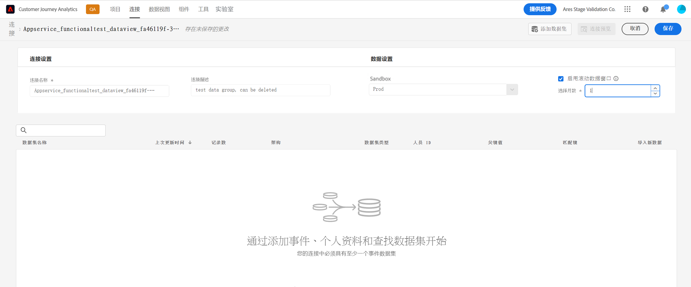
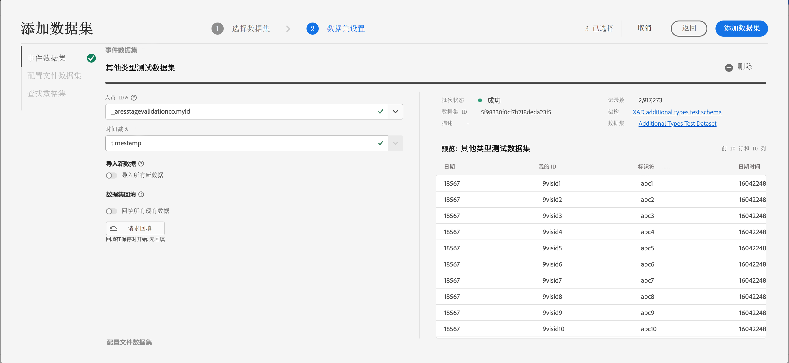
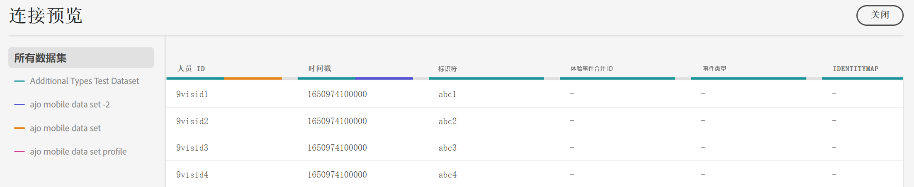

# 创建连接

2022年5月，将在Customer Journey Analytics(CJA)中启动新的连接工作流。 以下是新增功能的概述：

* 创建连接时，可以启用滚动数据保留窗口。
* 您可以向连接添加数据集，也可以从连接中删除数据集。 (删除数据集会将其从连接中删除，并会影响任何关联的数据视图和基础Analysis Workspace项目。)
* 您可以启用并请求每个数据集的回填数据。
* 您可以编辑数据集，例如请求其他回填。
* 您可以按数据集导入现有数据。

## 创建和配置连接 {#create-connection}

1. 在CJA中，单击连接选项卡。
1. 单击新建连接。

   

1. 配置连接设置。

   | 设置 | 描述 |
   | --- | --- |
   | 连接名称 | 输入连接的唯一名称。 |
   | 连接说明 | 描述此连接的用途。 |
   | 沙盒 | 在 Experience Platform 中选择一个沙盒，其中包含要创建连接的数据集。<p>Adobe Experience Platform 提供了可将单个 Platform 实例划分为多个单独的虚拟环境的[沙盒](https://experienceleague.adobe.com/docs/experience-platform/sandbox/home.html?lang=zh-Hans)，以帮助开发和改进数字体验应用程序。您可以将沙盒视为包含数据集的“数据孤岛”。 沙盒可用于控制对数据集的访问。<p>选择沙盒后，左边栏会显示可从该沙盒中提取的所有数据集。 |
   | 启用滚动数据窗口 | 此设置允许您在连接级别将CJA数据保留定义为以月（1个月、3个月、6个月等）为单位的滚动窗口。<p>数据保留基于事件数据集时间戳并且仅适用于事件数据集。配置文件或查找数据集不存在滚动数据窗口设置，因为没有适用的时间戳。 但是，如果您的连接包含任何用户档案或查询数据集（除一个或多个事件数据集之外），则该数据将保留在同一时间段。<p> 主要好处是，您只需存储或报告适用且有用的数据，并且可删除不再有用的旧数据。它可以帮助您保持在合同限制范围内，并减少超出预期成本的风险。 |
   | 添加数据集（请参阅下文） | 如果数据集列表中未显示任何数据集，则添加数据集。 |
   | 数据集名称 | 选择您要提取到 Customer Journey Analytics 的一个或多个数据集，并单击&#x200B;**[!UICONTROL 添加]**。<p>（如果您有许多数据集可供选择，可以使用数据集列表上方的搜索数据集搜索栏搜索正确的数据集。） |
   | 上次更新时间 | 仅对于事件数据集，此设置会自动设置为Experience Platform中基于事件的架构的默认时间戳字段。 “N/A”表示此数据集不包含任何数据。 |
   | 架构 | 这是 [模式](https://experienceleague.adobe.com/docs/experience-platform/xdm/schema/composition.html?lang=en) 基于在Adobe Experience Platform中创建数据集的位置。 |
   | 数据集类型 | 对于您添加到此连接的每个数据集，Customer Journey Analytics会根据传入的数据自动设置数据集类型。 有 3 种不同的数据集类型：事件数据、配置文件数据和查找数据。有关数据集类型的说明，请参阅下表。 |
   | 人员 ID | 从可用身份的下拉列表中选择一个人员ID。 这些身份已在 Experience Platform 的数据集架构中定义。有关如何将身份映射用作人员 ID 的信息，请参见下文。<p>重要信息：如果没有可供选择的人员ID，则表示架构中尚未定义一个或多个人员ID。 请观看[这个视频](https://www.youtube.com/watch?v=G_ttmGl_LRU)，以了解如何在 Experience Platform 中定义身份。 |
   | 键 | 仅用于查找数据集（例如_id）。 |
   | 匹配键 | 仅用于查找数据集（例如_id）。 |
   | 导入新数据 | 设置为开或关。 |
   | 回填数据 |  |
   | 回填状态 | 指示是否正在处理任何回填数据。 |

## 添加和配置数据集 {#add-dataset}

通过新的工作流，您可以在创建连接时添加Experience Platform数据集。

1. 在连接设置对话框中，单击 **[!UICONTROL 添加数据集]**.
1. 选择一个或多个数据集并单击 **[!UICONTROL 下一个]**.

   请注意，连接中至少需要有一个事件数据集。
1. 现在，可逐个配置数据集。

   

   | 设置 | 描述 |
   | --- | --- |
   | 人员 ID | 从可用身份的下拉列表中选择一个人员ID。 这些身份已在 Experience Platform 的数据集架构中定义。有关如何将身份映射用作人员 ID 的信息，请参见下文。<p>如果没有可供选择的人员 ID，则意味着架构中尚未定义一个或多个人员 ID。请观看这个视频，以了解如何在 Experience Platform 中定义身份。 |
   | 时间戳 | 仅对于事件数据集，此设置会自动设置为Experience Platform中基于事件的架构的默认时间戳字段。 |
   | 导入新数据 | 如果要创建持续连接，请选择此选项，以便要添加到此连接中数据集的任何新数据批次会自动流入 工作区 中。可设置为开或关。 |
   | 数据集回填 | 单击 **[!UICONTROL 请求回填]** 来回填历史数据。<ul><li>您可以逐个回填每个数据集。</li><li>我们会优先处理新添加到此连接中数据集的新数据，因此这些新数据的滞后时间最短。</li><li>任何回填（历史）数据的导入速度都会比较慢。滞后时间受您拥有的历史数据量的影响。</li><li>Adobe Analytics Source Connector 最多可导入 13 个月的数据，而无论数据大小如何。</li></ul> |
   | 回填状态 | 可能的状态指标包括：<ul><li>成功</li><li>X回填处理</li><li>关</li></ul> |
   | 数据集 ID | 此ID将自动生成。 |
   | 描述 | 创建此数据集时对其的描述。 |
   | 数据集大小 | 数据集的大小。 |
   | 架构 | 这是基于其在Adobe Experience Platform中创建数据集的架构。 |
   | 数据集 | 数据集的名称。 |
   | 预览: `<dataset name>` | 预览包含日期、我的ID和标识符列的数据集。 |
   | 删除 | 从连接中删除此数据集。 |

## 连接预览 {#preview}

要预览已创建的连接，请单击 **[!UICONTROL 连接预览]** 中。



此预览包含列出连接配置的列数。 显示的列类型取决于您的各个数据集。

## 数据集类型 {#dataset-types}

对于您添加到此连接的每个数据集， [!UICONTROL Customer Journey Analytics] 会根据传入的数据自动设置数据集类型。

>[!IMPORTANT]
>
>您需要在连接中至少添加一个事件数据集。

有 3 种不同的数据集类型：[!UICONTROL 事件]数据、[!UICONTROL 配置文件]数据和[!UICONTROL 查找]数据。

| 数据集类型 | 描述 | 时间戳 | 架构 | 人员 ID |
|---|---|---|---|---|
| [!UICONTROL 事件] | 表示及时事件的数据（例如 Web 访问、互动、交易、POS 数据、调查数据、广告展示数据等）。例如，这可能是典型的点击流数据，包含客户 ID 或 Cookie ID 以及时间戳。使用“事件”数据，您可以灵活地选择将哪个 ID 用作人员 ID。 | 自动设置为 [!UICONTROL Experience Platform] 中基于事件的架构的默认时间戳字段。 | 任何基于 XDM 类且具有“时间序列”行为的内置或自定义架构。示例包括“XDM 体验事件”或“XDM 决策事件”。 | 您可以选择想要包含的人员 ID。Experience Platform 中定义的每个数据集架构，可以拥有自己定义的一个或多个标识集，并与命名空间关联。其中任何标识都可用作人员 ID。示例包括 Cookie ID、拼接 ID、用户 ID、跟踪代码等。 |
| [!UICONTROL 查找] | 此数据用于查找在“事件”或“配置文件”数据中找到的值或键。例如，您可以上传将事件数据中的数字 ID 映射到产品名称的查找数据。有关示例，请参阅[此用例](/help/use-cases/b2b.md)。 | 不适用 | 任何基于 XDM 类且具有“记录”行为的内置或自定义架构，“XDM 个人资料”类除外。 | 不适用 |
| [!UICONTROL 配置文件] | [!UICONTROL 事件]数据中应用于访客、用户或客户的数据。例如，允许您上传关于客户的 CRM 数据。 | 不适用 | 任何基于“XDM 个人资料”类的内置或自定义架构。 | 您可以选择想要包含的人员 ID。[!DNL Experience Platform] 中定义的每个数据集，都拥有自己定义的一个或多个人员 ID 集，例如 Cookie ID、拼合 ID、用户 ID、跟踪代码等。<br>**注意**：如果您创建的连接包含具有不同 ID 的数据集，报告将反映这一点。要真正合并数据集，您需要使用相同的人员 ID。 |

## 将身份映射用作人员 ID {#id-map}

现在，Customer Journey Analytics 支持将身份映射用作人员 ID。身份映射是一种允许人员上传键值对的映射数据结构。键是身份命名空间，值是包含身份值的结构。在上传的每一行/每个事件中，都存在身份映射，并且身份映射会相应地填充到每一行中。

身份映射适用于任何满足以下要求的数据集：使用基于 [ExperienceEvent XDM](https://experienceleague.adobe.com/docs/experience-platform/xdm/home.html?lang=zh-Hans) 类的架构。当您要将此类数据集包含在 CJA 连接中时，您既可以选择主 ID，也可以选择身份映射来作为字段：


如果选择身份映射，您会另外再获得两个配置选项：

| 选项 | 描述 |
|---|---|
| [!UICONTROL 使用主 ID 命名空间] | 它会指示 CJA 逐行在“身份映射”中查找标记了“primary=true”属性的身份，并将该身份用作相应行的人员 ID。这意味着，它是 Experience Platform 中用于分区时使用的主密钥。此外，它还是用作 CJA 访客 ID 的主要候选项（取决于 CJA 连接中数据集的配置方式）。 |
| [!UICONTROL 命名空间] | （此选项仅适用于未使用主 ID 命名空间的情况。）身份命名空间是 [Adobe Experience Platform Identity Service](https://experienceleague.adobe.com/docs/experience-platform/identity/namespaces.html?lang=zh-Hans) 的组件，充当与身份相关的上下文指示器。如果指定了命名空间，CJA 会在每行的“身份映射”中搜索此命名空间密钥，并将该命名空间下的身份用作该行的人员 ID。请注意，由于 CJA 无法对所有行执行全方位数据集扫描以确定哪些命名空间实际存在，因此下拉列表中会列出所有可能的命名空间。您需要知道数据中指定了哪些命名空间；这些信息无法自动检测。 |

### 身份映射边缘情况 {#id-map-edge}

下表显示了当存在边缘情况时两种配置方案及其处理方式：

| 选项 | “身份映射”中不存在 ID | 没有 ID 标记为主 ID | 多个 ID 均标记为主 ID | 单个 ID 标记为主 ID | 一个 ID 标记为主 ID 的无效命名空间 |
|---|---|---|---|---|---|
| **[!UICONTROL 使用主 ID 命名空间]已选中** | 该行将被 CJA 删除。 | 该行将被 CJA 删除，因为未指定主 ID。 | 所有命名空间下标记为主 ID 的 ID 都将被提取到列表中，随后，这些 ID 将按字母顺序排序；根据这种新的排序方式，排在第一个命名空间中的首个 ID 将被用作人员 ID。 | 标记为主 ID 的单个 ID 将被用作人员 ID。 | 即便命名空间可能无效（未出现在 AEP 中），CJA 仍会将该命名空间下的主 ID 用作人员 ID。 |
| **[!UICONTROL 特定的身份映射命名空间]已选择** | 该行将被 CJA 删除。 | 选定命名空间下的所有 ID 都将被提取到列表中，并且首个 ID 将会用作人员 ID。 | 选定命名空间下的所有 ID 都将被提取到列表中，并且首个 ID 将会用作人员 ID。 | 选定命名空间下的所有 ID 都将被提取到列表中，并且首个 ID 将会用作人员 ID。 | 选定命名空间下的所有 ID 都将被提取到列表中，并且首个 ID 将会用作人员 ID。（由于在创建连接时，只能选择有效的命名空间，因此无效的命名空间/ID 不可能用作人员 ID） |

### 计算平均每日事件数

必须对连接中的每个数据集都进行此项计算。

1. 转到 [Adobe Experience Platform 查询服务](https://experienceleague.adobe.com/docs/experience-platform/query/home.html?lang=zh-Hans)并创建新查询。

   创建的查询将如下所示：

   ```
   Select AVG(A.total_events) from (Select DISTINCT COUNT (*) as total_events, date(TIMESTAMP) from analytics_demo_data GROUP BY 2 Having total_events>0) A;
   ```

   在此示例中，“analytics_demo_data”是数据集的名称。

1. 执行 `Show Tables` 查询以显示 AEP 中存在的所有数据集。
