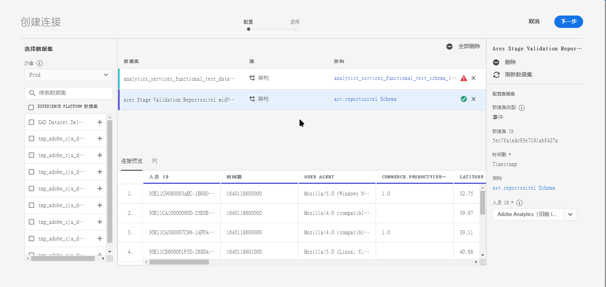

# 创建连接

通过连接，您可以将Adobe Experience Platform中的数据集集成到Workspace中。 为了报告平台数据集，您首先必须在平台和工作区中的数据集之间建立连接。

单击 [此处](https://docs.adobe.com/content/help/en/platform-learn/tutorials/cja/connecting-customer-journey-analytics-to-data-sources-in-platform.html) ，查看视频概述。

>[!IMPORTANT] 您可以将多个平台数据集合到一个连接中。

1. 请访问 [https://analytics.adobe.com](https://analytics.adobe.com)。

1. Click the **[!UICONTROL Connections]** tab.

1. 单击 **[!UICONTROL Create new connection]** 右上角的。

1. 左边栏显示平台中可从中提取的所有数据集。 选择要导入Customer Journey Analytics的一个或多个数据集，然后单击 **[!UICONTROL Add]**。 (如果您有大量数据集可供选择，则可以使用数据集列表上方的搜索栏搜索正确的数据集。)

1. 接下来，对于您添加到此连接的每个数据集，客户旅程分析会根据传入的数据自动设置数据集类型。 有3种不同的数据集类型：事件数据、用户档案数据和查找数据。

   | 数据集类型 | 描述 | 时间戳 | 架构 | 人员 ID |
   |---|---|---|---|---|
   | 事件 | 表示及时事件的数据(例如，Web访问、交互、交易、POS数据、调查数据、广告印象数据等)。 这是典型的点击流数据，带有客户ID或cookie ID，以及时间戳。 利用事件数据，我们允许您使用您需要的ID。 | 将设置为时间戳。 | 此数据集类型所基于的平台模式。 | 不适用 |
   | 查找 | 与分类文件类似。 此数据用于查找在事件或用户档案数据中找到的值或键。 例如，您可以上传将事件数据中的数字ID映射到产品名称的查找数据。 | 不适用 | 此数据集类型所基于的平台模式。 | 不适用 |
   | 配置文件 | 与“客户属性”类似——适用于非更改属性和非临时属性。 应用于访客、用户或客户的事件数据。 例如，允许您上传有关客户的CRM数据。 | 不适用 | 此数据集类型所基于的平台模式。 | 您可以选择要包含的人物ID。 在Adobe Experience Platform中定义的每个数据集都有其自己的一组一个或多个Person ID，如Cookie ID、拼接ID、用户ID、跟踪代码等。 **员&#x200B;**:如果您创建的连接包含具有不同ID的数据集，报告将反映这一点。 要真正合并数据集，您需要使用相同的Person ID。 |

1. 单击 **[!UICONTROL Next]**.

1. 在“创建连接”对话框中，定义以下设置：

   | 字段 | 描述 |
   |---|---|
   | 名称 | 为连接指定一个描述性名称。 无法保存连接，但没有名称。 |
   | 描述 | 添加更多详细信息以区分此连接与其他连接。 |
   | 大小 | 数据连接中数据集的集合大小。 |
   | 数据集 | 此连接中包含的数据集。 |
   | 数据流式传输 | 要开始为此连接流化数据，请启用数据流化。 为此连接启用数据流时，您的帐户将按此连接为流的数据量计费。 （请注意，您还可以在连接管理器中启用数据流。） |

1. 单击 **[!UICONTROL Save]**. 保存此连接时，会发生两件事：

   * 您从平台中提取所有与此关联的所有数据集的历史数据。
   * 如果启用流，您将建立持续的连接，这样添加到此连接中数据集的任何新数据都会自动流入Workspace。

工作流的下一步是创 [建数据视图](/help/data-views/create-dataview.md)。
