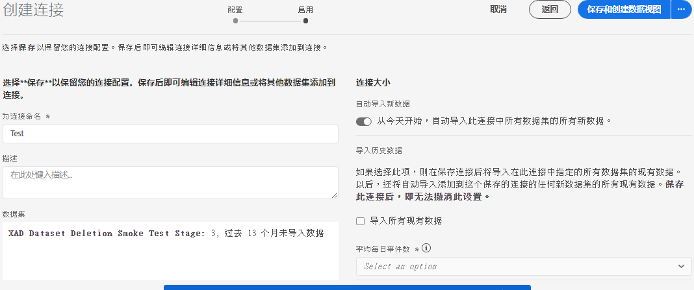

# 创建连接

通过连接，您可以将源自 [!DNL Adobe Experience Platform] 的数据集集成到[!UICONTROL 工作区]中。为了报告 [!DNL Experience Platform] 数据集，您必须首先在 [!DNL Experience Platform] 和[!UICONTROL 工作区]中的数据集之间建立连接。

单击[此处](https://docs.adobe.com/content/help/en/platform-learn/tutorials/cja/connecting-customer-journey-analytics-to-data-sources-in-platform.html)，查看视频概述。

>[!IMPORTANT]
>
>您可以将多个 [!DNL Experience Platform] 数据集合并到单个连接中。

1. 访问 [https://analytics.adobe.com](https://analytics.adobe.com)。

1. 单击&#x200B;**[!UICONTROL 连接]**&#x200B;选项卡。

1. 单击右上方的&#x200B;**[!UICONTROL 新建连接]**。

   

1. 在 Experience Platform 中选择一个沙盒，其中包含要创建连接的数据集。

   Adobe Experience Platform 提供了可将单个 Platform 实例划分为多个单独的虚拟环境的[沙盒](https://docs.adobe.com/content/help/zh-Hans/experience-platform/sandbox/home.html)，以帮助开发和改进数字体验应用程序。您可以将沙盒视为包含数据集的“数据孤岛”。沙盒可用于控制对数据集的访问。您不能跨沙盒访问数据。选择沙盒后，左边栏会显示可从该沙盒中提取的所有数据集。

1. 选择您要提取到 [!UICONTROL Customer Journey Analytics] 的一个或多个数据集，并单击&#x200B;**[!UICONTROL 添加]**。

   （如果您有许多数据集可供选择，可以使用数据集列表上方的&#x200B;**[!UICONTROL 搜索数据集]**&#x200B;搜索栏搜索正确的数据集。）

## 配置数据集

在右侧，您现在可以配置已添加的数据集。

1. **[!UICONTROL 数据集类型]**：对于您添加到此连接的每个数据集，[!UICONTROL Customer Journey Analytics] 会根据传入的数据自动设置数据集类型。

   有 3 种不同的数据集类型：[!UICONTROL 事件]数据、[!UICONTROL 配置文件]数据和[!UICONTROL 查找]数据。

   | 数据集类型 | 描述 | 时间戳 | 架构 | 人员 ID |
   |---|---|---|---|---|
   | [!UICONTROL 事件] | 表示及时事件的数据（例如 Web 访问、互动、交易、POS 数据、调查数据、广告展示数据等）。例如，这可能是典型的点击流数据，包含客户 ID 或 Cookie ID 以及时间戳。使用“事件”数据，您可以灵活地选择将哪个 ID 用作人员 ID。 | 自动设置为 [UICONTROL Experience Platform] 中基于事件的架构的默认时间戳字段。 | 任何基于 XDM 类且具有“时间序列”行为的内置或自定义架构。示例包括“XDM 体验事件”或“XDM 决策事件”。 | 您可以选择想要包含的人员 ID。Experience Platform 中定义的每个数据集架构，可以拥有自己定义的一个或多个标识集，并与命名空间关联。其中任何标识都可用作人员 ID。示例包括 Cookie ID、拼接 ID、用户 ID、跟踪代码等。 |
   | [!UICONTROL 查找] | 类似于分类文件。此数据用于查找在“事件”或“个人资料”数据中找到的值或键。例如，您可以上传将事件数据中的数字 ID 映射到产品名称的查找数据。 | 不适用 | 任何基于 XDM 类且具有“记录”行为的内置或自定义架构，“XDM 个人资料”类除外。 | 不适用 |
   | [!UICONTROL 配置文件] | 类似于[!UICONTROL 客户属性] - 用于非更改属性和非临时属性。[!UICONTROL 事件]数据中应用于访客、用户或客户的数据。例如，允许您上传关于客户的 CRM 数据。 | 不适用 | 任何基于“XDM 个人资料”类的内置或自定义架构。 | 您可以选择想要包含的人员 ID。[!DNL Experience Platform] 中定义的每个数据集，都拥有自己定义的一个或多个人员 ID 集，例如 Cookie ID、拼合 ID、用户 ID、跟踪代码等。 **注意&#x200B;**：如果您创建的连接包含具有不同 ID 的数据集，报告将反映这一点。要真正合并数据集，您需要使用相同的人员 ID。 |

1. **[!UICONTROL 数据集 ID]**：此 ID 将自动生成。

1. **[!UICONTROL 时间戳]**:在此处添加内容

1. **[!UICONTROL 模式]**:这是 [模式](https://docs.adobe.com/content/help/zh-Hans/experience-platform/xdm/schema/composition.html) 根据数据集在Adobe Experience Platform创建。

1. **[!UICONTROL 人员ID]**:从可用身份的下拉列表中选择人员ID。 这些身份在Experience Platform的数据集模式中定义。 有关如何将身份映射用作人员ID的信息，请参见下文。

   >[!IMPORTANT]
   >
   >如果没有人员ID可供选择，则表示模式中尚未定义一个或多个人员ID。 视图 [此视频](https://youtu.be/G_ttmGl_LRU) 如何定义Experience Platform中的身份。

1. 单击&#x200B;**[!UICONTROL 下一步]**，转到[!UICONTROL 启用连接]对话框。

### 使用身份映射作为人员ID

Customer Journey Analytics现在支持将身份映射用于其人员ID。 标识映射是一种允许某人上传密钥->值对的映射数据结构。 键是身份命名空间，值是包含身份值的结构。上传的每行/事件上都存在标识映射，并会相应地为每行填充标识映射。

The Identity Map is available a any dataset that uses a模式基于 [ExperienceEvent XDM](https://docs.adobe.com/content/help/zh-Hans/experience-platform/xdm/home.html) 类。 当您选择要包含在CJA连接中的此类数据集时，您可以选择选择字段作为主ID或标识映射：

如果选择“身份映射”，您还会获得两个其他配置选项：

| 选项 | 描述 |
|---|---|
| [!UICONTROL 使用主 ID 命名空间] | 这会指示CJA在标有primary=true属性的标识映射中，按行查找标识，并将该标识用作该行的人员ID。 这意味着这是将用于分区的Experience Platform的主要密钥。 它还是用作CJA访客ID的主要候选者（取决于在CJA连接中配置数据集的方式）。 |
| [!UICONTROL 命名空间] | (此选项仅在未使用主ID命名空间时可用。) 身份命名空间是 [Adobe Experience Platform身份服务](https://docs.adobe.com/content/help/en/experience-platform/identity/namespaces.html) 作为身份相关背景的指标。 如果指定命名空间,CJA将搜索每行的此命名空间键的标识映射，并将该命名空间下的标识用作该行的人员ID。 请注意，由于CJA无法对所有行执行完全数据集扫描以确定哪些命名空间实际存在，因此所有可能的命名空间都会列在下拉列表中。 您需要知道数据中指定了哪些命名空间;无法自动检测。 |

### 标识映射边缘案例

下表显示了当存在边缘情况时的两种配置选项及其处理方式：

| 选项 | 身份映射中不存在ID | 没有ID被标记为主ID | 多个ID被标记为主ID | 单个ID被标记为主ID | ID标记为主命名空间无效 |
|---|---|---|---|---|---|
| **选中“使用主ID命名空间”** | CJA会删除该行。 | CJA将删除该行，因为未指定主ID。 | 标记为主ID的所有命名空间下的所有ID都会被提取到列表中。 然后按字母顺序排序；在此新排序中，具有第一个ID的第一个命名空间将用作人员ID。 | 标为主ID的单个ID用作人员ID。 | 即使命名空间无效（AEP中不存在）,CJA仍将该命名空间下的主ID用作人员ID。 |
| **已选择特定身份映射命名空间** | CJA会删除该行。 | 选定命名空间下的所有ID都提取到列表中，第一个ID用作人员ID。 | 选定命名空间下的所有ID都提取到列表中，第一个ID用作人员ID。 | 选定命名空间下的所有ID都提取到列表中，第一个ID用作人员ID。 | 选定命名空间下的所有ID都提取到列表中，第一个ID用作人员ID。 (在连接创建时，只能选择有效的命名空间，因此无效的命名空间/ID不能用作人员ID) |

## 启用连接

1. 要启用连接，请定义以下设置：

   | 选项 | 描述 |
   |---|---|
   | [!UICONTROL 名称连接] | 为连接指定一个描述性名称。如果没有名称，将无法保存连接。 |
   | [!UICONTROL 描述] | 添加更多详细信息以将此连接与其他连接区分开来。 |
   | [!UICONTROL 数据集] | 此连接中包含的数据集。 |
   | [!UICONTROL 从今天开始自动导入此连接中的所有新数据集。] | 如果要创建持续连接，请选择此选项，以便要添加到此连接中数据集的任何新数据批次会自动流入 [!UICONTROL 工作区] 中。 |
   | [!UICONTROL 导入所有现有数据] | 当选择此选项并保存连接时，将会从 [!DNL Experience Platform] 中导入此连接中所有数据集的所有现有（历史）数据。未来，还将自动导入添加到这个已保存连接的任何新数据集的所有现有历史数据。 **请注意，保存此连接后，无法更改此设置。** |

   **请记住以下事项：**

   * 如果连接中所有数据集的历史数据的累计大小超过 15 亿行，则会出现一条错误消息，指示您无法导入此数量的历史数据。但是，如果您要添加一个包含 10 亿行历史数据的数据集并导入该数据，一周后，再添加另一个同等大小的数据集并导入其历史数据，则导入可正常进行。
   * 我们会优先处理新添加到此连接中数据集的新数据，因此这些新数据的滞后时间最短。
   * 任何回填（历史）数据的导入速度都会比较慢。

1. 单击&#x200B;**[!UICONTROL 保存]**。

工作流程的下一步是[创建数据视图](/help/data-views/create-dataview.md)。
