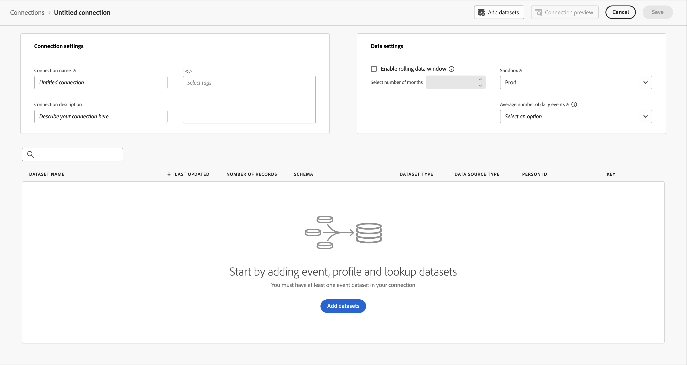
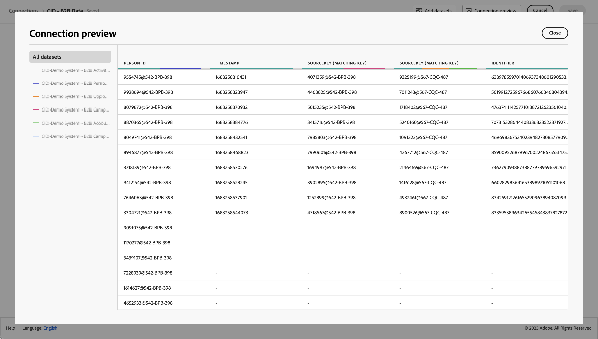

# 创建连接

连接创建和编辑工作流体验通过辅助工作流将所有数据集和连接配置设置引入屏幕中心。它提供了详细的数据集选择、配置和查看体验，以及数据集类型、大小、架构、数据集 ID、批次状态、回填状态、人员 ID 等关键信息，以降低错误连接配置的风险。以下是功能概述：

* 您可以在创建连接时启用滚动数据保留窗口。
* 您可以在连接中添加和删除数据集。（删除数据集会将其从连接中删除，并影响任何关联的数据视图和基础 Analysis Workspace 项目。）
* 您可以为每个数据集启用和请求回填数据。
* 您可以编辑数据集，例如请求另一个回填。
* 您可以按数据集导入现有数据。

>[!VIDEO](https://video.tv.adobe.com/v/343044/?quality=12&learn=on)

## 先决条件

您必须拥有&#x200B;**选择**&#x200B;包才能将无限数量的数据集添加到连接中。**基础**&#x200B;包仅限于一个数据集。如果您不确定您拥有的 Customer Journey Analytics 包，请联系您的管理员。&#x200B;

## 创建和配置连接 {#create-connection}

1. 在 Customer Journey Analytics 中，单击&#x200B;**[!UICONTROL 连接]**&#x200B;选项卡。
1. 单击&#x200B;**[!UICONTROL 创建新连接]**。

   

1. 配置连接设置。

   | 设置 | 描述 |
   | --- | --- |
   | **[!UICONTROL 连接名称]** | 输入连接的唯一名称。 |
   | **[!UICONTROL 连接说明]** | 描述这种连接的目的。 |
   | **[!UICONTROL 沙盒]** | 在 Experience Platform 中选择一个沙盒，其中包含要创建连接的数据集。<p>Adobe Experience Platform 提供了可将单个 Platform 实例划分为多个单独的虚拟环境的[沙盒](https://experienceleague.adobe.com/docs/experience-platform/sandbox/home.html?lang=zh-Hans)，以帮助开发和改进数字体验应用程序。您可以将沙盒视为包含数据集的“数据孤岛”。沙盒可用于控制对数据集的访问。<p>选择沙盒后，左边栏会显示可从该沙盒中提取的所有数据集。 |
   | **[!UICONTROL 启用滚动数据窗口]** | 如果选中此复选框，那么您可以在连接级别将 Customer Journey Analytics 数据保留定义为以月计的时段（1 个月、3 个月、6 个月等）。<p>数据保留基于事件数据集时间戳并且仅适用于事件数据集。由于没有适用的时间戳，因此配置文件或查找数据集不存在滚动数据窗口设置。但是，如果您的连接包括任何配置文件或查找数据集（一个或多个事件数据集除外），则该数据会在相同的时段内进行保存。<p> 主要好处是，您只需存储或报告适用且有用的数据，并且可删除不再有用的旧数据。它可以帮助您保持在合同限制范围内，并减少超出预期成本的风险。<p>如果您保留默认值（未选中），则保留期会被 Adobe Experience Platform 数据保留设置所取代。如果您在 Experience Platform 中有 25 个月的数据，那么 Customer Journey Analytics 会通过回填获取 25 个月的数据。如果您在 Platform 中删除了其中的 10 个月，则 Customer Journey Analytics 将会保留剩余的 15 个月。 |
   | **[!UICONTROL 添加数据集]**（见下文） | 如果您的数据集列表中没有数据集，请添加数据集。 |
   | **[!UICONTROL 数据集名称]** | 选择您要提取到 Customer Journey Analytics 的一个或多个数据集，并单击&#x200B;**[!UICONTROL 添加。]**<p>（如果您有许多数据集可供选择，可以使用数据集列表上方的搜索数据集搜索栏搜索正确的数据集。） |
   | **[!UICONTROL 上次更新时间]** | 仅对于事件数据集，此设置会自动设置为 Experience Platform 中基于事件的架构的默认时间戳字段。“N/A”表示该数据集不包含数据。 |
   | **[!UICONTROL 架构]** | 在 Adobe Experience Platform 中创建数据集所依据的[架构。](https://experienceleague.adobe.com/docs/experience-platform/xdm/schema/composition.html?lang=zh-Hans) |
   | **[!UICONTROL 数据集类型]** | 对于您添加到此连接的每个数据集，Customer Journey Analytics 会根据传入的数据自动设置数据集类型。有 3 种不同的数据集类型：事件数据、配置文件数据和查找数据。有关数据集类型的说明，请参见下表。 |
   | **[!UICONTROL 人员 ID]** | 从可用标识的下拉列表中选择个人 ID。这些标识已在 Experience Platform 的数据集架构中定义。有关如何将标识映射用作人员 ID 的信息，请参见下文。<p>重要提示：如果没有可供选择的人员 ID，则意味着未在模式中定义一个或多个人员 ID。请查看[这个视频](https://www.youtube.com/watch?v=G_ttmGl_LRU)，以了解如何在 Experience Platform 中定义标识。 |
   | **[!UICONTROL 键]** | 仅用于查找数据集（例如 _id）。 |
   | **[!UICONTROL 匹配键]** | 仅用于查找数据集（例如 _id）。 |
   | **[!UICONTROL 导入新数据]** | 设置为开或关。 |
   | **[!UICONTROL 回填数据]** | 您可以请求根据事件时间戳回填数据集中的数据。例如，您可以请求回填过去 7 天的数据，配置正确的人员 ID 并测试您的连接是否配置正确。如果一切看起来正常，您可以轻松回填所有剩余数据。<p>此外，您可以启用按数据集导入新数据。例如，您可以仅对查找数据启用新数据导入。 |
   | **[!UICONTROL 回填状态]** | 指示是否正在处理任何回填数据。 |

   {style="table-layout:auto"}

## 添加和配置数据集 {#add-dataset}

新的工作流允许您在创建连接时添加 Experience Platform 数据集。

1. 在“连接设置”对话框中，选择&#x200B;**[!UICONTROL 添加数据集]**。

2. 在[!UICONTROL 选择数据集]步骤中，选择一个或多个数据集并选择&#x200B;**[!UICONTROL 下一步]**。必须有至少一个事件数据集是该连接的一部分。
   * 要更改为数据集列表显示的列，请选择 ，然后选择要在[!UICONTROL 自定义表]对话框中显示的列。
   * 要搜索特定数据集，请使用  搜索字段。
   * 要在显示或隐藏所选数据集之间切换，请选择  **[!UICONTROL 隐藏所选项]**&#x200B;或&#x200B;**[!UICONTROL 显示所选项]**。
   * 要从所选数据集的列表中删除数据集，请使用 。要删除所有所选的数据集，请选择&#x200B;**[!UICONTROL 全部清除]**。

   

3. 现在逐一配置数据集。

   

   | 设置 | 描述 |
   | --- | --- |
   | **[!UICONTROL 人员 ID]** | 仅适用于事件和配置文件数据集。从可用标识的下拉列表中选择个人 ID。这些标识已在 Experience Platform 的数据集架构中定义。有关如何将标识映射用作人员 ID 的信息，请参见下文。<p>如果没有可供选择的人员 ID，则意味着架构中尚未定义一个或多个人员 ID。请查看这个视频，以了解如何在 Experience Platform 中定义标识。 |
   | **[!UICONTROL 时间戳]** | 仅对于事件数据集，此设置会自动设置为 Experience Platform 中基于事件的架构的默认时间戳字段。 |
   | **[!UICONTROL 键]** | 仅适用于查找数据集。用于查找数据集的键。 |
   | **[!UICONTROL 匹配键]** | 仅适用于查找数据集。某个事件数据集中要按其连接在一起的匹配键。如果此列表为空，则可能尚未添加或配置事件数据集。 |
   | **[!UICONTROL 数据源类型]** | 选择数据源类型。<br/>数据源的类型包括： <ul><li>[!UICONTROL Web 数据]</li><li>[!UICONTROL 移动应用程序数据]</li><li>[!UICONTROL POS 数据]</li><li>[!UICONTROL CRM 数据]</li><li>[!UICONTROL 调查数据]</li><li>[!UICONTROL 呼叫中心数据]</li><li>[!UICONTROL 产品数据]</li><li> [!UICONTROL 帐户数据]</li><li> [!UICONTROL 事务数据]</li><li>[!UICONTROL 客户反馈数据]</li><li> [!UICONTROL 其他]</li></ul>该字段用于调查正在使用的数据源的类型。 |
   | **[!UICONTROL 导入新数据]** | 如果要创建持续连接，请选择此选项，以便要添加到此连接中数据集的任何新数据批次会自动流入工作区中。可以设置为[!UICONTROL 开]或[!UICONTROL 关。] |
   | **[!UICONTROL 数据集回填]** | 选择&#x200B;**[!UICONTROL 请求回填]**，以回填历史数据。<ul><li>您可以单独回填每个数据集。</li><li>您会优先处理新添加到此连接中数据集的新数据，因此这些新数据的滞后时间最短。</li><li>任何回填（历史）数据的导入速度都会比较慢。延迟受您拥有多少历史数据的影响。</li><li>Analytics Source Connector 会为生产沙盒导入最多 13 个月的数据（无论大小）。非生产沙盒的回填期限为 3 个月。</li></ul> |
   | **[!UICONTROL 回填状态]** | 可能的状态指示符有：<ul><li>成功</li><li>X 回填处理</li><li>关</li></ul> |
   | **[!UICONTROL 数据集 ID]** | 此 ID 是自动生成的。 |
   | **[!UICONTROL 描述]** | 创建此数据集时给出的描述。 |
   | **[!UICONTROL 数据集大小]** | 数据集的大小。 |
   | **[!UICONTROL 架构]** | 在 Adobe Experience Platform 中创建数据集所依据的架构。 |
   | **[!UICONTROL 数据集]** | 数据集的名称。 |
   | **[!UICONTROL 预览：*数据集名称&#x200B;*]** | 使用日期、我的 ID 和标识符列预览数据集。 |
   | **[!UICONTROL 删除]** | 您可以删除或移除数据集并更改人员 ID 而不删除整个连接。删除或移除会降低数据引入以及重新创建整个连接和相关数据视图这一繁琐过程所涉及的成本。 |

   {style="table-layout:auto"}

## 连接预览 {#preview}

要预览您创建的连接，请单击连接设置对话框中的&#x200B;**[!UICONTROL 连接预览]**。



此预览包含某些列，其中列出了连接配置。显示的列类型取决于您的个人数据集。

## 数据集类型 {#dataset-types}

对于您已添加到此连接的每个数据集，[!UICONTROL Customer Journey Analytics] 会根据传入的数据自动设置数据集类型。

>[!IMPORTANT]
>
>您必须添加至少一个事件数据集作为连接的一部分。

有三种不同的数据集类型：[!UICONTROL 事件]数据、[!UICONTROL 配置文件]数据和[!UICONTROL 查找]数据。

| 数据集类型 | 描述 | 时间戳 | 架构 | 人员 ID |
|---|---|---|---|---|
| **[!UICONTROL 事件]** | 表示及时事件的数据（例如 Web 访问、互动、交易、POS 数据、调查数据、广告展示数据等）。例如，该数据可能是典型的点击流数据，包含客户 ID 或 Cookie ID 以及时间戳。使用“事件”数据，您可以灵活地选择将哪个 ID 用作个人 ID。 | 自动设置为 [!UICONTROL Experience Platform] 中基于事件的架构的默认时间戳字段。 | 任何基于 XDM 类且具有“时间序列”行为的内置或自定义架构。示例包括“XDM 体验事件”或“XDM 决策事件”。 | 您可以选择想要包含的人员 ID。Experience Platform 中定义的每个数据集架构，可以拥有自己定义的一个或多个标识集，并与命名空间关联。其中任何标识都可用作人员 ID。示例包括 Cookie ID、拼接 ID、用户 ID、跟踪代码等。 |
| **[!UICONTROL 查询]** | 现在，您可以添加数据集，作为所有数据集类型中字段的查找：配置文件、查找和事件数据集（始终支持后者）。这一附加功能扩展了 CJA 支持复杂数据模型（包括 B2B CDP）的能力。此数据用于查找在“事件”、“个人资料”或“查找”数据中找到的值或键。您最多可以添加两级查找。（注意[派生字段](/help/data-views/derived-fields/derived-fields.md)不能用作”连接“内的查找的匹配键。）例如，您可以上传将事件数据中的数字 ID 映射到产品名称的查找数据。有关示例，请参阅[ B2B 用例。](/help/use-cases/b2b/b2b.md) | 不适用 | 任何基于 XDM 类且具有“记录”行为的内置或自定义架构，“XDM 个人资料”类除外。 | 不适用 |
| **[!UICONTROL 配置文件]** | [!UICONTROL 事件]数据中应用于人员、用户或客户的数据。例如，允许您上传关于客户的 CRM 数据。 | 不适用 | 任何基于“XDM 个人资料”类的内置或自定义架构。 | 您可以选择想要包含的人员 ID。[!DNL Experience Platform] 中定义的每个数据集，都拥有自己定义的一个或多个人员 ID 集，例如 Cookie ID、拼合 ID、用户 ID、跟踪代码等。<br>**注意**：如果您创建的连接包含具有不同 ID 的数据集，报告会反映这一点。要真正合并数据集，您需要使用相同的个人 ID。 |

{style="table-layout:auto"}

## 使用数字字段作为查找键和查找值 {#numeric}

如果要将数值字段（如成本或利润）添加到基于字符串的键字段，则此查找功能会非常有用。它允许数值以键或值的形式作为查找的一部分。在查找模式中，您可能有与产品名称、COG、营销活动成本或利润率等相关的数值。以下是 Adobe Experience Platform 中的查找模式示例：


您现在支持将这些值作为量度或维度引入 Customer Journey Analytics 报告中。设置连接和拉入查找数据集时，可以编辑数据集以选择[!UICONTROL 键]和[!UICONTROL 匹配键]：


基于此连接设置数据视图时，可以将数值作为组件添加到数据视图中。基于此数据视图的任何项目都可以报告这些数值。

## 使用标识映射作为个人 ID {#id-map}

Customer Journey Analytics 支持将标识映射作为个人 ID。Identity Map 是一种地图数据结构，它允许您上载键 -> 值对。键是标识命名空间，值是包含标识值的结构。在上传的每一行/每个事件中，都存在标识映射，并且标识映射会相应地填充到每一行中。

标识映射适用于任何满足以下要求的数据集：使用基于 [ExperienceEvent XDM](https://experienceleague.adobe.com/docs/experience-platform/xdm/home.html?lang=zh-Hans) 类的架构。当您要将此类数据集包含在 Customer Journey Analytics 连接中时，您既可以选择主要 ID，也可以选择标识映射来作为字段：


如果选择标识映射，您会另外再获得两个配置选项：

| 选项 | 描述 |
|---|---|
| **[!UICONTROL 使用主要 ID 命名空间]** | 该选项会指示 Customer Journey Analytics 逐行在“标识映射”中查找标记了“primary=true”属性的标识，并将该标识用作相应行的人员 ID。该标识是 Experience Platform 中用于分区时使用的主密钥。此标识也是用作 Customer Journey Analytics 人员 ID 的主要候选项（取决于数据集在 Customer Journey Analytics 连接中的配置方式）。 |
| **[!UICONTROL 命名空间]** | （此选项仅适用于未使用主要 ID 命名空间的情况。）标识命名空间是 [ Experience Platform Identity Service](https://experienceleague.adobe.com/docs/experience-platform/identity/namespaces.html?lang=zh-Hans) 的组件，充当与标识相关的上下文指示器。如果指定了命名空间，Customer Journey Analytics 会在每行的“标识映射”中搜索此命名空间密钥，并将该命名空间下的标识用作该行的人员 ID。由于 Customer Journey Analytics 无法对所有行执行全方位数据集扫描以确定存在哪些命名空间，因此下拉列表中会显示所有可能的命名空间。您必须知道数据中指定了哪些命名空间；系统不会自动检测这些命名空间。 |

{style="table-layout:auto"}

### 标识映射边缘情况 {#id-map-edge}

下表显示了当存在边缘情况时两种配置方案及其处理方式：

| 选项 | “标识映射”中不存在 ID | 多个 ID，没有一个标记为主要 ID | 多个 ID 均标记为主要 ID | 单个 ID，是否标记为主要 ID | 一个 ID 标记为主要 ID 的无效命名空间 |
|---|---|---|---|---|---|
| **[!UICONTROL 使用主要 ID 命名空间]已选中** | Customer Journey Analytics 中删除了该行。 | Customer Journey Analytics 删除了该行，因为未指定主要 ID。 | 所有命名空间下标记为主要 ID 的 ID 都将被提取到列表中，随后，这些 ID 会按字母顺序排序；根据这种新的排序方式，排在第一个命名空间中的首个 ID 将被用作人员 ID。 | 单个 ID 用作个人 ID。 | 即使命名空间可能无效（Adobe Experience Platform 中不存在），Customer Journey Analytics 也会使用该命名空间下的主要 ID 作为人员 ID。 |
| **[!UICONTROL 特定的标识映射命名空间]已选择** | Customer Journey Analytics 中删除了该行。 | 选定命名空间下的所有 ID 都将被提取到列表中，并且首个 ID 将会用作人员 ID。 | 选定命名空间下的所有 ID 都将被提取到列表中，并且首个 ID 将会用作人员 ID。 | 选定命名空间下的所有 ID 都将被提取到列表中，并且首个 ID 将会用作人员 ID。 | 选定命名空间下的所有 ID 都将被提取到列表中，并且首个 ID 将会用作人员 ID。（由于在创建连接时，只能选择有效的命名空间，因此无效的命名空间/ID 不可能用作人员 ID） |

{style="table-layout:auto"}

## 计算平均每日事件数 {#average-number}

连接中的每个数据集都会进行此计算。

1. 转到 [Adobe Experience Platform 查询服务](https://experienceleague.adobe.com/docs/experience-platform/query/home.html?lang=zh-Hans)，并创建一个查询。

   创建的查询将如下所示：

   ```
   Select AVG(A.total_events) from (Select DISTINCT COUNT (*) as total_events, date(TIMESTAMP) from analytics_demo_data GROUP BY 2 Having total_events>0) A;
   ```

   在此示例中，“analytics_demo_data”是数据集的名称。

2. 要显示 Adob&#x200B;e Experience Platform 中存在的所有数据集，请执行 `Show Tables` 查询。
