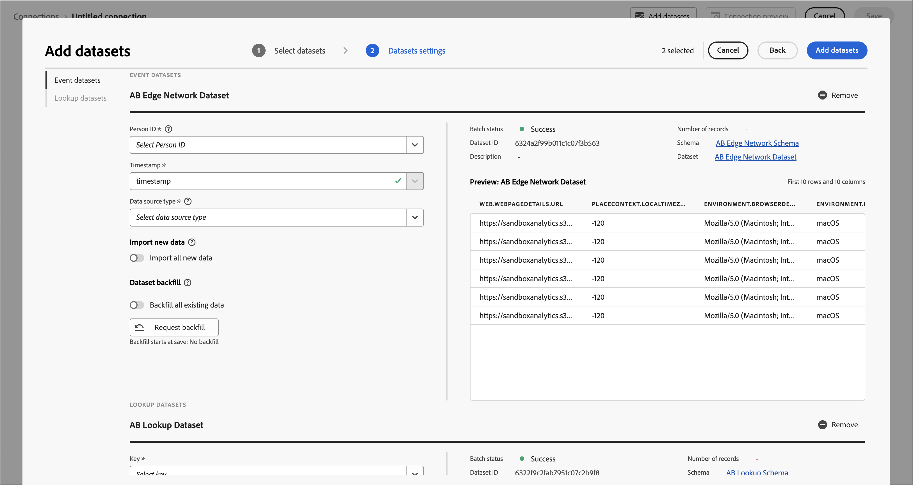

# 创建连接

最近在Customer Journey Analytics中启动了一个新的“连接”工作流。 新的连接创建和编辑工作流体验通过辅助工作流将所有数据集和连接配置设置引入屏幕中心。您提供了详细的数据集选择、配置和查看体验，以及数据集类型、大小、架构、数据集ID、批次状态、回填状态、人员ID等关键信息，以降低连接配置错误的风险。 以下是新功能的概述：

* 您可以在创建连接时启用滚动数据保留窗口。
* 您可以在连接中添加和删除数据集。（删除数据集会将其从连接中删除，并影响任何关联的数据视图和基础分析工作区项目。）
* 您可以为每个数据集启用和请求回填数据。
* 您可以编辑数据集，例如请求另一个回填。
* 您可以按数据集导入现有数据。

>[!VIDEO](https://video.tv.adobe.com/v/343044/?quality=12&learn=on)

## 创建和配置连接 {#create-connection}

1. 在 Customer Journey Analytics 中，单击&#x200B;**[!UICONTROL 连接]**&#x200B;选项卡。
1. 单击&#x200B;**[!UICONTROL “创建新连接”]**。

   

1. 配置连接设置。

   | 设置 | 描述 |
   | --- | --- |
   | **[!UICONTROL 连接名称]** | 输入连接的唯一名称。 |
   | **[!UICONTROL 连接说明]** | 描述这种连接的目的。 |
   | **[!UICONTROL 沙盒]** | 在 Experience Platform 中选择一个沙盒，其中包含要创建连接的数据集。<p>Adobe Experience Platform 提供了可将单个 Platform 实例划分为多个单独的虚拟环境的[沙盒](https://experienceleague.adobe.com/docs/experience-platform/sandbox/home.html?lang=zh-Hans)，以帮助开发和改进数字体验应用程序。您可以将沙盒视为包含数据集的“数据孤岛”。 沙盒用于控制对数据集的访问。<p>选择沙盒后，左边栏会显示可从该沙盒中提取的所有数据集。 |
   | **[!UICONTROL 启用滚动数据窗口]** | 如果选中此复选框，则可在连接级别将Customer Journey Analytics数据保留定义为以月计的滚动时段（1个月、3个月、6个月等）。<p>数据保留基于事件数据集时间戳并且仅适用于事件数据集。由于没有适用的时间戳，因此配置文件或查找数据集不存在滚动数据窗口设置。但是，如果您的连接包括任何配置文件或查找数据集（一个或多个事件数据集除外），则该数据会保留相同的时间段。<p> 主要好处是，您只需存储或报告适用且有用的数据，并且可删除不再有用的旧数据。它可以帮助您保持在合同限制范围内，并减少超出预期成本的风险。<p>如果您保留默认值（未选中），则保留期将由Adobe Experience Platform数据保留设置取代。 如果您在Experience Platform中有25个月的数据，则Customer Journey Analytics将通过回填获取25个月的数据。 如果您在Platform中删除了其中的10个月，则Customer Journey Analytics将保留剩余的15个月。 |
   | **[!UICONTROL 添加数据集]**（见下文） | 如果您的数据集列表中没有数据集，请添加数据集。 |
   | **[!UICONTROL 数据集名称]** | 选择一个或多个要拉入Customer Journey Analytics的数据集并单击 **[!UICONTROL 添加]**.<p>（如果您有许多数据集可供选择，可以使用数据集列表上方的搜索数据集搜索栏搜索正确的数据集。） |
   | **[!UICONTROL 上次更新时间]** | 仅对于事件数据集，此设置会自动设置为 Experience Platform 中基于事件的架构的默认时间戳字段。“N/A”表示该数据集不包含数据。 |
   | **[!UICONTROL 架构]** | 此 [架构](https://experienceleague.adobe.com/docs/experience-platform/xdm/schema/composition.html?lang=zh-Hans) 根据在Adobe Experience Platform中创建的数据集。 |
   | **[!UICONTROL 数据集类型]** | 对于您添加到此连接的每个数据集，Customer Journey Analytics 会根据传入的数据自动设置数据集类型。有 3 种不同的数据集类型：事件数据、配置文件数据和查找数据。有关数据集类型的说明，请参见下表。 |
   | **[!UICONTROL 人员 ID]** | 从可用标识的下拉列表中选择一个人员ID。 这些身份已在 Experience Platform 的数据集架构中定义。有关如何将身份映射用作人员 ID 的信息，请参见下文。<p>重要提示：如果没有可供选择的人员 ID，则意味着未在模式中定义一个或多个人员 ID。请查看[这个视频](https://www.youtube.com/watch?v=G_ttmGl_LRU)，以了解如何在 Experience Platform 中定义标识。 |
   | **[!UICONTROL 键]** | 仅用于查找数据集（例如 _id）。 |
   | **[!UICONTROL 匹配键]** | 仅用于查找数据集（例如 _id）。 |
   | **[!UICONTROL 导入新数据]** | 设置为开或关。 |
   | **[!UICONTROL 回填数据]** | 您可以请求根据事件时间戳回填数据集中的数据。例如，您可以请求回填过去 7 天的数据，配置正确的人员 ID 并测试您的连接是否配置正确。如果一切看起来正常，您可以轻松回填所有剩余数据。<p>此外，您可以启用按数据集导入新数据。例如，您可以仅对查找数据启用新数据导入。 |
   | **[!UICONTROL 回填状态]** | 指示是否正在处理任何回填数据。 |

   {style="table-layout:auto"}

## 添加和配置数据集 {#add-dataset}

新的工作流程允许您在创建连接时添加 Experience Platform 数据集。

1. 在连接设置对话框中，单击&#x200B;**[!UICONTROL 添加数据集]**。

2. 选择一个或多个数据集并单击&#x200B;**[!UICONTROL 下一个]**。至少一个事件数据集必须是连接的一部分。

3. 现在逐一配置数据集。

   

   | 设置 | 描述 |
   | --- | --- |
   | **[!UICONTROL 人员 ID]** | 从可用标识的下拉列表中选择一个人员ID。 这些身份已在 Experience Platform 的数据集架构中定义。有关如何将身份映射用作人员 ID 的信息，请参见下文。<p>如果没有可供选择的人员 ID，则意味着架构中尚未定义一个或多个人员 ID。请查看这个视频，以了解如何在 Experience Platform 中定义标识。 |
   | **[!UICONTROL 时间戳]** | 仅对于事件数据集，此设置会自动设置为 Experience Platform 中基于事件的架构的默认时间戳字段。 |
   | **[!UICONTROL 数据源类型]** | 选择数据源类型。 <br/>数据源类型包括： <ul><li>[!UICONTROL Web数据]</li><li>[!UICONTROL 移动应用程序数据]</li><li>[!UICONTROL POS数据]</li><li>[!UICONTROL CRM 数据]</li><li>[!UICONTROL 调查数据]</li><li>[!UICONTROL 呼叫中心数据]</li><li>[!UICONTROL 产品数据]</li><li> [!UICONTROL 帐户数据]</li><li> [!UICONTROL 交易数据]</li><li>[!UICONTROL 客户反馈数据]</li><li> [!UICONTROL 其他]</li></ul>此字段用于调查正在使用的数据源类型。 |
   | **[!UICONTROL 导入新数据]** | 如果要创建持续连接，请选择此选项，以便要添加到此连接中数据集的任何新数据批次会自动流入工作区中。可以设置为 [!UICONTROL 日期] 或 [!UICONTROL 关闭]. |
   | **[!UICONTROL 数据集回填]** | 选择 **[!UICONTROL 请求回填]** 以回填历史数据。<ul><li>您可以单独回填每个数据集。</li><li>您可以优先处理新添加到连接中数据集的新数据，因此这些新数据的延迟最低。</li><li>任何回填（历史）数据的导入速度都会比较慢。滞后时间受您拥有的历史数据数量影响。</li><li>Adobe Analytics Source Connector最多可为生产沙盒导入13个月的数据（不考虑数据大小）。 非生产沙盒中的回填限制为3个月。</li></ul> |
   | **[!UICONTROL 回填状态]** | 可能的状态指示符有：<ul><li>成功</li><li>X 回填处理</li><li>关</li></ul> |
   | **[!UICONTROL 数据集 ID]** | 此 ID 是自动生成的。 |
   | **[!UICONTROL 描述]** | 创建此数据集时给出的描述。 |
   | **[!UICONTROL 数据集大小]** | 数据集的大小。 |
   | **[!UICONTROL 架构]** | 在Adobe Experience Platform中创建数据集的架构。 |
   | **[!UICONTROL 数据集]** | 数据集的名称。 |
   | **[!UICONTROL 预览]**: `<dataset name>` | 预览包含日期、我的ID和标识符列的数据集。 |
   | **[!UICONTROL 删除]** | 您可以删除或移除数据集并更改人员 ID 而不删除整个连接。删除或删除数据可降低数据引入以及重新创建整个连接和相关数据视图这一繁琐过程所涉及的成本。 |

   {style="table-layout:auto"}

## 连接预览 {#preview}

要预览您创建的连接，请单击连接设置对话框中的&#x200B;**[!UICONTROL 连接预览]**。


此预览包含一些列出连接配置的列。 显示的列类型取决于您的个人数据集。

## 数据集类型 {#dataset-types}

对于您添加到此连接的每个数据集， [!UICONTROL Customer Journey Analytics] 根据传入的数据自动设置数据集类型。

>[!IMPORTANT]
>
>您必须至少添加一个事件数据集作为连接的一部分。


有三种不同的数据集类型： [!UICONTROL 事件] 数据， [!UICONTROL 个人资料] 数据，以及 [!UICONTROL 查找] 数据。

| 数据集类型 | 描述 | 时间戳 | 架构 | 人员 ID |
|---|---|---|---|---|
| **[!UICONTROL 事件]** | 表示及时事件的数据（例如，Web访问、交互、交易、POS数据、调查数据、广告展示数据等）。 例如，此数据可能是典型的点击流数据，包含客户ID或Cookie ID以及时间戳。 使用“事件”数据，您可以灵活地选择将哪个 ID 用作人员 ID。 | 自动设置为 [!UICONTROL Experience Platform] 中基于事件的架构的默认时间戳字段。 | 任何基于 XDM 类且具有“时间序列”行为的内置或自定义架构。示例包括“XDM 体验事件”或“XDM 决策事件”。 | 您可以选择想要包含的人员 ID。Experience Platform 中定义的每个数据集架构，可以拥有自己定义的一个或多个标识集，并与命名空间关联。这些身份中的任何身份都可以用作人员ID。 示例包括Cookie ID、拼接ID、用户ID、跟踪代码等。 |
| **[!UICONTROL 查询]** | 您现在可以将数据集添加为所有数据集类型中的字段的查找：配置文件、查找和事件数据集（始终支持后者）。 这一额外功能扩展了CJA支持复杂数据模型（包括B2B CDP）的能力。 此数据用于查找在事件、配置文件或查找数据中找到的值或键。 最多可以添加两个查找级别。 (请注意 [派生字段](/help/data-views/derived-fields/derived-fields.md) 不能用作连接中查找的匹配键。) 例如，您可以上传将事件数据中的数字 ID 映射到产品名称的查找数据。参见 [B2B用例](/help/use-cases/b2b/b2b.md) 举个例子。 | 不适用 | 任何基于 XDM 类且具有“记录”行为的内置或自定义架构，“XDM 个人资料”类除外。 | 不适用 |
| **[!UICONTROL 配置文件]** | 在中应用于您的个人、用户或客户的数据 [!UICONTROL 事件] 数据。 例如，允许您上传关于客户的 CRM 数据。 | 不适用 | 任何基于“XDM 个人资料”类的内置或自定义架构。 | 您可以选择想要包含的人员 ID。中定义的每个数据集 [!DNL Experience Platform] 拥有自己定义的一个或多个人员ID集，例如Cookie ID、拼接ID、用户ID、跟踪代码等。<br>**注释**：如果您创建的连接包含具有不同ID的数据集，则报表会反映这一点。 要真正合并数据集，您需要使用相同的人员 ID。 |

{style="table-layout:auto"}

## 使用数字字段作为查找键和查找值 {#numeric}

如果要向基于字符串的键字段添加数值字段（如成本或利润），此查找功能非常有用。 它允许数值以键或值的形式作为查找的一部分。在查找模式中，您可能有与产品名称、COG、营销活动成本或利润率等相关的数值。以下是 Adobe Experience Platform 中的查找模式示例：


现在，您支持将这些值作为量度或维度引入Customer Journey Analytics报表。 设置连接和拉入查找数据集时，可以编辑数据集以选择[!UICONTROL 键]和[!UICONTROL 匹配键]：


基于此连接设置数据视图时，可以将数值作为组件添加到数据视图中。基于此数据视图的任何项目都可以报告这些数值。

## 使用标识映射作为个人 ID {#id-map}

Customer Journey Analytics 支持将标识映射作为个人 ID。Identity Map 是一种地图数据结构，它允许您上载键 -> 值对。键是身份命名空间，值是包含身份值的结构。在上传的每一行/每个事件中，都存在身份映射，并且身份映射会相应地填充到每一行中。

身份映射适用于任何满足以下要求的数据集：使用基于 [ExperienceEvent XDM](https://experienceleague.adobe.com/docs/experience-platform/xdm/home.html?lang=zh-Hans) 类的架构。在选择要包含在Customer Journey Analytics连接中的此类数据集时，您可以选择字段作为主ID，也可以选择身份映射：


如果选择身份映射，您会另外再获得两个配置选项：

| 选项 | 描述 |
|---|---|
| **[!UICONTROL 使用主 ID 命名空间]** | 此选项指示Customer Journey Analytics在标识映射中每行查找标记为primary=true属性的标识并将其用作该行的人员ID。 此标识是在Experience Platform中用于分区的主键。 此外，此身份还是用作Customer Journey Analytics人员ID的主要候选项(取决于Customer Journey Analytics连接中数据集配置的方式)。 |
| **[!UICONTROL 命名空间]** | （此选项仅适用于未使用主 ID 命名空间的情况。）身份命名空间是 [ Experience Platform Identity Service](https://experienceleague.adobe.com/docs/experience-platform/identity/namespaces.html?lang=zh-Hans) 的组件，充当与身份相关的上下文指示器。如果指定命名空间，则Customer Journey Analytics将搜索此命名空间键的每行的“身份映射”，然后使用该命名空间下的身份作为该行的人员ID。 由于Customer Journey Analytics无法对所有行执行完整数据集扫描以确定哪些命名空间存在，因此下拉列表中会显示所有可能的命名空间。 您必须知道数据中指定了哪些命名空间；系统不会自动检测到这些命名空间。 |

{style="table-layout:auto"}

### 身份映射边缘情况 {#id-map-edge}

下表显示了当存在边缘情况时两种配置方案及其处理方式：

| 选项 | “身份映射”中不存在 ID | 多个 ID，没有一个标记为主 ID | 多个 ID 均标记为主 ID | 单个 ID，是否标记为主 ID | 一个 ID 标记为主 ID 的无效命名空间 |
|---|---|---|---|---|---|
| **[!UICONTROL 使用主 ID 命名空间]已选中** | 该行将被Customer Journey Analytics删除。 | 该行将被Customer Journey Analytics删除，因为未指定主ID。 | 所有命名空间下标记为主 ID 的 ID 都将被提取到列表中，然后，它们按字母顺序排序；在新的排序中，第一个命名空间及其第一个ID将被用作人员ID。 | 单个 ID 用作个人 ID。 | 即使命名空间可能无效(未出现在Adobe Experience Platform中)，Customer Journey Analytics仍会使用该命名空间下的主ID作为人员ID。 |
| **[!UICONTROL 特定的身份映射命名空间]已选择** | 该行将被Customer Journey Analytics删除。 | 选定命名空间下的所有 ID 都将被提取到列表中，并且首个 ID 将会用作人员 ID。 | 选定命名空间下的所有 ID 都将被提取到列表中，并且首个 ID 将会用作人员 ID。 | 选定命名空间下的所有 ID 都将被提取到列表中，并且首个 ID 将会用作人员 ID。 | 选定命名空间下的所有 ID 都将被提取到列表中，并且首个 ID 将会用作人员 ID。（由于在创建连接时，只能选择有效的命名空间，因此无效的命名空间/ID 不可能用作人员 ID） |

{style="table-layout:auto"}

## 计算平均每日事件数

此计算针对连接中的每个数据集完成。

1. 转到 [Adobe Experience Platform查询服务](https://experienceleague.adobe.com/docs/experience-platform/query/home.html?lang=zh-Hans) 并创建查询。

   创建的查询将如下所示：

   ```
   Select AVG(A.total_events) from (Select DISTINCT COUNT (*) as total_events, date(TIMESTAMP) from analytics_demo_data GROUP BY 2 Having total_events>0) A;
   ```

   在此示例中，“analytics_demo_data”是数据集的名称。

2. 要显示Adobe Experience Platform中存在的所有数据集，请执行 `Show Tables` 查询。
