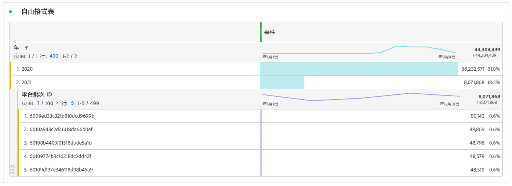

# 预估连接大小

您可能需要知道 [!UICONTROL Customer Journey Analytics] 中当前有多少行数据。要准确了解贵组织的事件数据记录（数据行）使用情况，请执行以下操作 **对于贵组织创建的每个连接**.

1. 在 [!UICONTROL Customer Journey Analytics] 中，单击&#x200B;**[!UICONTROL 连接]**&#x200B;选项卡。

   您现在可以看到所有当前连接的列表。

1. 单击每个连接名称以转到连接管理器。

1. 将 **[!UICONTROL 可用事件数据的记录]** ，用于创建的所有连接。 （根据连接的大小，数字可能需要一段时间才能显示。）

   

1. 获得所有事件数据行的总和后，在您的公司与Adobe签署的Customer Journey Analytics合同中查找“数据行”权利。

   这可让您获得销售订单中授权的最大数据行数。 如果步骤3产生的数据行数大于此数值，则表示您出现过量情况。

1. 要解决这种情况，您有以下几个选项：

   * 更改 [数据保留设置](https://experienceleague.adobe.com/docs/analytics-platform/using/cja-connections/manage-connections.html?lang=zh-Hans#set-rolling-window-for-connection-data-retention).
   * [删除任何未使用的连接](https://experienceleague.adobe.com/docs/analytics-platform/using/cja-overview/cja-faq.html?lang=zh-Hans#implications-of-deleting-data-components).
   * [删除AEP中的数据集](https://experienceleague.adobe.com/docs/analytics-platform/using/cja-overview/cja-faq.html?lang=en#implications-of-deleting-data-components).
   * 请联系您的Adobe客户经理以许可额外容量。

## 关于使用超量

Adobe会每天严格监控和强制实施使用限制。 “数据行”是指可用于在Customer Journey Analytics中分析的每日平均数据行数。

假设您的合同授权将行数限制为100万。 假设在第1天使用Customer Journey Analytics时，您上传了200万行数据。 在第2天，您删除了100万行，并在剩余的许可期限内，将使用量保持在已承诺的最大值。 根据您的合同条款，您仍可能会在第1天收取按比例分摊的超额使用费用。

## 诊断差异

在某些情况下，您可能会注意到您的连接所摄取的事件总数与 [!UICONTROL Adobe Experience Platform] 中数据集的行数存在差异。在此示例中，“B2B Impression”数据集的行数为 7650，而该数据集在 [!UICONTROL Adobe Experience Platform] 中的行数为 3830。导致差异的原因有多种，可采取以下步骤进行诊断：

1. 按 **[!UICONTROL Platform 数据集 ID]** 划分此维度，此时，您会发现存在两个大小相同但 **[!UICONTROL Platform 数据集 ID]** 不同的数据集。每个数据集都包含 3825 条记录。这意味着由于缺少人员 ID 或缺少时间戳，[!UICONTROL Customer Journey Analytics] 忽略了 5 条记录：

   

1. 此外，如果我们登入 [!UICONTROL Adobe Experience Platform]，便会发现不存在 ID 为“5f21c12b732044194bffc1d0”的数据集，这表示在最初创建连接时，从 [!UICONTROL Adobe Experience Platform] 中删除了此特定数据集。不过，之后又将此数据集重新添加到 Customer Journey Analytics 中，但 [!UICONTROL Adobe Experience Platform] 生成了一个不同的 [!UICONTROL Platform 数据集 ID]。

有关更多信息，请参阅在 [!UICONTROL Customer Journey Analytics] 和 [!UICONTROL Adobe Experience Platform] 中[删除数据集和连接的后果](https://experienceleague.adobe.com/docs/analytics-platform/using/cja-overview/cja-faq.html?lang=en#implications-of-deleting-data-components)。
