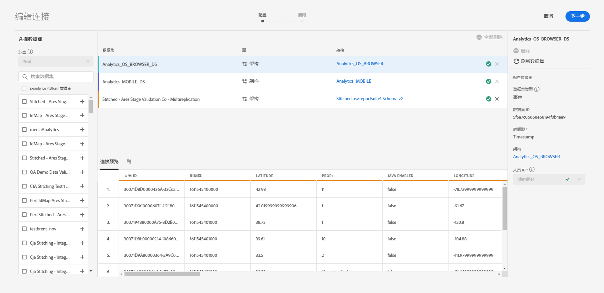
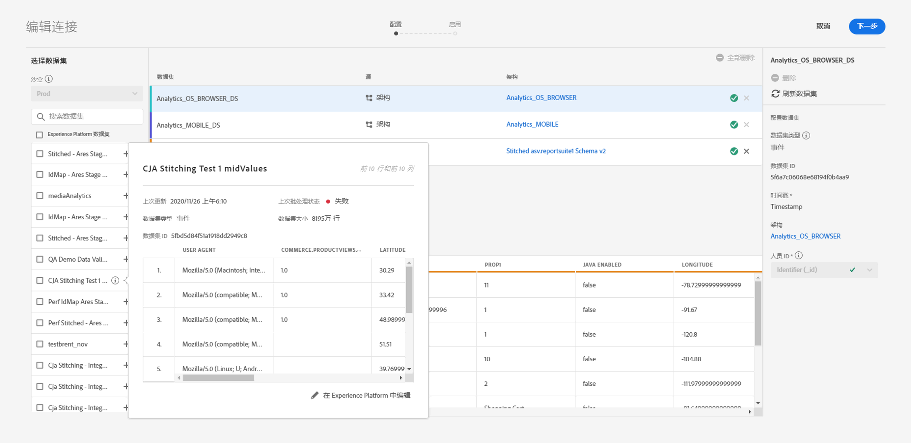
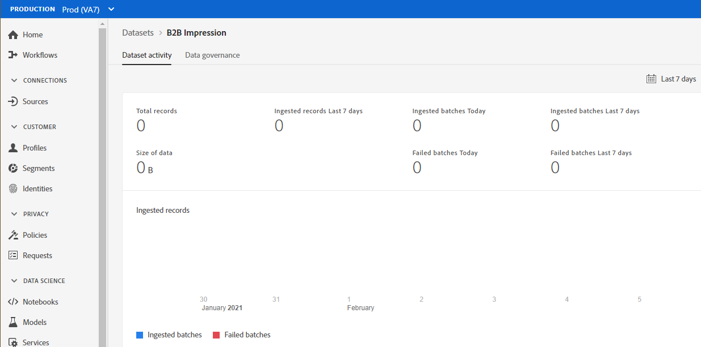
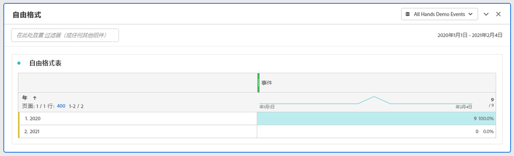

# 预估连接大小

您可能需要知道 [!UICONTROL Customer Journey Analytics] 中当前有多少行数据。本主题旨在向您展示如何报告 [!UICONTROL Customer Journey Analytics] 的当前使用情况。

1. 在 [!UICONTROL Customer Journey Analytics] 中，单击&#x200B;**[!UICONTROL 连接]**&#x200B;选项卡。
1. 在[!UICONTROL 编辑连接]屏幕上，选择要确定其使用情况/连接大小的连接。

   

1. 从左边栏中选择连接中包含的一个数据集。在本例中，选择“B2B Impression”数据集。

   

1. 单击该数据集名称旁边的蓝色 (i) 图标（信息）。您会注意到该数据集具有 3800 行/事件。此外，要获得确切的行数，请单击预览表下方的&#x200B;**[!UICONTROL 在 Experience Platform 中编辑]**。这会将您重定向到 [!UICONTROL Adobe Experience Platform] 中的数据集。

   

1. 注意，此数据集的&#x200B;**[!UICONTROL 总记录数]**&#x200B;为 3830 条，数据大小为 388.59 KB。

1. 对连接中的其他数据集重复步骤 1-5，并累加记录数/行数。最终的汇总数是您连接的“使用情况”量度。这是您要从 [!UICONTROL Adobe Experience Platform] 中摄取的连接数据集的行数。

## 确定摄取的行数

在 [!UICONTROL Customer Journey Analytics] 中实际摄取的事件数取决于您的连接配置设置。此外，如果您选择了错误的人员 ID，或者此 ID 对于数据集中的某些行不可用，则 [!UICONTROL Customer Journey Analytics] 将忽略这些行。要确定实际摄取的事件行数，请执行以下步骤：

1. 保存连接后，创建同一连接的数据视图，且不使用任何过滤器。
1. 创建一个工作区项目并选择正确的数据视图。创建一个自由格式表，并将&#x200B;**[!UICONTROL 事件]**&#x200B;量度和&#x200B;**[!UICONTROL 年份]**&#x200B;维度拖放到该表中。从用于进行日期选择的日历中选择足够大的日期范围，以封装连接中的所有数据。这样，您将可以看到被摄取到 [!UICONTROL Customer Journey Analytics] 中的事件数。

   

   >[!NOTE]
   >
   >这将让您可以看到从事件数据集摄取的事件数。其中不包含配置文件和查找类型的数据集。对配置文件和查找数据集，请按照“预估连接大小”下的步骤 1-3 操作，并累加数值以获得此连接的总行数。

## 诊断差异

在某些情况下，您可能会注意到您的连接所摄取的事件总数与 [!UICONTROL Adobe Experience Platform] 中数据集的行数存在差异。在此示例中，“B2B Impression”数据集的行数为 7650，而该数据集在 [!UICONTROL Adobe Experience Platform] 中的行数为 3830。导致差异的原因有多种，可采取以下步骤进行诊断：

1. 按 **[!UICONTROL Platform 数据集 ID]** 划分此维度，此时，您会发现存在两个大小相同但 **[!UICONTROL Platform 数据集 ID]** 不同的数据集。每个数据集都包含 3825 条记录。这意味着由于缺少人员 ID 或缺少时间戳，[!UICONTROL Customer Journey Analytics] 忽略了 5 条记录：

   

1. 此外，如果我们登入 [!UICONTROL Adobe Experience Platform]，便会发现不存在 ID 为“5f21c12b732044194bffc1d0”的数据集，这表示在最初创建连接时，从 [!UICONTROL Adobe Experience Platform] 中删除了此特定数据集。不过，之后又将此数据集重新添加到 [!UICONTROL Customer Journey Analytics] 中，但 [!UICONTROL Adobe Experience Platform] 生成了一个不同的 [!UICONTROL Platform 数据集 ID]。

有关更多信息，请参阅在 [!UICONTROL Customer Journey Analytics] 和 [!UICONTROL Adobe Experience Platform] 中[删除数据集和连接的后果](https://experienceleague.adobe.com/docs/analytics-platform/using/cja-overview/cja-faq.html?lang=zh-Hans#implications-of-deleting-data-components)。
