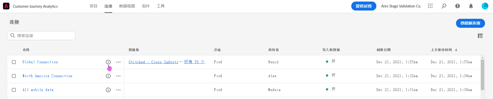
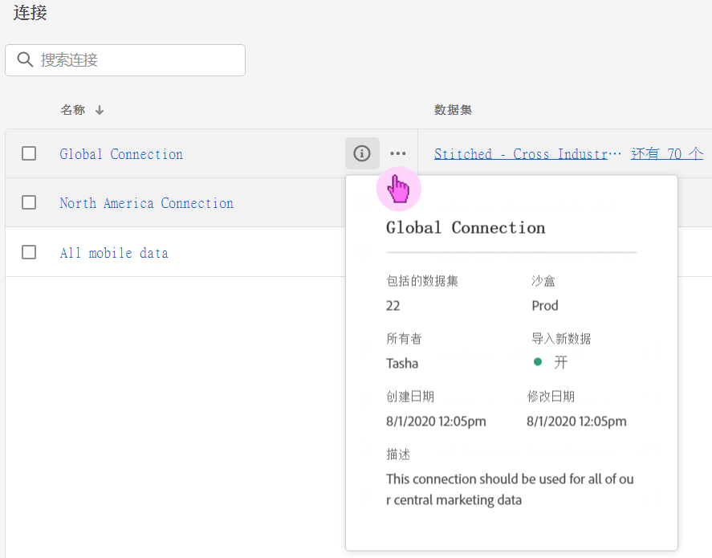
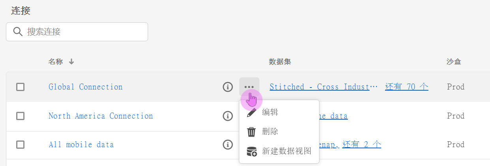
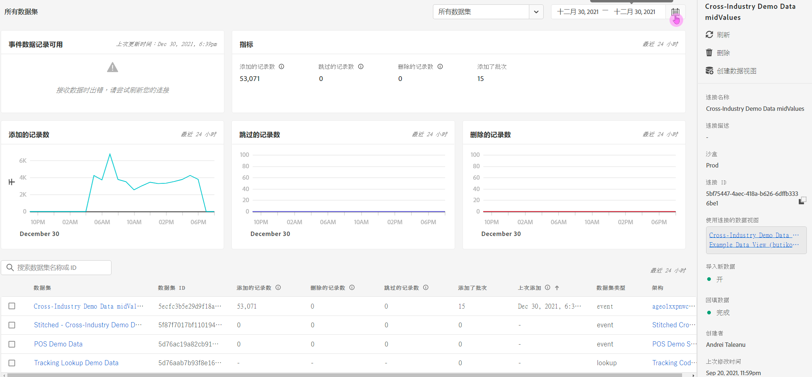

# 管理连接

一旦管理员用户[创建了一个或多个连接](/help/connections/create-connection.md)，他们就可以在[!UICONTROL 连接]管理器中管理这些连接。在“连接”体验的最新更新中，在“连接详细信息”页面中增加了两个重要功能，详细说明见本页下面部分：

* 这使您可以检查&#x200B;**连接的数据集的状态和摄取过程的状态**。通过此状态检查，您能够知道什么时候数据可用，从而可以进入 Analysis Workspace 开始分析。

* 它让您能够发现因错误配置&#x200B;**导致的数据不一致**。您是否丢失了行？如果是，那么丢失了哪些行？为什么？您是否错误配置了连接并因此导致 CJA 中数据丢失？

以下是关于新连接管理器的视频：

>[!VIDEO](https://video.tv.adobe.com/v/342097/?quality=12&learn=on)

## 连接管理器 {#connections-manager}

连接管理器允许您：

* 直观查看所有连接，包括所有者、沙盒以及其创建和修改时间。
* 查看一个连接中的全部数据集。
* 检查连接状态。
* 删除连接。
* 重命名连接。
* 从连接中创建一个数据视图。

### 连接管理器设置

| 设置 | 描述 |
| --- | --- |
| [!UICONTROL 名称] | 好记的连接名称。当您单击超链接名称时，将转入下面描述的“连接详细信息”页面。 |
| 连接信息 | 单击连接名称旁边的信息图标以查看以下信息： |
| 编辑连接 | 单击连接名称旁边的省略号 (...)，然后单击[!UICONTROL 编辑]。 有关更多信息，请参阅下面的“编辑连接”。 |
| 删除连接 | 单击连接名称旁边的省略号 (...)，然后单击[!UICONTROL 删除]。更多信息参见“删除连接”标题下的内容。 |
| 创建数据视图 | 单击连接名称旁边的省略号 (...)，然后单击[!UICONTROL 创建数据视图]。此操作基于这一连接创建新的数据视图。[了解详情](https://experienceleague.adobe.com/docs/analytics-platform/using/cja-dataviews/data-views.html) |
| [!UICONTROL 数据集] | 作为连接一部分的数据集。您可以单击超链接来查看连接中的全部数据集。单击一个数据集会在 Adobe Experience Platform 中在新的选项卡中打开该数据集。 |
| [!UICONTROL 沙盒] | 此连接从中获取其数据集的 [Adobe Experience Platform 沙盒](https://experienceleague.adobe.com/docs/experience-platform/sandbox/home.html)。这是您在首次创建连接时选择的沙盒。不能更改。 |
| [!UICONTROL 所有者] | 创建连接的人员。 |
| [!UICONTROL 导入数据集] | 您可以启用或禁用以前称为“数据流式传输”的东西。 |
| [!UICONTROL 创建日期] | 首次创建连接的日期。 |
| [!UICONTROL 上次修改时间] | 上次更新连接的日期。 |

### 删除连接 {#connections-delete}

只有管理员有权删除连接。非管理员看不到此操作。

1. 单击连接名称旁边的省略号 (...)。
1. 单击[!UICONTROL 删除]。

删除 [!UICONTROL Customer Journey Analytics] 中的一个连接时，出现错误消息，称：

* 基于已删除连接所创建的任何数据视图都不再有效。
* 同样地，任何依赖于已删除连接中的数据视图的工作区项目都将停止运行。

[详细了解](/help/getting-started/cja-deletion.md)删除后果。

### 搜索连接或数据集

您可以使用顶部的搜索栏，在[!UICONTROL 连接]标题下搜索连接。

### 排序连接

您可以单击每个列头并向上或向下排序来排序连接。

## “连接详细信息”页面 {#connection-detail}

新的“连接详细信息”页面为您提供关于连接状态的非常详细的视图。

您可以从中：

* 检查连接的数据集的状态和摄取过程的状态。
* 发现导致跳过或删除记录的配置问题。
* 了解数据何时可用于报告。

>[!IMPORTANT]
>任何在 2021 年 8 月 13 日之前引入的数据均不反映在此[!UICONTROL 连接]对话框中。

以下是构件和设置解释：

### 连接详细信息设置

| 构件/设置 | 描述 |
| --- | --- |
| 数据集选择器 | 允许您选择连接中的一个或全部数据集。不能选择其他数量的数据集。默认为[!UICONTROL 全部数据集]。 |
| 日历/日期范围 | 日期范围指您何时将数据添加到连接中的。包括所有标准日历预设。您可以自定义日期范围，但自定义日期范围不会出现在下拉列表中。 |
| [!UICONTROL 可用的事件数据记录数]构件 | 表示&#x200B;**对于整个连接**&#x200B;可用于报表的事件数据集总行数。此数与任何日历设置无关。如果您从数据集选择器中选择了一个数据集，或者在表中选择了一个数据集，则该数会变化。（请注意，添加数据后，数据延迟 1-2 个小时后才会出现在报告中。） |
| [!UICONTROL 量度]构件 | 汇总&#x200B;**对于所选择的数据集和日期范围**&#x200B;添加/跳过/删除的事件记录以及添加的批次数。 |
| [!UICONTROL 添加的记录数]构件 | 指示在选定时间段，**为您选择的数据集和日期范围**&#x200B;添加了多少行。每 10 分钟更新一次。**注意**：**[!UICONTROL 添加的记录数]**&#x200B;的数据目前仅包括事件数据，而不包括配置文件或查找数据。 |
| [!UICONTROL 跳过的记录数]构件 | 指示在选定的时间段内跳过了多少行（对于您选择的数据集和日期范围&#x200B;**）。**&#x200B;跳过记录的原因包括：缺少时间戳、缺少人员 ID 或人员 ID 无效等。每 10 分钟更新一次。
无效的个人 ID（例如“undefined”或“00000000”，或者在某个事件中，[!UICONTROL 人员 ID] 中的任何数字和字母组合在指定月份出现超过 100 万次）无法归因到任何特定的用户或个人。它们无法提取到系统中，并会导致容易出错的提取和报告。要修复无效的人员 ID，您有 3 个选项：<ul><li>使用[跨渠道分析](/help/cca/overview.md)可以利用有效用户 ID 填充未定义或全零用户 ID。</li><li>作废用户 ID，则在提取期间也会跳过这些 ID（这要优于无效或全零用户 ID）。</li><li>先修复系统中的任意无效用户 ID，然后再提取数据。</li></ul>
**注意**：**[!UICONTROL 跳过的记录数]**&#x200B;的数据目前仅包括事件数据，而不包括配置文件或查找数据。 |
| [!UICONTROL 删除的记录数]构件 | 指示在选定时间段，**为您选择的数据集和日期范围**&#x200B;删除了多少行。例如，有人可能在 Experience Platform 中删除了一个数据集。每 10 分钟更新一次。**注意**：**[!UICONTROL 删除的记录数]**&#x200B;的数据目前仅包括事件数据，而不包括配置文件或查找数据。 |
| 数据集搜索框 | 您可以按数据集名称或[!UICONTROL 数据集 ID] 来搜索。 |
| [!UICONTROL 数据集] | 显示作为连接一部分的数据集。您可以单击超链接来查看连接中的全部数据集。 |
| [!UICONTROL 数据集 ID] | 此 ID 由 Adobe Experience Platform 自动生成。 |
| [!UICONTROL 批次] | 指示已在此数据集中添加了多少数据批次。 |
| [!UICONTROL 上次添加时间] | 显示此数据集中最后添加的批次的时间戳。 |
| [!UICONTROL 数据集类型] | 此数据集的数据集类型可以是[!UICONTROL 事件]、[!UICONTROL 查找]或[!UICONTROL 档案]。[了解详情](https://experienceleague.adobe.com/docs/analytics-platform/using/cja-connections/create-connection.html#configure-dataset) |
| 架构 | 此连接中的数据集所基于的 Adobe Experience Platform 架构。 |

### 连接级别的右侧边栏设置

| 设置 | 描述 |
| --- | --- |
| [!UICONTROL 刷新] | 刷新连接以便反映最近添加的记录。 |
| [!UICONTROL 删除] | 删除此连接。 |
| [!UICONTROL 创建数据视图] | 基于此连接创建新的数据视图。[了解详情](https://experienceleague.adobe.com/docs/analytics-platform/using/cja-dataviews/data-views.html) |
| [!UICONTROL 连接名称] | 显示好记的连接名称。 |
| [!UICONTROL 连接说明] | 显示完整描述此连接目的的更详细的说明。 |
| [!UICONTROL 沙盒] | 此连接从中获取其数据集的 [Adobe Experience Platform 沙盒](https://experienceleague.adobe.com/docs/experience-platform/sandbox/home.html)。这是您在首次创建连接时选择的沙盒。不能更改。 |
| [!UICONTROL 连接 ID] | 此 ID 是系统在 Adobe Experience Platform 中生成的。 |
| [!UICONTROL 使用连接的数据视图] | 列出使用此连接的所有数据视图。 |
| [!UICONTROL 导入新数据] | （开启/关闭）指示是否应将新批次的数据添加到历史（回填）数据中。 |
| [!UICONTROL 回填数据] | 跟踪回填（历史）数据的 3 种状态：[!UICONTROL 队列中]、[!UICONTROL 进行中]（同时显示进度百分比）和[!UICONTROL 完成]。 |
| [!UICONTROL 创建者] | 显示创建连接的人员的姓名。 |
| [!UICONTROL 上次修改时间] | 显示上次更改连接的日期和时间。 |
| [!UICONTROL 上次修改人] | 显示上次修改连接的人员。 |

### 数据集级别的右侧边栏设置

| 设置 | 描述 |
| --- | --- |
| [!UICONTROL 人员 ID] | 在 Experience Platform 中显示在数据集架构中定义的身份。这是您在创建连接期间选择的人员 ID。如果您创建的连接包含具有不同 ID 的数据集，则报告中会反映这一点。要真正合并数据集，需要跨所有数据集使用相同的人员 ID。 |
| [!UICONTROL 可用的记录数] | 表示对于通过日历选择的特定时段为此数据集引入的总行数。添加数据后，数据立刻在报告中显示，没有延迟。（创建全新连接时的情况例外，此时有[延迟](https://experienceleague.adobe.com/docs/analytics-platform/using/cja-overview/cja-faq.html#3.-getting-data-into-customer-journey-analytics)。） |
| [!UICONTROL 添加的记录数] | 指示在所选时段中添加了多少行。**注意**：**[!UICONTROL 添加的记录数]**&#x200B;的数据目前仅包括事件数据，而不包括配置文件或查找数据。 |
| [!UICONTROL 删除的记录数] | 指示在所选时段期间删除了多少条记录。**注意**：**[!UICONTROL 删除的记录数]**&#x200B;的数据目前仅包括事件数据，而不包括配置文件或查找数据。 |
| [!UICONTROL 添加的批次] | 指示有多少数据批次添加到此数据集。 |
| [!UICONTROL 跳过的记录数] | 指示提取期间在选定的时段中跳过了多少行。
跳过记录的原因包括：缺少时间戳、缺少人员 ID 或人员 ID 无效等。每 10 分钟更新一次。
无效的个人 ID（例如“undefined”或“00000000”，或者在某个事件中，[!UICONTROL 人员 ID] 中的任何数字和字母组合在指定月份出现超过 100 万次）无法归因到任何特定的用户或个人。它们无法提取到系统中，并会导致容易出错的提取和报告。要修复无效的人员 ID，您有 3 个选项：<ul><li>使用[跨渠道分析](/help/cca/overview.md)可以利用有效用户 ID 填充未定义或全零用户 ID。</li><li>作废用户 ID，则在提取期间也会跳过这些 ID（这要优于无效或全零用户 ID）。</li><li>先修复系统中的任意无效用户 ID，然后再提取数据。</li></ul>
**注意**：**[!UICONTROL 跳过的记录数]**&#x200B;的数据目前仅包括事件数据，而不包括配置文件或查找数据。 |
| [!UICONTROL 上次添加时间] | 指示添加最后批次的时间。 |
| [!UICONTROL 数据集类型] | [!UICONTROL 事件]、[!UICONTROL 查找]或[!UICONTROL 档案]。[了解详情](https://experienceleague.adobe.com/docs/analytics-platform/using/cja-connections/create-connection.html#configure-dataset) |
| [!UICONTROL 架构] | 显示此数据集所基于的 Adobe Experience Platform 架构。 |
| [!UICONTROL 数据集 ID] | 此 ID 是系统在 Adobe Experience Platform 中生成的。 |

## 编辑连接

允许管理员编辑连接。选择一个连接，然后单击[!UICONTROL 编辑连接]转入该对话框。在这里，您可以执行以下操作：

* 开始或停止导入新数据。此过程以前称为“数据流式传输”。
* 重命名连接。
* 刷新数据集。
* 从连接中删除数据集。

