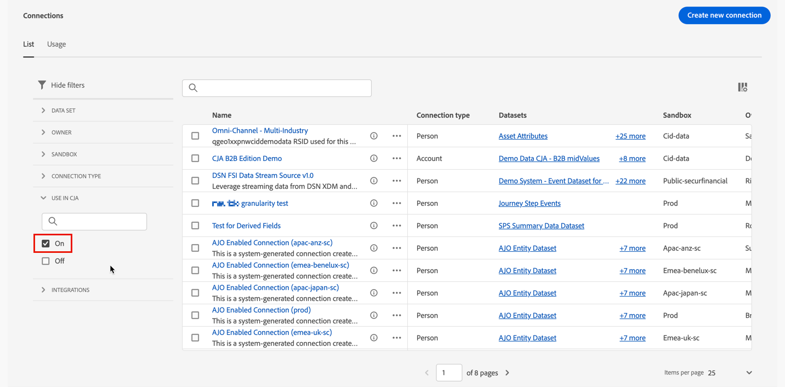
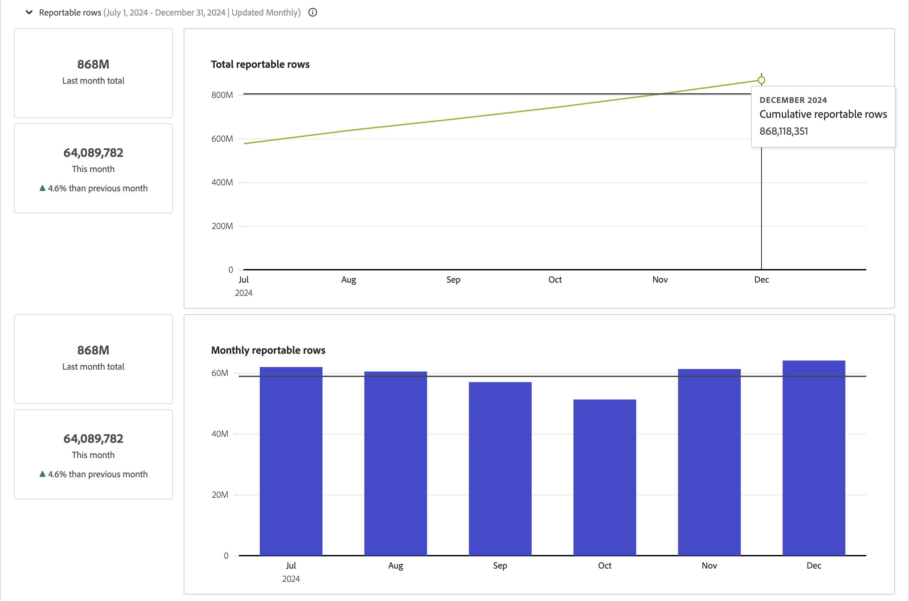

# 管理连接 {#manage-connections}

>[!CONTEXTUALHELP]
>id="connections_use_ajo"
>title="使用 Journey Optimizer 连接"
>abstract="通过 Journey Optimizer 使用高级 Customer Journey Analytics 报告功能。"

>[!CONTEXTUALHELP]
>id="connections_cancel_ajo"
>title="取消 Journey Optimizer 连接"
>abstract="通过 Journey Optimizer 取消高级 Customer Journey Analytics 报告功能。"

在[创建或编辑一个或多个连接](/help/connections/create-connection.md)后，即可在&#x200B;**[!UICONTROL 连接]**&#x200B;中管理它们。[!UICONTROL 连接]接口允许您：

* 一目了然地查看所有连接，包括所有者、沙盒以及创建和修改连接的时间。
* 编辑连接。
* 删除连接。
* 从连接中创建一个数据视图。
* 查看一个连接中的全部数据集。
* 检查连接的数据集的状态以及摄取过程的状态。例如，您的数据何时可用，以便您可以开始在 Analysis Workspace 中进行报告和分析。
* 识别因配置错误导致的任何数据不一致的情况。是否漏掉了任何行？如果是，那么漏掉了哪些行？为什么？连接的配置是否有误，导致 Customer Journey Analytics 中的数据缺失？
* 了解所有连接中已摄取和可报告行的使用情况。

[!UICONTROL 连接]有两个界面：[[!UICONTROL 列表]](#list)和[[!UICONTROL 使用情况]](#usage)。

## 列表

**[!UICONTROL 列表]**&#x200B;界面是“连接”的默认界面。如果未选择，请选择&#x200B;**[!UICONTROL 列表]**&#x200B;选项卡以访问该界面。

[!UICONTROL List]接口显示所有可用连接的表。

### 搜索连接

您可以使用搜索框快速搜索连接。

### 将过滤器应用于连接列表

要将过滤器应用于连接列表，请选择过滤器图标，然后从以下过滤器选项中选择：

| 筛选选项 | 描述 |
|---------|----------|
| **[!UICONTROL 数据集]** | 只显示与您选择的数据集关联的连接。 |
| **[!UICONTROL 所有者]** | 只显示由您选择的人员拥有的连接。 |
| **[!UICONTROL 沙盒]** | 仅显示您选择的沙盒中可用的连接。 |
| 在CJA中&#x200B;**[!UICONTROL 使用]** | 选择&#x200B;**[!UICONTROL On]**&#x200B;以仅显示允许与Customer Journey Analytics一起使用的连接。 选择&#x200B;**[!UICONTROL 关闭]**&#x200B;可仅显示尚未启用以与Customer Journey Analytics一起使用的连接。 |

### 可用列

该表格中提供了以下列或图标。

| 列或图标 | 描述 |
| --- | --- |
| **[!UICONTROL _名称_]** | 好记的连接名称。选择超链接名称以查看连接[的](#connection-details)详细信息。 |
|  | 要查看有关[!UICONTROL 包含的数据集]、[!UICONTROL 沙盒]、[!UICONTROL 所有者]等的信息，请选择连接名称旁边的。
一个弹出窗口会显示有关数据集的详细信息。 
 |
|  | 要为连接[创建一个数据视图](#create-a-data-view)，请选择。仅当连接没有与之关联的数据视图时才会显示此图标。 |
|  | 选择以打开上下文菜单。 您可以选择︰ 
 **[!UICONTROL 编辑]**&#x200B;以[编辑](#edit-a-connection)连接。
 **[!UICONTROL 删除]**&#x200B;以[删除](#delete-a-connection)连接。
 **[!UICONTROL 创建新的数据视图]**&#x200B;以[为连接创建新的数据视图](#create-a-data-view)。
 **[!UICONTROL 连接映射]**&#x200B;以查看连接的[连接映射](#map-a-connection)。 |
| [!BADGE B2B edition]{type=Informative url="https://experienceleague.adobe.com/zh-hans/docs/analytics-platform/using/cja-overview/cja-b2b/cja-b2b-edition" newtab=true tooltip="Customer Journey Analytics B2B Edition"} **[!UICONTROL 连接类型&#x200B;]** | 连接的类型：基于&#x200B;**[!UICONTROL 人员]**&#x200B;或基于&#x200B;**[!UICONTROL 帐户]**&#x200B;的连接。 |
| **[!UICONTROL 数据集]** | 连接中包含的一个或多个数据集链接。您可以选择数据集超链接来查看连接中的数据集。如果选定的连接中包含更多数据集，请选择 **[!UICONTROL +*x* 更多]**，以显示&#x200B;**[!UICONTROL 包含的数据集]**&#x200B;面板。此面板显示指向所有数据集的链接以及以搜索作为连接一部分的特定数据集的选项。

选择一个数据集名称，以在新选项卡的Experience Platform界面中打开该数据集。 |
| **[!UICONTROL 沙盒]** | 此连接从中获取其数据集的 [Experience Platform 沙盒](https://experienceleague.adobe.com/zh-hans/docs/experience-platform/sandbox/home)。在创建连接时选择此沙盒。 保存连接后，无法更改沙盒。 |
| **[!UICONTROL 所有者]** | 创建连接的人员。 |
| **[!UICONTROL 导入新数据]** | 数据集导入新数据的状态： 
   **[!UICONTROL _x _On]**&#x200B;用于配置为导入新数据的数据集，并且
对于未配置为导入新数据的数据集，   **[!UICONTROL _x 关闭_]**。 |
| **[!UICONTROL 创建日期]** | 创建连接的时间戳。 |
| **[!UICONTROL 上次修改时间]** | 上次更新连接的时间戳。 |
| **[!UICONTROL 回填数据]** | 数据集中回填数据的状态。
   **[!UICONTROL _x _回填失败]**，表示数据集中回填失败的次数，
   **[!UICONTROL _x _正在处理回填]**，表示数据集中正在处理的回填次数，
   **[!UICONTROL _x _回填完成]**，数据集中已完成的回填次数，以及
如果连接中的数据集未定义回填，则   **[!UICONTROL _关闭_]**。 |
| **[!UICONTROL 集成]** | 显示通过连接启用的所有Experience Platform应用程序。 |
| 在CJA中&#x200B;**[!UICONTROL 使用]** | 显示是否已启用连接以用于Customer Journey Analytics。 |

要配置要在表中显示的列，请选择。 在自定义表对话框中，选择要显示的列。

### 编辑连接

要编辑连接：

1. 选择连接名称旁边的 
1. 从上下文菜单中选择**[!UICONTROL 编辑]**。

或者，您可以：

1. 选择连接行。

1. 从蓝色操作栏中选择 **[!UICONTROL 编辑]**。

有关更多信息，请参阅[创建或编辑连接](create-connection.md)。

### 删除连接 {#connections-delete}

要删除连接：

1. 选择连接名称旁边的。
1. 选择**[!UICONTROL 删除]**。

或者，您可以：

1. 选择连接行。

1. 从蓝色操作栏中选择 **[!UICONTROL 删除]**。

删除连接时，**[!UICONTROL 删除连接]**&#x200B;面板会指示删除的是哪些数据视图，以及哪些工作区项目会受到影响。

* 在➊ **[!UICONTROL 信息]**&#x200B;中，显示了删除连接的后果。

  

  选择&#x200B;**[!UICONTROL 继续]**&#x200B;以确认删除。

* 在➋ **[!UICONTROL 确认]**&#x200B;中，在&#x200B;**[!UICONTROL 键入连接名称]**&#x200B;中输入连接名称，并选择&#x200B;**[!UICONTROL 删除]**&#x200B;以删除该连接。 选择&#x200B;**[!UICONTROL 取消]**&#x200B;即可取消。

有关删除连接的更多信息，参阅[删除产生的影响](/help/technotes/deletion.md)。

### 为连接创建一个数据视图

要为连接创建数据视图：

1. 选择连接名称旁边的。
1. 选择**[!UICONTROL 创建新的数据视图]**。

或者，您可以：

1. 选择连接行。

1. 从蓝色操作栏中选择 **[!UICONTROL 创建数据视图]**。

有关更多信息，请参阅[创建或编辑数据视图](/help/data-views/create-dataview.md)。

### Journey Optimizer连接

您可以使用Customer Journey Analytics中的Journey Optimizer连接为您的连接带来以下附加值：

* 在Customer Journey Analytics中对Journey Optimizer数据执行深入分析(通过使用Journey Optimizer中的&#x200B;**[!UICONTROL 在CJA中分析]**&#x200B;按钮)。

  有关详细信息，请参阅Journey Optimizer文档中的[在Customer Journey Analytics中分析](https://experienceleague.adobe.com/en/docs/journey-optimizer/using/reporting/channel-report/report-cja-manage#cja-template)。

* 编辑Journey Optimizer连接和关联的数据视图。

  有关编辑选项的详细信息，请参阅[编辑连接](#edit-a-connection)。

>[!IMPORTANT]
>
>当您按照本节所述启用Journey Optimizer连接以用于Customer Journey Analytics时，连接中的每一行数据都会计入您每月为Customer Journey Analytics授予许可的数据行，并显示在连接使用情况UI中。 仅当您熟悉Customer Journey Analytics中额外使用数据行时，才选择连接上的&#x200B;**[!UICONTROL 在CJA中使用]**&#x200B;选项。
>
>**如果您在2024年10月至2025年10月期间有权使用Customer Journey Analytics和Journey Optimizer，请参阅以下有关[启用AJO的连接](https://view.adobe.com/viewer/1ed94fc35c7860b260766c620889e7a0#1)**&#x200B;的文档。

要启用此功能，您的组织需要访问Customer Journey Analytics。 如果您没有访问权限，请联系您的Adobe销售代表。

#### 使用Journey Optimizer连接 {#use-connection-in-cja}

要在Customer Journey Analytics中使用Journey Optimizer连接，请执行以下操作：

1. 找到要与Customer Journey Analytics一起使用的Journey Optimizer连接。

   1. 在选项卡中选择&#x200B;**[!UICONTROL 筛选器]** **[!UICONTROL 筛选器]**。

   1. 在&#x200B;**[!UICONTROL 用于CJA]**&#x200B;部分中，选择&#x200B;**[!UICONTROL 禁用]**。

      这会显示当前未配置为可在Customer Journey Analytics中使用的所有Journey Optimizer连接。

      

1. 选择Journey Optimizer连接的名称。

1. 选择 **[!UICONTROL 在CJA中使用]**。

   

   将显示&#x200B;**[!UICONTROL 在Customer Journey Analytics]**&#x200B;中使用此连接。

1. 启用切换功能，**[!UICONTROL 在CJA中使用连接]**。

1. 选择&#x200B;**[!UICONTROL 使用连接]**。<!-- double-check these dialog button names -->

#### 删除Journey Optimizer连接 {#remove-connection-in-cja}

您可以随时从Customer Journey Analytics中删除Journey Optimizer连接。 但是，在使用连接后从Customer Journey Analytics中删除该连接会导致以下情况：

* Journey Optimizer连接和任何关联的数据视图都将重置为其默认状态，且无法再编辑

* 与连接关联的任何自定义派生字段都将被删除。

* 您无法再在Customer Journey Analytics中对Journey Optimizer数据执行深入分析。

  这意味着Journey Optimizer中的&#x200B;**[!UICONTROL 在CJA中分析]**&#x200B;按钮已禁用。

>[!IMPORTANT]
>
>Customer Journey Analytics中的连接账单包括删除连接的整个月。

要从Customer Journey Analytics中删除连接，请执行以下操作：

1. 找到要从Customer Journey Analytics中删除的Journey Optimizer连接。

   1. 在选项卡中选择&#x200B;**[!UICONTROL 筛选器]** **[!UICONTROL 筛选器]**。

   1. 在&#x200B;**[!UICONTROL 用于CJA]**&#x200B;部分中，选择&#x200B;**[!UICONTROL On]**。

      这会显示当前配置为在Customer Journey Analytics中使用的所有Journey Optimizer连接。

      

1. 要查看连接，请选择要从Customer Journey Analytics中删除的Journey Optimizer连接的名称。

1. 查看Journey Optimizer连接时，选择&#x200B;**[!UICONTROL 从CJA中删除]**。

   将显示&#x200B;**[!UICONTROL 从Customer Journey Analytics中删除此连接]**&#x200B;对话框：

   

1. 禁用选项&#x200B;**[!UICONTROL 从CJA中删除连接]**。

1. 选择&#x200B;**[!UICONTROL 删除连接]**。

### 映射连接

要查看详细说明了属于连接的各个数据集之间关系的[连接图](/help/connections/create-connection.md#connection-map)：

1. 选择连接名称旁边的。
1. 选择  **[!UICONTROL 连接图]**。

### 连接详细信息 {#connection-detail}

要转至连接的详细信息，请在连接表中选择超链接的连接名称。

连接详细信息界面提供了连接状态的详细视图。您可以：

* 检查连接的数据集的状态以及摄取过程的状态。
* 发现导致跳过或删除记录的配置问题。
* 了解数据何时可用于报告。

| 用户界面 | 描述 |
| --- | --- |
|  **[!UICONTROL 编辑]**&#x200B;连接 | 要编辑连接的详细信息，请选择 **[!UICONTROL 编辑连接]**。有关更多信息，请参阅[创建或编辑连接](create-connection.md)。 |
| **[!UICONTROL *数据集选择器&#x200B;*]** | 选择一个或多个数据集以显示连接中的详细信息。 不能选择其他数量的数据集。默认为&#x200B;**[!UICONTROL 全部数据集]**。 |
| **[!UICONTROL *日期范围选择器&#x200B;*]** | 选择要显示连接中详细信息的数据范围。 编辑开始日期、结束日期，或选择以打开日期范围选择器。在日期范围选择器中，使用预定义的时间段之一选择日期范围（例如&#x200B;**[!UICONTROL 过去 6 个月]**）或使用日程表选择开始和结束日期。选择&#x200B;**[!UICONTROL 应用]**&#x200B;将新的日期范围应用到连接详细信息。 |
| **[!UICONTROL 事件数据记录可用]** | **对于整个连接**&#x200B;可用于报告的事件数据集总行数。此计数与任何日期范围或数据集选择无关。 |
| [!UICONTROL **[!UICONTROL 量度]**] | 汇总添加、跳过和删除的事件、查找、轮廓和摘要数据集记录以及添加的批次数。这些量度基于&#x200B;**您选择的数据集和日期范围**。
选择&#x200B;**[!UICONTROL 查看详细信息]**，以显示&#x200B;**[!UICONTROL 查看跳过的详细信息]**&#x200B;弹出窗口。该弹出窗口列出了所有事件数据集或选定数据集中跳过的记录数及其原因。

选择弹出窗口，查看更多信息。由于某些跳过的原因，如[!UICONTROL 访客ID为空]，弹出窗口将显示&#x200B;**[!UICONTROL EQS示例PSQL]** (查询服务的Experience Platform)，您可以在[查询服务](https://experienceleague.adobe.com/zh-hans/docs/experience-platform/query/home)中使用它来查询数据集中跳过的记录。 选择 **[!UICONTROL 复制 EQS 的示例 PSQL]** 来复制 SQL。 |
| **[!UICONTROL 添加的记录数]** | 一个可视化图表，用于指示在选定的时间段中添加了多少行，**用于您已选择的数据集和日期范围**。 每10分钟更新一次。 |
| **[!UICONTROL 跳过的记录数]** | 用于指示选定时间段内跳过了多少行的可视化图表，**用于您已选择的数据集和日期范围**。 跳过记录的原因包括：缺少时间戳、人员ID或帐户ID [!BADGE B2B edition]{type=Informative url="https://experienceleague.adobe.com/zh-hans/docs/analytics-platform/using/cja-overview/cja-b2b/cja-b2b-edition" newtab=true tooltip="Customer Journey Analytics B2B Edition"}缺失或无效，等等。 每10分钟更新一次。 
无效 ID（例如 `undefined` 或 `00000000`，或者在某个事件中，[!UICONTROL 人员 ID] 中在给定月份内出现超过 100 万次的数字和字母的任何组合）是无法归因到任何特定用户或人员的 ID。这些行不能被摄入系统，从而导致摄取和报告容易出错。要修复无效的人员ID或帐户ID [!BADGE B2B edition]{type=Informative url="https://experienceleague.adobe.com/zh-hans/docs/analytics-platform/using/cja-overview/cja-b2b/cja-b2b-edition" newtab=true tooltip="Customer Journey Analytics B2B Edition"}，您有3个选项：<ul><li>使用[拼接](/help/stitching/overview.md)可以利用有效的用户 ID 来填充未定义或全部为零的用户 ID。</li><li>留出用户ID，在引入期间跳过这些ID（这要优于无效或全零用户ID）。</li><li>先修复系统中的任意无效用户 ID，然后再提取数据。</li></ul> |
| **[!UICONTROL 删除的记录数]** | 用于指示选定时间段内删除了多少行的可视化图表，**用于您已选择的数据集和日期范围**。 例如，有人可能在 [!DNL Experience Platform] 中删除了一个数据集。每10分钟更新一次。
在某些情况下，该值还可以包括替换的记录，如拼接或某些查找数据集更新。考虑以下示例：
<ul><li>您将一条记录上传到 XDM 个人轮廓数据集，Customer Journey Analytics 被配置为将其作为轮廓查找数据摄取。在连接详细信息中，该数据集将会显示已添加 1 条记录。</li><li>您将原始记录的副本上传到同一个 AEP 数据集，该数据集现在包含两条记录。Customer Journey Analytics 从轮廓或帐户 [!BADGE B2B Edition]{type=Informative url="https://experienceleague.adobe.com/zh-hans/docs/analytics-platform/using/cja-overview/cja-b2b/cja-b2b-edition" newtab=true tooltip="Customer Journey Analytics B2B Edition"} 查找数据集中摄取额外记录。看到连接中已摄取该人员ID或帐户ID [!BADGE B2B edition]{type=Informative url="https://experienceleague.adobe.com/zh-hans/docs/analytics-platform/using/cja-overview/cja-b2b/cja-b2b-edition" newtab=true tooltip="Customer Journey Analytics B2B Edition"}的配置文件或帐户记录，Customer Journey Analytics将删除其早期版本并添加新的配置文件数据。 在连接详细信息中，此操作将表示添加了1条记录并删除了1条记录，因为Customer Journey Analytics仅保留任何引入的人员ID或帐户ID [!BADGE B2B edition]{type=Informative url="https://experienceleague.adobe.com/zh-hans/docs/analytics-platform/using/cja-overview/cja-b2b/cja-b2b-edition" newtab=true tooltip="Customer Journey Analytics B2B Edition"}的最新配置文件查找数据。</li><li>总的来说，AEP 数据集包含两个恰好相同的记录。另外，Customer Journey Analytics 连接详细信息显示其摄取数据的状态：此轮廓数据集添加了 2 条记录，删除了 1 条记录。 </li></ul> |
|  | 数据集搜索字段。您可以按数据集名称或数据集ID搜索数据集表。 |
| [!UICONTROL 数据集表] | 作为连接一部分的数据集。请参阅下表了解更多说明。 选择单个数据集以仅显示选定数据集的连接详细信息。 这相当于从&#x200B;**[!UICONTROL _数据集选择器_]**&#x200B;中选择了一个数据集。 |

数据集表格会显示每个数据集的以下列：

| 列 | 描述 |
| --- | --- |
| **[!UICONTROL 数据集]** | 数据集的名称。 您可以选择超链接在新选项卡中的 Experience Platform UI 中打开数据集。您可以选择行或复选框来仅显示所选数据集的详细信息。 |
| **[!UICONTROL 数据集 ID]** | 由Experience Platform生成的数据集ID。 |
| **[!UICONTROL 添加的记录数]** | 在选定日期范围内添加到连接的数据集记录（行）数。 |
| **[!UICONTROL 跳过的记录数]** | 在选定日期范围内为连接传输数据期间跳过的数据集记录（行）数。 |
| **[!UICONTROL 删除的记录数]** | 在选定日期范围内从连接中删除的数据集记录（行）数。 |
| **[!UICONTROL 添加的批次数]** | 在选定日期范围内添加到连接的批次数。 |
| **[!UICONTROL 上次添加时间]** | 添加到连接的最新批次的时间戳。 |
| **[!UICONTROL 数据源类型]** | 源类型。 在向连接添加数据集时定义源类型。 |
| **[!UICONTROL 数据集类型]** | [数据集类型](create-connection.md#dataset-types)。 类型可以是[!UICONTROL Event]、[!UICONTROL Profile]、[!UICONTROL Lookup]或[!UICONTROL Summary]。 |
| **[!UICONTROL 架构]** | 此数据集所基于的 Experience Platform 架构。 |
| **[!UICONTROL 导入新数据]** | 数据集导入新数据的状态： 
如果数据集已配置为导入新数据，则   **[!UICONTROL _x _开启]**，以及
如果数据集已配置为不导入新数据，则   **[!UICONTROL _x 关闭_]**。 |
| **[!UICONTROL 转换数据]** | 适用的 B2B 查找数据集的转换状态。参见[转换数据集以进行 B2B 查找](transform-datasets-b2b-lookups.md)了解更多信息。
对于已启用转换的适用数据集，   **[!UICONTROL _x _开启]**， 
对于未启用转换的适用数据集，   **[!UICONTROL _x 关闭_]**，以及
对于所有其他数据集均为 **[!UICONTROL N/A]**，不适用于转换。 |
| **[!UICONTROL 回填数据]** | 数据集的回填数据的状态。
   **[!UICONTROL _x _回填失败]**，表示回填失败的次数，
   **[!UICONTROL _x _正在处理回填]**，正在处理的回填次数，
   **[!UICONTROL _x _回填完成]**，已完成的回填次数，以及
如果未配置回填，则   **[!UICONTROL _关闭_]**。 |

>[!IMPORTANT]
>
>任何在 2021 年 8 月 13 日之前摄取的数据均不会反映在[!UICONTROL 连接]界面中。
>

#### 连接面板

在数据集表中未选择单个数据集时，右侧面板会显示连接选项和详细信息。

| 选项 | 描述 |
| --- | --- |
|  **[!UICONTROL 刷新]** | 要刷新连接并允许反映最近添加的记录，请选择 **[!UICONTROL 刷新]**。 |
|  **[!UICONTROL 删除]** | [删除](#delete-a-connection)此连接。 |
|  **[!UICONTROL 创建数据视图]** | 根据该连接[创建一个数据视图](#create-a-data-view)。有关更多信息，请参阅[数据视图](https://experienceleague.adobe.com/zh-hans/docs/analytics-platform/using/cja-dataviews/data-views)。 |
| 在CJA中&#x200B;**[!UICONTROL 使用]** | 在Customer Journey Analytics中使用Journey Optimizer连接，为您的Journey Optimizer连接带来其他价值。 有关详细信息，请参阅[在Customer Journey Analytics中使用Journey Optimizer连接](#use-a-journey-optimizer-connection-in-customer-journey-analytics)。 |
| **[!UICONTROL 连接名称]** | 友好的连接名称。 |
| **[!UICONTROL 连接说明]** | 描述此连接目的的更详细描述。 |
| **[!UICONTROL 沙盒]** | 此连接从中获取其数据集的 [Experience Platform 沙盒](https://experienceleague.adobe.com/zh-hans/docs/experience-platform/sandbox/home)。在创建连接时选择此沙盒。 保存连接后，无法更改沙盒。 |
| **[!UICONTROL 连接 ID]** | 为连接生成的标识符。 您可以使用来复制值。 |
| [!BADGE B2B edition]{type=Informative url="https://experienceleague.adobe.com/zh-hans/docs/analytics-platform/using/cja-overview/cja-b2b/cja-b2b-edition" newtab=true tooltip="Customer Journey Analytics B2B Edition"} **[!UICONTROL 主ID类型&#x200B;]** | 基于人员的连接的主要ID类型： **[!UICONTROL 人员]**，基于帐户的连接&#x200B;**[!UICONTROL 帐户]**。 |
| [!BADGE B2B edition]{type=Informative url="https://experienceleague.adobe.com/zh-hans/docs/analytics-platform/using/cja-overview/cja-b2b/cja-b2b-edition" newtab=true tooltip="Customer Journey Analytics B2B Edition"} **[!UICONTROL 容器&#x200B;]** | 为连接配置的容器。 |
| **[!UICONTROL 使用连接的数据视图]** | 使用此连接的数据视图。 |
| **[!UICONTROL 导入新数据]** | 数据集导入新数据的状态： 
   **[!UICONTROL _x _开启]**，表示配置为导入新数据的数据集有多少个，以及
   **[!UICONTROL _x 关闭_]**，表示关闭导入新数据功能的数据集有多少个。 |
| **[!UICONTROL 回填数据]** | 数据集中回填数据的状态。
   **[!UICONTROL _x _回填失败]**，表示数据集中回填失败的次数，
   **[!UICONTROL _x _正在处理回填]**，表示数据集中正在处理的回填次数，
   **[!UICONTROL _x _回填完成]**，数据集中已完成的回填次数，以及
如果连接中的数据集未定义回填，则   **[!UICONTROL _关闭_]**。 |
| **[!UICONTROL 转换数据]** | 适用的 B2B 查找数据集的转换状态。参见[转换数据集以进行 B2B 查找](transform-datasets-b2b-lookups.md)了解更多信息。
   **[!UICONTROL _x _开启]**，表示启用转换的数据集数量。 |
| **[!UICONTROL 创建者]** | 创建该连接的人员的姓名。 |
| **[!UICONTROL 上次修改时间]** | 该连接上次进行更改的时间戳。 |
| **[!UICONTROL 上次修改人]** | 上次修改连接的人员的姓名。 |

#### 数据集面板

在数据集表中选择一个数据集行时，“连接”界面右侧的面板会显示所选数据集的详细信息。

| 详细信息 | 描述 |
| --- | --- |
| [!BADGE B2B Edition]{type=Informative url="https://experienceleague.adobe.com/zh-hans/docs/analytics-platform/using/cja-overview/cja-b2b/cja-b2b-edition" newtab=true tooltip="Customer Journey Analytics B2B Edition"} **[!UICONTROL 全球帐户 ID &#x200B;]** | 您指定为连接的全局帐户ID的标识。 仅适用于已配置全局帐户容器的基于帐户的连接。 |
| [!BADGE B2B Edition]{type=Informative url="https://experienceleague.adobe.com/zh-hans/docs/analytics-platform/using/cja-overview/cja-b2b/cja-b2b-edition" newtab=true tooltip="Customer Journey Analytics B2B Edition"} **[!UICONTROL 帐户 ID &#x200B;]** | 您指定为连接的帐户ID的身份。 仅适用于未配置全局帐户容器的基于帐户的连接。 |
| **[!UICONTROL 人员 ID]** | 您指定为连接的人员ID的身份。 |
| **[!UICONTROL 键]** | 您为查找数据集指定的键。 |
| **[!UICONTROL 匹配键]** | 您为查找数据集指定的匹配键。 |
| **[!UICONTROL 时间戳]** | 为事件数据集定义的时间戳。 |
| **[!UICONTROL 可用的记录数]** | 在日程表中选择的特定时间段内，此数据集摄取的总行数。添加数据后，数据立刻在报告中显示，没有延迟。但是，当您创建一个全新的连接时，则会出现[延迟](https://experienceleague.adobe.com/en/docs/analytics-platform/using/cja-overview/cja-b2c-overview/cja-faq)。 |
| **[!UICONTROL 添加的记录数]** | 在选定日期范围内添加到连接的数据集记录（行）数。 |
| **[!UICONTROL 跳过的记录数]** | 在选定日期范围内为连接传输数据期间跳过的数据集记录（行）数。 |
| **[!UICONTROL 添加的批次数]** | 已添加到连接的批次数。 |
| **[!UICONTROL 删除的记录数]** | 在选定日期范围内从连接中删除的数据集记录（行）数。 |
| **[!UICONTROL 上次添加时间]** | 添加到连接的最新批次的时间戳。 |
| **[!UICONTROL 导入新数据]** | 数据集导入新数据的状态： 
如果数据集已配置为导入新数据，则   **[!UICONTROL _x _开启]**，以及
如果数据集已配置为不导入新数据，则   **[!UICONTROL _x 关闭_]**。 |
| **[!UICONTROL 回填数据]** | 数据集的回填数据的状态。
   **[!UICONTROL _x _回填失败]**，表示回填失败的次数，
   **[!UICONTROL _x _正在处理回填]**，正在处理的回填次数，
   **[!UICONTROL _x _回填完成]**，已完成的回填次数，以及
如果没有配置回填，则   **[!UICONTROL _关闭_]**。
要显示包含数据集过去回填情况概述的对话框，请选择  **[!UICONTROL 过去的回填]**。 |
| **[!UICONTROL 数据源类型]** | 将数据集添加到连接时定义的数据源类型。 |
| **[!UICONTROL 数据集类型]** | [数据集类型](create-connection.md#dataset-types)。 |
| **[!UICONTROL 架构]** | 此数据集所基于的 Experience Platform 架构。 |
| **[!UICONTROL 数据集 ID]** | Experience Platform中生成的数据集ID。 |

## 使用情况 {#connections-usage}

>[!CONTEXTUALHELP]
>id="connections_usage_keyusagemetrics"
>title="关键使用量度"
>abstract="提供核心和历史可报告行数的月度和总计数据。"

>[!CONTEXTUALHELP]
>id="connections_usage_monthlyingestedrows"
>title="每月引入行数"
>abstract="衡量每月添加到系统的记录总数，提供数据增长和引入率的洞察。"

>[!CONTEXTUALHELP]
>id="connections_usage_monthlyreportablerows"
>title="每月可报告行数"
>abstract="跟踪可用于报告的行数。可报告行数是被摄取的行数减去摄取过程中被跳过和删除的行数。可报告行数是计费和数据使用情况的关键量度。"

>[!CONTEXTUALHELP]
>id="connections_usage_detailbreakdown"
>title="详细细分。"
>abstract="您可以按连接、数据集、沙盒和标记详细查看量度，也可以选择下载数据的 CSV 文件。"

>[!CONTEXTUALHELP]
>id="connections_usage_otherdatasets"
>title="其他数据集"
>abstract="对于 2024 年 9 月之前的月份，数据是在数据集层面收集的，为了清楚起见，显示为&#x200B;*其他数据集*。从 2024 年 9 月起，在粒度数据集层面收集数据，*其他数据集*&#x200B;则不再出现。"

>[!CONTEXTUALHELP]
>id="connections_usage_unknowndatasetsorconnections"
>title="未知的数据集或连接"
>abstract="未知的数据集或连接使用其 ID 显示。"

>[!CONTEXTUALHELP]
>id="connections_usage_datanotavailable"
>title="数据不可用"
>abstract="由于系统限制，2024 年 9 月之前的历史数据不可用。从 2024 年 9 月开始收集和显示量度。该图表在时间线上显示了过去 18 个月的数据，未来的数据在数据可用的情况下显示。"

>[!CONTEXTUALHELP]
>id="connections_corereportablerows"
>title="核心可报告行数"
>abstract="从本月起过去 13 个月内可用的总行数，以及与上个月相比的百分比变化。例如，2024 年 2 月 1 日，该数字显示事件时间戳从 2023 年 1 月到 2024 年 1 月的可用行数总数。"

>[!CONTEXTUALHELP]
>id="connections_historicalreportablerows"
>title="历史可报告行数"
>abstract="从本月起过去超过 13 个月可用的总行数，以及与上个月相比的百分比变化。例如，2024 年 2 月 1 日，该数字显示事件时间戳早于 2023 年 1 月的可用行数总数。"

>[!CONTEXTUALHELP]
>id="connections_averagerowsize"
>title="平均行大小"
>abstract="本月每行数据摄取并存储所使用的平均存储量（以 KB 为单位），以及与上个月相比的百分比变化。"

>[!CONTEXTUALHELP]
>id="connections_coredatavolume"
>title="核心数据量"
>abstract="磁盘上存储的带有本月时间戳的数据总量（以 TB 为单位），以及与上个月相比的变化百分比。"

>[!CONTEXTUALHELP]
>id="connections_breakdown_corereportablerows"
>title="核心可报告行数"
>abstract="核心可报告行是快照值，而不是汇总总数。这些值根据所选日期范围内的最后一个月动态更新。如果客户选择一月至三月，则值会反映三月的快照。"

>[!CONTEXTUALHELP]
>id="connections_breakdown_historicalreportablerows"
>title="历史可报告行数"
>abstract="历史可报告行是快照值，而不是汇总总数。这些值根据所选日期范围内的最后一个月动态更新。如果客户选择一月至三月，则值会反映三月的快照。"

>[!CONTEXTUALHELP]
>id="connections_breakdown_cumulativereportablerows"
>title="累计可报告行数"
>abstract="累计可报告行是快照值，而不是汇总总数。这些值根据所选日期范围内的最后一个月动态更新。如果客户选择一月至三月，则值会反映三月的快照。"

[!UICONTROL 使用情况]界面显示所有连接中摄取的可报告的行的使用情况。如果未选择，请选择&#x200B;**[!UICONTROL 使用情况]**&#x200B;选项卡以访问该界面。

在此界面中，您可以确定您的 Customer Journey Analytics 使用情况是否遵守合同条款。除了监测目的之外，您还可以使用“使用情况”界面来规划 Customer Journey Analytics 许可证的续订。

“使用情况”界面使用以下量度：

| 量度名称 | 描述 |
|---|---|
| **历史可报告行** | 超过 13 个月的时间段内的行数。 |
| **核心可报告行** | 过去 13 个月的行数。 |
| **核心数据卷** | 存储在磁盘上的总数据量。 |
| **平均行大小** | 为摄取和存储的每一行数据使用的平均存储量。 |
| **摄取的行数** | 特定时期内摄取了多少行。 |
| **可报告行数** | 在特定时段内，连接中有多少行数据？ |
| **累计行** | 截至特定月份已摄取了多少行。 |

>[!NOTE]
>
>从 2024 年 7 月开始收集核心、历史和总体记录数据。请联系您的客户经理获取早期的历史数据。
>

“使用情况”界面由两个面板组成：

* 显示的&#x200B;**[!UICONTROL 密钥使用量度]**&#x200B;面板：

   * 四个摘要可视化图表显示了与上月相比的总变化和百分点变化：

      * **[!UICONTROL 可报告的核心数据行]**。 当月过去13个月中可用的总行数，与上月相比具有百分比变化。 例如，2024 年 2 月 1 日，该数字显示事件时间戳从 2023 年 1 月到 2024 年 1 月的可用行数总数。
      * **[!UICONTROL 历史数据可报告行]**。 从本月起过去超过 13 个月可用的总行数，以及与上个月相比的百分比变化。例如，2024 年 2 月 1 日，该数字显示事件时间戳早于 2023 年 1 月的可用行数总数。
      * **[!UICONTROL 核心数据卷]**。 磁盘上存储的带有本月时间戳的数据总量（以 TB 为单位），以及与上个月相比的变化百分比。
      * **[!UICONTROL 平均行大小]**。 本月每行数据摄取并存储所使用的平均存储量（以 KB 为单位），以及与上个月相比的百分比变化。

   * 显示过去13个月&#x200B;**[!UICONTROL 核心数据和历史数据可报告行]**&#x200B;的栈叠垂直条形图可视化图表。

     当您将鼠标悬停在可视化图表中任何栈叠的条形图上时，会出现一个弹出窗口，其中显示该条形图特定部分的行数。 在下面的示例中，显示了当月(2025年8月： 936M (936,347,325))的核心数据可报告行。

     

* 一个组合面板，显示三个子面板：

  +++ 摄取的行数

  **[!UICONTROL 摄取的行数]**&#x200B;子面板衡量每月添加到系统的记录总数，提供有关数据增长和摄取率的洞察。该子面板提供了本月总摄取行数以及与上个月相比的变化的摘要。

  

  您可以将鼠标悬停在可视化效果中的数据点上，以显示包含更多详细信息的弹出窗口。

  +++

  +++ 可报告行数

  **[!UICONTROL 可报告行数]**&#x200B;可视化效果通过从摄取的行数中减去跳过和删除的行数来跟踪可供报告的行数，作为计费和数据使用情况的关键量度。该子面板提供了两个摘要：

   * **[!UICONTROL 上月总计]**：截至本月的总可报告行数摘要。
   * **[!UICONTROL 本月]**：本月可报告行总数及与上月相比的变化的摘要。

  

  您可以将鼠标悬停在可视化效果中的数据点上，以显示包含更多详细信息的弹出窗口。

  +++

  +++ 详细细分

  您可以使用&#x200B;**[!UICONTROL 详细细分]**&#x200B;表来按照连接、数据集、沙盒和标记查看详细量度。数据集使用 ID 而不是名称进行报告，因为数据集名称可以在报告期间进行修改。未知的数据集或连接使用 ID 进行报告。

  对于 2024 年 9 月之前的月份，数据是在数据集层面收集的，为了清楚起见，显示为[!UICONTROL 其他数据集]。从2024年9月开始，在粒度数据集级别收集数据，并且[!UICONTROL 其他数据集]不再显示。

   * 要更改细分，请选择组合&#x200B;**[!UICONTROL 查看方式]**&#x200B;和&#x200B;**[!UICONTROL 细分方式]**&#x200B;的组合。

     | **[!UICONTROL 查看方式]**&#x200B;选项 | **[!UICONTROL 细分方式]** 选项 |
     |---|---|
     | **[!UICONTROL 连接]** | **[!UICONTROL -]** 和&#x200B;**[!UICONTROL 数据集]** |
     | **[!UICONTROL 数据集]** | **[!UICONTROL -]** |
     | **[!UICONTROL 沙盒]** | **[!UICONTROL 连接]** |
     | **[!UICONTROL 标记]** | **[!UICONTROL 连接]** |

  

  +++

  您可以定义以月为单位的&#x200B;**[!UICONTROL 时间范围]**&#x200B;进行报告。使用来选择时间范围。

>[!MORELIKETHIS]
>
>[查看、排查和修改连接设置](https://experienceleague.adobe.com/zh-hans/docs/customer-journey-analytics-learn/tutorials/connections/connections-details-experience-in-cja)教程
>&#x200B;>[管理您的 Customer Journey Analytics 使用情况](/help/technotes/estimate-usage.md)
>
