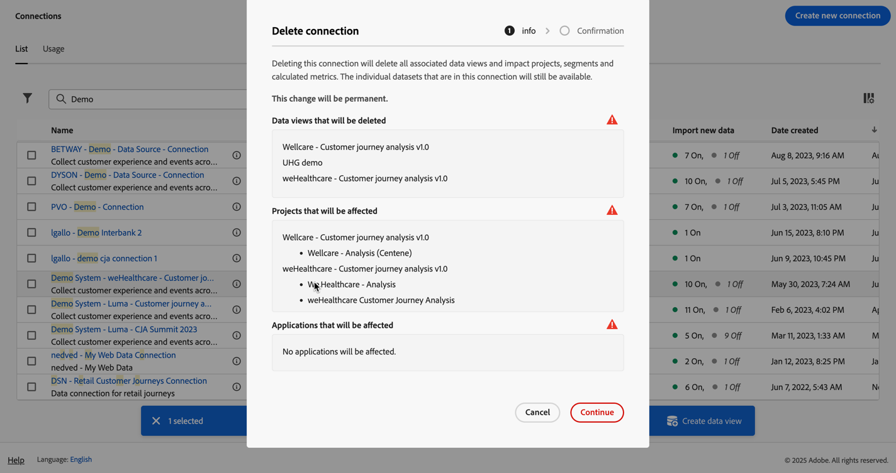

# 管理连接

在[创建或编辑一个或多个连接](/help/connections/create-connection.md)后，即可在&#x200B;**[!UICONTROL 连接]**&#x200B;中管理它们。[!UICONTROL 连接]接口允许您：

* 一目了然地查看所有连接，包括所有者、沙盒以及创建和修改连接的时间。
* 编辑连接。
* 删除连接。
* 从连接中创建一个数据视图。
* 查看一个连接中的全部数据集。
* 检查连接的数据集的状态以及摄取过程的状态。例如，您的数据何时可用，以便您可以开始在 Analysis Workspace 中进行报告和分析。
* 识别因配置错误导致的任何数据不一致的情况。是否漏掉了任何行？如果是，那么漏掉了哪些行？为什么？连接的配置是否有误，导致 Customer Journey Analytics 中的数据缺失？
* 了解所有连接中已摄取和可报告行的使用情况。

[!UICONTROL 连接]有两个界面：[[!UICONTROL 列表]](#list)和[[!UICONTROL 使用情况]](#usage)。

## 列表

**[!UICONTROL 列表]**&#x200B;界面是“连接”的默认界面。如果未选择，请选择&#x200B;**[!UICONTROL 列表]**&#x200B;选项卡以访问该界面。

[!UICONTROL 列表]界面会显示所有可用连接的表格。您可以使用搜索框快速搜索连接。

该表格中提供了以下列或图标。

| 列或图标 | 描述 |
| --- | --- |
| **[!UICONTROL _名称_]** | 好记的连接名称。要查看连接的详细信息，请选择带有超链接的名称。参阅[连接详细信息](#connection-details)。 |
|  | 要查看有关[!UICONTROL 包含的数据集]、[!UICONTROL 沙盒]、[!UICONTROL 所有者]等的信息，请选择连接名称旁边的。
一个弹出窗口会显示有关数据集的详细信息。 
 |
|  | 选择以打开上下文菜单。 您可以选择︰ 
 **[!UICONTROL 编辑]**&#x200B;以[编辑](#edit-a-connection)连接。
 **[!UICONTROL 删除]**&#x200B;以[删除](#delete-a-connection)连接。
 **[!UICONTROL 创建新的数据视图]**&#x200B;以[为连接创建新的数据视图](#create-a-data-view)。
 **[!UICONTROL 连接映射]**&#x200B;以查看连接的[连接映射](#map-a-connection)。 |
| [!BADGE B2B edition]{type=Informative url="https://experienceleague.adobe.com/en/docs/analytics-platform/using/cja-overview/cja-b2b/cja-b2b-edition" newtab=true tooltip="Customer Journey Analytics B2B edition"} **[!UICONTROL 连接类型&#x200B;]** | 指示连接是基于&#x200B;**[!UICONTROL 人员]**&#x200B;还是基于&#x200B;**[!UICONTROL 帐户]**&#x200B;的连接。 |
| **[!UICONTROL 数据集]** | 连接中包含的一个或多个数据集链接。您可以选择数据集超链接来查看连接中的数据集。如果选定的连接中包含更多数据集，请选择 **[!UICONTROL +*x* 更多]**，以显示&#x200B;**[!UICONTROL 包含的数据集]**&#x200B;面板。此面板显示指向所有数据集的链接以及以搜索作为连接一部分的特定数据集的选项。

选择一个数据集名称，以在新选项卡的Experience Platform界面中打开该数据集。 |
| **[!UICONTROL 沙盒]** | 此连接从中获取其数据集的 [Experience Platform 沙盒](https://experienceleague.adobe.com/zh-hans/docs/experience-platform/sandbox/home)。这是您在首次创建连接时选择的沙盒。不能更改。 |
| **[!UICONTROL 所有者]** | 创建连接的人员。 |
| **[!UICONTROL 导入新数据]** | 数据集导入新数据的状态： 
   **[!UICONTROL _x _On]**用于配置为导入新数据的数据集，并且
对于未配置为导入新数据的数据集，   **[!UICONTROL _x 关闭_]**。 |
| **[!UICONTROL 创建日期]** | 创建连接的时间戳。 |
| **[!UICONTROL 上次修改时间]** | 上次更新连接的时间戳。 |
| **[!UICONTROL 回填数据]** | 数据集中回填数据的状态。
   **[!UICONTROL _x _回填失败]**，表示数据集中回填失败的次数，
   **[!UICONTROL _x _正在处理回填]**，表示数据集中正在处理的回填次数，
   **[!UICONTROL _x _回填完成]**，数据集中已完成的回填次数，以及
如果连接中的数据集未定义回填，则   **[!UICONTROL _关闭_]**。 |

若要配置要显示的列，请选择，这将会显示&#x200B;**自定义表格**&#x200B;对话框，并允许您在表格中启用或禁用列。

### 编辑连接

要编辑连接，请执行以下操作：

1. 选择连接名称旁边的 
1. 从上下文菜单中选择**[!UICONTROL 编辑]**。

或者，您可以：

1. 选择连接行。

1. 从蓝色操作栏中选择 **[!UICONTROL 编辑]**。

在编辑连接时，您可以：

* 开始或停止导入新数据。
* 重命名连接。
* 刷新数据集。
* 从连接中删除数据集。

有关更多信息，请参阅[创建或编辑连接](create-connection.md)。

### 删除连接 {#connections-delete}

要删除连接，请执行以下操作：

1. 选择连接名称旁边的。
1. 选择**[!UICONTROL 删除]**。

或者，您可以：

1. 选择连接行。

1. 从蓝色操作栏中选择 **[!UICONTROL 删除]**。

删除连接时，**[!UICONTROL 删除连接]**&#x200B;面板会指示删除的是哪些数据视图，以及哪些工作区项目会受到影响。

* 在{➊0}信息&#x200B;]**中，显示了删除连接的后果。**[!UICONTROL 

  

  选择&#x200B;**[!UICONTROL 继续]**&#x200B;以确认删除。

* 在{➋0}确认&#x200B;]**中，在**[!UICONTROL &#x200B;键入连接名称&#x200B;]**中输入连接名称，然后选择**[!UICONTROL &#x200B;删除&#x200B;]**以删除该连接。**[!UICONTROL &#x200B;选择&#x200B;**[!UICONTROL 取消]**&#x200B;即可取消。

有关删除连接的更多信息，参阅[删除产生的影响](/help/technotes/deletion.md)。

### 为连接创建一个数据视图

要为连接创建新数据视图，请执行以下操作：

1. 选择连接名称旁边的。
1. 选择**[!UICONTROL 创建新的数据视图]**。

或者，您可以：

1. 选择连接行。

1. 从蓝色操作栏中选择 **[!UICONTROL 创建数据视图]**。

有关更多信息，请参阅[创建或编辑数据视图](/help/data-views/create-dataview.md)。

### 映射连接

要查看[连接映射](/help/connections/create-connection.md#connection-map)，该映射详细说明作为连接一部分的数据集之间的关系，请执行以下操作：

1. 选择连接名称旁边的。
1. 选择 **[!UICONTROL 连接映射]**。

### 连接详细信息 {#connection-detail}

要转至连接的详细信息，请在连接表中选择超链接的连接名称。

连接详细信息界面提供了连接状态的详细视图。您可以：

* 检查连接的数据集的状态以及摄取过程的状态。
* 发现导致跳过或删除记录的配置问题。
* 了解数据何时可用于报告。

| 用户界面 | 描述 |
| --- | --- |
|  **[!UICONTROL 编辑]**&#x200B;连接 | 要编辑连接的详细信息，请选择 **[!UICONTROL 编辑连接]**。有关更多信息，请参阅[创建或编辑连接](create-connection.md)。 |
| **[!UICONTROL *数据集选择器&#x200B;*]** | 允许您选择连接中的一个或全部数据集。不能选择其他数量的数据集。默认为&#x200B;**[!UICONTROL 全部数据集]**。 |
| **[!UICONTROL *日期范围选择器&#x200B;*]** | 编辑开始日期、结束日期，或选择以打开日期范围选择器。在日期范围选择器中，使用预定义的时间段之一选择日期范围（例如&#x200B;**[!UICONTROL 过去 6 个月]**）或使用日程表选择开始和结束日期。选择&#x200B;**[!UICONTROL 应用]**&#x200B;将新的日期范围应用到连接详细信息。 |
| **[!UICONTROL 事件数据记录可用]** | **对于整个连接**&#x200B;可用于报告的事件数据集总行数。此计数与任何日程表设置无关。如果您从数据集选择器中选择了一个数据集，或者在表中选择了一个数据集，则该计数会变化。添加数据后，需要等待 1-2 小时后数据才会在报告中显示。 |
| [!UICONTROL **[!UICONTROL 量度]**] | 汇总添加、跳过和删除的事件、查找、轮廓和摘要数据集记录以及添加的批次数。这些量度基于&#x200B;**您选择的数据集和日期范围**。
选择&#x200B;**[!UICONTROL 查看详细信息]**，以显示&#x200B;**[!UICONTROL 查看跳过的详细信息]**&#x200B;弹出窗口。该弹出窗口列出了所有事件数据集或选定数据集中跳过的记录数及其原因。

选择弹出窗口，查看更多信息。由于某些跳过的原因，如[!UICONTROL 访客ID为空]，弹出窗口将显示&#x200B;**[!UICONTROL EQS示例PSQL]** (查询服务的Experience Platform)，您可以在[查询服务](https://experienceleague.adobe.com/zh-hans/docs/experience-platform/query/home)中使用它来查询数据集中跳过的记录。 选择 **[!UICONTROL 复制 EQS 的示例 PSQL]** 来复制 SQL。 |
| **[!UICONTROL 添加的记录数]** | 指示在选定时间段，**为您选择的数据集和日期范围**&#x200B;添加了多少行。每10分钟更新一次。 |
| **[!UICONTROL 跳过的记录数]** | 指示在选定的时间段内跳过了多少行（**对于您选择的数据集和日期范围**）。跳过记录的原因包括：缺少时间戳、人员ID或帐户ID [!BADGE B2B edition]{type=Informative url="https://experienceleague.adobe.com/en/docs/analytics-platform/using/cja-overview/cja-b2b/cja-b2b-edition" newtab=true tooltip="Customer Journey Analytics B2B edition"}缺失或无效，等等。 每10分钟更新一次。 
无效的ID（如`undefined`或`00000000`，或[!UICONTROL 人员ID]中在指定月份出现超过100万次的事件中的任何数字和字母组合）是无法归因到任何特定用户或人员的ID。 这些行不能被摄入系统，从而导致摄取和报告容易出错。要修复无效的人员ID或帐户ID [!BADGE B2B edition]{type=Informative url="https://experienceleague.adobe.com/en/docs/analytics-platform/using/cja-overview/cja-b2b/cja-b2b-edition" newtab=true tooltip="Customer Journey Analytics B2B edition"}，您有3个选项：<ul><li>使用[拼接](/help/stitching/overview.md)可以利用有效的用户 ID 来填充未定义或全部为零的用户 ID。</li><li>留出用户ID，在引入期间跳过这些ID（这要优于无效或全零用户ID）。</li><li>先修复系统中的任意无效用户 ID，然后再提取数据。</li></ul> |
| **[!UICONTROL 删除的记录数]** | 指示在选定的时段内，**为您选择的数据集和日期范围**&#x200B;删除了多少行。例如，有人可能在 [!DNL Experience Platform] 中删除了一个数据集。每10分钟更新一次。
在某些情况下，该值还可以包括替换的记录，如拼接或某些查找数据集更新。考虑以下示例：
<ul><li>您将一条记录上传到 XDM 个人轮廓数据集，Customer Journey Analytics 被配置为将其作为轮廓查找数据摄取。在连接详细信息中，该数据集将会显示已添加 1 条记录。</li><li>您将原始记录的副本上传到同一个 AEP 数据集，该数据集现在包含两条记录。Customer Journey Analytics从配置文件或帐户[!BADGE B2B edition]{type=Informative url="https://experienceleague.adobe.com/en/docs/analytics-platform/using/cja-overview/cja-b2b/cja-b2b-edition" newtab=true tooltip="Customer Journey Analytics B2B edition"}查找数据集中摄取其他记录。 看到连接中已摄取该人员ID或帐户ID [!BADGE B2B edition]{type=Informative url="https://experienceleague.adobe.com/en/docs/analytics-platform/using/cja-overview/cja-b2b/cja-b2b-edition" newtab=true tooltip="Customer Journey Analytics B2B edition"}的配置文件或帐户记录，Customer Journey Analytics将删除其早期版本并添加新的配置文件数据。 在连接详细信息中，此操作将表示添加了1条记录并删除了1条记录，因为Customer Journey Analytics仅保留任何引入的人员ID或帐户ID [!BADGE B2B edition]{type=Informative url="https://experienceleague.adobe.com/en/docs/analytics-platform/using/cja-overview/cja-b2b/cja-b2b-edition" newtab=true tooltip="Customer Journey Analytics B2B edition"}的最新配置文件查找数据。</li><li>总的来说，AEP 数据集包含两个恰好相同的记录。另外，Customer Journey Analytics 连接详细信息显示其摄取数据的状态：此轮廓数据集添加了 2 条记录，删除了 1 条记录。 </li></ul> |
|  | 数据集搜索字段。您可以按数据集名称或[!UICONTROL 数据集 ID] 来搜索数据集表。 |
| [!UICONTROL 数据集表] | 显示作为连接一部分的数据集。请参阅下表了解更多说明。 |

数据集表显示以下列：

| 列 | 描述 |
| --- | --- |
| **[!UICONTROL 数据集]** | 作为连接一部分的数据集的名称。您可以选择超链接在新选项卡中的 Experience Platform UI 中打开数据集。您可以选择行或复选框来仅显示所选数据集的详细信息。 |
| **[!UICONTROL 数据集 ID]** | 由 Experience Platform 自动生成。 |
| **[!UICONTROL 添加的记录数]** | 在所选时间间隔期间添加到某个连接的数据集记录数（行数）。 |
| **[!UICONTROL 跳过的记录数]** | 在所选时间间隔期间为某个连接传输数据期间跳过的数据集记录数（行数）。 |
| **[!UICONTROL 删除的记录数]** | 在所选时间间隔期间从某个连接移除的数据集记录数（行数）。 |
| **[!UICONTROL 添加的批次数]** | 已添加到连接中的数据集批次数。 |
| **[!UICONTROL 上次添加时间]** | 已添加到连接的数据集中的最新批的时间戳。 |
| **[!UICONTROL 数据源类型]** | 数据集的源类型。创建连接时定义源类型。 |
| **[!UICONTROL 数据集类型]** | 此数据集的数据集类型。类型可以是[!UICONTROL 事件]、 [!UICONTROL 轮廓]、[!UICONTROL 查找]或[!UICONTROL 摘要]。[了解详情](https://experienceleague.adobe.com/zh-hans/docs/analytics-platform/using/cja-connections/create-connection) |
| **[!UICONTROL 架构]** | 此数据集所基于的 Experience Platform 架构。 |
| **[!UICONTROL 导入新数据]** | 数据集导入新数据的状态： 
如果数据集已配置为导入新数据，则   **[!UICONTROL _x _开启]**，以及
如果数据集已配置为不导入新数据，则   **[!UICONTROL _x 关闭_]**。 |
| **[!UICONTROL 转换数据]** | 适用的 B2B 查找数据集的转换状态。参见[转换数据集以进行 B2B 查找](transform-datasets-b2b-lookups.md)了解更多信息。
对于已启用转换的适用数据集，   **[!UICONTROL _x _开启]**， 
对于未启用转换的适用数据集，   **[!UICONTROL _x 关闭_]**，以及
对于所有其他数据集均为 **[!UICONTROL N/A]**，不适用于转换。 |
| **[!UICONTROL 回填数据]** | 数据集的回填数据的状态。
   **[!UICONTROL _x _回填失败]**，表示回填失败的次数，
   **[!UICONTROL _x _正在处理回填]**，正在处理的回填次数，
   **[!UICONTROL _x _回填完成]**，已完成的回填次数，以及
如果未配置回填，则   **[!UICONTROL _关闭_]**。 |
| **[!UICONTROL 导入新数据]** | 数据集导入新数据的状态： 
如果数据集已配置为导入新数据，则   **[!UICONTROL _x _开启]**，以及
如果数据集已配置为不导入新数据，则   **[!UICONTROL _x 关闭_]**。 |
| **[!UICONTROL 回填数据]** | 数据集的回填数据的状态。
   **[!UICONTROL _x _回填失败]**，表示回填失败的次数，
   **[!UICONTROL _x _正在处理回填]**，正在处理的回填次数，
   **[!UICONTROL _x _回填完成]**，已完成的回填次数，以及
如果没有配置回填，则   **[!UICONTROL _关闭_]**。 |

>[!IMPORTANT]
>
>任何在 2021 年 8 月 13 日之前摄取的数据均不会反映在[!UICONTROL 连接]界面中。
>

#### 连接面板

当数据集表中未选择任何数据集时，连接界面右侧的面板会显示连接选项和详细信息。

| 选项 | 描述 |
| --- | --- |
|  [!UICONTROL 刷新] | 要刷新连接并允许反映最近添加的记录，请选择 **[!UICONTROL 刷新]**。 |
|  **[!UICONTROL 删除]** | [删除](#delete-a-connection)此连接。 |
|  **[!UICONTROL 创建数据视图]** | 根据该连接[创建一个数据视图](#create-a-data-view)。有关更多信息，请参阅[数据视图](https://experienceleague.adobe.com/zh-hans/docs/analytics-platform/using/cja-dataviews/data-views)。 |
| **[!UICONTROL 连接名称]** | 友好的连接名称。 |
| **[!UICONTROL 连接说明]** | 连接的描述。 |
| **[!UICONTROL 沙盒]** | 此连接从中获取其数据集的 [Experience Platform 沙盒](https://experienceleague.adobe.com/zh-hans/docs/experience-platform/sandbox/home)。这是您在首次创建连接时选择的沙盒。不能更改。 |
| **[!UICONTROL 连接 ID]** | 此 ID 是在 Experience Platform 中生成的。您可以使用来复制该 ID。 |
| **[!UICONTROL 使用连接的数据视图]** | 列出使用此连接的所有数据视图。 |
| **[!UICONTROL 导入新数据]** | 数据集导入新数据的状态： 
   **[!UICONTROL _x _开启]**，表示配置为导入新数据的数据集有多少个，以及
   **[!UICONTROL _x 关闭_]**，表示关闭导入新数据功能的数据集有多少个。 |
| **[!UICONTROL 回填数据]** | 数据集中回填数据的状态。
   **[!UICONTROL _x _回填失败]**，表示数据集中回填失败的次数，
   **[!UICONTROL _x _正在处理回填]**，表示数据集中正在处理的回填次数，
   **[!UICONTROL _x _回填完成]**，数据集中已完成的回填次数，以及
如果连接中的数据集未定义回填，则   **[!UICONTROL _关闭_]**。 |
| **[!UICONTROL 转换数据]** | 适用的 B2B 查找数据集的转换状态。参见[转换数据集以进行 B2B 查找](transform-datasets-b2b-lookups.md)了解更多信息。
   **[!UICONTROL _x _开启]**，表示启用转换的数据集数量。 |
| **[!UICONTROL 创建者]** | 创建该连接的人员的姓名。 |
| **[!UICONTROL 上次修改时间]** | 该连接上次进行更改的时间戳。 |
| **[!UICONTROL 上次修改人]** | 上次修改该连接的人员。 |

#### 数据集面板

在数据集表中选择数据集行后，“连接”界面右侧的面板将显示选定数据集的详细信息。

| 详细信息 | 描述 |
| --- | --- |
| **[!UICONTROL 人员 ID]** | 在Experience Platform的数据集架构中定义的标识。 该身份标识是您在创建连接期间选择的人员 ID。如果您创建的连接包含具有不同 ID 的数据集，则报告中会反映这一点。要合并数据集，需要跨所有数据集使用相同的人员 ID。 |
| **[!UICONTROL 键]** | 您为查找数据集指定的键。 |
| **[!UICONTROL 匹配键]** | 您为查找数据集指定的匹配键。 |
| **[!UICONTROL 时间戳]** | 为事件数据集定义的时间戳。 |
| **[!UICONTROL 可用的记录数]** | 在日程表中选择的特定时间段内，此数据集摄取的总行数。添加数据后，数据立刻在报告中显示，没有延迟。但是，当您创建一个全新的连接时，则会出现[延迟](https://experienceleague.adobe.com/en/docs/analytics-platform/using/cja-overview/cja-b2c-overview/cja-faq)。 |
| **[!UICONTROL 添加的记录数]** | 在选定的时间段中添加了多少行。 |
| **[!UICONTROL 删除的记录数]** | 在所选时段期间删除了多少条记录。 |
| **[!UICONTROL 添加的批次]** | 有多少数据批次添加到此数据集。 |
| **[!UICONTROL 跳过的记录数]** | 摄取期间在选定的时间段中跳过了多少行。
跳过记录的原因包括：缺少时间戳、缺少人员ID或帐户ID [!BADGE B2B edition]{type=Informative url="https://experienceleague.adobe.com/en/docs/analytics-platform/using/cja-overview/cja-b2b/cja-b2b-edition" newtab=true tooltip="Customer Journey Analytics B2B edition"}或它们无效，等等。 每10分钟更新一次。
无效ID（如`undefined`或`00000000`，或者[!UICONTROL 人员ID]中的任何数字和字母组合，在指定月份在某个事件中出现超过100万次）是无法归因到任何特定用户或人员的ID。 这些行不能被摄入系统，从而导致摄取和报告容易出错。要修复无效的人员ID或帐户ID，您有3个选项：<ul><li>使用[拼接](/help/stitching/overview.md)可以利用有效的用户 ID 来填充未定义或全部为零的用户 ID。</li><li>清空用户 ID，然后在摄取过程中跳过（优于无效或全部为零的用户 ID）。</li><li>先修复系统中的任意无效用户 ID，然后再提取数据。</li></ul> |
| **[!UICONTROL 上次添加时间]** | 添加最后批次时的时间戳。 |
| **[!UICONTROL 导入新数据]** | 数据集导入新数据的状态： 
如果数据集已配置为导入新数据，则   **[!UICONTROL _x _开启]**，以及
如果数据集已配置为不导入新数据，则   **[!UICONTROL _x 关闭_]**。 |
| **[!UICONTROL 回填数据]** | 数据集的回填数据的状态。
   **[!UICONTROL _x _回填失败]**，表示回填失败的次数，
   **[!UICONTROL _x _正在处理回填]**，正在处理的回填次数，
   **[!UICONTROL _x _回填完成]**，已完成的回填次数，以及
如果没有配置回填，则   **[!UICONTROL _关闭_]**。
要显示包含数据集过去回填情况概述的对话框，请选择  **[!UICONTROL 过去的回填]**。 |
| **[!UICONTROL 数据源类型]** | 将数据集添加到连接时定义的数据源类型。 |
| **[!UICONTROL 数据集类型]** | [!UICONTROL 事件]、[!UICONTROL 概述]、[!UICONTROL 查找]或[!UICONTROL 摘要]。[了解详情](https://experienceleague.adobe.com/zh-hans/docs/analytics-platform/using/cja-connections/create-connection) |
| **[!UICONTROL 架构]** | 此数据集所基于的 Experience Platform 架构。 |
| **[!UICONTROL 数据集 ID]** | 此数据集 ID 是在 Experience Platform 中生成的。 |

## 使用情况 {#connections-usage}

<!-- markdownlint-disable MD034 -->

>[!CONTEXTUALHELP]
>id="cja_connections_usage_keyusagemetrics"
>title="关键使用量度"
>abstract="提供核心和历史可报告行数的月度和总计数据。"
<!-- markdownlint-enable MD034 -->

<!-- markdownlint-disable MD034 -->

>[!CONTEXTUALHELP]
>id="cja_connections_usage_monthlyingestedrows"
>title="每月引入行数"
>abstract="衡量每月添加到系统的记录总数，提供数据增长和引入率的洞察。"
<!-- markdownlint-enable MD034 -->

<!-- markdownlint-disable MD034 -->

>[!CONTEXTUALHELP]
>id="cja_connections_usage_monthlyreportablerows"
>title="每月可报告行数"
>abstract="跟踪可用于报告的行数。可报告行是摄取的行减去摄取期间跳过和删除的行。 可报告行数是计费和数据使用情况的关键量度。"
<!-- markdownlint-enable MD034 -->

<!-- markdownlint-disable MD034 -->

>[!CONTEXTUALHELP]
>id="cja_connections_usage_detailbreakdown"
>title="详细细分。"
>abstract="您可以按连接、数据集、沙盒和标记详细查看量度，也可以选择下载数据的 CSV 文件。"
<!-- markdownlint-enable MD034 -->

<!-- markdownlint-disable MD034 -->

>[!CONTEXTUALHELP]
>id="cja_connections_usage_otherdatasets"
>title="其他数据集"
>abstract="对于 2024 年 9 月之前的月份，数据是在数据集层面收集的，为了清楚起见，显示为&#x200B;*其他数据集*。从2024年9月开始，在粒度数据集级别收集数据，并且&#x200B;*其他数据集*&#x200B;不再显示。"
<!-- markdownlint-enable MD034 -->

<!-- markdownlint-disable MD034 -->

>[!CONTEXTUALHELP]
>id="cja_connections_usage_unknowndatasetsorconnections"
>title="未知的数据集或连接"
>abstract="未知的数据集或连接使用其 ID 显示。"
<!-- markdownlint-enable MD034 -->

<!-- markdownlint-disable MD034 -->

>[!CONTEXTUALHELP]
>id="cja_connections_usage_datanotavailable"
>title="数据不可用"
>abstract="由于系统限制，2024 年 9 月之前的历史数据不可用。从 2024 年 9 月开始收集和显示量度。此图表在时间轴上显示过去18个月，当数据可用时，将显示未来的数据。"
<!-- markdownlint-enable MD034 -->

<!-- markdownlint-disable MD034 -->

>[!CONTEXTUALHELP]
>id="cja_connections_corereportablerows"
>title="核心可报告行数"
>abstract="显示过去 13 个月可用的总行数。例如，2024 年 2 月 1 日，该数字显示事件时间戳从 2023 年 1 月到 2024 年 1 月的可用行数总数。"
<!-- markdownlint-enable MD034 -->

<!-- markdownlint-disable MD034 -->

>[!CONTEXTUALHELP]
>id="cja_connections_historicalreportablerows"
>title="历史可报告行数"
>abstract="显示超过 13 个月的时间段内可用的总行数。例如，2024 年 2 月 1 日，该数字显示事件时间戳早于 2023 年 1 月的可用行数总数。"

<!-- markdownlint-enable MD034 -->

<!-- markdownlint-disable MD034 -->

>[!CONTEXTUALHELP]
>id="connections_usage_keyusagemetrics"
>title="关键使用量度"
>abstract="提供核心和历史可报告行数的月度和总计数据。"
<!-- markdownlint-enable MD034 -->

<!-- markdownlint-disable MD034 -->

>[!CONTEXTUALHELP]
>id="connections_usage_monthlyingestedrows"
>title="每月引入行数"
>abstract="衡量每月添加到系统的记录总数，提供数据增长和引入率的洞察。"
<!-- markdownlint-enable MD034 -->

<!-- markdownlint-disable MD034 -->

>[!CONTEXTUALHELP]
>id="connections_usage_monthlyreportablerows"
>title="每月可报告行数"
>abstract="跟踪可用于报告的行数。可报告行是摄取的行减去摄取期间跳过和删除的行。 可报告行数是计费和数据使用情况的关键量度。"
<!-- markdownlint-enable MD034 -->

<!-- markdownlint-disable MD034 -->

>[!CONTEXTUALHELP]
>id="connections_usage_detailbreakdown"
>title="详细细分。"
>abstract="您可以按连接、数据集、沙盒和标记详细查看量度，也可以选择下载数据的 CSV 文件。"
<!-- markdownlint-enable MD034 -->

<!-- markdownlint-disable MD034 -->

>[!CONTEXTUALHELP]
>id="connections_usage_otherdatasets"
>title="其他数据集"
>abstract="对于 2024 年 9 月之前的月份，数据是在数据集层面收集的，为了清楚起见，显示为&#x200B;*其他数据集*。从2024年9月开始，在粒度数据集级别收集数据，并且&#x200B;*其他数据集*&#x200B;不再显示。"
<!-- markdownlint-enable MD034 -->

<!-- markdownlint-disable MD034 -->

>[!CONTEXTUALHELP]
>id="connections_usage_unknowndatasetsorconnections"
>title="未知的数据集或连接"
>abstract="未知的数据集或连接使用其 ID 显示。"
<!-- markdownlint-enable MD034 -->

<!-- markdownlint-disable MD034 -->

>[!CONTEXTUALHELP]
>id="connections_usage_datanotavailable"
>title="数据不可用"
>abstract="由于系统限制，2024 年 9 月之前的历史数据不可用。从 2024 年 9 月开始收集和显示量度。此图表在时间轴上显示过去18个月，当数据可用时，将显示未来的数据。"
<!-- markdownlint-enable MD034 -->

<!-- markdownlint-disable MD034 -->

>[!CONTEXTUALHELP]
>id="connections_corereportablerows"
>title="核心可报告行数"
>abstract="显示过去 13 个月可用的总行数。例如，2024 年 2 月 1 日，该数字显示事件时间戳从 2023 年 1 月到 2024 年 1 月的可用行数总数。"
<!-- markdownlint-enable MD034 -->

<!-- markdownlint-disable MD034 -->

>[!CONTEXTUALHELP]
>id="connections_historicalreportablerows"
>title="历史可报告行数"
>abstract="显示超过 13 个月的时间段内可用的总行数。例如，2024 年 2 月 1 日，该数字显示事件时间戳早于 2023 年 1 月的可用行数总数。"

<!-- markdownlint-enable MD034 -->

<!-- markdownlint-disable MD034 -->

>[!CONTEXTUALHELP]
>id="connections_breakdown_corereportablerows"
>title="核心可报告行数"
>abstract="核心可报告行是快照值，而不是汇总总数。这些值根据所选日期范围内的最后一个月动态更新。如果客户选择“一月 — 三月”，则值反映三月的快照。"

>[!CONTEXTUALHELP]
>id="connections_breakdown_historicalreportablerows"
>title="历史可报告行数"
>abstract="历史可报告行是快照值，而不是汇总总数。这些值根据所选日期范围内的最后一个月动态更新。如果客户选择“一月 — 三月”，则值反映三月的快照。"

>[!CONTEXTUALHELP]
>id="connections_breakdown_cumulativereportablerows"
>title="累计可报告行数"
>abstract="累计可报告行是快照值，而不是汇总总数。这些值根据所选日期范围内的最后一个月动态更新。如果客户选择“一月 — 三月”，则值反映三月的快照。"

<!-- markdownlint-enable MD034 -->

[!UICONTROL 使用情况]界面显示所有连接中摄取的可报告的行的使用情况。如果未选择，请选择&#x200B;**[!UICONTROL 使用情况]**&#x200B;选项卡以访问该界面。

在此界面中，您可以确定您的 Customer Journey Analytics 使用情况是否遵守合同条款。除了监测目的之外，您还可以使用“使用情况”界面来规划 Customer Journey Analytics 许可证的续订。

“使用情况”界面使用以下量度：

| 量度名称 | 描述 |
|---|---|
| 历史可报告行数 | 超过 13 个月的时间段内的行数。 |
| 核心可报告行数 | 过去 13 个月的行数。 |
| 摄取的行数 | 特定时期内摄取了多少行。 |
| 可报告行数 | 在特定时段内，连接中有多少行数据？ |
| 累计行数 | 截至特定月份已摄取了多少行。 |

>[!NOTE]
>
>从 2024 年 7 月开始收集核心、历史和总体记录数据。请联系您的客户经理获取早期的历史数据。
>

“使用情况”界面由两个面板组成：

* **[!UICONTROL 关键使用情况量度]**&#x200B;面板：提供核心和历史数据可报告行。该面板还跟踪核心数据和历史数据行与上个月相比的百分比变化。

  该面板显示了一个可视化图表，其中包含：

   * **[!UICONTROL 核心数据可报告行数]**。

     过去 13 个月中您有多少可报告的行。摘要数字是上个月（例如 2024 年 12 月）的核心可报告行数（例如 741M）。

   * **[!UICONTROL 历史数据可报告行数]**。

     对于超过 13 个月的时间段，您有多少可报告行？摘要数字是上个月（例如 2024 年 12 月）的历史可报告行数（例如 127M）。

  当您将鼠标悬停在可视化效果中的任何堆积条形图上时，将会弹出一个窗口，其中显示该条形图这一特定部分的行数（例如）。

  

* 一个组合面板，显示三个子面板：

+++ 摄取的行数

  **[!UICONTROL 摄取的行数]**&#x200B;子面板衡量每月添加到系统的记录总数，提供有关数据增长和摄取率的洞察。该子面板提供了本月总摄取行数以及与上个月相比的变化的摘要。

  

  您可以将鼠标悬停在可视化效果中的数据点上，以显示包含更多详细信息的弹出窗口。

+++

+++ 可报告行数

  **[!UICONTROL 可报告行数]**&#x200B;可视化效果通过从摄取的行数中减去跳过和删除的行数来跟踪可供报告的行数，作为计费和数据使用情况的关键量度。该子面板提供了两个摘要：

   * **[!UICONTROL 上月总计]**：截至本月的总可报告行数摘要。
   * **[!UICONTROL 本月]**：本月可报告行总数及与上月相比的变化的摘要。

  

  您可以将鼠标悬停在可视化效果中的数据点上，以显示包含更多详细信息的弹出窗口。

+++

+++ 详细细分

  您可以使用&#x200B;**[!UICONTROL 详细细分]**&#x200B;表来按照连接、数据集、沙盒和标记查看详细量度。数据集使用 ID 而不是名称进行报告，因为数据集名称可以在报告期间进行修改。未知的数据集或连接使用 ID 进行报告。

  对于 2024 年 9 月之前的月份，数据是在数据集层面收集的，为了清楚起见，显示为[!UICONTROL 其他数据集]。从 2024 年 9 月起，数据将在细粒度的数据集层面进行收集，[!UICONTROL 其他数据集]则不再出现。

   * 要更改细分，请选择组合&#x200B;**[!UICONTROL 查看方式]**&#x200B;和&#x200B;**[!UICONTROL 细分方式]**&#x200B;的组合。

     | **[!UICONTROL 查看方式]**&#x200B;选项 | **[!UICONTROL 细分方式]** 选项 |
     |---|---|
     | **[!UICONTROL 连接]** | **[!UICONTROL -]** 和&#x200B;**[!UICONTROL 数据集]** |
     | **[!UICONTROL 数据集]** | **[!UICONTROL -]** |
     | **[!UICONTROL 沙盒]** | **[!UICONTROL 连接]** |
     | **[!UICONTROL 标记]** | **[!UICONTROL 连接]** |

  

+++

  您可以定义以月为单位的&#x200B;**[!UICONTROL 时间范围]**&#x200B;进行报告。使用来选择时间范围。

>[!MORELIKETHIS]
>
>[查看、排查和修改连接设置](https://experienceleague.adobe.com/zh-hans/docs/customer-journey-analytics-learn/tutorials/connections/connections-details-experience-in-cja)教程
>[管理您的Customer Journey Analytics使用情况](/help/technotes/estimate-usage.md)
>
