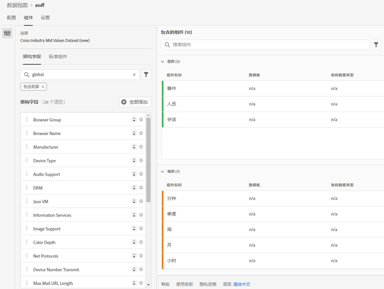
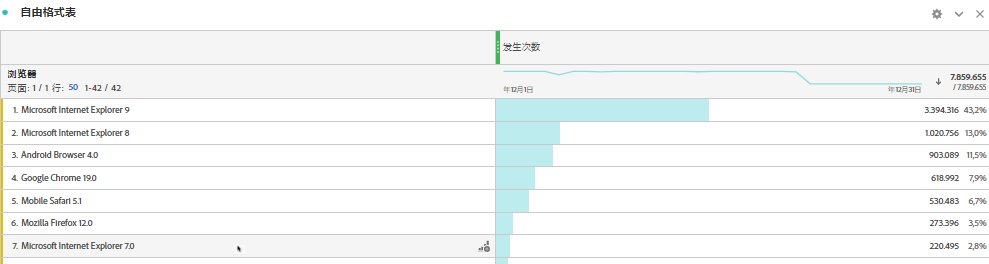

# 向数据集添加标准查找

>[!IMPORTANT]
>在 CJA 中仅为 Analytics 数据连接器数据源提供标准查找。您可以将它们用于标准Adobe Analytics实施，或 [Adobe Experience Platform Web SDK](https://experienceleague.adobe.com/docs/experience-platform/edge/home.html)，或Experience Platform数据收集API。

标准查找（也称为 Adobe 提供的查找）可以增强 Customer Journey Analytics 的功能，用于报告一些本身并不是非常有用但在与其他数据结合时可以发挥作用的维度/属性。示例包括移动设备属性、操作系统属性和浏览器维度，如浏览器版本号。“标准查找”类似于查找数据集。标准查找适用于整个 Experience Cloud 组织。它们自动应用于包含某些 XDM 架构字段（有关具体字段见下文）的所有事件数据集。Adobe 分类的每个架构位置都存在一个标准查找数据集。

在传统的 Adobe Analytics 中，这些维度按自己的方式显示，但在 CJA 中，您必须在创建数据视图时主动包含这些维度。在“连接”工作流中，选择具有标准查找键标志的数据集。数据视图 UI 自动知道包括所有标准查找维度以用于报告。查找文件会在所有区域和所有帐户中自动保持为最新版本和可用。这些文件将存储在与客户关联的特定于区域的组织中。

## 将标准查找与 Adobe Data Connector 数据集结合使用

标准查找数据集在报告时自动应用。如果您使用 Analytics Data Connector 并且引入 Adobe 将为其提供标准查找的维度，我们会自动应用此标准查找。如果某个事件数据集包含 XDM 字段，我们可以对其应用标准查找。

<!--
### Specific IDs that need to be populated

The following IDs need to be populated in the specific XDM mixins for this functionality to work:

* Environment Details Mixin – device/typeID value populated - Must match Device Atlas IDs and will populate device data.
* Adobe Analytics ExperienceEvent Template Mixin or Adobe Analytics ExperienceEvent Full Extension Mixin with analytics/environment/browserIDStr and analytics/environment/operatingSystemIDStr. Both must match the Adobe IDs and  populate browser and OS data, respectively.

You need these mixins with the three IDs populated (device/typeID, environment/browserIDStr, and environment/operatingSystemIDStr). The lookup dimensions will then be pulled automatically by CJA and will be available in the Data View.

The catch here is that they can only populate those IDs today if they have a direct relationship with Device Atlas. They are Device Atlas IDs, and they provide an API to allow a customer to look them up. This is a significant hurdle, and we may just want to take the reference to this capability out of the product documentation until we have a productized way to expose the Device Atlas ID lookup functionality.
-->

### 可用标准查找字段

* `browser`
   * `browser`、`group_id`、`id`
* `browser_group`
   * `browser_group`、`id`
* `os`
   * `os`、`group_id`、`id`
* `os_group`
   * `os_group`、`id`
* `mobile_audio_support - multi`
* `mobile_color_depth`
* `mobile_cookie_support`
* `mobile_device_name`
* `mobile_device_number_transmit`
* `mobile_device_type`
* `mobile_drm - multi`
* `mobile_image_support - multi`
* `mobile_information_services`
* `mobile_java_vm - multi`
* `mobile_mail_decoration`
* `mobile_manufacturer`
* `mobile_max_bookmark_url_length`
* `mobile_max_browser_url_length`
* `mobile_max_mail_url_length`
* `mobile_net_protocols - multi`
* `mobile_os`
* `mobile_push_to_talk`
* `mobile_screen_height`
* `mobile_screen_size`
* `mobile_screen_width`
* `mobile_video_support - multi`

## 报告标准查找维度

要报告标准查找维度，当您在 Customer Journey Analytics 中创建数据视图时需要添加这些维度。

然后，您便可以在工作区中查看查找数据：

