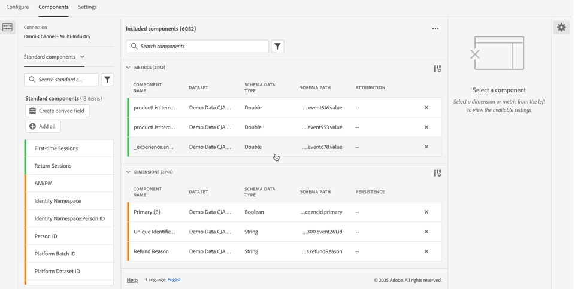
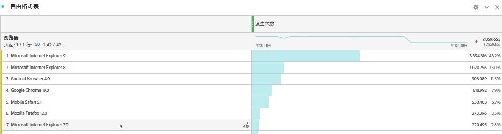

# 向数据集添加标准查找

>[!IMPORTANT]
>
>标准查找仅适用于Customer Journey Analytics中的Analytics Source Connector数据源。 您可以将其用于标准 Adobe Analytics 实施、[Adobe Experience Platform Web SDK](https://experienceleague.adobe.com/docs/experience-platform/edge/home.html) 或 Experience Platform 数据收集 API。
>

标准查找（也称为 Adobe 提供的查找）可以增强 Customer Journey Analytics 的功能，用于报告一些本身并不是非常有用但在与其他数据结合时可以发挥作用的维度/属性。 示例包括移动设备属性、操作系统属性和浏览器维度，如浏览器版本号。 “标准查找”类似于查找数据集。 标准查找适用于CX Enterprise组织。 它们自动应用于包含特定XDM架构字段的所有事件数据集（有关特定字段的信息，请参阅下文）。 Adobe分类的每个架构位置都存在一个标准查找数据集。

在传统Adobe Analytics中，这些维度按自己的方式显示，但在Customer Journey Analytics中，您必须在创建数据视图时主动包含这些维度。 在“连接”工作流中，选择一个被标记为具有标准查找键的数据集。 数据视图 UI 会自动将所有标准查找维度纳入可用于报告的维度中。 查找文件会在所有区域和所有帐户中自动保持为最新版本和可用。 这些文件将存储在与客户关联的特定于区域的组织中。

## 对Analytics源连接器数据集使用标准查找

标准查找数据集在报告时自动应用。 如果您使用Analytics Source Connector并且引入Adobe将为其提供标准查找的维度，我们会自动应用此标准查找。 如果某个事件数据集包含 XDM 字段，我们可以对其应用标准查找项。

<!--
### Specific IDs that need to be populated

The following IDs need to be populated in the specific XDM mixins for this functionality to work:

* Environment Details Mixin – device/typeID value populated - Must match Device Atlas IDs and will populate device data.
* Adobe Analytics ExperienceEvent Template Mixin or Adobe Analytics ExperienceEvent Full Extension Mixin with analytics/environment/browserIDStr and analytics/environment/operatingSystemIDStr. Both must match the Adobe IDs and  populate browser and OS data, respectively.

You need these mixins with the three IDs populated (device/typeID, environment/browserIDStr, and environment/operatingSystemIDStr). The lookup dimensions will then be pulled automatically by Customer Journey Analytics and will be available in the Data View.

The catch here is that they can only populate those IDs today if they have a direct relationship with Device Atlas. They are Device Atlas IDs, and they provide an API to allow a customer to look them up. This is a significant hurdle, and we may just want to take the reference to this capability out of the product documentation until we have a productized way to expose the Device Atlas ID lookup functionality.
-->

### 可用标准查找字段

* `browser`
  * `browser`, `group_id`, `id`
* `browser_group`
  * `browser_group`、`id`
* `os`
  * `os`, `group_id`, `id`
* `os_group`
  * `os_group`、`id`
* `mobile_audio_support - multi`
* `mobile_color_depth`
* `mobile_cookie_support`
* `mobile_device_name`
* `mobile_device_number_transmit`
* `mobile_device_type`
* `mobile_drm - multi`
* `mobile_image_support - multi`
* `mobile_information_services`
* `mobile_java_vm - multi`
* `mobile_mail_decoration`
* `mobile_manufacturer`
* `mobile_max_bookmark_url_length`
* `mobile_max_browser_url_length`
* `mobile_max_mail_url_length`
* `mobile_net_protocols - multi`
* `mobile_os`
* `mobile_push_to_talk`
* `mobile_screen_height`
* `mobile_screen_size`
* `mobile_screen_width`
* `mobile_video_support - multi`

## 报告标准查找维度

为了报告Adobe标准查找维度，在Customer Journey Analytics中创建[数据视图](/help/data-views/data-views.md)时，必须添加一个或多个这些维度。 在&#x200B;**[!UICONTROL 数据视图]** > **[!UICONTROL 组件]**&#x200B;中：

1. 从左边栏的下拉菜单中选择&#x200B;**[!UICONTROL 架构字段]**。
1. 从架构字段容器列表中选择&#x200B;**[!UICONTROL Adobe查找]**。
1. 深入了解&#x200B;**[!UICONTROL 浏览器]**、**[!UICONTROL 移动设备]**&#x200B;或&#x200B;**[!UICONTROL 操作系统]**，直到找到要添加维度。
1. 将维度拖动到&#x200B;**[!UICONTROL 包含的组件]**&#x200B;中的&#x200B;**[!UICONTROL Metrics]**&#x200B;或&#x200B;**[!UICONTROL Dimensions]**&#x200B;表中。

   

然后，您可以在Workspace中使用查找数据：

