# Content Analytics 引导式配置

引导式配置可帮助您快速轻松地配置 Content Analytics。 引导式配置会使用向导来设置相关要求，以便为您的组织自动配置 Content Analytics。 在&#x200B;**[!UICONTROL 配置]**&#x200B;屏幕中，您可以创建新的配置或编辑现有配置。

>[!IMPORTANT]
>
>您的组织中每个沙盒内只能有一个 Content Analytics 配置。

>[!NOTE]
>
>配置向导支持多个数据视图和通道，这与仅支持一个数据视图和仅Web通道的早期版本不同。 您必须先选择沙盒和连接，然后才能在[数据视图](#data-views)部分中选择一个或多个数据视图。 **[!UICONTROL 体验捕获]**、**[!UICONTROL 数据收集]**&#x200B;和&#x200B;**[!UICONTROL 标题覆盖]**&#x200B;的配置依赖于渠道，并且是您在[渠道](#channels)部分中配置的每个渠道的一部分。

要访问 Content Analytics 配置

* 从 Customer Journey Analytics 的主菜单中选择&#x200B;**[!UICONTROL 数据管理]** > **[!UICONTROL Content Analytics 配置]**。

在 **[!UICONTROL Content Analytics 配置]**&#x200B;屏幕中，您会看到包含现有 Content Analytics 配置的表格。

对于每个配置，提供了以下详细信息：

| 列 | 描述 |
|---|---|
| **[!UICONTROL 名称]** | 配置的名称。 |
| **[!UICONTROL 创建者]** | 创建配置的技术帐户。 |
| **[!UICONTROL 创建日期]** | 创建配置的时间戳。 |
| **[!UICONTROL 修改日期]** | 配置最后修改的时间戳。 |
| **[!UICONTROL 沙盒]** | 组织内（计划）配置并实施 Content Analytics 的沙盒。 |
| **[!UICONTROL 状态]** | 配置的状态。 状态指示已完成配置的启用通道数。 使用打开包含更多详细信息的弹出窗口。 |

您可以使用  来自定义该表格。 选择要在&#x200B;**[!UICONTROL 自定义表格]**&#x200B;对话框中显示哪些列，然后选择&#x200B;**[!UICONTROL 应用]**，以应用更改。

在 Content Analytics **[!UICONTROL 配置]**&#x200B;屏幕中，您可以创建新配置，或编辑现有配置。

要创建新的配置：

* 选择&#x200B;**[!UICONTROL 创建配置]**。 此操作会打开[引导式配置向导](#guided-configuration-wizard)。

编辑现有配置：

* 选择 ，然后选择 **[!UICONTROL 编辑]**&#x200B;现有 Content Analytics 配置。 此操作会打开[引导式配置向导](#guided-configuration-wizard)。

## 引导式配置向导

引导式配置向导包含四个部分：[详细信息](#details)、[连接](#connection)、[数据视图](#data-view)和[通道](#channels)。 每个部分都会提示您提供配置Content Analytics所需的详细信息。 在移到下一部分之前完成每个部分，因为某些设置取决于前面部分中的配置值。

### 详细信息 {#onboarding-details}

>[!CONTEXTUALHELP]
>id="aca_onboarding_details_button"
>title="详细信息"
>abstract="提供该连接的名称。 为该配置命名，并选择包含要分析的内容分析数据的沙盒。"

>[!CONTEXTUALHELP]
>id="aca_onboarding_details_name_header"
>title="详细信息"
>abstract="本指南设置了配置Content Analytics的要求。 为此配置提供一个名称，然后选择包含要分析的内容分析数据的沙盒。"

>[!CONTEXTUALHELP]
>id="aca_onboarding_connection_boldheader"
>title="连接"
>abstract="**Connection**"

>[!CONTEXTUALHELP]
>id="aca_onboarding_connection_header"
>title="连接"
>abstract="从Customer Journey Analytics中选择一个现有连接，以将Content Analytics数据与合并。"

每个配置都需要一个唯一名称。 例如：`Example Content Analytics configuration`。 保存或实施配置都需要名称。

对于每个配置，您还需要选择要为其配置Content Analytics的沙盒。

* **[!UICONTROL 名称]**：每个配置都需要一个唯一的名称。 例如：`Example Content Analytics configuration`。 保存或实施配置需要名称。

* **[!UICONTROL 沙盒]**：配置需要沙盒。 从您有权访问的沙盒列表中选择一个沙盒，并在该沙盒上收集要用于Content Analytics的数据。

  如果更改已为其定义连接和（可选）数据视图的配置沙盒，您将收到需要重新配置连接和数据视图的通知。

### 连接

您需要选择要将Content Analytics数据收集添加到的连接。

如果尚未为您的配置选择连接：

1. 使用 **[!UICONTROL 选择连接]**&#x200B;以打开&#x200B;**[!UICONTROL 选择连接]**&#x200B;对话框，其中列出了沙盒上可用的所有连接。
1. 在&#x200B;**[!UICONTROL 选择连接]**&#x200B;对话框中，选择要使用的连接。 您只能选择一个连接。
1. 选择&#x200B;**[!UICONTROL 使用连接]**。

如果已选择连接，但要更改该连接：

1. 选择**[!UICONTROL 编辑]**。
1. 在&#x200B;**[!UICONTROL 选择连接]**&#x200B;对话框中，修改要使用的连接。
1. 选择&#x200B;**[!UICONTROL 使用连接]**。

### 数据视图 {#onboarding-data-view}

>[!CONTEXTUALHELP]
>id="ac_onboarding_dataview_button"
>title="数据视图"
>abstract="要配置 Content Analytics，您需要选择一个现有的数据视图。 然后，您可以将 Content Analytics 数据与其他数据合并。"

>[!CONTEXTUALHELP]
>id="aca_onboarding_dataview_header"
>title="数据视图"
>abstract="从Customer Journey Analytics中选择现有数据视图，以将Content Analytics数据与合并。"

>[!CONTEXTUALHELP]
>id="aca_onboarding_dataview_header_alt"
>title="数据视图"
>abstract="从 Customer Journey Analytics 中选择一个您希望将 Content Analytics 数据与之合并的现有数据视图 "

>[!CONTEXTUALHELP]
>id="aca_onboarding_dataview_change_dialog"
>title="新数据视图"
>abstract="您已为此配置选择了新的数据视图。 新的数据视图将进行更新，以包含 Content Analytics 量度和维度。 这些量度和维度将会从原先选择的数据视图中移除。  如果不同的连接与新的数据视图相关联，则该连接将会更新，以包含 Content Analytics 数据集。 Content Analytics 数据集不会从原先选择的连接中删除。"

>[!CONTEXTUALHELP]
>id="aca_onboarding_dataview_current_cleanup_labels_dialog"
>title="清理选定的数据视图"
>abstract="您选择了已为 Content Analytics 配置的数据视图。 现有的 Content Analytics 配置已移除，数据视图将使用新配置。"

>[!CONTEXTUALHELP]
>id="aca_onboarding_dataview_prev_cleanup_labels_dialog"
>title="清理以前的数据视图"
>abstract="您已选择新的数据视图。 之前选定数据视图的 Content Analytics 配置已移除。"

>[!CONTEXTUALHELP]
>id="aca_onboarding_dataview_new_dialog"
>title="新数据视图"
>abstract="您已为此配置选择了新的数据视图。 新的数据视图将进行更新，以包含 Content Analytics 量度和维度。 类似的量度和维度将会从现有的数据视图中移除。 如果不同的连接与新的数据视图相关联，则该连接将会更新，以包含 Content Analytics 数据集。 请注意，Content Analytics 数据集不会从现有配置中移除。"

>[!CONTEXTUALHELP]
>id="ac_onboarding_dataviews_button"
>title="数据视图"
>abstract="要配置 Content Analytics，您需要选择一个或多个数据视图。 然后，您可以将 Content Analytics 数据与其他数据合并。"

>[!CONTEXTUALHELP]
>id="aca_onboarding_dataviews_header"
>title="数据视图"
>abstract="从 Customer Journey Analytics 中选择一个或多个您希望将 Content Analytics 数据与之合并的现有数据视图。"

>[!CONTEXTUALHELP]
>id="aca_onboarding_dataviews_header_alt"
>title="数据视图"
>abstract="从 Customer Journey Analytics 中选择一个或多个您希望将 Content Analytics 数据与之合并的现有数据视图。 "

>[!CONTEXTUALHELP]
>id="aca_onboarding_dataviews_new_dialog"
>title="选定的数据视图"
>abstract="您已修改此配置的选定数据视图。 选定的数据视图将进行更新，以包含 Content Analytics 量度和维度。 这些量度和维度将从之前选择的、现在已取消选择的数据视图中移除。  如果有另一个连接与选定的数据视图相关联，此连接就会更新，以包含 Content Analytics 数据集。 Content Analytics 数据集不会从原先选择的连接中删除。  所有选定的数据视图均继承属于这个配置的渠道。"

>[!CONTEXTUALHELP]
>id="aca_onboarding_dataviews_change_dialog"
>title="选定的数据视图"
>abstract="您已修改此配置的选定数据视图。 选定的数据视图将进行更新，以包含 Content Analytics 量度和维度。 这些量度和维度将从之前选择的、现在已取消选择的数据视图中移除。  如果有另一个连接与选定的数据视图相关联，此连接就会更新，以包含 Content Analytics 数据集。 Content Analytics 数据集不会从原先选择的连接中删除。  所有选定的数据视图均继承属于这个配置的渠道。"

>[!CONTEXTUALHELP]
>id="aca_onboarding_dataviews_current_cleanup_labels_dialog"
>title="选定的数据视图"
>abstract="您已修改此配置的选定数据视图。 选定的数据视图将进行更新，以包含 Content Analytics 量度和维度。 这些量度和维度将从之前选择的、现在已取消选择的数据视图中移除。  如果有另一个连接与选定的数据视图相关联，此连接就会更新，以包含 Content Analytics 数据集。 Content Analytics 数据集不会从原先选择的连接中删除。  所有选定的数据视图均继承属于这个配置的渠道。"

>[!CONTEXTUALHELP]
>id="aca_onboarding_dataviews_prev_cleanup_labels_dialog"
>title="选定的数据视图"
>abstract="您已修改此配置的选定数据视图。 选定的数据视图将进行更新，以包含 Content Analytics 量度和维度。 这些量度和维度将从之前选择的、现在已取消选择的数据视图中移除。  如果有另一个连接与选定的数据视图相关联，此连接就会更新，以包含 Content Analytics 数据集。 Content Analytics 数据集不会从原先选择的连接中删除。  所有选定的数据视图均继承属于这个配置的渠道。"

>[!CONTEXTUALHELP]
>id="aca_onboarding_channels_button"
>title="渠道"
>abstract="为该配置启用并配置一个或多个渠道。"

>[!CONTEXTUALHELP]
>id="aca_onboarding_channels_header"
>title="渠道"
>abstract="为该配置启用并配置一个或多个渠道。 属于该配置的所有数据视图均继承已启用的渠道。"

您的配置要求选择一个或多个[数据视图](/help/data-views/data-views.md)。

如果尚未为您的配置选择数据视图：

1. 使用 **[!UICONTROL 选择数据视图]**&#x200B;打开&#x200B;**[!UICONTROL 数据视图]**&#x200B;对话框，其中列出了为Content Analytics配置的连接可用的所有数据视图。
1. 在&#x200B;**[!UICONTROL 数据视图]**&#x200B;对话框中，选择您要使用的一个或多个数据视图。
1. 选择&#x200B;**[!UICONTROL 保存]**。

如果已选择了一个或多个数据视图，但想要更改该选择：

1. 选择 **[!UICONTROL 编辑数据视图选择]**。
1. 在&#x200B;**[!UICONTROL 数据视图]**&#x200B;对话框中，修改要使用的数据视图的选择。
1. 选择&#x200B;**[!UICONTROL 保存]**。

选择&#x200B;**[!UICONTROL 保存]**&#x200B;后，您会看到&#x200B;**[!UICONTROL 选定数据视图]**&#x200B;对话框，该对话框通知您有关将Content Analytics包含在选定数据视图中的含义。 选择&#x200B;**[!UICONTROL 继续]**&#x200B;继续，或选择&#x200B;**[!UICONTROL 取消]**&#x200B;取消。

以下操作在&#x200B;**[!UICONTROL 数据视图]**&#x200B;对话框中可用：

* 要搜索特定的数据视图，请使用字段。
* 要筛选可用数据视图的列表，请选择。 您可以筛选[!UICONTROL 所有者]的列表。 使用 **[!UICONTROL 隐藏筛选器]**&#x200B;来隐藏区段窗格。
* 要定义在表格中显示哪些列，请选择。 选择要在&#x200B;**[!UICONTROL 自定义表格]**&#x200B;对话框中显示哪些列，然后选择&#x200B;**[!UICONTROL 应用]**，以应用更改。

### 渠道

在&#x200B;**[!UICONTROL 渠道]**&#x200B;部分中，选择要为Content Analytics启用的渠道。 您可以选择介于&#x200B;**[!UICONTROL 移动设备]**、**[!UICONTROL Web]**&#x200B;和&#x200B;**[!UICONTROL 付费媒体]**&#x200B;之间。

* 要选择尚未配置的渠道，请选择&#x200B;**[!UICONTROL 启用]**。
* 要选择已配置但要更改配置的渠道，请选择&#x200B;**[!UICONTROL 编辑配置]**。

然后，您可以更详细地配置渠道。 根据您是启用[移动设备](#mobile)、[Web](#web)还是[付费媒体](#paid-media)渠道的配置，该配置会有所不同。

#### 移动

+++ 详细信息

<!-- For updated ACA -->

>[!CONTEXTUALHELP]
>id="aca_onboarding_datacollection_mobile_experience_locations_boldheader"
>title="移动体验位置数据收集"
>abstract="**要排除的体验位置**"

>[!CONTEXTUALHELP]
>id="aca_onboarding_datacollection_mobile_experience_locations_header"
>title="移动体验位置数据收集"
>abstract="指明在为 Content Analytics 收集数据时应&#x200B;**排除**&#x200B;哪些体验位置。 请确保排除能够识别个人身份的体验位置。"

>[!CONTEXTUALHELP]
>id="aca_onboarding_datacollection_mobile_asset_locations_boldheader"
>title="移动设备资产位置数据收集"
>abstract="**要排除的资产位置**"

>[!CONTEXTUALHELP]
>id="aca_onboarding_datacollection_mobile_asset_locations_header"
>title="移动设备资产位置数据收集"
>abstract="指明在为 Content Analytics 收集数据时应&#x200B;**排除**&#x200B;哪些资产位置。 请确保排除能够识别个人身份的资产位置。"

>[!CONTEXTUALHELP]
>id="aca_onboarding_datacollection_mobile_asset_urls_boldheader"
>title="移动设备资产 URL 数据收集"
>abstract="**要排除的资产 URL**"

>[!CONTEXTUALHELP]
>id="aca_onboarding_datacollection_mobile_asset_urls_header"
>title="移动设备资产 URL 数据收集"
>abstract="指明在为 Content Analytics 收集数据时应&#x200B;**排除**&#x200B;哪些资产 URL。 请确保排除能够识别个人身份的资产 URL。"

对于移动渠道，您可以配置[体验捕获和定义](#experience-capture-and-definition)、[数据收集](#data-collection)和[标头覆盖](#header-overrides)。

### 体验捕捉和定义 {#mobile-experience-capture-and-definition}

在此部分中，您可以选择将体验包含在通过Content Analytics收集的移动数据中。  对于移动渠道，体验是指您使用适用于Content Analytics的Adobe Experience Platform SDK注册为体验。

默认情况下，**[!UICONTROL 包含体验]**&#x200B;处于禁用状态。

仅考虑在您使用移动设备应用程序注册体验并跟踪体验视图和体验点击次数时包含体验。

### 数据收集 {#mobile-data-collection}

利用数据收集设置，可定义要为Content Analytics收集的数据（体验位置、资源位置、资源URL）。 确保在该数据收集过程中不会收集任何个人身份信息。

要配置数据收集，请执行以下操作：

* 使用现有的移动标记属性或创建新的移动标记属性。

  * 要使用现有的移动标记属性，请执行以下操作：

    1. 选择&#x200B;**[!UICONTROL 选择现有的]**。
    2. 从&#x200B;**[!UICONTROL 标记属性]**&#x200B;下拉菜单中选择一个现有的属性。 您可以开始输入，以搜索并缩小可用选项范围。 您不能选择另一个已实施Content Analytics配置已使用的Tags属性。

  * 要创建新的移动标记属性，请执行以下操作：

    1. 选择&#x200B;**[!UICONTROL 新建]**。
    1. 指定一个&#x200B;**[!UICONTROL 标记名称]**，例如 `ACA Test for Documentation`。
    1. 指定&#x200B;**[!UICONTROL 域]**，例如，`example.com`。

* 指示在为Content Analytics收集数据时应排除哪些体验位置。 请确保排除能够识别个人身份的体验位置。

  为要排除的&#x200B;**[!UICONTROL 体验位置]**&#x200B;指定&#x200B;**[!UICONTROL 正则表达式字符串]**。  例如：`^(?!.*documentation).*`从Content Analytics中排除所有文档体验位置。

* 指示在为Content Analytics收集数据时应排除的资源位置。 请确保排除能够识别个人身份的资产位置。

  为&#x200B;**[!UICONTROL 要排除的资源位置]**&#x200B;指定&#x200B;**[!UICONTROL 正则表达式字符串]**。  例如： `^(?!.*(logo\.jpg)).*$`从Content Analytics中排除所有带有徽标JPEG图像的资源位置。

* 指示在为Content Analytics收集数据时应排除哪些资源URL。 请确保排除能够识别个人身份的资产 URL。

  为&#x200B;**[!UICONTROL 要排除的资产URL]**&#x200B;指定&#x200B;**[!UICONTROL 正则表达式字符串]**。  例如： `^(?!.*(logo\.jpg)).*$`从Content Analytics中排除所有引用徽标JPEG图像的资源URL。

### 标头覆盖 {#mobile-header-overrides}

<!-- needs modification for mobile channel -->

或者，您可以在&#x200B;**[!UICONTROL 标头覆盖]**&#x200B;部分中指定标头名称和密码标头值。  此标头覆盖配置可确保Content Analytics发送自定义HTTP标头以检索移动应用程序资源，从而绕过机器人检测或流量审核技术。

1. 启用&#x200B;**[!UICONTROL 配置标头覆盖]**。
1. 输入&#x200B;**[!UICONTROL 标头名称]**。 例如，`x-asset-service`。
1. 输入&#x200B;**[!UICONTROL 标头值]**。 您指定的任何内容都是机密的，在用户界面中不可见（除非您在输入期间明确选择公开值）。

### 保存 {#mobile-save}

配置移动渠道后，选择&#x200B;**[!UICONTROL 保存]**&#x200B;以保存配置。 选择&#x200B;**[!UICONTROL 取消]**&#x200B;以取消配置。

+++

#### Web {#web}

+++ 详细信息

对于Web渠道，您可以配置[体验捕获和定义](#experience-capture-and-definition-1)、[数据收集](#data-collection-1)和[标题覆盖](#header-overrides-1)。

>[!CONTEXTUALHELP]
>id="aca_onboarding_experiences_button"
>title="体验捕捉和定义"
>abstract="您可以选择将体验包含在使用 Content Analytics 收集的数据中。 选中后，您必须定义正则表达式和查询参数的一个或多个组合，以定义要包含体验的 URL。"

>[!CONTEXTUALHELP]
>id="aca_onboarding_experiences_header"
>title="体验捕捉和定义"
>abstract="在 Content Analytics 中收集体验"

>[!CONTEXTUALHELP]
>id="aca_onboarding_experiences_parameters_header"
>title="体验捕捉和定义"
>abstract="指定用于决定内容如何在网站上呈现的参数。"

>[!CONTEXTUALHELP]
>id="aca_onboarding_experiencecapture_new_include_experiences"
>title="体验捕捉和定义"
>abstract="启用后，将收集体验数据，生成体验属性，并提供体验报告。"

>[!CONTEXTUALHELP]
>id="aca_onboarding_experiencecapture_edit_include_experiences"
>title="体验捕捉和定义"
>abstract="启用后，将收集体验数据，生成体验属性，并提供体验报告。   使用  **[!UICONTROL 编辑]**&#x200B;功能，可修改与当前配置相关联的“标记”属性中体验的数据收集配置。"

>[!CONTEXTUALHELP]
>id="aca_onboarding_experiencecapture_edit_button"
>title="体验捕捉和定义"
>abstract="您必须在 Adobe Content Analytics 扩展中编辑体验数据收集的设置。"

>[!CONTEXTUALHELP]
>id="aca_onboarding_datacollection_button"
>title="数据收集"
>abstract="定义您想要使用的标记属性，或者创建一个新的标记属性。 并使用正则表达式定义您想要包含或排除的页面和资产。 对于与标签无关的实施方式，请选择&#x200B;**[!UICONTROL 新建]**。  系统会创建一个“标记”属性，但您无需使用它。"
>additional-url="https://experienceleague.adobe.com/zh-hans/docs/analytics-platform/using/content-analytics/configuration/tags-agnostic" text="Content Analytics JavaScript 库"

>[!CONTEXTUALHELP]
>id="aca_onboarding_datacollection_tag_header"
>title="数据收集"
>abstract="**提供标记属性**"

>[!CONTEXTUALHELP]
>id="aca_onboarding_datacollection_pages_excluded_boldheader"
>title="数据收集"
>abstract="**要包含/排除的页面**"

>[!CONTEXTUALHELP]
>id="aca_onboarding_datacollection_pages_excluded_header"
>title="数据收集"
>abstract="指明在为 Content Analytics 收集数据时应&#x200B;**包含**&#x200B;或&#x200B;**排除**&#x200B;哪些页面。 请确保排除能够识别个人身份的页面。"

>[!CONTEXTUALHELP]
>id="aca_onboarding_datacollection_assets_excluded_boldheader"
>title="数据收集"
>abstract="**要包含/排除的资产**"

>[!CONTEXTUALHELP]
>id="aca_onboarding_datacollection_assets_excluded_header"
>title="数据收集"
>abstract="指明在为 Content Analytics 收集数据时应&#x200B;**包含**&#x200B;或&#x200B;**排除**&#x200B;哪些资产。 请确保排除能够识别个人身份的资产。"

>[!CONTEXTUALHELP]
>id="aca_onboarding_datacollection_experiences_edit_button"
>title="数据收集"
>abstract="您可以在与当前配置关联的标记属性中编辑 Adobe Content Analytics 扩展中的页面设置。"

>[!CONTEXTUALHELP]
>id="aca_onboarding_datacollection_assets_edit_button"
>title="数据收集"
>abstract="您可以在与当前配置关联的标记属性中编辑 Adobe Content Analytics 扩展中的资产设置。"

>[!CONTEXTUALHELP]
>id="aca_onboarding_datacollection_tags_disabled_description "
>title="标记属性已禁用"
>abstract="Content Analytics 扩展已激活。"

<!-- For updated ACA -->

>[!CONTEXTUALHELP]
>id="aca_onboarding_datacollection_web_pages_boldheader"
>title="网页数据收集"
>abstract="**要包含/排除的页面**"

>[!CONTEXTUALHELP]
>id="aca_onboarding_datacollection_web_pages_header"
>title="网页数据收集"
>abstract="指明在为 Content Analytics 收集数据时应&#x200B;**包含**&#x200B;或&#x200B;**排除**&#x200B;哪些页面。"

>[!CONTEXTUALHELP]
>id="aca_onboarding_datacollection_web_assets_boldheader"
>title="Web 资产数据收集"
>abstract="**要包含/排除的资产**"

>[!CONTEXTUALHELP]
>id="aca_onboarding_datacollection_web_assets_header"
>title="Web 资产数据收集"
>abstract="指明在为 Content Analytics 收集数据时应&#x200B;**包含**&#x200B;或&#x200B;**排除**&#x200B;哪些资产。 请确保排除能够识别个人身份的资产。"

### 体验捕捉和定义 {#web-experience-capture-and-definition}

在此部分中，您可以选择将体验包含在通过Content Analytics收集的Web数据中。  体验由网页上的所有文本组成，这些文本可使用最初用户访问的URL进行复制。

默认情况下，**[!UICONTROL 包含体验]**&#x200B;处于关闭状态。 选中后，定义要包含其体验的URL。

仅在以下情况适用时才考虑包含体验：

* 网站上的页面必须能够通过页面 URL 重现。
* 任何给定用户看到的文本内容都可以使用页面 URL 重复出现，并且不取决于 cookie 或其他个性化机制。

>[!IMPORTANT]
>
>实施 [Content Analytics 版本控制](manual.md#versioning)，收集您因 Content Analytics 而对体验（页面）所做的更改。

#### 新的配置 {#new-experiences-configuration}

要将体验包含到新的或未实施的配置中：

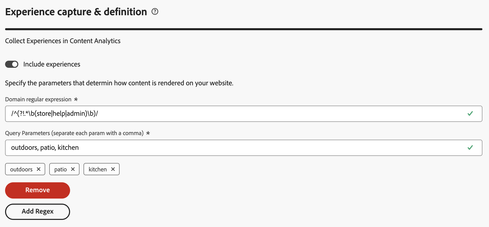

1. 启用&#x200B;**[!UICONTROL 包括体验]**。 用于启用体验的切换开关会影响以下方面：

   * Content Analytics 扩展中的数据收集
   * 从 Content Analytics 事件数据生成体验属性的过程
   * Customer Journey Analytics 中的报告模板。

1. 选择&#x200B;**[!UICONTROL 添加Regex]**&#x200B;以添加域正则表达式和查询参数的组合。
1. 通过定义影响页面内容的&#x200B;**[!UICONTROL 域正则表达式]**&#x200B;和&#x200B;**[!UICONTROL 查询参数]**&#x200B;的组合，指定内容在网站上的呈现方式。
   1. 输入&#x200B;**[!UICONTROL 域正则表达式]**，例如 `/^(?!.*\b(store|help|admin)\b)/`。 确保使用以下方法将正则表达式转义 `/`。 域正则表达式表示这些参数适用于哪些 URL。 例如，您有多个网站，而每个网站的内容是由不同的参数驱动的。 如果查询参数适用于所有页面，那么您可以使用 `.*` 表示所有页面。
   1. 指定&#x200B;**[!UICONTROL 查询参数]**&#x200B;的逗号分隔列表，例如`outdoors, patio, kitchen`。
1. 如果您想移除域正则表达式和查询参数的组合，请选择&#x200B;**[!UICONTROL 移除]**。
1. 如果您想添加正则表达式和查询参数的另一个组合，请选择&#x200B;**[!UICONTROL 添加正则表达式]**。

#### 已实施的配置 {#implemented-experiences-configuration}

要在已实施的配置中编辑现有体验或包含新体验，请执行以下操作：

* 切换启用或禁用&#x200B;**[!UICONTROL 包含体验]**：

  * 从 Content Analytics 事件数据生成体验属性的过程
  * Customer Journey Analytics 中的报告模板。

* 选择 **[!UICONTROL 编辑]**&#x200B;以进一步编辑Content Analytics中体验的数据收集配置。 您在与当前配置相关联的标记属性中被重定向到 [Adobe Content Analytics 扩展](https://experienceleague.adobe.com/zh-hans/docs/experience-platform/tags/extensions/client/content-analytics/overview#configure-event-segmenting)。

### 数据收集 {#web-data-collection}

数据收集设置允许您定义要为Content Analytics收集哪些数据（页面、资源）。 请勿在该数据收集过程中收集任何个人身份信息。

要配置数据收集，请执行以下操作：

* 使用现有的Web标记属性或创建新的Web标记属性。

  * 要使用现有Web标记属性，请执行以下操作：

    1. 选择&#x200B;**[!UICONTROL 选择现有的]**。
    2. 从&#x200B;**[!UICONTROL 标记属性]**&#x200B;下拉菜单中选择一个现有的属性。 您可以开始输入，以搜索并缩小可用选项范围。 您不能选择另一个已实施Content Analytics配置已使用的Tags属性。

  * 要创建新的Web标记属性，请执行以下操作：

    1. 选择&#x200B;**[!UICONTROL 新建]**。
    1. 指定一个&#x200B;**[!UICONTROL 标记名称]**，例如 `ACA Test for Documentation`。
    1. 指定&#x200B;**[!UICONTROL 域]**，例如，`example.com`。

    如果要使用[Content Analytics JavaScript库](/help/content-analytics/config/tags-agnostic.md)为Web渠道创建与标记无关的实现，请使用新的Tags属性。 将创建Tags属性，但在不可知的实施中不能使用属性。 但是，不确定的实施要求您至少运行一次引导式配置向导。

* 表示在为 Content Analytics 收集数据时应包含或排除哪些页面。 请确保排除能够识别个人身份的页面。

  为&#x200B;**[!UICONTROL 要包含/排除的页面]**&#x200B;指定&#x200B;**[!UICONTROL 正则表达式字符串]**。  例如：`^(?!.*documentation).*`，以从 Content Analytics 中排除所有文档页面。

* 指明在为 Content Analytics 收集数据时应包括或排除哪些资产。 请确保排除能够识别个人身份的资产。

  为&#x200B;**[!UICONTROL 要包含/排除的资产]**&#x200B;指定&#x200B;**[!UICONTROL 正则表达式字符串]**。  例如：`^(?!.*(logo\.jpg)).*$` 可将所有徽标 JPEG 图像排除在 Content Analytics 之外。

### 标头覆盖 {#web-header-overrides}

>[!CONTEXTUALHELP]
>id="aca_onboarding_datacollection_header_overrides_boldheader"
>title="标头覆盖"
>abstract="**标头覆盖**"

>[!CONTEXTUALHELP]
>id="aca_onboarding_datacollection_header_overrides_header"
>title="标头覆盖"
>abstract="用于绕过机器人检测或进行流量管控的高级功能。 Content Analytics 在调用您的端点时包含您自定义的 HTTP 标头。"

<!-- needs modification for mobile channel -->

或者，您可以在&#x200B;**[!UICONTROL 标头覆盖]**&#x200B;部分中指定标头名称和密码标头值。  此标头覆盖配置可确保Content Analytics发送自定义HTTP标头，以绕过您实施的任何机器人检测或流量审核技术。

1. 启用&#x200B;**[!UICONTROL 配置标头覆盖]**。
1. 输入&#x200B;**[!UICONTROL 标头名称]**。 例如，`x-asset-service`。
1. 输入&#x200B;**[!UICONTROL 标头值]**。 您指定的任何内容都是机密的，在用户界面中不可见（除非您在输入期间明确选择公开值）。

### 保存 {#web-save}

指定Web渠道的详细信息后，选择&#x200B;**[!UICONTROL 保存]**&#x200B;以保存配置。 选择&#x200B;**[!UICONTROL 取消]**&#x200B;以取消配置。

+++

#### 付费媒体 {#paid-media}

>[!CONTEXTUALHELP]
>id="aca_onboarding_paidmedia_adplatforms_nosourceconnectors"
>title="没有源连接器"
>abstract="付费媒体需要为您的广告发布平台配置 Experience Platform 源连接器。 此沙盒中没有 Google Ads 或 Meta Ads 连接器可用。 在 **[!UICONTROL Experience Platform]** > **[!UICONTROL 源]**&#x200B;界面中配置一个或多个连接器，然后返回到此步骤，继续配置 Content Analytics 付费媒体。"
>additional-url="https://experienceleague.adobe.com/zh-hans/docs/experience-platform/sources/connectors/advertising/ads" text="Google Ads 源"

+++ 详细信息

>[!NOTE]
>
>付费媒体渠道不可用于AWS上的Customer Journey Analytics和Experience Platform部署。

对于付费媒体渠道，在配置的沙盒中连接的所有受支持[广告平台](#paidmedia-adplatforms)会自动包含在Content Analytics中。

### 广告平台 {#paidmedia-adplatforms}

付费媒体需要为广告发布者配置Experience Platform源连接器。

如果您确实看到&#x200B;**[!UICONTROL 未找到支持的源连接器]**，则表示您尚未在配置的沙盒中为可用广告平台配置任何源连接器。

要为广告平台配置源连接器，请选择&#x200B;**[!UICONTROL 转到AEP源]**。 您将被重定向到Experience Platform中的&#x200B;**[!UICONTROL 源]**&#x200B;界面。

有关如何配置Google Ads和Meta Ads源连接器的示例，请参阅下文。

>[!BEGINTABS]

>[!TAB Google广告]

1. 在Experience Platform > **[!UICONTROL 源]**&#x200B;中，选择&#x200B;**[!UICONTROL Google广告]**&#x200B;卡片中的&#x200B;**[!UICONTROL 设置]**&#x200B;以启动设置向导。

   >[!WARNING]
   >
   >请勿在&#x200B;**Google广告（测试版）**&#x200B;卡中使用&#x200B;**[!UICONTROL 设置]**。

1. 在向导的➊ **[!UICONTROL 身份验证]**&#x200B;步骤中，选择&#x200B;**[!UICONTROL 新建帐户]**，然后输入&#x200B;**[!UICONTROL 帐户名称]**。

   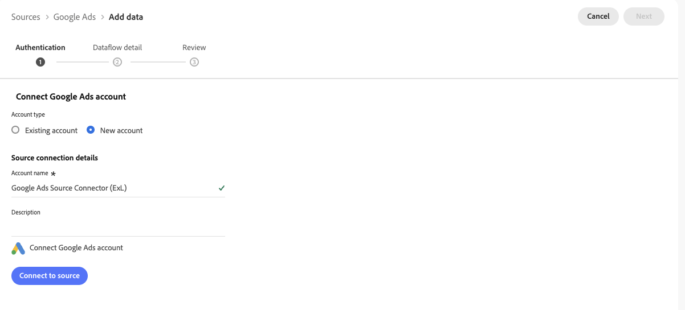

1. 在&#x200B;**[!UICONTROL 使用Google登录]**&#x200B;对话框中，选择一个拥有Google广告管理器帐户和Google广告帐户的帐户。

   

1. 使用密钥或其他身份验证机制验证您的凭据。

   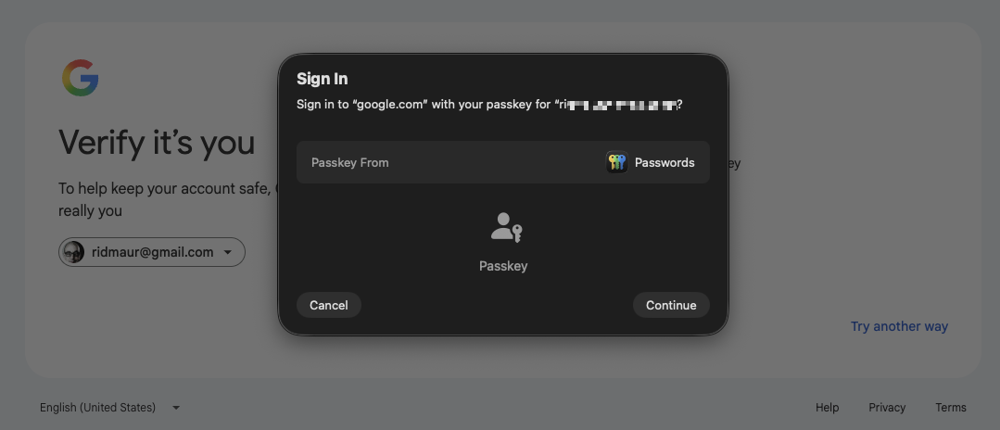

1. 在&#x200B;**[!UICONTROL Adobe Experience Platform希望访问您的Google帐户]**&#x200B;的对话框中选择&#x200B;**[!UICONTROL 继续]**。

   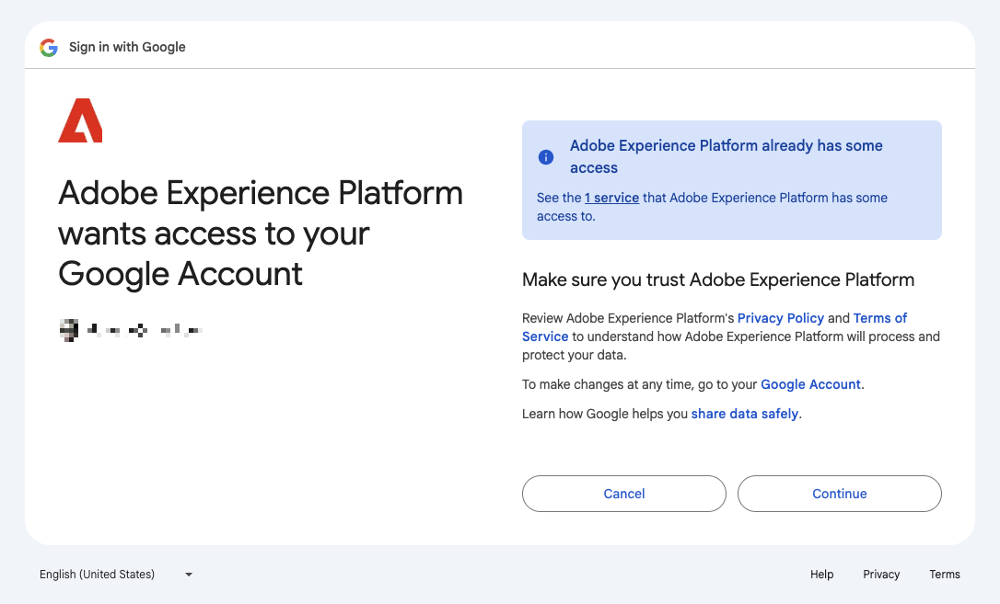

1. 成功验证后，在向导的➊ **[!UICONTROL 身份验证]**&#x200B;步骤中看到 **[!UICONTROL Connected]**。

   

   选择&#x200B;**[!UICONTROL 下一步]**。

1. 在向导的➋ **[!UICONTROL 数据流详细信息]**&#x200B;步骤中，输入&#x200B;**[!UICONTROL 数据流]**&#x200B;名称。 您还可以选中订阅警报的选项。

   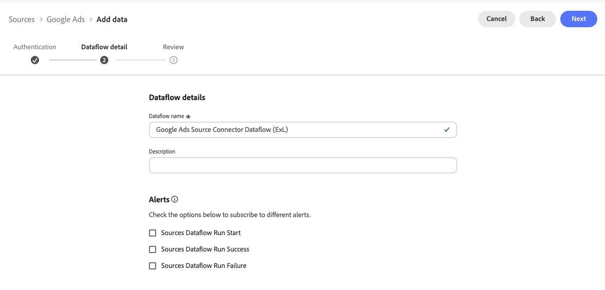

   选择&#x200B;**[!UICONTROL 下一步]**。

1. 在向导的➌ **[!UICONTROL 查看]**&#x200B;步骤中，查看源连接器详细信息。

   

   选择&#x200B;**[!UICONTROL 完成]**。

1. 您最终会看到已成功配置的Google源连接器的详细信息。

   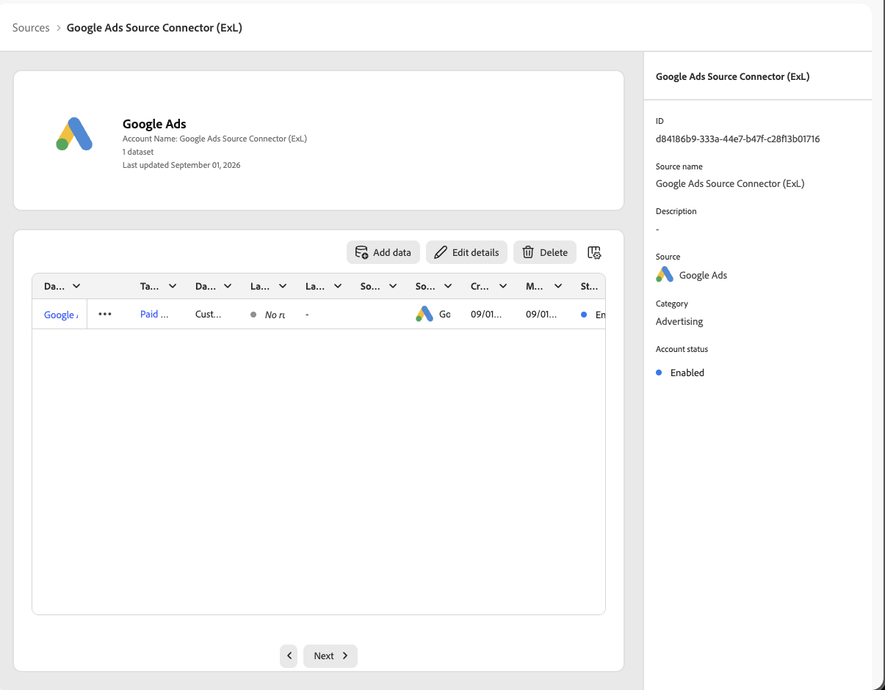

>[!TAB Meta广告]

1. 在Experience Platform > **[!UICONTROL 源]**&#x200B;中，选择&#x200B;**[!UICONTROL Meta广告]**&#x200B;卡片中的&#x200B;**[!UICONTROL 设置]**&#x200B;以启动设置向导。

1. 在向导的➊ **[!UICONTROL 身份验证]**&#x200B;步骤中，选择&#x200B;**[!UICONTROL 新建帐户]**，然后输入&#x200B;**[!UICONTROL 帐户名称]**。

   

1. 登录到已配置广告管理器的Facebook帐户。 如果您已经登录，则会显示一个对话框，该对话框将以登录用户的身份继续。

   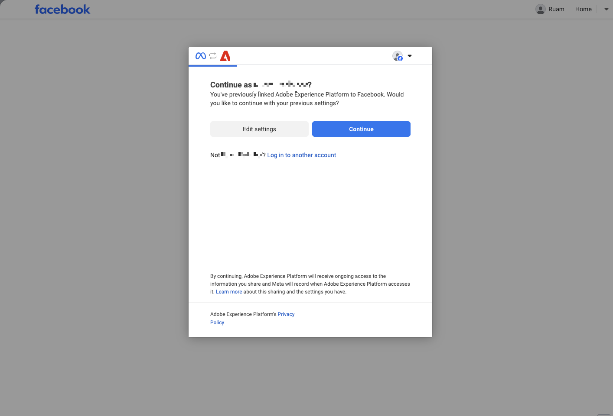

1. 成功验证后，在向导的➊ **[!UICONTROL 身份验证]**&#x200B;步骤中看到 **[!UICONTROL Connected]**。

   

   选择&#x200B;**[!UICONTROL 下一步]**。

1. 在向导的➋ **[!UICONTROL 选择帐户]**&#x200B;步骤中，选择要配置的帐户。

   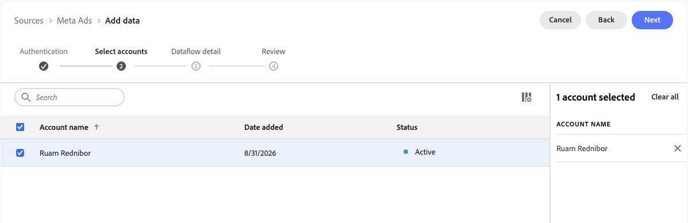

   选择&#x200B;**[!UICONTROL 下一步]**。

1. 在向导的➌ **[!UICONTROL 数据流详细信息]**&#x200B;步骤中，输入&#x200B;**[!UICONTROL 数据流]**&#x200B;名称。 您还可以选中订阅警报的选项。

   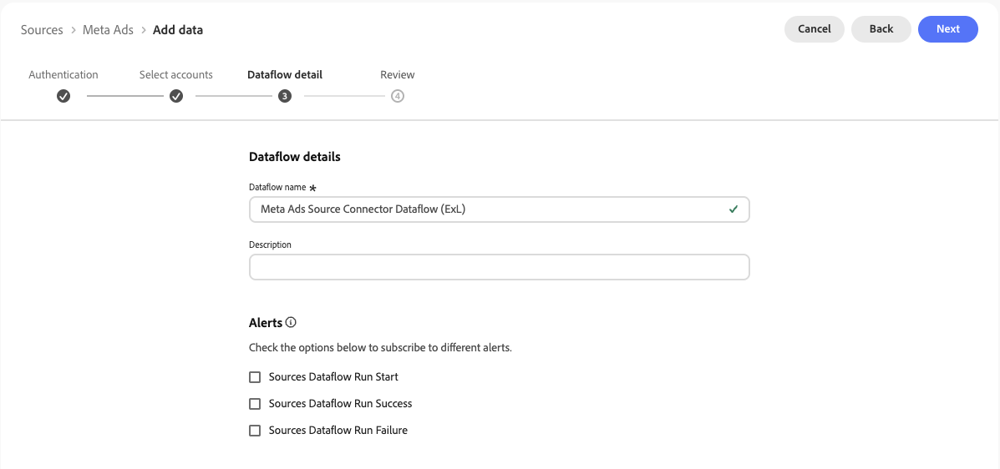

   选择&#x200B;**[!UICONTROL 下一步]**。

1. 在向导的➍ **[!UICONTROL 查看]**&#x200B;步骤中，查看源连接器详细信息。

   

1. 您最终会看到已成功配置的Google源连接器的详细信息。

   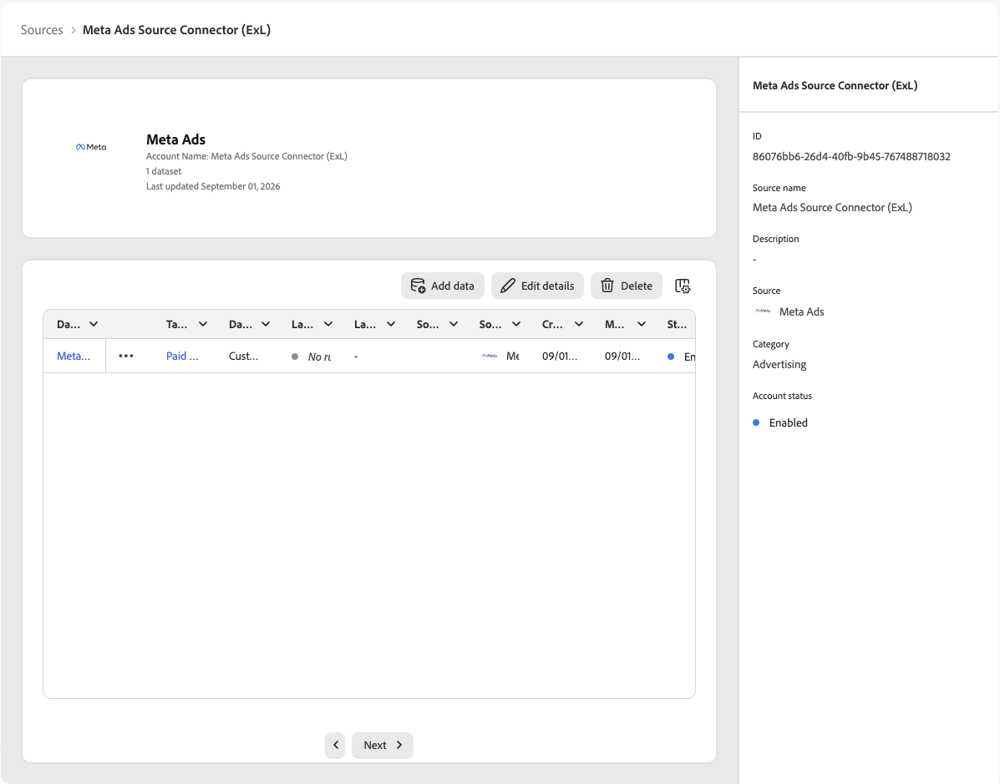

>[!ENDTABS]

有关付费媒体渠道支持的源连接器的更多信息，请参阅[Source连接器概述](https://experienceleague.adobe.com/zh-hans/docs/experience-platform/sources/home)。

在Experience Platform中配置源连接器后，选择 **[!UICONTROL 刷新]**&#x200B;以更新源连接器的列表。

您会看到可用广告平台的列表，以及哪些平台为 **Connected**&#x200B;和 **Not configured**。

已配置

### 数据行为 {#paidmedia-databehavior}

当您选择&#x200B;**[!UICONTROL 保存]**&#x200B;时，Content Analytics会自动：

* 更新Customer Journey Analytics连接，将来自所有连接的源连接器的付费媒体数据集包含在此沙盒中。
* 在所有选定的数据视图中启用付费媒体维度和量度。
* 在 Workspace 报告中，将付费媒体渠道作为可筛选维度显示。

### 保存 {#paidmedia-save}

选择&#x200B;**[!UICONTROL 保存]**&#x200B;以保存&#x200B;**[!UICONTROL 付费媒体]**&#x200B;配置。

+++

### 摘要 {#summary}

在提供了所有必要的详细信息后，摘要中会提供有关创建或修改的工件的详细信息。

* 当您实施新配置时，您会看到&#x200B;**[!UICONTROL 您已准备好为Content Analytics]**&#x200B;摘要实施&#x200B;_配置名称_。

* 对于已实施的配置，您会看到&#x200B;**[!UICONTROL 您已为 Content Analytics 实施&#x200B;_实施名称_]**&#x200B;的摘要。

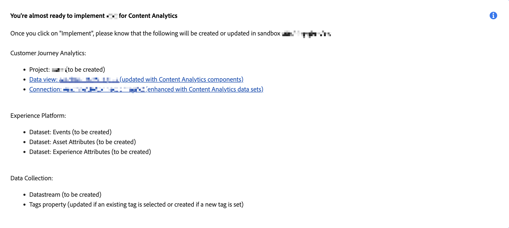

### 操作 {#actions}

>[!CONTEXTUALHELP]
>id="aca_onboarding_implementation_warning_dialog"
>title="实施确认"
>abstract="如果选择&#x200B;**[!UICONTROL 实施]**，则会根据您在此工作流程中提供的输入来配置 Content Analytics。 默认情况下，会根据 Content Analytics 的一般用途选择几种设置，但您（作为数据控制者）必须检查每个工件的设置，以确保这些设置是根据您的隐私政策、合同权利和义务以及符合适用法律的同意声明要求实施的。  请注意，在手动发布与此配置关联的标记库之前，不会收集任何数据。  为了获取图像和文本的属性，Adobe 使用了以下方式检索属性：<ol><li>根据您配置的数据收集设置，在用户访问网站时捕获的页面 URL，以及</li><li>托管图像的 URL。</li></ol>您不得对第三方网站上托管的图像进行标记。"

创建或编辑配置时，您有以下选项：

* **[!UICONTROL 丢弃]**：作为配置一部分的所有更改都将被丢弃。
* **[!UICONTROL 保存以供未来使用]**：对配置所做的更改已保存。 要进一步更改或实施配置，请在以后阶段重新访问它。 保存配置时只需要一个[!UICONTROL 名称]的值。
* **[!UICONTROL 实施]**：为配置所做的设置或更改已保存并实施。 标记为的所有字段都必须有正确的值。 实施包括：

  * **[!UICONTROL Customer Journey Analytics]** 配置：
    * 选定的数据视图已更新，将包含Content Analytics维度和量度。
    * 与所选数据视图相关联的连接已更改，以包含 Content Analytics 事件和属性数据集。
    * Content Analytics 报告模板已添加到工作区。

  * **[!UICONTROL Adobe Experience Platform]** 配置：
    * 创建用于为 Content Analytics 事件、资产属性和（如果已配置）体验属性建模的架构。
    * 创建数据集以收集 Content Analytics 事件、资产属性以及（如果已配置）体验属性。
    * 创建一个数据流，用于通过特征化服务从 Content Analytics 事件生成和更新内容属性。

  * **[!UICONTROL 数据收集]**&#x200B;配置：
    * 新的或现有的 Tags 属性被配置为支持 Content Analytics 数据收集。 此配置意味着需包含用于 Tags 的 Adobe Content Analytics 扩展。
    * 为 Content Analytics 事件创建数据流。
    * Adobe Content Analytics 扩展已配置，以确保将 Content Analytics 事件发送到 Content Analytics 的数据流。
    * 如果没有为Tags属性配置Web SDK或Mobile SDK，则会创建新的Web SDK或Mobile SDK配置以仅发送Content Analytics事件。
    * 如果为Tags属性配置了Web SDK或Mobile SDK，则不会对现有Web SDK或Mobile SDK配置进行任何更改。

* **[!UICONTROL 保存]**：对已实施的配置所做的更改会被保存，并且实施会被更新。
* **[!UICONTROL 退出]**。 退出引导式配置。 对已实施的配置所做的所有更改都会被丢弃。

## 发布 {#publish}

要开始收集Content Analytics配置的数据，您需要[手动](manual.md)发布为您启用的渠道创建的标记属性。

>[!MORELIKETHIS]
>
>[手动配置](manual.md)
>

