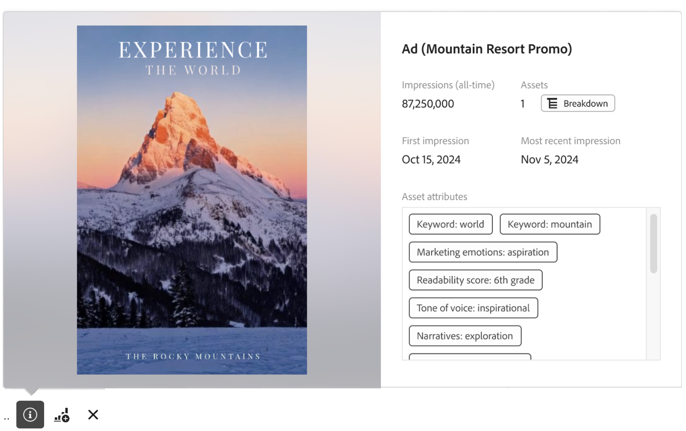

# Content Analytics 报告概述

您可以在 [Analysis Workspace](/help/analysis-workspace/home.md) 中报告 Content Analytics、执行分析并获得相关见解。现在提供一个特定的 Workspace [模板](#template)，您可以立即访问一个预先填充了相关内容见解的 Workspace 项目。

要从头开始报告 Content Analytics：

1. [在 Workspace 中创建一个新项目](/help/analysis-workspace/build-workspace-project/create-projects.md)或者[打开一个现有的](/help/analysis-workspace/build-workspace-project/open-projects.md)项目。
1. 确保[为 Content Analytics 报告选择一个数据视图](/help/analysis-workspace/c-panels/panels.md#data-view)。Content Analytics 报告仅适用于那些[已配置](/help/content-analytics/config/configuration.md)给 Content Analytics 的数据视图。
1. 将一个 [自由格式表](/help/analysis-workspace/visualizations/freeform-table/freeform-table.md)可视化图表拖到画布上。
1. 使用[特定的Content Analytics组件](components.md)和其他常规的[组件](/help/components/overview.md)（如区段、日期范围、注释）来构建Content Analytics见解。

## 缩略图

根据您在项目中使用的 Content Analytics 特定维度，将显示资产和维度的缩略图。

默认情况下，会显示相关 Content Analytics 维度的缩略图。如要配置 Content Analytics 维度的缩略图显示：

* 将鼠标悬停在 Content Analytics 维度的标题行上。例如，**[!UICONTROL 资产 ID]**&#x200B;或&#x200B;**[!UICONTROL 体验 ID]**。
* 选择。
* 在&#x200B;**[!UICONTROL 行设置]**&#x200B;弹出窗口中，在&#x200B;**[!UICONTROL 设置]**&#x200B;下方，勾选或取消勾选&#x200B;**[!UICONTROL 显示缩略图]**。

## 预览

对于显示缩略图的 Content Analytics 维度的行，您可以打开一个预览弹出窗口。

如要打开包含以下详细信息的预览：

* 选择 。会显示以下详细信息。

  | 体验预览 | 资产预览 |
  |---|---|
  |  |  |
  | 维度的名称（例如，**[!UICONTROL 体验 ID]）** | 资产维度的名称（例如，**[!UICONTROL 资产 ID]）** |
  | **[!UICONTROL 展示次数（所有时间）]**：体验的展示次数。 | **[!UICONTROL 展示次数（所有时间）]**：资产的展示次数。 |
  | **[!UICONTROL 资产]**：此体验包含的资产数量。 选择 **[!UICONTROL 细分]**&#x200B;以检查资产。 | **[!UICONTROL 体验]**：显示此资产的体验数量。 选择 **[!UICONTROL 细分]**&#x200B;以检查资产。 |
  | **[!UICONTROL 第一印象]**：体验的第一印象的日期。 | **[!UICONTROL 第一印象]**：资产的第一印象的日期。 |
  | **[!UICONTROL 最近的印象]**：体验的最近印象的日期。 | **[!UICONTROL 最近的印象]**：资产的最近印象的日期。 |
  | **[!UICONTROL 体验属性]**：体验的[属性](/help/content-analytics/report/components.md#experience-attributes)。 | **[!UICONTROL 资产属性]**：资产的[属性](/help/content-analytics/report/components.md#asset-attributes)。 |

## 模板

Content Analytics [模板](/help/analysis-workspace/templates/use-templates.md)可帮助您了解哪些内容和内容属性的表现最佳。 该模板是[网页渠道和参与度用例](/help/analysis-workspace/templates/use-templates.md#web-engagement)的一部分，详细说明了您的内容在粒度级别上的表现。您可以查看单个资产或特定属性的表现。

根据您获得的见解，您可能可以做很多事情。例如在主页上推广表现优异的资产，为特定区段提供个性化内容以包含表现优异的属性，或者轮换掉已经开始过时的内容。

如要使用模板：

1. 从主菜单中选择&#x200B;**[!UICONTROL Workspace]**。
1. 确保您选择的数据视图已配置给 Content Analytics。
1. 搜索或使用区段(**[!UICONTROL 渠道]**&#x200B;的&#x200B;**[!UICONTROL Web]**&#x200B;和****[!UICONTROL 用例]****的[!UICONTROL 参与])查找并选择&#x200B;**[!UICONTROL Content Analytics]**&#x200B;模板。
1. 选择&#x200B;**[!UICONTROL 使用模板]**。
1. 在&#x200B;**[!UICONTROL 设置模板]**&#x200B;对话框中，从&#x200B;**[!UICONTROL 选择转化量度]**&#x200B;对话框中选择一个量度。例如，**[!UICONTROL 资产点进率]**。
1. 选择&#x200B;**[!UICONTROL 继续]**。

在 [Analysis Workspace](/help/analysis-workspace/home.md) 中打开一个&#x200B;**[!UICONTROL Content Analytics 概述]**&#x200B;项目。该项目由四个[面板](/help/analysis-workspace/c-panels/panels.md)组成，每个面板都提供[自由格式表](/help/analysis-workspace/visualizations/freeform-table/freeform-table.md)和[可视化图表](/help/analysis-workspace/visualizations/freeform-analysis-visualizations.md)，以回答一个具体问题：

* **哪些内容表现最好？**
此面板可帮助您了解哪些体验以及这些体验中的哪些资产推动了参与度和转化。体验是一个在特定时间捕获的完整网页。体验可以包含文本和多个单个图像资产。资产是一个单个图像。

  面板由以下可视化图表组成：

   * **体验**。

     >[!NOTE]
     >
     >只有在您的 Content Analytics 配置中[包含了体验](/help/content-analytics/config/guided.md#experience-capture-and-definition)的情况下才会显示这些可视化图表。
     > 

      * **体验点进率**：一个展示体验点进率的[摘要变化](/help/analysis-workspace/visualizations/summary-number-change.md)可视化图表。
      * **最佳转化体验**：展示基于所选转化量度的最佳转化体验的[水平条形图](/help/analysis-workspace/visualizations/horizontal-bar.md)可视化图表。
      * **最佳表现体验**：一个展示最佳表现体验的[自由格式表](/help/analysis-workspace/visualizations/freeform-table/freeform-table.md)（包括[缩略图](#thumbnails)和[预览](#previews)）。

   * **资产**

      * **资产点进率**
一个展示资产点进率的[摘要变化](/help/analysis-workspace/visualizations/summary-number-change.md)可视化图表。
      * **最佳转化资产**
展示基于所选转化量度的最佳转化资产的[水平条形图](/help/analysis-workspace/visualizations/horizontal-bar.md)可视化图表。
      * **最佳表现资产**
一个展示最佳表现资产的[自由格式表](/help/analysis-workspace/visualizations/freeform-table/freeform-table.md)（包括[缩略图](#thumbnails)和[预览](#previews)）。
      * **资产 - 浏览次数与转化。**
[散点图](/help/analysis-workspace/visualizations/scatterplot.md)可视化图表显示了资产浏览与资产转化的散点图。

* **哪些资产属性有助于转化？**
Content Analytics 使用 AI 和生成式 AI 自动分配每个资产元数据，例如主题、场景、前景颜色等。属性是 AI 分配的描述资产或体验内容的元数据标记。例如：<code>foreground color: red</code> 是一个自动分配的属性。可视化图表可以帮助您确定资产的哪些属性对转化的贡献最大。

  面板由以下可视化图表组成：

   * **最佳转化资产属性**
展示基于所选转化量度的最佳转化资产属性的[水平条形图](/help/analysis-workspace/visualizations/horizontal-bar.md)。
   * **与前 30 天相比的最佳转化资产属性**
展示基于所选转化量度的与前 30 天相比最佳转化资产属性的[水平条形图](/help/analysis-workspace/visualizations/horizontal-bar.md)。
   * **最佳转化资产属性数据**
展示基于所选转化量度的最佳转化属性的[自由格式表](/help/analysis-workspace/visualizations/freeform-table/freeform-table.md)。选择表中的一行可更新该属性的趋势可视化图表。
   * **属性趋势**
展示所选最佳转化资产属性的属性趋势的[线形图](/help/analysis-workspace/visualizations/line.md)。
   * **资产前景颜色**
一个[自由格式表](/help/analysis-workspace/visualizations/freeform-table/freeform-table.md)示例，用于比较来自单个资产属性类别“前景颜色”的各项的表现。您可以用其他资产属性类别维度替换这个资产属性。

* **哪些体验属性有助于转化？**

  >[!NOTE]
  >
  >只有在 Content Analytics 配置中[包含了体验](/help/content-analytics/config/guided.md#experience-capture-and-definition)的情况下，才会显示此面板。
  > 

  资产属性关注图像的视觉质量，而体验属性则关注页面的文本。下面的可视化图表可以让您探索哪些体验属性有助于转化。这些属性也使用 AI 和生成式 AI 模型自动分配。

  面板由以下可视化图表组成：

   * **最佳转化体验属性**
展示基于所选转化量度的最佳转化体验属性的[水平条形图](/help/analysis-workspace/visualizations/horizontal-bar.md)。
   * **与前 30 天相比的最佳转化体验属性**
展示基于所选转化量度的与前 30 天相比最佳转化体验属性的[水平条形图](/help/analysis-workspace/visualizations/horizontal-bar.md)。
   * **最佳转化体验属性数据**
展示基于所选转化量度的最佳转化体验的[自由格式表](/help/analysis-workspace/visualizations/freeform-table/freeform-table.md)。选择表中的一行可更新线形图可视化图表。
   * **线形图**
展示基于所选最佳转化体验属性的趋势的[线形图](/help/analysis-workspace/visualizations/line.md)。
   * **体验关键词**
展示基于所选转化量度的最佳体验关键词的[自由格式表](/help/analysis-workspace/visualizations/freeform-table/freeform-table.md)。

* **资产出现在我的网站上的什么位置？**
由一个自由格式表组成的面板详细说明了您网站上浏览次数最多的资产出现在哪里。

  该面板由一个可视化图表组成：

   * **浏览次数最多的资产出现在哪里？**
您可以将任何资产按维度细分，以帮助您更好地了解该图像出现在哪里。

     在[自由格式表](/help/analysis-workspace/visualizations/freeform-table/freeform-table.md)（包括[缩略图](#thumbnails)和[预览](#previews)）示例中使用了&#x200B;**[!UICONTROL 资产感知 ID]**，而不是[!UICONTROL 资产 ID]。有时，完全相同的图像可能会在您的网站上以不同的图像 URL 重复出现。[!UICONTROL 资产感知 ID] 属性有助于将这些重复项分组到单个 ID 下。

     由于资产可以在页面上发生变化，因此每个资产都按&#x200B;**[!UICONTROL 体验 ID]** 进行细分，以识别资产出现在该页面的哪个版本上。您可以将[!UICONTROL 体验 ID] 替换为其他维度，以帮助您了解某个资产在您网站上的位置。例如，[!UICONTROL 页面名称]、[!UICONTROL 页面 URL] 或[!UICONTROL 网站分区]。

     您还可以将[!UICONTROL 资产感知 ID] 换为[!UICONTROL 资产 ID]，以记录特定图像 URL 被引用的位置。

>[!MORELIKETHIS]
>
>[Content Analytics 组件](components.md)
>>[使用模板](/help/analysis-workspace/templates/use-templates.md#web-engagement)
>
