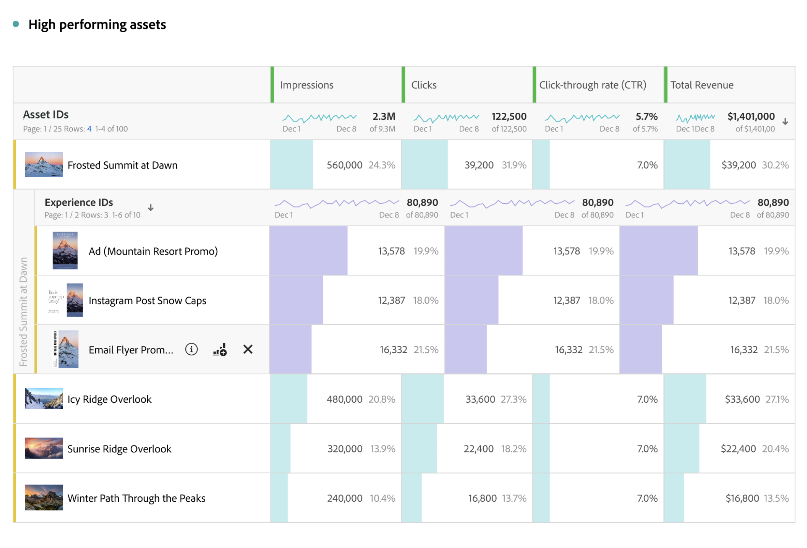

# Content Analytics 报告概述

您可以在[Analysis Workspace](/help/analysis-workspace/home.md)中报告、执行分析和了解[!DNL Content Analytics]。 现在提供一个特定的 Workspace [模板](#template)，您可以立即访问一个预先填充了相关内容洞察的 Workspace 项目。

要从头开始创建您自己的Content Analytics报表，请执行以下步骤：

1. 在Workspace中创建[新项目](/help/analysis-workspace/build-workspace-project/create-projects.md)或打开[现有项目](/help/analysis-workspace/build-workspace-project/open-projects.md)。
1. 确保[为 Content Analytics 报告选择一个数据视图](/help/analysis-workspace/c-panels/panels.md#data-view)。 Content Analytics 报告仅适用于那些[已配置](/help/content-analytics/config/configuration.md)给 Content Analytics 的数据视图。
1. 将 [自由格式表](/help/analysis-workspace/visualizations/freeform-table/freeform-table.md)可视化拖动到画布上。
1. 使用[特定的 Content Analytics 组件](components.md)和其他通用[组件](/help/components/overview.md)（例如区段、日期范围、注释）来构建您的 Content Analytics 洞察。
1. 使用其他[可视化图表](/help/analysis-workspace/visualizations/freeform-analysis-visualizations.md)来增强您的项目。

## 缩略图

根据您在项目中使用的特定于Content Analytics的维度，缩略图会显示在以下可视化图表中：

### 自由格式表

默认情况下，缩略图显示在[自由格式表](/help/analysis-workspace/visualizations/freeform-table/freeform-table.md)中。 如要配置 Content Analytics 维度的缩略图显示：

* 将鼠标悬停在 Content Analytics 维度的标题行上。 例如，**[!UICONTROL 资产 ID]**&#x200B;或&#x200B;**[!UICONTROL 体验 ID]**。
* 选择。
* 在&#x200B;**[!UICONTROL 行设置]**&#x200B;弹出窗口中，在&#x200B;**[!UICONTROL 设置]**&#x200B;下方，勾选或取消勾选&#x200B;**[!UICONTROL 显示缩略图]**。

### 条形图（栈叠）和水平条形图（栈叠）

{{release-limited-testing-section}}

缩略图在垂直轴或水平轴上显示为图例的一部分。 当您将鼠标悬停在[条形图（栈叠）](/help/analysis-workspace/visualizations/bar.md)和[水平条形图（栈叠）](/help/analysis-workspace/visualizations/horizontal-bar.md)中的条形图上时，也会显示缩略图。

### 散点图

{{release-limited-testing-section}}

将鼠标悬停在[散点图](/help/analysis-workspace/visualizations/scatterplot.md)中的数据点上时，将显示缩略图。

## 预览

>[!AVAILABILITY]
>
>本节中介绍的条形图和散点图可视化图表位于有限测试中，可能无法在您的环境中使用。 当功能正式可用时，将删除此注释。 有关 Customer Journey Analytics 发布流程的信息，请参阅 [Customer Journey Analytics 功能版本](/help/release-notes/releases.md)。
>

您可以打开预览弹出窗口。 操作方法：

* 在[自由格式表](#freeform-table)中选择。
* 在[条形图](#bar-and-horizontal-bar)或[水平条形图](#bar-and-horizontal-bar)可视化图中选择特定条形图，或者在[散点图](#scatter)可视化图表中选择数据点。

会显示以下详细信息。

| 体验预览 | 资产预览 |
|---|---|
|  |  |
| 维度的名称（例如，**[!UICONTROL 体验 ID]）** | 资产维度的名称（例如，**[!UICONTROL 资产 ID]）** |
| **[!UICONTROL 展示次数（所有时间）]**：体验的展示次数。 | **[!UICONTROL 展示次数（所有时间）]**：资产的展示次数。 |
| **[!UICONTROL 资产]**：此体验包含的资产数量。  选择 **[!UICONTROL 细分]**&#x200B;以检查资产。 | **[!UICONTROL 体验]**：显示此资产的体验数量。  选择 **[!UICONTROL 细分]**&#x200B;以检查资产。 |
| **[!UICONTROL 第一印象]**：体验的第一印象的日期。 | **[!UICONTROL 第一印象]**：资产的第一印象的日期。 |
| **[!UICONTROL 最近展示]**：体验最近展示的日期。 | **[!UICONTROL 最近的印象]**：资产的最近印象的日期。 |
| **[!UICONTROL 体验属性]**：体验的[属性](/help/content-analytics/report/components.md#experience-attributes)。 | **[!UICONTROL 资产属性]**：资产的[属性](/help/content-analytics/report/components.md#asset-attributes)。 |

## 模板

Content Analytics [模板](/help/analysis-workspace/templates/use-templates.md)可帮助您了解哪些内容和内容属性的表现最佳。 该模板是[网页渠道和参与度用例](/help/analysis-workspace/templates/use-templates.md#web-engagement)的一部分，详细说明了您的内容在粒度级别上的表现。 您可以查看单个资产或特定属性的表现。

根据您获得的见解，您可能可以做很多事情。 例如在主页上推广表现优异的资产，为特定区段提供个性化内容以包含表现优异的属性，或者轮换掉已经开始过时的内容。

如要使用模板：

1. 从主菜单中选择&#x200B;**[!UICONTROL Workspace]**。
1. 确保您选择的数据视图已配置给 Content Analytics。
1. 搜索或使用区段（为&#x200B;**[!UICONTROL 渠道]**&#x200B;使用 **[!UICONTROL Web]**，为**[!UICONTROL 用例]**使用&#x200B;**[!UICONTROL 参与度]**）查找并选择 **[!UICONTROL Content Analytics]** 模板。
1. 选择&#x200B;**[!UICONTROL 使用模板]**。
1. 在&#x200B;**[!UICONTROL 设置模板]**&#x200B;对话框中，从&#x200B;**[!UICONTROL 选择转化量度]**&#x200B;对话框中选择一个量度。 例如，**[!UICONTROL 资产点进率]**。
1. 选择&#x200B;**[!UICONTROL 继续]**。

在 [Analysis Workspace](/help/analysis-workspace/home.md) 中打开一个&#x200B;**[!UICONTROL Content Analytics 概述]**&#x200B;项目。 项目由四个[面板](/help/analysis-workspace/c-panels/panels.md)组成，其中每个面板都提供[自由格式表](/help/analysis-workspace/visualizations/freeform-table/freeform-table.md)和[可视化图表](/help/analysis-workspace/visualizations/freeform-analysis-visualizations.md)来回答特定问题。 您可以使用&#x200B;**[!UICONTROL 内容渠道]**&#x200B;划分[划分](/help/analysis-workspace/c-panels/panels.md#break-down-a-panel)您感兴趣的内容渠道的面板：**[!UICONTROL Web]**&#x200B;或&#x200B;**[!UICONTROL 移动设备]**。

四个面板包括：

* **哪些内容表现最好？**
此面板可识别哪些体验和资产可促进参与和转化。 体验是在特定时间捕获的完整网页，或者移动应用程序中定义的文本、资源和行动号召的组合。

   * **体验**。

     >[!NOTE]
     >
     >只有在您将系统配置为在Content Analytics配置中[包含体验](/help/content-analytics/config/guided.md#experience-capture-and-definition)时，这些可视化才会显示在您的模板中。
     > 

      * **体验CTR**：显示Experience CTR的[摘要更改](/help/analysis-workspace/visualizations/summary-number-change.md)可视化图表。
      * **最佳转化体验**：展示基于所选转化量度的最佳转化体验的[水平条形图](/help/analysis-workspace/visualizations/horizontal-bar.md)可视化图表。
      * **表现最佳的体验**：表现最佳的体验的[自由格式表](/help/analysis-workspace/visualizations/freeform-table/freeform-table.md)（包括[缩略图](#thumbnails)和[预览](#previews)）。

   * **资产**

      * **资源CTR**
显示Asset CTR的[摘要变化](/help/analysis-workspace/visualizations/summary-number-change.md)可视化图表。
      * **排名最前的转化资产**
一个[水平条形图](/help/analysis-workspace/visualizations/horizontal-bar.md)可视化图表，它根据所选的转化量度显示排名最前的转化资产。
      * **表现最佳的资产**
针对表现最好的资产的[自由格式表](/help/analysis-workspace/visualizations/freeform-table/freeform-table.md)（包括[缩略图](#thumbnails)和[预览](#previews)）。
Assets — 查看次数与转化率的比较。
[散点图](/help/analysis-workspace/visualizations/scatterplot.md)可视化图表，它显示资源视图与资源转换的散点图。

* **哪些资产属性有助于转化？**
Content Analytics使用AI和GenAI自动将元数据和属性（如主题、场景和前景色）分配给每个资源。

   * **排名最前的转换资产属性**
一个[水平条](/help/analysis-workspace/visualizations/horizontal-bar.md)，它根据所选的转化量度显示排名最前的转化资产属性。
   * **排名最前的转化资产属性与前30天的对比**
一个[水平条形图](/help/analysis-workspace/visualizations/horizontal-bar.md)可视化图表，它根据所选的转化量度显示与前30天相比排名最前的转化资产属性。
   * **排名最前的转换资产属性数据**
一个[自由格式表](/help/analysis-workspace/visualizations/freeform-table/freeform-table.md)，它根据所选的转化量度显示排名最前的转化属性。 选择表中的一行可更新该属性的趋势可视化图表。
   * **属性趋势**
显示所选转化率最高的资产属性的属性趋势的[折线图](/help/analysis-workspace/visualizations/line.md)可视化图表。
   * **资源前景颜色**
示例[自由格式表](/help/analysis-workspace/visualizations/freeform-table/freeform-table.md)比较单个资源属性类别（前景颜色）中项目的性能。 您可以用其他资产属性类别维度替换这个资产属性。

* **哪些体验属性有助于转化？**

  >[!NOTE]
  >
  >只有在 Content Analytics 配置中[包含了体验](/help/content-analytics/config/guided.md#experience-capture-and-definition)的情况下，才会显示此面板。
  > 

  资产属性关注图像的视觉质量，而体验属性则关注页面的文本。 下面的可视化图表可以让您探索哪些体验属性有助于转化。 这些属性也使用 AI 和生成式 AI 模型自动分配。

  面板由以下可视化图表组成：

   * **排名最前的转换体验属性**
一个[水平条形图](/help/analysis-workspace/visualizations/horizontal-bar.md)可视化图表，它根据所选的转化量度显示排名最前的转化体验属性。
与前30天相比的转化体验属性排名
一个[水平条形图](/help/analysis-workspace/visualizations/horizontal-bar.md)可视化图表，它根据所选的转化量度显示与前30天相比排名最前的转化体验属性。
   * **排名最前的转换体验属性数据**
一个[自由格式表](/help/analysis-workspace/visualizations/freeform-table/freeform-table.md)，它根据所选的转化量度显示排名最前的转化体验。 选择表中的一行可更新线形图可视化图表。
   * **行**
显示所选排名最前的转化体验属性趋势的[折线图](/help/analysis-workspace/visualizations/line.md)可视化图表。
   * **体验关键字**
一个[自由格式表](/help/analysis-workspace/visualizations/freeform-table/freeform-table.md)，它根据所选的转化量度显示排名最前的体验关键字。

* **资产出现在我的网站上的什么位置？**
此自由格式表详细说明了您查看次数最多的资源的显示位置。 使用此分析可以识别高性能页面并优化资产放置。

   * **浏览次数最多的资产出现在哪里？**
您可以按尺寸划分任何资源，以帮助您更好地了解该图像出现的位置。

     在[自由格式表](/help/analysis-workspace/visualizations/freeform-table/freeform-table.md)（包括[缩略图](#thumbnails)和[预览](#previews)）示例中使用了&#x200B;**[!UICONTROL 资产感知 ID]**，而不是[!UICONTROL 资产 ID]。 有时，完全相同的图像可能会在您的网站上以不同的图像 URL 重复出现。 [!UICONTROL 资产感知 ID] 属性有助于将这些重复项分组到单个 ID 下。

     由于资产可以在页面上更改，因此系统会按&#x200B;**[!UICONTROL 体验ID]**&#x200B;划分每个资产，以确定资产出现的页面版本。 您可以将[!UICONTROL 体验 ID] 替换为其他维度，以帮助您了解某个资产在您网站上的位置。 例如，[!UICONTROL 页面名称]、[!UICONTROL 页面 URL] 或[!UICONTROL 网站分区]。

     您还可以将[!UICONTROL 资产感知 ID] 换为[!UICONTROL 资产 ID]，以记录特定图像 URL 被引用的位置。

>[!MORELIKETHIS]
>
>[Content Analytics组件](components.md)
>[使用模板](/help/analysis-workspace/templates/use-templates.md#web-engagement)
>
