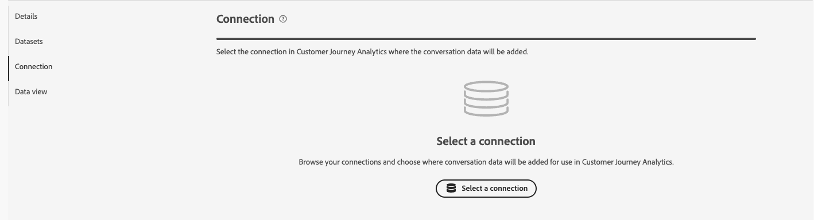
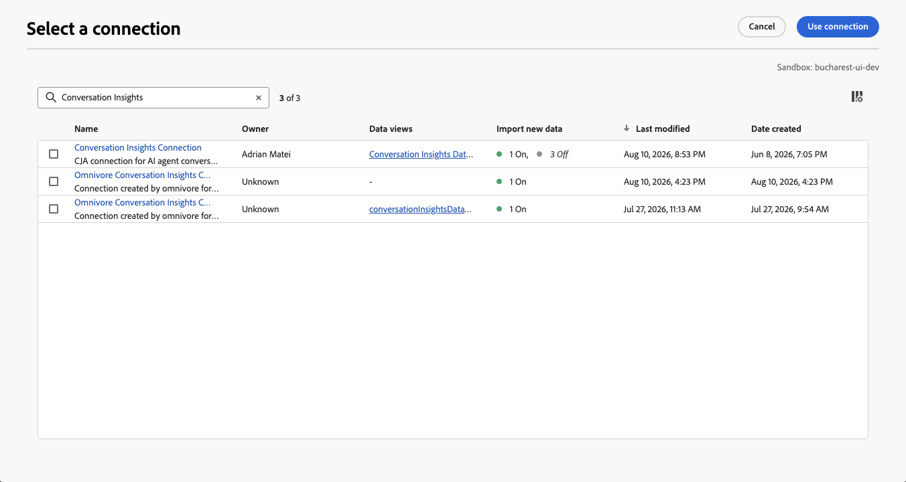

# 创建或编辑配置

对话分析允许您从提供给客户的座席体验分析对话。 这些代理体验可以基于大型语言模型(LLM)或基于人类对话。 例如，与客户或呼叫中心进行交互的聊天机器人成绩单。
通过对话分析，您可以了解座席对实际用户结果的影响。

通过对话见解配置界面，您可以快速创建或编辑配置和相关工件（连接、数据视图等）。

创建或编辑“对话分析”配置时，请指定沙盒以及包含提示、响应和反馈数据的事件数据集。 您还可以选择要将这些数据集添加到的Customer Journey Analytics连接。 以及要将对话分析量度和维度添加到其中的数据视图。

只有系统管理员才能创建或编辑对话分析配置。

您可以从[对话见解配置界面](./manage.md)创建或编辑配置。

## 恢复缺少的混合数据集

如果编辑配置并且为该配置生成的混合数据集不再存在，请选择&#x200B;**[!UICONTROL 恢复]**&#x200B;以重新生成混合数据集。

## 配置步骤

对于每个配置：

1. 在&#x200B;**[!UICONTROL 详细信息]**&#x200B;部分中，指定以下信息：

   

   | 字段 | 描述 |
   |---------|----------|
   | **[!UICONTROL 名称]** | 指定配置的名称。 |
   | **[!UICONTROL 沙盒]** | 选择包含要添加到连接的提示、响应和反馈事件数据集的Experience Platform沙盒。 |

1. 在&#x200B;**[!UICONTROL 数据集]**&#x200B;部分中，指定以下信息：

   

   | 字段 | 描述 |
   |---------|----------|
   | **[!UICONTROL 提示事件数据集]** | 选择包含提示事件数据的数据集。 |
   | **[!UICONTROL 响应事件数据集]** | 选择包含响应事件数据的数据集。 |
   | **[!UICONTROL 反馈事件数据集]** | 选择包含反馈事件数据的数据集。 |

1. 在&#x200B;**[!UICONTROL 连接]**&#x200B;部分中，如果尚未配置任何连接，请使用&#x200B;**[!UICONTROL 选择连接]**&#x200B;以选择连接。

   

   如果已配置连接，请选择 **[!UICONTROL 编辑]**&#x200B;以选择其他连接。

   

   在&#x200B;**[!UICONTROL 选择连接]**&#x200B;对话框中：

   

   1. 选中要向其添加提示、响应和反馈事件数据集的连接旁边的复选框。
   1. 选择&#x200B;**[!UICONTROL 使用连接]**。

   * 若要在要从中进行选择的连接列表中搜索，请使用字段。
   * 要配置要在表中显示的列，请选择。 在&#x200B;**[!UICONTROL 自定义表]**&#x200B;对话框中，选择要显示的列。 然后选择&#x200B;**[!UICONTROL 应用]**。

1. 在&#x200B;**[!UICONTROL 数据视图]**&#x200B;部分中，如果尚未配置任何数据视图，请选择&#x200B;**[!UICONTROL 选择数据视图]**&#x200B;以选择数据视图。

   如果数据视图已配置，请选择 **[!UICONTROL 编辑数据视图选择]**&#x200B;以重新配置数据视图选择。

   在&#x200B;**[!UICONTROL 选择多个数据视图]**&#x200B;对话框中：

   

   1. 选择要用于对话分析配置的一个或多个数据视图。

   1. 选择&#x200B;**[!UICONTROL 使用数据视图]**&#x200B;以使用数据视图。 选择“取消”即可取消。

   * 若要在要从中进行选择的数据视图列表中搜索，请使用字段。
   * 要配置要在表中显示的列，请选择。 在&#x200B;**[!UICONTROL 自定义表]**&#x200B;对话框中，选择要显示的列。 然后选择&#x200B;**[!UICONTROL 应用]**。

1. 要完成配置，请执行以下操作：

   * 为尚未创建的新配置选择&#x200B;**[!UICONTROL 放弃]**。

   * 对于要保存但不想为其创建项目（例如数据视图的更新）的新配置，请选择&#x200B;**[!UICONTROL 保存以供以后使用]**。 您可以稍后重新访问配置，并完成配置的实际创建。

   * 选择&#x200B;**[!UICONTROL 创建]**&#x200B;以创建新配置。

   * 选择&#x200B;**[!UICONTROL 保存]**&#x200B;以保存修改的配置。

   * 选择&#x200B;**[!UICONTROL 还原]**&#x200B;以还原配置以重新生成配置的新混合数据集。

   * 选择&#x200B;**[!UICONTROL 退出]**&#x200B;以忽略对配置的任何更改。

## 数据视图验证

您在[配置步骤](#configuration-steps)中配置的数据视图具有&#x200B;**[!UICONTROL 对话见解]**，作为[数据视图](/help/data-views/manage-dataviews.md)中&#x200B;**[!UICONTROL 集成]**&#x200B;的值。

对于每个配置的数据视图：

* **容器**： [容器选项卡](/help/data-views/create-dataview.md#containers)包含一个新的&#x200B;**[!UICONTROL 容器名称]**： **[!UICONTROL 对话]**，其中具有&#x200B;**[!UICONTROL 显示名称]**： **[!UICONTROL 容器]**&#x200B;作为附加的&#x200B;**[!UICONTROL 系统]** **[!UICONTROL 容器类型]**。
* **组件**：您看到其他架构字段文件夹。 例如：agentExperience和conversation。 此外，还会自动添加以下组件：

  | 量度 | 架构数据类型 | 架构路径 |
  |---|---|---|
  | 客户反馈 | 字符串 | 事件类型 |
  | 正面情绪 | 字符串 | 派生字段 |
  | 建议 | 字符串 | 事件类型 |
  | 转弯 | 字符串 | 事件类型 |

  | 维度 | 架构数据类型 | 架构路径 |
  |---|---|---|
  | 代理 ID | 字符串 | `agenticExperience.agents.agentID` |
  | 代理商名称 | 字符串 | `agenticExperience.agents.name` |
  | 调度器名称 | 字符串 | `agenticExperience.name` |
  | 调度器的版本 | 字符串 | `agenticExperience.version` |
  | 对话 ID | 字符串 | `conversation.conversationID` |
  | 对话名称 | 字符串 | `conversation.conversationName` |
  | 对话信号名称 | 字符串 | `conversation.signals.name` |
  | 对话摘要布尔值 | 布尔值 | `conversation.signals.values.booleanValue` |
  | 对话摘要置信度 | 双精度型 | `conversation.signals.values.confidence` |
  | 对话摘要元数据键 | 字符串 | `conversation.signals.values.metadata.key` |
  | 对话摘要数值 | 双精度型 | `conversation.signals.values.numberValue` |
  | 对话摘要限定符 | 字符串 | `conversation.signals.values.qualifiers` |
  | 对话语气信号 | 字符串 | `conversation.signals.attributes.tones.values` |
  | 环境 | 字符串 | `agenticExperience.environment` |
  | 反馈分类 | 字符串 | 派生字段 |
  | 反馈评分分类 | 字符串 | `conversation.feedback.rating.classification` |
  | 反馈分区的用途 | 字符串 | `conversation.feedback.raw.purpose` |
  | 反馈的来源 | 字符串 | `conversation.feedback.source` |
  | 字句 | 字符串 | `conversation.signals.attributes.subjects.values.phrase` |
  | 回答的原始文本 | 字符串 | `conversation.response.raw.text` |
  | 回答的来源 | 字符串 | `conversation.response.source` |
  | 情绪分类 | 字符串 | 派生字段 |
  | 技能名称 | 字符串 | `agenticExperience.agents.skills.name` |
  | 技能版本 | 字符串 | `agenticExperience.agents.skills.version` |
  | 数值 | 字符串 | `agenticExperience.agents.skills.parameters.value` |

<!--

1. In the Data views dialog, select the checkbox next to one or more data views that you want to use when analyzing Experience Platform audience data within Analysis Workspace. These data views are automatically configured with Experience Platform audience data for reporting.

1. Select **[!UICONTROL Use data views]**.

1. Select **[!UICONTROL Create]** to create the configuration.

   >[!IMPORTANT]
   >
   >Because the profile dataset is updated once per day, audiences are available in Customer Journey Analytics data views on the day after you create the audience analysis configuration.

1. After 24 hours, [view audience dimensions in the data view](#view-audience-dimensions-in-the-data-view) to verify that the audience dimensions are available in the data views that you selected. 

## View audience dimensions in the data view

After you [create an audience analysis configuration](#create-an-audience-analysis-configuration), you can verify that audience dimensions were added to the data views that you selected during the configuration.

To view audience dimensions in the data view, you must be a product profile administrator for the product profile that the data view is assigned to. For more information, see [Access control](/help/technotes/access-control.md).

To view the audience analysis dimensions in the data view:

1. In Customer Journey Analytics, select **[!UICONTROL Data Management]** > **[!UICONTROL Data views]**.

1. In the **[!UICONTROL Dimensions]** section, the following dimensions should now be available:

   * **[!UICONTROL Audience Name]**

   * **[!UICONTROL Audience Origin]**

   * **[!UICONTROL Exited Audience Origin]**

   * **[!UICONTROL Exited Audience Name]**

   Note that each of these dimensions was added to the profile dataset that is associated with the merge policy that you selected during the audience analysis configuration, and each was added to the new lookup dataset that was created.

   

1. Use the audience analysis dimensions in Analysis Workspace. 

   Users who have access to use the data view in Analysis Workspace can now see the new dimensions and use them in their analyses. For information about how to use the audience analysis dimensions in Analysis Workspace, see [Analyze Experience Platform audiences in Customer Journey Analytics](/help/connections/audience-analysis/analyze-audiences.md).

-->