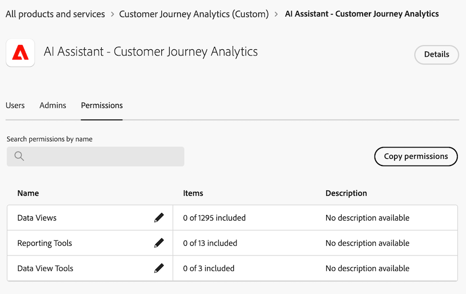
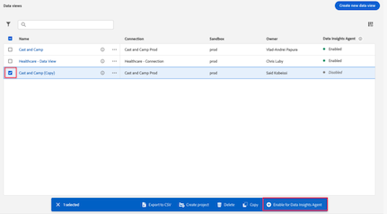
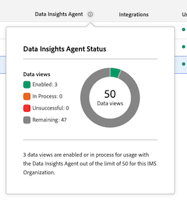

# 使用 Data Insights 代理可视化数据

>[!AVAILABILITY]
>
>Data Insights 代理在限定时间内供符合条件的客户使用。Data Insights 代理的访问截止日期为 2026 年 2 月 28 日。 若希望在此日期之后继续不间断地使用 Data Insights 代理，请联系 Adobe 客户代表，了解有关 Adobe Experience Platform Agent Orchestrator 许可的更多信息。

Data Insights 代理可从 Customer Journey Analytics 中的 [AI 助手](/help/ai-assistant.md)访问，它是一个生成式 AI 对话代理，可以快速有效地回答有关您数据的问题。它使用来自数据视图的组件和您的实际数据在 Analysis Workspace 中构建相关的可视化图表。

使用 Data Insights 代理回答 Analysis Workspace 中以数据为中心的问题可以节省您大量时间，否则您可能需要花费大量时间手动在 Analysis Workspace 中构建可视化图表以及熟悉数据视图组件。

## 范围内与范围外的功能

| 功能 | 范围内 | 范围外 |
| --- | --- | --- |
| **可视化图表类型** | <ul><li>线形图</li><li>多条线形图</li><li>自由格式表</li><li>条形图</li><li>圆环图</li><li>摘要数字</li></ul> | <ul><li>流量</li><li>流失</li><li>同类群组表</li><li>面积图，堆叠面积图</li><li>堆叠的条形图</li><li>项目符号</li><li>组合</li><li>直方图</li><li>水平条形图，横向堆叠条形图</li><li>关键量度摘要</li><li>散点图</li><li>摘要变化</li><li>文本</li><li>树状图</li><li>维恩图</li><li>引导式分析：活跃增长、转化趋势、参与度、首次使用影响、频率、漏斗、净增长、版本影响、用户留存、时间线、趋势分析</li></ul> |
| **工作区操作和代理功能** | <ul><li>构建和更新可视化图表
生成自由格式表和相关联的可视化图表（例如线形图、条形图、圆环图等）。
例如：*2 月至 5 月各 SKU 的利润是多少？*
</li><li>提出跟进问题
根据先前提示词的上下文，对提示词做出回应。例如：
 <ul><li>提示词 1：*3 月的趋势事件。*</li><li>提示词 2：*请改为显示 3 月至 4 月的数据*</li></ul> </li><li>范围外提示词识别
如果您提交超出范围的提示词，例如&#x200B;*导出此项目*，Data Insights 代理就会做出回应，告知您该问题超出范围。
</li></ul> | <ul><li>共享</li><li>导出</li><li>下载</li><li>管理用户偏好设置</li><li>管理数据视图</li><li>Analytics 功能板应用程序</li><li>归因</li><li>内联摘要或回答
Data Insights 代理无法在聊天边栏中通过对用户提示词的概述回答进行内联回复。范围外的提示示例包括：*请概括我上一个提示中的洞察*&#x200B;和&#x200B;*请总结线形图中的亮点。*
</li></ul> |
| **澄清问题** | 如果您提出的问题没有充分的上下文让 Data Insights 代理能够回答，或者问题太过笼统，Data Insights 代理就会提出用于澄清的问题或一些建议选项。 
以下澄清问题是与组件相关问题的示例：
<ul><li>量度：*您指的是哪个“收入”量度？*</li><li>维度：*您想关注以下哪一个“地区”？*</li><li>区段：*您想应用哪个“帐户”区段？*</li><li>日期范围：*您所说的“上个月”是指过去的整个月还是过去 30 天？*</li></ul>
以下澄清问题是与维度项相关问题的示例：
 <ul><li>您指的是哪个“商店名称”？（例如，商店 #5274、商店 #2949 等。）</li></ul> | 澄清问题仅限于组件和维度项。Data Insights 代理无法澄清数据视图、可视化图表、数据粒度、比较和范围等方面的问题。如果无法使用澄清问题，代理会默认采用您最有可能提出的问题。如果它返回意外的可视化图表或数据粒度，您可以提出跟进问题或调整可视化图表和数据。 |
| **数据可验证性和正确性** | 通过查看生成的自由格式表和数据可视化图表可以确认数据的可验证性和正确性。 
例如，如果您要求 Data Insights 代理统计&#x200B;*上个月的订单趋势*，您可以确认在新生成的面板、数据可视化图表和自由格式表中选择了正确的量度（“订单”）和日期范围（“上个月”）。 | Data Insights 代理不会在回答中告知您添加了哪些组件或可视化图表。
 |
| **反馈机制** | <ul><li>拇指向上</li><li>拇指向下</li><li>标记</li></ul> |  |

## 管理对 Data Insights 代理的访问权限 {#manage-access}

<!-- markdownlint-disable MD034 -->

>[!CONTEXTUALHELP]
>id="cja-enable-data-insights-data-view"
>title="为 Data Insights 代理启用"
>abstract="此选项可启用与 Data Insights 代理一起使用的数据视图。Data Insights 代理是一个生成式 AI 对话代理，可以从 Customer Journey Analytics 中的 AI 助手访问。它可帮助您通过文本提示词快速分析数据。它使用来自数据视图的组件和您的实际数据在 Analysis Workspace 中构建相关的可视化图表。"

<!-- markdownlint-enable MD034 -->

以下参数控制 Customer Journey Analytics 中对 Data Insights 代理的访问权限：

* **解决方案访问权限**：作为有限访问权限计划的一部分，截至 2025 年 11 月 30 日，Data Insights 代理可供所有 Customer Journey Analytics 客户使用。它在 Adobe Analytics 中不可用。

* **合同访问权限**：如果您无法使用 AI 助手中的 Data Insights 代理，请联系您所在组织的管理员或 Adobe 帐户团队。在您的组织可以使用 Data Insights 代理之前，您必须先同意某些与生成式 AI 相关的法律条款。

* **权限**：必须先在 [!UICONTROL Adobe Admin Console] 中授予必要的权限，然后用户才能访问 Data Insights 代理。

  要授予权限，[产品轮廓管理员](https://helpx.adobe.com/cn/enterprise/using/manage-product-profiles.html)必须在 [!UICONTROL Admin Console] 中完成以下步骤：
   1. 在 **[!UICONTROL Admin Console]** 中选择&#x200B;**[!UICONTROL 产品]**&#x200B;选项卡，可查看&#x200B;**[!UICONTROL 所有产品和服务]**&#x200B;页面。
   1. 选择 **[!UICONTROL Customer Journey Analytics]**。
   1. 在&#x200B;**[!UICONTROL 产品轮廓]**&#x200B;选项卡中，选择您想要为其提供 [!UICONTROL AI 助手：产品知识]访问权限的产品轮廓标题。
   1. 在具体的产品轮廓中，选择&#x200B;**[!UICONTROL 权限]**&#x200B;选项卡。

      

   1. 在所提供表格的&#x200B;**[!UICONTROL 报告工具]**&#x200B;行中，选择编辑图标。
   1. 滚动到或搜索 **[!UICONTROL AI 助手：产品知识]**，然后选择此权限旁边的加号图标 。
   1. 滚动到或搜索 **[!UICONTROL Data Insights 代理]**，然后选择此权限旁边的加号图标 。

      **[!UICONTROL AI 助手：产品知识]**&#x200B;权限和 **[!UICONTROL Data Insights 代理]**&#x200B;权限已添加到&#x200B;**[!UICONTROL 包含的权限项]**&#x200B;一列中。

      。

   1. 选择&#x200B;**[!UICONTROL 保存]**&#x200B;来保存权限。

  有关访问控制的其他信息，请参阅[访问控制](/help/technotes/access-control.md#access-control)。

* **数据视图访问**：必须为 Data Insights 代理启用数据视图。

  >[!IMPORTANT]
  >
  >启用数据视图时，请考虑以下事项：
  >* 每个 IMS 组织最多可以启用 50 个数据视图。如果您为某个特定组织的所有产品轮廓启用了超过 50 个数据视图，Data Insights 代理将使用最常用的 50 个数据视图。
  >* 您启用数据视图后的同一天内，Data Insights 代理就可以引用这些被包含的数据视图。

  要为 Data Insights 代理启用数据视图，请执行以下操作：

   1. 在 Customer Journey Analytics 中选择&#x200B;**[!UICONTROL 数据管理]** > **[!UICONTROL 数据视图]**。

   1. 选择您想为 Data Insights 代理启用的一个或多个数据视图，然后选择&#x200B;**[!UICONTROL 为 Data Insights 代理启用]**。

      

  要查看在您的 IMS 组织中为 Data Insights 代理启用的数据视图的数量，请执行以下操作：

   1. 在 Customer Journey Analytics 中选择&#x200B;**[!UICONTROL 数据管理]** > **[!UICONTROL 数据视图]**。

   1. 选择 **[!UICONTROL Data Insights 代理]**&#x200B;一列顶部的信息图标。

      

## 访问 AI 助手中的 Data Insights 代理

1. 前往 [experience.adobe.com](https://experience.adobe.com/) 并使用您的 Adobe ID 登录。

2. 从 Experience Cloud 主页选择 **Customer Journey Analytics**。

3. 在项目页面顶部的横幅中选择&#x200B;**[!UICONTROL 空白项目]**，打开一个新的空白项目。

4. 确保面板所选的数据视图已被启用可与 Data Insights 代理一起使用，如[管理对 Customer Journey Analytics 中 Data Insights 代理的访问权限](#manage-access-to-data-insights-agent-in-customer-journey-analytics)中所述。

5. 选择页面右上角的 AI 助手聊天图标。

   如果您看不到聊天图标，请联系您的管理员，他们可以在管理控制台中启用以下功能：

   * 报告工具：**[!UICONTROL AI 助手：产品知识]**

   * 数据视图工具：**[!UICONTROL Data Insights 代理]**

   有关更多详细信息，请参阅[管理对 Customer Journey Analytics 中 Data Insights 代理的访问权限](#manage-access-to-data-insights-agent-in-customer-journey-analytics)。

   

6. 在页面底部的&#x200B;**[!UICONTROL 询问有关 Customer Journey Analytics 的问题]**&#x200B;对话框中，使用 Data Insights 代理提出数据可视化图表的问题。

   有关更多信息，请参阅以下示例。

### 示例 1

例如，假设您对您的企业 7 月份收到的订单感兴趣。

**提示词：**&#x200B;输入&#x200B;*“7 月份订单趋势。”*

**回答：** Data Insights 代理通过查看数据视图中的数据（包括量度和组件）来收集相关见解。它将提示词转换成数据范围内的合适的维度和量度。

您可以看到，它自动生成了一个线形图和一个自由格式表来显示 7 月的订单。

### 示例 2

接下来，您想了解不同地区的收入比较。

**提示词：**&#x200B;在提示词窗口中输入&#x200B;*“按地区显示收入。”*

**回答：** Data Insights 代理会智能地理解“地区”是指“客户地区”。它会生成一个能最佳显示各地区收入的条形图：

### 示例 3

接下来，除了各地区的收入之外，您还想查看各地区的利润数据。您不必重复先前的提示词，而是可以要求 Data Insights 代理更新最近期的可视化图表和自由格式表。

**提示词：**&#x200B;在提示词窗口中输入&#x200B;*“添加利润。”*

**回答：****[!UICONTROL 条形]**&#x200B;图仍然提供了最简洁的回答，而利润量度被添加到自由格式表中成为一列：

### 示例 4

最后我们来看看按产品类别划分的收入。

**提示词：**&#x200B;在提示词窗口中输入&#x200B;*“按产品类别划分的收入比例”。*

**回答：**&#x200B;同样的，Data Insights 代理会选择最合适的可视化图表，在本例中是&#x200B;**[!UICONTROL 圆环图]**，来回答这个问题。

## 在各种 Experience Cloud 应用程序中访问 Data Insights 代理

Adobe Experience Platform Agent Orchestrator 允许您在 Adobe Journey Optimizer 和 Real-Time CDP 等多个 Adobe Experience Cloud 应用程序中访问 Data Insights 代理的功能。

Agent Orchestrator 能够理解您的请求，确定需要使用哪些专门的代理，并编排它们以提供正确的回答。它可以在多轮次交互中跟踪上下文，使您可以在之前查询的基础上自然地构建对话。

有关更多信息，请参阅 [Adobe Experience Platform Agent Orchestrator](http://www.adobe.com/go/agent-orchestrator-home)。

## 数据可视化图表提示词示例

以下是一些常见提示词的示例以及 Data Insights 代理回答这些提示词时使用的可视化图表。

| 提示词示例 | 预期的可视化图表 |
| --- | --- |
| 显示[各月]的利润 | 线形图
默认情况下，询问特定时间范围内的趋势或量度时会返回一个线形图可视化图表。 |
| [各月]订单趋势 | 线形图 |
| 显示[各月]各地区的收入 | 条形图 |
| 按产品类别划分的收入比例 | 圆环图 |
| 1 月至 5 月一周中各天的订单 | 条形图 |
| 显示 3 月到 6 月不同性别的订单 | 条形图 |
| 2 月到 5 月各 SKU 的利润是多少 | 条形图 |
| [各月]按商店名称划分的收入 | 条形图 |
| 按[月]利润计算，我的前 10 名 SKU 是哪些？ | 条形图 |
| 一年中各月的购买比例 | 圆环图 |
| [月]总利润 | 摘要数字
询问特定时间范围内某个量度的“总数”应该返回一个摘要数字可视化图表。 |

## 提示词最佳实践

Data Insights 代理会处理每个用户提示词所提供的上下文，尝试通过最合适的可视化图表和自由格式表中的组件做出智能回答。

回答可能会因提示词中使用的具体单词和短语而有所不同，语言的细微变化可能会导致不同的结果。

为了获得最佳结果，请考虑以下原则：

* **用词具体：**&#x200B;使用确切的术语，以缩小回答范围。以下是一个具体提示词的示例：“加州上个月的销售额”

* **使用清晰的量度、维度和区段：**&#x200B;添加具体的量度（例如“收入”）、维度（例如“网站名称”）、区段（例如“iPhone 用户”）和日期范围（例如“过去三个月”）有助于 Data Insights 代理专注于合适的数据。

* **提出直接的问题：**&#x200B;直接描述问题可以让 Data Insights 代理更容易提供清晰、相关的见解。以下是在提示词中直接提问的示例：“今年各产品类别的平均收入是多少？”

您可以在 Data Insights 代理的提示词中使用下表中的术语和短语示例，还提供了您可以预期的回答类型。

这些示例旨在帮助您熟悉具体的词语或结构会如何影响 Data Insight 代理的输出，确保您获得更准确、更有价值的洞察。Data Insight 代理使用生成式 AI，因此相似的提示词得到的可视化图表或选定的数据可能会略有不同。

| 期望的结果 | 术语和短语示例 |
| --- | --- |
| 摘要数字可视化图表 | <ul><li>合计</li></ul> |
| 比较组件 | <ul><li>比较</li><li>VS</li><li>对比度</li><li>每周</li><li>月度环比</li><li>季度环比</li><li>年度同比</li></ul> |
| 圆环图可视化图表 | <ul><li>比例</li><li>份额</li><li>分布</li><li>百分比</li><li>贡献</li><li>部分</li><li>部分</li></ul> |
| 线形图可视化图表 | <ul><li>趋势</li><li>[时间范围]内的[量度]</li></ul> |
| 条形图可视化图表 | <ul><li>按[维度]的[量度]</li></ul> |

<!--

## Beta testing expectations and requested feedback

After posing each question, carefully review the assistant's provided answer. It's crucial to evaluate the generated visualizations comprehensively before providing feedback. 

Consider the following when evaluating a response from Data Insights Agent: 

* Chat rail response or template: Evaluate the textual response provided. Is the response appropriate given the context of your prompt? 

* Visualization/chart: Evaluate the visualization. Is it the appropriate or expected visualization for your question, or would you have expected a different visualization?  

* Freeform table: Evaluate the freeform table. Is the freeform table data correct? Is it breaking down data where requested? Are the applied segments those that you requested or expected? 

* Error Message / Out-of-Scope: If a generic error message is given stating the question is out of scope, provide feedback on whether you think the out-of-scope message is appropriate, given your prompt. Was your prompt actually in scope? 

**For every response, give a thumbs up or thumbs down, based on the response.**

Following the thumbs up or thumbs down selection, please make a selection for the relevant multi-select feedback boxes. If you want to provide additional feedback, add notes in the open text box.

## Questions and Contact

* Send questions and feedback in the Beta Slack channel: #data-insights-agent-in-cja-beta

-->

## 配置最佳实践

以下是 Customer Journey Analytics 配置（包括数据视图、计算量度、区段等）的最佳实践，可帮助 Data Insights 代理准确地定位相关组件，提供更清晰的解答，而无需反复向您请求额外信息。

* **合理平衡所需组件数量**。请勿将数据集中所有字段都添加为数据视图中的量度或维度组件。尤其是那些在分析中几乎不会使用的字段。但另一方面，也不应将自己严格局限于预期分析中会用到的字段。数据视图过于受限将限制您的分析灵活性，并影响 Data Insights 代理的功能发挥。
* **始终使用友好的显示名称**。请确保您在数据视图中定义为量度或维度组件的所有字段都具备易于理解的组件名称。为字段重命名为易于理解的名称的过程，对于来自 Adobe Analytics 源连接器数据集的字段尤为重要。这些字段通常具有不易识别的不友好名称，如 `eVar41` 或 `prop25`。
* **使用具有辨识度的名称**。当您在数据视图中将同一个字段同时用作量度和维度组件时，使用具有辨识度的名称尤为重要。或当您将同一个字段用于多个相同类型的组件（例如两个不同的量度），且每个组件具有不同的设置时，更应使用具有辨识度的名称。
* **使用组件命名惯例**。您可以通过组件命名规范对组件进行分组管理。例如，使用&#x200B;**[!UICONTROL 订单 | 产品]**&#x200B;和&#x200B;**[!UICONTROL 订单 | 客户]**&#x200B;等命名方式，可以区分数据中可能存在的不同订单量度。
* **使用数据字典**。在数据字典中为组件添加描述及其他相关信息。目前，Data Insights 代理尚未使用数据字典中的描述和标签，但未来可能会支持此功能。
* **使用已审核的计算量度**。建立一致的流程，仅使用已审核的计算量度作为数据视图中的组件，并避免使用试验性计算量度。
* **共享所需的区段**。请确保共享所需的区段，并将其设为可见，以支持 Data Insights 代理的提示使用。
* **在各数据视图间统一组件命名标准**。如果您在多个数据视图中将同一字段用作组件，请确保为该组件使用统一的友好名称和唯一标识符。统一的名称和标识符可使 Data Insights 代理在切换数据视图时保持上下文连续性。

>[!MORELIKETHIS]
>
>[组件设置](/help/data-views/component-settings/overview.md)
>[数据字典](/help/components/data-dictionary/data-dictionary-overview.md)
>[批准计算量度](/help/components/calc-metrics/cm-workflow/cm-approving.md)
>[共享区段](/help/components/segments/seg-share.md)
>
