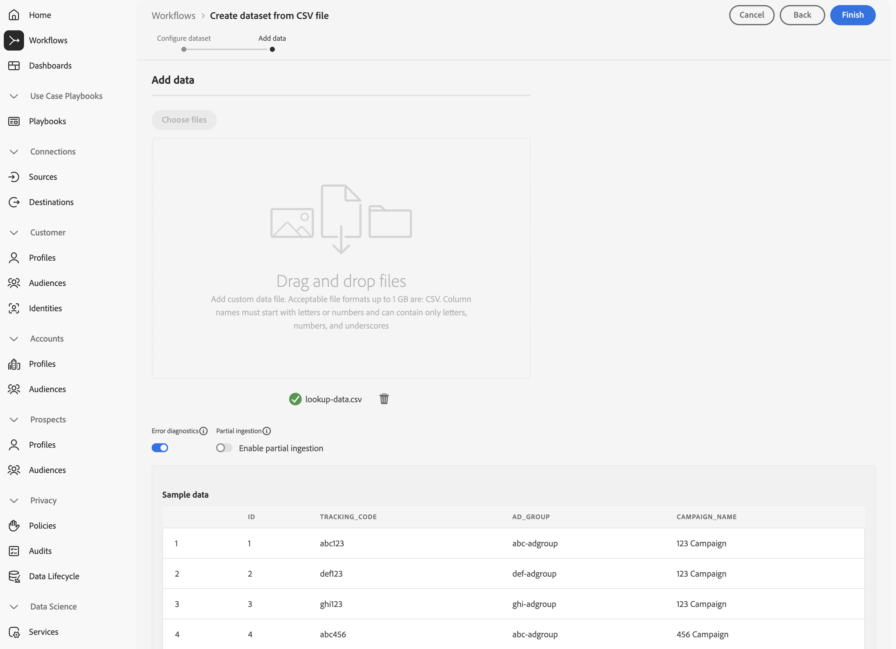
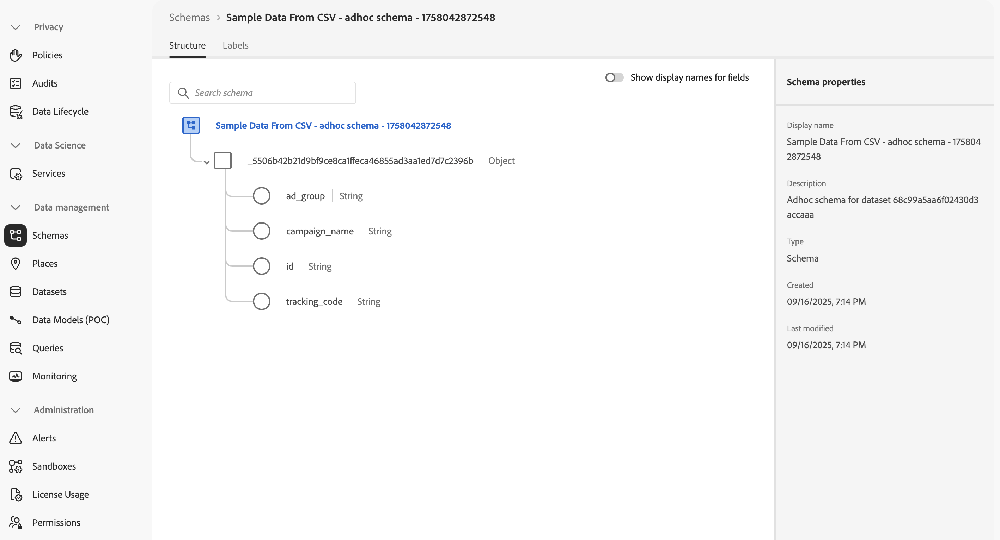

# 摄取和使用临时数据

本快速入门指南介绍如何将临时数据摄取到Experience Platform，然后在Customer Journey Analytics中使用该数据。

要完成此实施，您需要：

- **在Experience Platform中创建包含CSV文件的数据集**。 此工作流定义要收集的数据的模型（架构）以及收集数据（数据集）的位置。

- 在 Customer Journey Analytics 中&#x200B;**设置连接**。此连接应该（至少）包含您的Experience Platform临时数据集。

- **在Customer Journey Analytics中设置数据视图**，以根据您想要在Analysis Workspace中使用的临时数据的字段定义量度和维度。

- 在 Customer Journey Analytics 中&#x200B;**设置一个项目**&#x200B;以构建报告和可视化图表。

>[!NOTE]
>
>本快速入门指南是一份关于如何使用将临时数据摄取到Experience Platform并在Customer Journey Analytics中使用该临时数据的简化指南。 强烈建议参考时研究附加信息。

## 使用CSV文件创建数据集

对于此快速入门，您需要使用一个CSV文件，该文件表示查找数据并包含与下面显示的信息类似的信息。

| _id | tracking_code | ad_group | campaign_name |
| ---: | :---          | :---        | :---          |
| 1 | abc123 | abc-adgroup | 123营销活动 |
| 2 | def123 | def-adgroup | 123营销活动 |
| 3 | ghi123 | ghi-adgroup | 123营销活动 |
| 4 | abc456 | abc-adgroup | 456营销活动 |
| 5 | def456 | def-adgroup | 456营销活动 |

>[!NOTE]
>
>将临时数据集和架构用于基于记录的数据（查找、个人资料）。 临时数据集和架构不太适合，不应考虑用于时间序列（事件、摘要）数据。

您不需要为临时数据创建XDM架构。 Experience Platform支持的工作流基于CSV文件中的数据：

1. 自动创建临时架构。 该架构符合CSV文件的列。
1. 创建包含CSV文件数据的数据集。

要启动工作流，请执行以下操作：

1. 在Experience Platform界面的左边栏中，选择&#x200B;**[!UICONTROL 工作流]**。
1. 选择 **[!UICONTROL 从CSV文件创建数据集]**。
1. 从右窗格中选择&#x200B;**[!UICONTROL 启动项]**。
1. 在&#x200B;**[!UICONTROL 工作流]** > **[!UICONTROL 从CSV文件创建数据集]**&#x200B;向导中：
   1. 在&#x200B;**[!UICONTROL 配置数据集]**&#x200B;步骤中：
      1. 输入数据集的&#x200B;**[!UICONTROL 名称]**。 例如：`Sample Data From CSV`。
      1. 添加可选的&#x200B;**[!UICONTROL 描述]**。 例如：`Sample data from a CSV file`。
      1. 添加一个或多个可选的&#x200B;**[!UICONTROL 标记]**，或选择一个或多个现有的&#x200B;**[!UICONTROL 标记]**。

         

      1. 选择&#x200B;**[!UICONTROL 下一步]**。
   1. 在&#x200B;**[!UICONTROL 添加数据]**&#x200B;步骤中：
      1. 选择&#x200B;**[!UICONTROL 选择文件]**&#x200B;以从您的计算机或网络中选择CSV文件。 或者，将文件从计算机或网络上的位置拖放到&#x200B;**[!UICONTROL 拖放文件]**。 文件已上传，并显示&#x200B;**[!UICONTROL 示例数据]**。
      1. 根据您的偏好设置启用或禁用&#x200B;**[!UICONTROL 错误诊断]**&#x200B;和&#x200B;**[!UICONTROL 启用部分摄取]**。 当您&#x200B;**[!UICONTROL 启用部分摄取]**&#x200B;时，您可以定义&#x200B;**[!UICONTROL 错误阈值%]**。

         

      1. 选择&#x200B;**[!UICONTROL 完成]**。

成功准备并上传数据后，您将被重定向到Experience Platform界面中的&#x200B;**[!UICONTROL 数据集]**。 您从CSV **[!UICONTROL 数据集看到]**&#x200B;示例数据的&#x200B;**[!UICONTROL 数据集活动]**，状态为 **[!UICONTROL 正在处理]**。

要检查临时数据，请执行以下操作：

1. 在Experience Platform界面的左边栏中，选择&#x200B;**[!UICONTROL 数据集]**。
1. 在&#x200B;**[!UICONTROL 数据集]**&#x200B;中选择&#x200B;**[!UICONTROL 浏览]**&#x200B;选项卡。 您应该会看到数据集已列出。
1. 从&#x200B;**[!UICONTROL 架构]**&#x200B;列中选择架构的名称。 例如：**[!UICONTROL CSV示例数据……]**

   

1. 在弹出窗口中，选择&#x200B;**[!UICONTROL 架构名称]**。 例如：**[!UICONTROL CSV中的示例数据 — 临时架构 — XXXXXXXXXXX]**。 您将被重定向到&#x200B;**[!UICONTROL 架构]** > **[!UICONTROL 来自CSV的示例数据 — 临时架构 — XXXXXXXXXXX]**&#x200B;接口。

在&#x200B;**[!UICONTROL 架构]** > **[!UICONTROL 来自CSV的示例数据 — 临时架构 — XXXXXXXXXXX]**&#x200B;界面中：

- 在&#x200B;**[!UICONTROL 架构]** > **[!UICONTROL CSV示例数据 — 临时架构 — XXXXXXXXXXXXX]**&#x200B;下选择最顶层的租户名称对象，以显示该对象中的字段。 对象中的字段表示CSV文件的结构。 根据临时数据的上载自动创建架构。

  

  >[!NOTE]
  >
  >工作流将架构中所有字段的类型定义为字符串。 您无法在以后更改此类型。 如果您需要在临时架构的定义中拥有更大的灵活性，请考虑使用[使用API创建临时架构](https://experienceleague.adobe.com/zh-hans/docs/experience-platform/xdm/tutorials/ad-hoc)，然后使用[从架构创建数据集](https://experienceleague.adobe.com/zh-hans/docs/experience-platform/catalog/datasets/user-guide#schema)工作流。
  > 

## 设置连接

要在Customer Journey Analytics中使用Experience Platform数据集，请创建一个连接，其中包含由[工作流](#create-a-dataset-with-a-csv-file)生成的临时数据集

通过连接，您可以将来自Experience Platform的数据集集成到Workspace中。 要报告这些数据集，您必须首先在Experience Platform和Workspace中的数据集之间建立连接。

创建您的连接：

1. 在Customer Journey Analytics UI中，从顶部菜单中选择&#x200B;**[!UICONTROL 连接]** （可选）从&#x200B;**[!UICONTROL 数据管理]**。

1. 选择&#x200B;**[!UICONTROL 创建新连接]**。

1. 在&#x200B;**[!UICONTROL 无标题连接]**&#x200B;屏幕中：

   1. 在&#x200B;**[!UICONTROL 连接设置]**&#x200B;中命名并描述您的连接。

   1. 从&#x200B;**[!UICONTROL 数据设置]**&#x200B;中的&#x200B;**[!UICONTROL 沙盒]**&#x200B;列表中选择正确的沙盒，并从&#x200B;**[!UICONTROL 平均每日事件数]**&#x200B;列表中选定每日事件数。

      

   1. 选择&#x200B;**[!UICONTROL 添加数据集]**。

1. 在&#x200B;**[!UICONTROL 添加数据集]**&#x200B;的&#x200B;**[!UICONTROL 选择数据集]**&#x200B;步骤中：

   1. 选择您之前创建的数据集，例如&#x200B;**[!UICONTROL CSV示例数据]**，以及要包含在连接中的任何其他数据集。 临时数据集具有&#x200B;**[!UICONTROL 临时]** [!UICONTROL 数据集类型]。

      

   1. 选择&#x200B;**[!UICONTROL 下一步]**。

1. 在&#x200B;**[!UICONTROL 添加数据集]**&#x200B;的&#x200B;**[!UICONTROL 设置数据集]**&#x200B;步骤中：

   对于您的临时数据集：

   1. 选择临时数据集的类型。 例如： **[!UICONTROL 查找]**。
   1. 从临时架构中定义的可用键中选择&#x200B;**[!UICONTROL 键]**。
   1. 从已添加为连接一部分的事件数据集中选择&#x200B;**[!UICONTROL 匹配键]**。
   1. 从&#x200B;**[!UICONTROL 数据源类型]**&#x200B;列表中选择正确的数据源。如果指定&#x200B;**[!UICONTROL 其他]**，则为您的数据源添加描述。

   1. 根据您的首选项设置&#x200B;**[!UICONTROL 导入所有新数据]**&#x200B;和&#x200B;**[!UICONTROL 数据集回填现有数据]**。

      

   1. 选择&#x200B;**[!UICONTROL 添加数据集]**。

   1. 选择&#x200B;**[!UICONTROL 保存]**。

有关可用于临时数据集的设置的更多详细信息，请参阅[临时数据集设置](/help/connections/create-connection.md#adhoc-dataset)。

>[!IMPORTANT]
>
>除了不将临时数据集和架构用于时间序列数据的一般建议之外，您不能将&#x200B;**[!UICONTROL 从CSV创建数据集]**&#x200B;工作流用于时间序列数据。 此工作流将所有字段定义为字符串类型，您之后无法对其进行修改。 将基于时间序列的数据集（事件或摘要）添加到连接时，此类型的数据集需要定义至少一个日期时间类型的字段。 如果确实需要使用临时时间序列数据，请考虑使用[使用API创建临时架构](https://experienceleague.adobe.com/zh-hans/docs/experience-platform/xdm/tutorials/ad-hoc#token_type=bearer&expires_in=43197438)，然后使用[从架构创建数据集](https://experienceleague.adobe.com/zh-hans/docs/experience-platform/catalog/datasets/user-guide#schema)工作流。

创建[连接](/help/connections/overview.md)后，您可以执行各种管理任务，如[选择和组合数据集](/help/connections/combined-dataset.md)、[检查连接的数据集的状态以及数据摄取的状态](/help/connections/manage-connections.md)等等。

## 设置数据视图

数据视图是 Customer Journey Analytics 专属的容器，通过它，可决定如何解释来自连接的数据。 它指定所有可在 Analysis Workspace 中找到的维度和量度，以及这些维度和量度从哪些列获取其数据。为准备 Analysis Workspace 中的报告而定义数据视图。

创建您的数据视图：

1. 在Customer Journey Analytics UI中，从顶部菜单中选择&#x200B;**[!UICONTROL 数据视图]**（可选）从&#x200B;**[!UICONTROL 数据管理]**&#x200B;中选择。

1. 选择&#x200B;**[!UICONTROL 创建新数据视图]**。

1. 在&#x200B;**[!UICONTROL 配置]**&#x200B;步骤中：

   1. 从[连接](#set-up-a-connection)列表中选择您的&#x200B;**[!UICONTROL 连接]**。

   1. 名称并（可选）描述您的连接。

      

   1. 选择&#x200B;**[!UICONTROL 保存并继续]**。

1. 在&#x200B;**[!UICONTROL 组件]**&#x200B;步骤中：

   1. 将您要包含的任何架构字段和/或标准组件添加到&#x200B;**[!UICONTROL METRICS]**&#x200B;或&#x200B;**[!UICONTROL DIMENSIONS]**&#x200B;组件框中。 确保从包含临时数据的数据集中添加相关字段。 要访问这些字段，请执行以下操作：

      1. 选择&#x200B;**[!UICONTROL 事件数据集]**。
      1. 选择&#x200B;**[!UICONTROL 临时和基于模型的字段]**。

         

      1. 将临时架构中的字段拖放到&#x200B;**[!UICONTROL METRICS]**&#x200B;或&#x200B;**[!UICONTROL DIMENSIONS]**&#x200B;上。

   1. 或者，使用[派生字段](/help/data-views/derived-fields/derived-fields.md)将任意临时字段从其默认字符串类型和格式修改为其他类型或格式。

   1. 选择&#x200B;**[!UICONTROL 保存并继续]**。

1. 在&#x200B;**[!UICONTROL 设置]**&#x200B;步骤中：

   保持设置不变并选择&#x200B;**[!UICONTROL 保存并完成]**。

有关如何创建和编辑数据视图的更多信息，请参阅[数据视图概述](../data-views/data-views.md)。 以及在数据视图中使用哪些组件以及如何使用区段和会话设置。

## 设置项目

Analysis Workspace是一款灵活的浏览器工具，允许您快速构建分析并根据数据分享见解。 您可以使用工作区项目来组合数据组件、表和可视化，以制作分析并与组织中的任何人共享。

要创建您的项目：

1. 在Customer Journey Analytics UI中，从顶部菜单中选择&#x200B;**[!UICONTROL 项目]**。

1. 选择左侧导航中的&#x200B;**[!UICONTROL 项目]**。

1. 选择&#x200B;**[!UICONTROL 创建项目]**。

1. 选择&#x200B;**[!UICONTROL 空白项目]**。

1. 从列表中选择您的[数据视图](#set-up-a-data-view)。

1. 要创建您的第一个报告，请在[!UICONTROL 面板]的[!UICONTROL 自由格式表]上开始拖放维度和量度。 包括那些基于您的临时数据的量度或维度。

请参阅 [Analysis Workspace 概述](../analysis-workspace/home.md)，了解有关如何使用组件、可视化和面板创建项目和构建分析的更多信息。

>[!SUCCESS]
>
>您已完成所有步骤。您首先定义了要收集的临时数据（CSV文件）。 您使用该工作流从该CSV文件创建临时数据集和架构。 您在Customer Journey Analytics中定义了一个连接，以使用摄取的临时数据和其他数据。 您的数据视图定义允许您指定要使用的维度和量度，最后您创建了您的第一个项目来可视化和分析您的数据。
