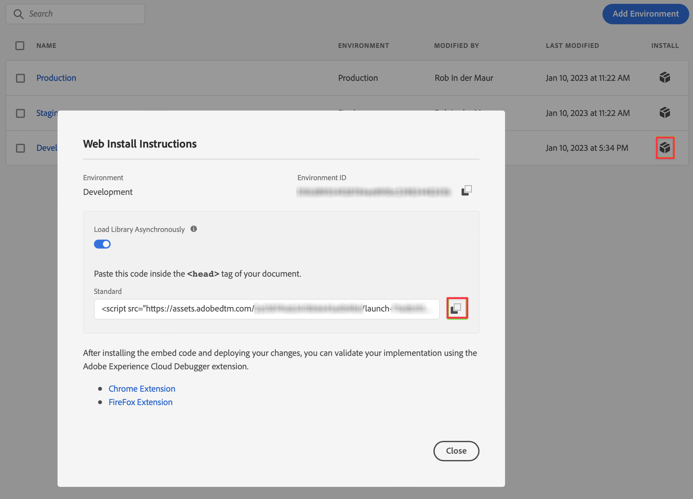
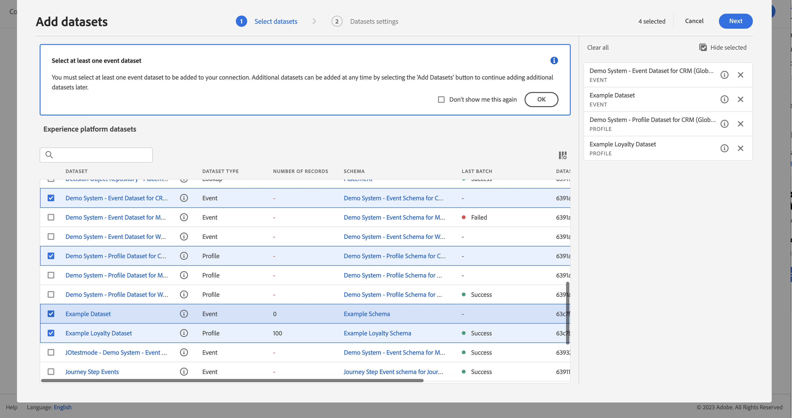

# 通过 Adobe Experience PlatformWeb SDK和 Edge Network 获取数据

本快速入门指南介绍了如何使用Adobe Experience Platform Web SDK和Edge Network将网站跟踪数据直接摄取到Adobe Experience Platform中，然后在Customer Journey Analytics中使用该数据。

要实现此目的，您需要：

- **设置架构和数据集** 在Adobe Experience Platform中，定义要收集的数据的模型（模式）以及实际收集数据（数据集）的位置。

- **设置数据流** 配置Adobe Experience Platform边缘网络，将收集的数据路由到您在Adobe Experience Platform中配置的数据集。

- **使用标记** 轻松地针对网站上数据层中的数据配置规则和数据元素。 然后，确保将数据发送到Adobe Experience Platform边缘网络上配置的数据流。

- **部署和验证**. 有一个可在其中进行标签迭代开发的环境，一旦所有内容都经过验证，就会将其实时发布到生产环境。

- **设置连接** Customer Journey Analytics。 此连接应（至少）包含您的Adobe Experience Platform数据集。

- **设置数据视图** Customer Journey Analytics中定义要在Analysis Workspace中使用的量度和维度。

- **设置项目** Customer Journey Analytics构建报表和可视化。

>[!NOTE]
>
>本指南是有关如何将从您的网站收集的数据摄取到Adobe Experience Platform并在Customer Journey Analytics中使用的简化指南。 强烈建议在提及时研究附加信息。


## 设置架构和数据集

要将数据引入Adobe Experience Platform，您首先需要定义要收集的数据。 摄取到Adobe Experience Platform的所有数据都必须符合标准的异常结构，以便下游功能和特性能够识别并处理这些数据。 体验数据模型(XDM)是以模式形式提供此结构的标准框架。

定义架构后，您可以使用一个或多个数据集来存储和管理数据收集。 数据集是用于数据集合的存储和管理结构，通常是表格，其中包含架构（列）和字段（行）。

摄取到Adobe Experience Platform的所有数据都必须符合预定义的架构，然后才能作为数据集进行持久保留。

### 设置架构

您希望跟踪来自访问您网站的用户档案的一些最低数据，例如页面名称、标识。
为此，您首先需要定义一个模型此数据的架构。

要设置架构，请执行以下操作：

1. 在Adobe Experience Platform UI的左边栏中，选择 **[!UICONTROL 模式]** within [!UICONTROL 数据管理].

2. 选择 **[!UICONTROL 创建架构]**. 选择 **[!UICONTROL XDM ExperienceEvent]** 列表。

   

   >[!INFO]
   >
   >    体验事件架构用于为 _行为_ （如页面查看、添加到购物车）。 单个用户档案架构用于对用户档案进行建模 _属性_ （如姓名、电子邮件、性别）。


3. 在 [!UICONTROL 无标题架构] 屏幕：

   1. 输入架构的显示名称和（可选）描述。

      

   2. 选择 **[!UICONTROL +添加]** in [!UICONTROL 字段组].

      

      字段组是对象和属性的可重用集合，允许您轻松扩展架构。

   3. 在 [!UICONTROL 添加字段组] 对话框，选择 **[!UICONTROL AEP Web SDK ExperienceEvent]** 字段组。

      

      您可以选择预览按钮，以查看属于此字段组的字段的预览，如 `web > webPageDetails > name`.

      

      选择 **[!UICONTROL 返回]** 来关闭预览。

   4. 选择 **[!UICONTROL 添加字段组]**.

4. 选择 **[!UICONTROL +]** 的架构名称旁边 [!UICONTROL 结构] 的上界。

   

5. 在 [!UICONTROL 字段属性] 面板，输入 `Identification` 作为名称， **[!UICONTROL 标识]** 作为 [!UICONTROL 显示名称]，选择 **[!UICONTROL 对象]** 作为 [!UICONTROL 类型] 选择 **[!UICONTROL ExperienceEvent Core v2.1]** 作为 [!UICONTROL 字段组].

   

   这会向架构中添加标识功能。 在您的用例中，您需要使用Experience CloudID和电子邮件地址来识别访问您网站的用户档案。 还有许多其他属性可用于跟踪访客的标识（例如客户ID、忠诚度ID）。

   选择 **[!UICONTROL 应用]** 将此对象添加到架构中。

6. 选择 **[!UICONTROL ecid]** 字段，然后选择 **[!UICONTROL 身份]** 和 **[!UICONTROL 主标识]** 和 **[!UICONTROL ECID]** 从 [!UICONTROL 身份命名空间] 列表。

   

   您将Experience Cloud标识指定为Adobe Experience Platform Identity服务可用来使用同一ECID组合（拼合）用户档案行为的主标识。

   选择 **[!UICONTROL 应用]**. 您会看到ecid属性中会显示一个指纹图标。

7. 选择 **[!UICONTROL 电子邮件]** 字段，然后选择 **[!UICONTROL 身份]** 和 **[!UICONTROL 电子邮件]** 从 [!UICONTROL 身份命名空间] 列表 [!UICONTROL 字段属性] 的上界。

   

   您将电子邮件地址指定为Adobe Experience Platform Identity服务可用于组合（拼合）用户档案行为的其他标识。

   选择 **[!UICONTROL 应用]**. 您会看到电子邮件属性中显示一个指纹图标。

   选择&#x200B;**[!UICONTROL 保存]**。

8. 选择显示架构名称的架构的根元素，然后选择 **[!UICONTROL 用户档案]** 切换。

   系统会提示您为用户档案启用架构。 启用后，当根据此架构将数据摄取到数据集时，该数据将合并到实时客户资料中。

   请参阅 [启用架构以在实时客户资料中使用](https://experienceleague.adobe.com/docs/experience-platform/xdm/tutorials/create-schema-ui.html?lang=en#profile) 以了解更多信息。

   >[!IMPORTANT]
   >
   >    保存为配置文件启用的架构后，便无法再为配置文件禁用该架构。

   

9. 选择 **[!UICONTROL 保存]** 以保存您的架构。

您已创建了一个最小架构，用于对可从您的网站捕获的数据进行建模。 该架构允许使用Experience Cloud身份和电子邮件地址来识别用户档案。 通过启用用户档案的架构，您可以确保将从您的网站捕获的数据添加到实时客户档案。

在行为数据旁边，您还可以从您的网站中捕获配置文件属性数据（例如，订阅新闻稿的用户档案详细信息）。

要捕获此用户档案数据，您需要：

- 创建基于XDM Indivial Profile类的架构。

- 将配置文件核心v2字段组添加到架构中。

- 添加基于“配置文件核心v2”字段组的标识对象。

- 将ecid定义为主标识符，将电子邮件定义为标识符。

- 为用户档案启用架构

请参阅 [在UI中创建和编辑架构](https://experienceleague.adobe.com/docs/experience-platform/xdm/ui/resources/schemas.html) 有关向架构添加和删除字段组和单个字段的详细信息。

### 设置数据集

使用您的架构，您定义了数据模型。 现在，您必须定义结构才能存储和管理该数据。 这可通过数据集完成。

要设置数据集，请执行以下操作：

1. 在Adobe Experience Platform UI的左边栏中，选择 **[!UICONTROL 数据集]** within [!UICONTROL 数据管理].

2. 选择 **[!UICONTROL 创建数据集]**.

   

3. 选择 **[!UICONTROL 从架构创建数据集]**.

   

4. 选择之前创建的架构，然后选择 **[!UICONTROL 下一个]**.

5. 命名数据集，并（可选）提供描述。

   

6. 选择 **[!UICONTROL 完成]**.

7. 选择 **[!UICONTROL 用户档案]** 切换。

   系统会提示您为配置文件启用数据集。 数据集在启用后，会通过其摄取的数据来丰富实时客户用户档案。

   >[!IMPORTANT]
   >
   >    仅当为配置文件启用架构（数据集所附的架构）时，才能为配置文件启用数据集。

   

请参阅 [数据集UI指南](https://experienceleague.adobe.com/docs/experience-platform/catalog/datasets/user-guide.html?lang=zh-Hans) 有关如何查看、预览、创建和删除数据集的更多信息。 以及如何为实时客户用户档案启用数据集。

## 设置数据流

数据流表示实施Adobe Experience Platform Web和移动SDK时的服务器端配置。 使用Adobe Experience Platform SDK收集数据时，数据会发送到Adobe Experience Platform边缘网络。 确定将数据转发到哪些服务的数据流。

在设置中，您希望将您从网站收集的数据发送到Adobe Experience Platform中的数据集。

要设置数据流，请执行以下操作：

1. 在Adobe Experience Platform UI中，选择 **[!UICONTROL 数据流]** 从 [!UICONTROL 数据收集] 中。

2. 选择 **[!UICONTROL 新数据流]**.

3. 命名并描述您的数据流。 从 [!UICONTROL 事件架构] 列表。

   

4. 选择&#x200B;**[!UICONTROL 保存]**。

5. 选择 **[!UICONTROL 添加服务]**.

6. 在 [!UICONTROL “添加服务”屏幕]:

   1. 选择 **[!UICONTROL Adobe Experience Platform]** 从 [!UICONTROL 服务] 列表。

   2. 确保 **[!UICONTROL 已启用]** 中。

   3. 从 [!UICONTROL 事件数据集] 列表。

      

   4. 保留其他设置并选择 **[!UICONTROL 保存]** 保存数据流。

您的数据流现已配置为将从您的网站收集的数据转发到Adobe Experience Platform中的数据集。

请参阅 [数据流概述](https://experienceleague.adobe.com/docs/experience-platform/edge/datastreams/overview.html?lang=zh-Hans) 有关如何配置数据流以及如何处理敏感数据的更多信息。


## 使用标记

使用Adobe Experience Platform中的标记功能在您的网站上实施代码，以实际收集数据。 这一款标记管理解决方案，可让您在满足其他标记要求的同时部署 代码。标记可使用Adobe Experience Platform Web SDK扩展与Adobe Experience Platform无缝集成。

### 创建标记

1. 在Adobe Experience Platform UI的左边栏中，选择 **[!UICONTROL 标记]** within [!UICONTROL 数据收集].

2. 选择 **[!UICONTROL 新建资产]**.

   命名标记，选择 **[!UICONTROL Web]** 并输入域名。 选择 **[!UICONTROL 保存]** 继续。

   

### 配置标记

创建标记后，您需要使用正确的扩展对其进行配置，并根据要跟踪网站并将数据发送到Adobe Experience Platform的方式配置数据元素和规则。

从 [!UICONTROL 标记属性] 打开它。


#### **扩展**

将Adobe平台Web SDK扩展添加到您的标记中，以确保您可以（通过数据流）将数据发送到Adobe Experience Platform。

要创建和配置Adobe Experience Platform Web SDK扩展，请执行以下操作：

1. 选择 **[!UICONTROL 扩展]** 中。

2. 选择 **[!UICONTROL 目录]** 中。

3. 搜索或滚动到Adobe Experience Platform Web SDK扩展，然后选择 **[!UICONTROL 安装]** 来安装它。

   

4. 为您的沙盒和之前创建的数据流选择 [!UICONTROL 生产环境] 和（可选） [!UICONTROL 暂存环境] 和 [!UICONTROL 开发环境].

   

   选择&#x200B;**[!UICONTROL 保存]**。

请参阅 [配置Adobe Experience Platform Web SDK扩展](https://experienceleague.adobe.com/docs/experience-platform/edge/extension/web-sdk-extension-configuration.html) 以了解更多信息。

您还希望设置Experience CloudID服务扩展，以便轻松使用Experience CloudID。 Experience CloudID服务可在所有Adobe Experience Cloud解决方案中标识访客。

要创建和配置Experience CloudID服务扩展，请执行以下操作：

1. 选择 **[!UICONTROL 扩展]** 中。

2. 选择 **[!UICONTROL 目录]** 中。

3. 搜索或滚动到Experience CloudID服务扩展，然后选择 **[!UICONTROL 安装]** 来安装它。

   

4. 将所有配置保留为默认配置。

5. 选择&#x200B;**[!UICONTROL 保存]**。

#### **数据元素**

数据元素是数据字典（或数据映射）的构建块。使用数据元素可跨市场营销和广告技术收集、组织和交付数据。您可以在标记中设置从数据层读取并可用于将数据交付到Adobe Experience Platform的数据元素。

数据元素的类型不同。 首先，设置一个数据元素以捕获访客在您的网站上查看的页面名称。

要定义页面名称数据元素，请执行以下操作：

1. 选择 **[!UICONTROL 数据元素]** 中。

2. 选择 **[!UICONTROL 添加数据元素]**.

3. 在 [!UICONTROL 创建数据元素] 对话框：

   - 例如，命名数据元素 `Page Name`.

   - 选择 **[!UICONTROL 核心]** 从 [!UICONTROL 扩展] 列表。

   - 选择 **[!UICONTROL 页面信息]** 从 [!UICONTROL 数据元素类型] 列表。

   - 选择 **[!UICONTROL 标题]** 从 [!UICONTROL 属性] 列表。

      

      或者，您也可以使用数据层变量中的值，例如 `pageName` 和 [!UICONTROL JavaScript变量] 用于定义数据元素的数据元素类型。

      

   - 选择&#x200B;**[!UICONTROL 保存]**。

现在，您需要设置一个数据元素，以引用由Adobe Experience Platform Web SDK自动提供的Experience CloudID，并且该ID可通过Experience CloudID服务扩展使用。

要定义ECID数据元素，请执行以下操作：

1. 选择 **[!UICONTROL 数据元素]** 中。

2. 选择 **[!UICONTROL 添加数据元素]**.

3. 在 [!UICONTROL 创建数据元素] 对话框：

   - 例如，命名数据元素 `ECID`.

   - 选择 **[!UICONTROL Experience CloudID服务]** 从 [!UICONTROL 扩展] 列表。

   - 选择 **[!UICONTROL ECID]** 从 [!UICONTROL 数据元素类型] 列表。

      

   - 选择&#x200B;**[!UICONTROL 保存]**。

最后，您现在希望将任何特定数据元素映射到之前定义的架构。 您可以定义另一个数据元素，以表示XDM架构。

要定义XDM对象数据元素，请执行以下操作：

1. 选择 **[!UICONTROL 数据元素]** 中。

2. 选择 **[!UICONTROL 添加数据元素]**.

3. 在 [!UICONTROL 创建数据元素] 对话框：

   - 例如，命名数据元素 `XDM - Page View`.

   - 选择 **[!UICONTROL Adobe Experience Platform Web SDK]** 从 [!UICONTROL 扩展] 列表。

   - 选择 **[!UICONTROL XDM对象]** 从 [!UICONTROL 数据元素类型] 列表。

   - 从 [!UICONTROL 沙盒] 列表。

   - 从 [!UICONTROL 架构] 列表。

   - 映射 `identification > core > ecid` 属性（在架构中定义）添加到ECID数据元素。 选择柱体图标，可轻松地从数据元素列表中选取ECID数据元素。

      

      


   - 映射 `web > webPageDetails > name` 属性（在架构中定义）添加到Page Name数据元素。

      

   - 选择&#x200B;**[!UICONTROL 保存]**。


#### **规则**

Adobe Experience Platform中的标记遵循基于规则的系统。 他们查找用户交互和关联的数据。 如果满足您的规则中所列的标准，则规则会触发您已识别的扩展、脚本或客户端代码。您可以使用规则通过Adobe Experience Platform Web SDK扩展将数据（如XDM对象）发送到Adobe Experience Platform。

定义规则：

1. 选择 **[!UICONTROL 规则]** 中。

2. 选择 **[!UICONTROL 创建新规则]**.

3. 在 [!UICONTROL 创建规则] 对话框：

   - 例如，命名规则 `Page View`.

   - 选择 **[!UICONTROL +添加]** 在 [!UICONTROL 事件].

   - 在 [!UICONTROL 事件配置] 对话框：

      - 选择 **[!UICONTROL 核心]** 从 [!UICONTROL 扩展] 列表。

      - 选择 **[!UICONTROL Window Loaded]** 从 [!UICONTROL 事件类型] 列表。

         

      - 选择 **[!UICONTROL 保留更改]**.
   - 选择 **[!UICONTROL +添加]** 在 [!UICONTROL 操作].

   - 在 [!UICONTROL 操作配置] 对话框：

      - 选择 **[!UICONTROL Adobe Experience Platform Web SDK]** 从 [!UICONTROL 扩展] 列表。

      - 选择 **[!UICONTROL 发送事件]** 从 [!UICONTROL 操作类型] 列表。

      - 选择 **[!UICONTROL web.webpagedetails.pageViews]** 从 [!UICONTROL 类型] 列表。

      - 选择旁边的圆柱图标  [!UICONTROL XDM数据] 和选择 **[!UICONTROL XDM — 页面查看]** 从数据元素列表中。

         

      - 选择 **[!UICONTROL 保留更改]**.
   - 您的规则应当类似于：

      

   - 选择&#x200B;**[!UICONTROL 保存]**。


这只是定义一个规则的示例，该规则会将包含来自其他数据元素的值的XDM数据发送到Adobe Experience Platform。

您可以在标记中以各种方式使用规则来处理变量（使用数据元素）。

请参阅 [规则](https://experienceleague.adobe.com/docs/experience-platform/tags/ui/rules.html?lang=zh-Hans) 以了解更多信息。

### 构建和发布标记

定义数据元素和规则后，您需要构建并发布标记。 创建库内部版本时，必须将其分配给环境。 然后，将会编译该内部版本的扩展、规则和数据元素，并将这些内容放入分配的环境。每个环境都提供了一个唯一的嵌入代码，从而允许您将其分配的内部版本集成到网站中。

要构建和发布标记，请执行以下操作：

1. 选择 **[!UICONTROL 发布流程]** 从左边栏。

2. 选择 **[!UICONTROL 选择工作库]**，后跟 **[!UICONTROL 添加库……]**.

3. 在 [!UICONTROL 创建库] 对话框：

   - 命名库。

   - 选择 **[!UICONTROL 发展（发展）]** 从 [!UICONTROL 环境] 列表。

   - 选择 **[!UICONTROL +添加所有已更改的资源]**.

      

   - 选择 **[!UICONTROL 保存并构建到开发环境]**.

   这会保存并构建用于开发环境的标记。 绿色圆点表示已在开发环境中成功生成标记。

4. 您可以选择 **[!UICONTROL ...]** 重建库或将库移动到暂存或生产环境。

   

Adobe Experience Platform标记支持简单到复杂的发布工作流程，这些工作流程应适应您部署Adobe Experience Platform Web SDK。

请参阅 [发布概述](https://experienceleague.adobe.com/docs/experience-platform/tags/publish/overview.html) 以了解更多信息。


### 检索您的标记代码

最后，您需要在要跟踪的网站上安装标记。 这意味着将代码置于网站模板的标题标记中。

要获取引用您的标记的代码，请执行以下操作：

1. 选择 **[!UICONTROL 环境]** 中。

2. 从环境列表中，选择正确的安装（框）按钮。

   在 [!UICONTROL Web安装说明] 对话框中，选择脚本代码旁边的“复制”按钮，该按钮应如下所示：

   ```javascript
   <script src="https://assets.adobedtm.com/2a518741ab24/.../launch-...-development.min.js" async></script>
   ```

   

3. 选择 **[!UICONTROL 关闭]**.

您可以根据部署Adobe Experience Platform Web SDK的过程中的位置，选择其他环境（暂存、生产），而不是开发环境的代码。

请参阅 [环境](https://experienceleague.adobe.com/docs/experience-platform/tags/publish/environments/environments.html?) 以了解更多信息。

## 部署和验证

现在，您可以在网站的开发版本上的 `<head>` 标记。 部署后，您的网站会开始收集数据到Adobe Experience Platform。

验证您的实施，在必要时进行更正，并在正确后，使用“标记”的发布工作流程功能将其部署到暂存和生产环境。

## 设置连接

要在Customer Journey Analytics中使用Adobe Experience Platform数据，请创建一个连接，其中包含设置架构、数据集和工作流后生成的数据。

通过创建连接，您可以将 Adobe Experience Platform 中的数据集集成到工作区中。要报告这些数据集，您必须首先在Adobe Experience Platform和工作区中的数据集之间建立连接。

要创建连接，请执行以下操作：

1. 在Customer Journey AnalyticsUI中，选择 **[!UICONTROL 连接]** 中。

2. 选择 **[!UICONTROL 创建新连接]**.

3. 在 [!UICONTROL 无标题连接] 屏幕：

   在中命名并描述您的连接 [!UICONTROL 连接设置].

   从 [!UICONTROL 沙盒] 列表 [!UICONTROL 数据设置] 并从 [!UICONTROL 平均每日事件数] 列表。

   

   选择 **[!UICONTROL 添加数据集]**.

   在 [!UICONTROL 选择数据集] 步骤 [!UICONTROL 添加数据集]:

   - 选择您之前创建的数据集(`Example dataset`)以及要包含在连接中的任何其他数据集。

      

   - 选择&#x200B;**[!UICONTROL 下一步]**。
   在 [!UICONTROL 数据集设置] 步骤 [!UICONTROL 添加数据集]:

   - 对于每个数据集：

      - 选择 [!UICONTROL 人员ID] 从Adobe Experience Platform的数据集架构中定义的可用标识。

      - 从 [!UICONTROL 数据源类型] 列表。 如果您指定 **[!UICONTROL 其他]**，然后为数据源添加描述。

      - 已设置 **[!UICONTROL 导入所有新数据]** 和 **[!UICONTROL 数据集回填现有数据]** 根据您的喜好。

      

   - 选择 **[!UICONTROL 添加数据集]**.
   选择&#x200B;**[!UICONTROL 保存]**。

请参阅 [连接概述](../connections/overview.md) 有关如何创建和管理连接以及如何选择和合并数据集的更多信息。

## 设置数据视图

数据视图 是 Customer Journey Analytics 专属的容器，通过它，可决定如何解释来自连接的数据。 它指定所有可在 Analysis Workspace 中找到的维度和指标，以及这些维度和指标从哪些列获取其数据。为准备 Analysis Workspace 中的报表而定义数据视图。

要创建数据视图，请执行以下操作：

1. 在Customer Journey AnalyticsUI中，选择 **[!UICONTROL 数据视图]** 中。

2. 选择 **[!UICONTROL 创建新数据视图]**.

3. 在 [!UICONTROL 配置] 步骤：

   从 [!UICONTROL 连接] 列表。

   名称和（可选）描述您的连接。

   

   选择 **[!UICONTROL 保存并继续]**.

4. 在 [!UICONTROL 组件] 步骤：

   将您要包含的任何架构字段和/或标准组件添加到 [!UICONTROL 量度] 或 [!UICONTROL Dimension] 组件框。

   

   选择 **[!UICONTROL 保存并继续]**.

5. 在 [!UICONTROL 设置] 步骤：

   

   保留设置原样，然后选择 **[!UICONTROL 保存并完成]**.

请参阅 [数据视图概述](../data-views/data-views.md) 有关如何创建和编辑数据视图的更多信息，可在数据视图中使用哪些组件，以及如何使用过滤器和会话设置。


## 设置项目

Analysis Workspace是一个灵活的浏览器工具，允许您快速构建分析并根据数据共享分析。 您可以使用工作区项目来组合数据组件、表格和可视化图表，以便进行分析并与组织中的任何人共享。

要创建项目，请执行以下操作：

1. 在Customer Journey AnalyticsUI中，选择 **[!UICONTROL 项目]** 中。

2. 选择 **[!UICONTROL 项目]** 中。

3. 选择 **[!UICONTROL 创建项目]**.

   

   选择 **[!UICONTROL 空白项目]**.

   

4. 从列表中选择数据视图。

   .

5. 开始在 [!UICONTROL 自由格式表] 在 [!UICONTROL 面板] 以创建您的第一个报表。 例如，拖动 `Program Points Balance` 和 `Page View` 作为量度和 `email` 作为维度，可快速查看访问过您的网站且属于收集会员积分的忠诚度计划一部分的用户档案。

   

请参阅 [Analysis Workspace概述](../analysis-workspace/home.md) 有关如何使用组件、可视化图表和面板创建项目和构建分析的更多信息。

>[!SUCCESS]
>
>您已完成所有步骤。 首先，定义要收集的数据（架构）以及将其存储在Adobe Experience Platform中的位置（数据集），然后在边缘网络上配置了一个数据流，以确保可将数据转发到该数据集。 然后，您定义并部署了您的标记，其中包含扩展(Adobe Experience Platform Web SDK、Experience CloudID服务)、数据元素和规则，以从您的网站中捕获数据并将该数据发送到您的数据流。 您在Customer Journey Analytics中定义了一个连接，以使用网站跟踪数据和其他数据。 通过数据视图定义，您可以指定要使用的维度和量度，最后创建了您的第一个项目，并对数据进行可视化和分析。
