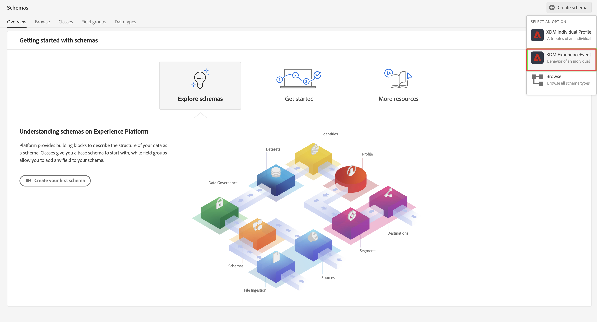
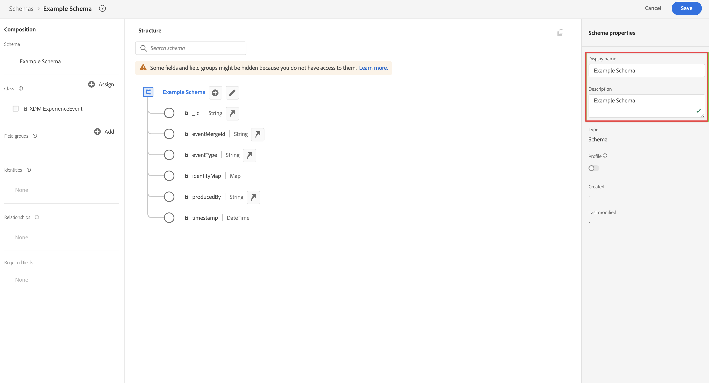
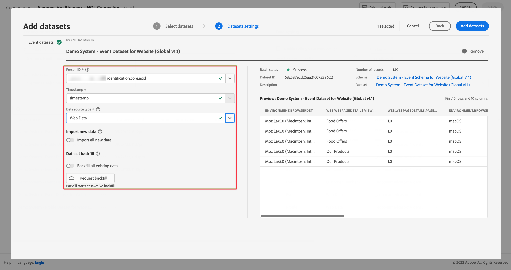
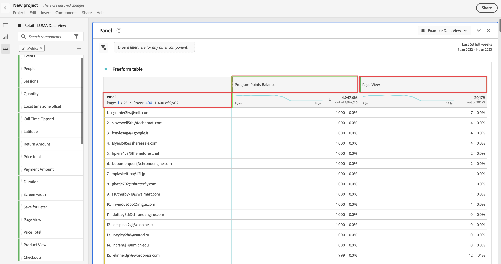

# 通过 Adobe Experience Platform Web SDK 和 Edge Network 获取数据

本快速入门指南介绍了如何使用 Adobe Experience Platform Web SDK 和 Edge Network 将网站跟踪数据直接引入 Adobe Experience Platform，然后在 Customer Journey Analytics 中使用该数据。

要完成此实施，您需要：

- 在 Adobe Experience Platform 中&#x200B;**设置模式和数据集** ，以定义要收集的数据的模型（模式）以及实际收集数据的位置（数据集）。

- **设置数据流** 以配置 Adobe Experience Platform Edge Network，将您收集的数据路由到您在 Adobe Experience Platform 中配置的数据集。

- **使用标签** 可以根据网站数据层中的数据轻松配置规则和数据元素。然后确保数据发送到在 Adobe Experience Platform Edge Network 上配置的数据流。

- **部署和验证**。拥有一个可以迭代标签开发的环境，一旦所有内容都经过验证，就可以在您的生产环境中实时发布。

- 在 Customer Journey Analytics 中&#x200B;**设置连接**。此连接应（至少）包含 Adobe Experience Platform 数据集。

- 在 Customer Journey Analytics 中&#x200B;**设置数据视图**&#x200B;以定义要在 Analysis Workspace 中使用的量度和维度。

- 在 Customer Journey Analytics 中&#x200B;**设置一个项目**&#x200B;以构建报告和可视化图表。

>[!NOTE]
>
>这是一份关于如何将从您的站点收集的数据提取到 Adobe Experience Platform 并在 Customer Journey Analytics 中使用的简化指南。强烈建议参考时研究附加信息。


## 设置模式和数据集

要将数据导入 Adobe Experience Platform，首先需要定义要收集的数据。引入 Adobe Experience Platform 的所有数据都必须符合标准的非规范化结构，以便下游功能和特性对其进行识别和操作。体验数据模型 (XDM) 是以模式形式提供此结构的标准框架。

定义模式后，您可以使用一个或多个数据集来存储和管理数据集合。数据集是用于数据集合的存储和管理结构，通常是表格，其中包含模式（列）和字段（行）。

摄取到 Adobe Experience Platform 中的所有数据都必须符合预定义的模式，然后才能作为数据集保存。

### 设置模式

您希望从访问您网站的配置文件中跟踪一些最小数据，例如页面名称、标识。
为此，首先需要定义一个模型化该数据的模式。

设置您的模式：

1. 在 Adobe Experience Platform UI 的左边栏中，选择[!UICONTROL 数据管理]中的&#x200B;**[!UICONTROL 模式]**。

2. 选择&#x200B;**[!UICONTROL “创建模式”]**。从选项列表中选择 **[!UICONTROL XDM ExperienceEvent]**。

   

   >[!INFO]
   >
   >    Experience Event 模式用于对配置文件的&#x200B;_行为_&#x200B;建模（如页面查看、添加到购物车）。个人配置档案模式用于对个人配置档案&#x200B;_属性_（如姓名、电子邮件、性别）建模。


3. 在[!UICONTROL 无标题模式]屏幕中：

   1. 输入模式的显示名称和（可选）描述。

      

   2. 在[!UICONTROL 字段组]中选择&#x200B;**[!UICONTROL + 添加]**。

      

      字段组是可重用的对象和属性集合，可让您轻松扩展模式。

   3. 在[!UICONTROL 添加字段组]对话框中，从列表中选择 **[!UICONTROL AEP Web SDK ExperienceEvent]** 字段组。

      

      您可以选择预览按钮，以查看属于该字段组的字段的预览，例如 `web > webPageDetails > name`。

      

      选择&#x200B;**[!UICONTROL 返回]**&#x200B;关闭预览。

   4. 选择&#x200B;**[!UICONTROL 添加字段组]**。

4. 在[!UICONTROL 结构]面板中选择模式名称旁边的 **[!UICONTROL +]**。

   

5. 在 [!UICONTROL  字段属性 ] 面板中，输入 `Identification`作为名称，**[!UICONTROL Identification]** 作为 [!UICONTROL Display name]，选择 **[!UICONTROL Object]** 作为 [!UICONTROL Type] 和选择 **[!UICONTROL ExperienceEvent Core v2.1]** 作为 [!UICONTROL Field Group]。

   

   这会为您的模式添加识别功能。在您的情况下，您希望使用 Experience Cloud Id 和电子邮件地址来识别访问您站点的配置文件。有许多其他属性可用于跟踪您的人员标识（例如客户ID、忠诚度ID）。

   选择&#x200B;**[!UICONTROL 应用]**&#x200B;将此对象添加到您的模式中。

6. 选择刚刚添加的标识对象中的&#x200B;**[!UICONTROL ecid]**&#x200B;字段，选择&#x200B;**[!UICONTROL 标识]**&#x200B;和&#x200B;**[!UICONTROL 主要标识]** 和 **[!UICONTROL ECID]** 来自右侧面板中的 [!UICONTROL 标识命名空间] 列表。

   

   您将 Experience Cloud Identity 指定为 Adobe Experience Platform Identity 服务可用于组合（缝合）具有相同 ECID 的配置文件行为的主要身份。

   选择 **[!UICONTROL 应用]**。您会看到 ecid 属性中出现指纹图标。

7. 选择刚刚添加的标识对象中的&#x200B;**[!UICONTROL 邮件]**&#x200B;字段，选择&#x200B;**[!UICONTROL 标识]**&#x200B;和&#x200B;**[!UICONTROL 邮件]** 和 [!UICONTROL 标识命名空间] 列表中的 [!UICONTROL 字段属性] 面板。

    

   您将电子邮件地址指定为 Adobe Experience Platform Identity 服务可用于组合（拼接）配置文件行为的另一个标识。

   选择 **[!UICONTROL 应用]**。您会看到电子邮件属性中显示指纹图标。

   选择&#x200B;**[!UICONTROL 保存]**。

8. 选择显示模式名称的模式的根元素，然后选择 **[!UICONTROL 配置文件]** 开关。

   系统会提示您启用配置文件的模式。一旦启用，当数据被引入基于此模式的数据集中时，该数据将合并到实时客户配置文件。

   有关详细信息，请参阅[启用模式以在实时客户配置文件中使用](https://experienceleague.adobe.com/docs/experience-platform/xdm/tutorials/create-schema-ui.html?lang=zh-Hans#profile)。

   >[!IMPORTANT]
   >
   >    一旦您保存了为配置文件启用的模式，就不能再为配置文件禁用它。

   

9. 选择&#x200B;**[!UICONTROL 保存]**&#x200B;以保存模式。

您已经创建了一个最小模式，用于对您可以从您的网站捕获的数据进行建模。该模式允许使用 Experience Cloud Identity 和电子邮件地址来识别配置文件。通过启用配置文件模式，您可以确保从您的网站捕获的数据被添加到实时客户配置文件中。

除了行为数据之外，您还可以从您的站点捕获配置文件属性数据（例如订阅时事通讯的配置文件的详细信息）。

要捕获此配置文件数据，您需要：

- 基于 XDM 个人配置文件类创建模式。

- 将 Profile Core v2 字段组添加到模式中。

- 添加基于 Profile Core v2 字段组的标识对象。

- 将 ecid 定义为主要标识符，将电子邮件定义为标识符。

- 为配置文件启用模式

请参阅[在 UI 中创建和编辑模式](https://experienceleague.adobe.com/docs/experience-platform/xdm/ui/resources/schemas.html)，了解有关向模式添加和删除字段组和单个字段的更多信息。

### 设置数据集

使用您的模式，您已经定义了数据模型。您现在必须定义结构来存储和管理该数据。这是通过数据集完成的。

设置您的数据集

1. 在 Adobe Experience Platform UI 的左边栏中，选择[!UICONTROL 数据管理]中的&#x200B;**[!UICONTROL 数据集]**。

2. 选择&#x200B;**[!UICONTROL 创建数据集]**。

   

3. 选择&#x200B;**[!UICONTROL 使用模式创建数据集]**。

   。

4. 选择您之前创建的模式，然后选择 **[!UICONTROL 下一个]**。

5. 为您的数据集命名并（可选）提供描述。

   

6. 选择&#x200B;**[!UICONTROL 完成]**。

7. 选择&#x200B;**[!UICONTROL 配置文件]**&#x200B;开关

   系统会提示您启用配置文件的数据集。启用后，数据集会使用其摄取的数据丰富实时客户配置文件。

   >[!IMPORTANT]
   >
   >    只有当数据集所依附的模式也为配置文件启用时，您才能为配置文件启用数据集。

   

有关如何查看、预览、创建和删除数据集的更多信息，请参阅[数据集 UI 指南](https://experienceleague.adobe.com/docs/experience-platform/catalog/datasets/user-guide.html?lang=zh-Hans)。以及如何为实时客户配置文件启用数据集。

## 设置数据流

数据流表示实施 Adobe Experience Platform Web 和移动 SDK 时的服务器端配置。使用 Adobe Experience Platform SDK 收集数据时，数据会发送到 Adobe Experience Platform Edge Network。数据流决定将数据转发到哪些服务。

在您的设置中，您希望将从网站收集的数据发送到 Adobe Experience Platform 中的数据集。

设置您的数据流

1. 在 Adobe Experience Platform UI 的左边栏中，选择 [!UICONTROL 数据收藏集] 中的 **[!UICONTROL 数据流]**。

2. 选择&#x200B;**[!UICONTROL 新数据流]**。

3. 命名并描述您的数据流。从 [!UICONTROL 事件模式] 列表中选择您的模式。

   

4. 选择&#x200B;**[!UICONTROL 保存]**。

5. 选择 **[!UICONTROL 添加服务]**。

6. 在 [!UICONTROL 添加服务屏幕]：

   1. 从 [!UICONTROL 服务] 列表中选择 **[!UICONTROL Adobe Experience Platform]**。

   2. 确保选择 **[!UICONTROL Enabled]**。

   3. 从 [!UICONTROL 事件数据集] 列表中选择您的数据集。

      

   4. 保留其他设置并选择 **[!UICONTROL 保存]** 以保存数据流。

您的数据流现已配置为将从您的网站收集的数据转发到 Adobe Experience Platform 中的数据集。

有关如何配置数据流和如何处理敏感数据的更多信息，请参阅[数据流概述](https://experienceleague.adobe.com/docs/experience-platform/edge/datastreams/overview.html?lang=zh-Hans)。


## 使用标签

使用 Adobe Experience Platform 中的标签功能在您的网站上实现代码，以实际收集数据。这一款标记管理解决方案，可让您在满足其他标记要求的同时部署代码。标签使用 Adobe Experience Platform Web SDK 扩展提供与 Adobe Experience Platform 的无缝集成。

### 创建您的标记

1. 在 Adobe Experience Platform UI 的左边栏中，选择 [!UICONTROL 数据收藏集] 中的 **[!UICONTROL 标签]**。

2. 选择&#x200B;**[!UICONTROL 新属性]**。

   为标签命名，选择 **[!UICONTROL Web]** 并输入域名。选择&#x200B;**[!UICONTROL 保存]**&#x200B;继续。

   

### 配置您的标签

创建标签后，您需要使用正确的扩展名对其进行配置，并根据您希望如何跟踪站点并将数据发送到 Adobe Experience Platform 配置数据元素和规则。

从 [!UICONTROL 标签属性] 列表中选择您新创建的标签以将其打开。


#### **扩展**

将 Adobe Platform Web SDK 扩展添加到您的标签，以确保您可以将数据发送到 Adobe Experience Platform（通过您的数据流）。

创建并配置 Adobe Experience Platform Web SDK。

1. 选择左边栏中的&#x200B;**[!UICONTROL 扩展]**。

2. 在顶部栏中选择 **[!UICONTROL 目录]**。

3. 搜索或滚动到 Adobe Experience Platform Web SDK 扩展，然后选择 **[!UICONTROL 安装]** 进行安装。

   

4. 选择您的沙盒和您之前为您的[!UICONTROL 生产环境]和（可选）[!UICONTROL 暂存环境]和[!UICONTROL 创建的数据流开发环境]。

   

   选择&#x200B;**[!UICONTROL 保存]**。

有关详细信息，请参阅[配置 Adobe Experience Platform Web SDK 扩展](https://experienceleague.adobe.com/docs/experience-platform/edge/extension/web-sdk-extension-configuration.html)。

您还希望设置 Experience Cloud ID 服务扩展，以便您可以轻松使用 Experience Cloud ID。Experience CloudID服务可识别所有Adobe Experience Cloud解决方案中的人员。

要创建和配置 Experience Cloud ID 服务扩展：

1. 选择左边栏中的&#x200B;**[!UICONTROL 扩展]**。

2. 在顶部栏中选择 **[!UICONTROL 目录]** 。

3. 搜索或滚动到 Experience Cloud ID 服务扩展，然后选择&#x200B;**[!UICONTROL 安装]** 进行安装。

   

4. 将所有配置保留为默认值。

5. 选择&#x200B;**[!UICONTROL 保存]**。

#### **数据元素**

数据元素是数据词典（或数据映射）的构建块。使用数据元素可跨市场营销和广告技术收集、组织和交付数据。您可以在标记中设置从数据层读取的数据元素，并可用于将数据传送到 Adobe Experience Platform。

有不同类型的数据元素。您首先设置一个数据元素来捕获用户在您的网站上查看的页面名称。

定义页面名称数据元素：

1. 选择左边栏中的&#x200B;**[!UICONTROL 数据元素]**。

2. 选择&#x200B;**[!UICONTROL 添加数据元素]**。

3. 在[!UICONTROL 创建数据元素]对话框中：

   - 为数据元素命名，例如，`Page Name`。

   - 从[!UICONTROL 扩展]列表中选择&#x200B;**[!UICONTROL 核心]** 

   - 从 [!UICONTROL 数据元素类型]列表中选择&#x200B;**[!UICONTROL 页面信息]**。

   - 从[!UICONTROL 属性] 列表中选择&#x200B;**[!UICONTROL 标题]** 

     

     或者您可以使用数据层变量中的值，例如 `pageName` 和 [!UICONTROL JavaScript 变量]数据元素类型来定义数据元素。

     

   - 选择&#x200B;**[!UICONTROL 保存]**。

您现在想要设置一个引用 Experience Cloud ID 的数据元素，该 ID 由 Adobe Experience Platform Web SDK 自动提供，可通过 Experience Cloud ID 服务扩展使用。

要定义 ECID 数据元素：

1. 选择左边栏中的&#x200B;**[!UICONTROL 数据元素]**。

2. 选择&#x200B;**[!UICONTROL 添加数据元素]**。

3. 在[!UICONTROL 创建数据元素]对话框中：

   - 为数据元素命名，例如，`ECID`。

   - 从[!UICONTROL 扩展] 列表中选择 **[!UICONTROL Experience Cloud ID 服务]**。

   - 从 [!UICONTROL 数据元素类型]列表中选择&#x200B;**[!UICONTROL ECID]**。

     

   - 选择&#x200B;**[!UICONTROL 保存]**。

最后，您现在希望将任何特定的数据元素映射到先前定义的模式。您可以定义另一个数据元素，它提供 XDM 模式的表示。

要定义 XDM 对象数据元素：

1. 选择左边栏中的&#x200B;**[!UICONTROL 数据元素]**。

2. 选择&#x200B;**[!UICONTROL 添加数据元素]**。

3. 在[!UICONTROL 创建数据元素]对话框中：

   - 为数据元素命名，例如，`XDM - Page View`。

   - 从 [!UICONTROL 扩展]列表中选择&#x200B;**[!UICONTROL Adobe Experience Platform Web SDK]**。

   - 从[!UICONTROL 数据元素类型]列表中选择 **[!UICONTROL XDM 对象]**。

   - 从您的[!UICONTROL 沙盒]列表中选择沙盒。

   - 从您的[!UICONTROL 模式]列表中选择模式。

   - 将模式中定义的 `identification > core > ecid` 属性映射到 ECID 数据元素。选择圆柱体图标可以轻松地从数据元素列表中拾取 ECID 数据元素。

     

     


   - 将模式中定义的`web > webPageDetails > name` 属性映射到页面名称数据元素。

     

   - 选择&#x200B;**[!UICONTROL 保存]**。


#### **规则**

Adobe Experience Platform 中的标签遵循基于规则的系统。他们寻找用户交互和相关数据。如果满足您的规则中所列的标准，则规则会触发您已识别的扩展、脚本或客户端代码。您可以使用规则使用 Adobe Experience Platform Web SDK 扩展将数据（如 XDM 对象）发送到 Adobe Experience Platform。

去定义规则

1. 选择左边栏中的&#x200B;**[!UICONTROL 规则]**。

2. 选择&#x200B;**[!UICONTROL 创建新规则]**。

3. 在[!UICONTROL 创建规则]对话框中：

   - 命名规则，例如`Page View`。

   - 选择并在[!UICONTROL 事件]下方 **[!UICONTROL +添加]** 

   - 在[!UICONTROL 事件配置]对话框中：

      - 从[!UICONTROL 扩展]列表中选择&#x200B;**[!UICONTROL 核心]** 

      - 从[!UICONTROL 事件类型] 列表中选择&#x200B;**[!UICONTROL 加载的窗口]** 

        

      - 选择&#x200B;**[!UICONTROL 保留更改]**。


   - 选择并在[!UICONTROL 操作]下方 **[!UICONTROL +添加]** 

   - 在[!UICONTROL 操作配置]对话框中：

      - 从 [!UICONTROL 扩展]列表中选择&#x200B;**[!UICONTROL Adobe Experience Platform Web SDK]**。

      - 从[!UICONTROL 操作类型] 列表中选择&#x200B;**[!UICONTROL 发送事件]** 

      - 从 [!UICONTROL 类型]列表中选择&#x200B;**[!UICONTROL web.webpagedetails.pageViews]**。

      - 选择[!UICONTROL  XDM 数据]旁边的圆柱体图标，然后从数据元素列表中选择&#x200B;**[!UICONTROL XDM - 页面视图]**。

        

      - 选择&#x200B;**[!UICONTROL 保留更改]**。

   - 您的规则应如下所示：

     

   - 选择&#x200B;**[!UICONTROL 保存]**。

这只是一个定义规则的示例，该规则将包含来自其他数据元素的值的 XDM 数据发送到 Adobe Experience Platform。

您可以在标记中以各种方式使用规则来操作变量（使用数据元素）。

有关详细信息，请参阅[规则](https://experienceleague.adobe.com/docs/experience-platform/tags/ui/rules.html?lang=zh-Hans)。

### 生成并发布标签

在定义了数据元素和规则之后，您需要构建和发布标签。创建库生成时，必须将其分配给环境。然后，将会编译该内部版本的扩展、规则和数据元素，并将这些内容放入分配的环境。每个环境都提供了一个唯一的嵌入代码，从而允许您将其分配的内部版本集成到网站中。

要生成并发布您的标签：

1. 从左边栏中选择&#x200B;**[!UICONTROL 发布流]**。

2. 选择 **[!UICONTROL 选择工作库]**，然后选择&#x200B;**[!UICONTROL 添加库…]**。

3. 在[!UICONTROL 创建库]对话框中：

   - 命名库。

   - 选择&#x200B;**[!UICONTROL 开发（开发）]**  [!UICONTROL 环境] 列表。

   - 选择&#x200B;**[!UICONTROL + 添加所有更改的资源]**。

     

   - 选择&#x200B;**[!UICONTROL 保存并生成到开发]**。

   这将为您的开发环境保存并构建标记。绿色圆点表示在开发环境中成功构建了标记。

4. 您可以选择&#x200B;**[!UICONTROL ...]** 重建库或将库移动到临时或生产环境。

   

Adobe Experience Platform 标签支持简单到复杂的发布工作流，这些工作流应适合您部署 Adobe Experience Platform Web SDK。

有关详细信息，请参阅 [发布概述](https://experienceleague.adobe.com/docs/experience-platform/tags/publish/overview.html) 。


### 检索您的标签代码

最后，你需要在你想要跟踪的网站上安装你的标签。这意味着将代码放在网站模板的标题标记中。

要获取引用标签的代码，请执行以下操作：

1. 选择左边栏中的&#x200B;**[!UICONTROL 环境]**。

2. 从环境列表中，选择正确的安装（框）按钮。

   在 [!UICONTROL Web 安装说明]对话框中，选择脚本代码旁边的复制按钮，其内容如下：

   ```javascript
   <script src="https://assets.adobedtm.com/2a518741ab24/.../launch-...-development.min.js" async></script>
   ```

   

3. 选择&#x200B;**[!UICONTROL 关闭]**。

您可以根据部署 Adobe Experience Platform Web SDK 的位置选择另一个环境（暂存、生产），而不是开发环境的代码。

有关详细信息，请参阅 [环境](https://experienceleague.adobe.com/docs/experience-platform/tags/publish/environments/environments.html?) 。

## 部署和验证

现在，您可以在`<head>` 标签内的网站开发版本上部署代码。部署后，您的网站开始将数据收集到 Adobe Experience Platform 中。

验证您的实现，在必要时进行更正，更正后，使用标签的发布工作流功能将其部署到您的暂存和生产环境中。

## 设置连接

要在 Customer Journey Analytics 中使用 Adobe Experience Platform 数据，您需要创建一个连接，其中包含因设置模式、数据集和工作流所产生的数据。

通过创建连接，您可以将 Adobe Experience Platform 中的数据集集成到工作区中。要报告这些数据集，您必须首先在 Adobe Experience Platform 和工作区中的数据集之间建立连接。

创建您的连接：

1. 在 Customer Journey Analytics UI 中，选择顶部导航中的&#x200B;**[!UICONTROL 连接]**。

2. 选择&#x200B;**[!UICONTROL 创建新连接]**。

3. 在[!UICONTROL 无标题连接]屏幕中：

   在[!UICONTROL 连接设置]中命名并描述您的连接。

   从[!UICONTROL 数据设置]中的[!UICONTROL 沙盒]列表中选择正确的沙盒，并从[!UICONTROL 平均每日事件数]列表中选定每日事件数。

   

   选择&#x200B;**[!UICONTROL 添加数据集]**。

   在[!UICONTROL 添加数据集]的[!UICONTROL 选择数据集]步骤中：

   - 选择先前(`Example dataset`)创建的数据集以及要包含在连接中的任何其他数据集。

     

   - 选择&#x200B;**[!UICONTROL 下一步]**。

   在[!UICONTROL 添加数据集]的[!UICONTROL 设置数据集]步骤中：

   - 对于每个数据集：

      - 在 Adobe Experience Platform 中，从在数据集模式中定义的可用身份中选择[!UICONTROL 人员 ID]。

      - 从[!UICONTROL 数据源类型]列表中选择正确的数据源。如果指定&#x200B;**[!UICONTROL 其他]**，则为您的数据源添加描述。

      - 根据您的首选项设置&#x200B;**[!UICONTROL 导入所有新数据]**&#x200B;和&#x200B;**[!UICONTROL 数据集回填现有数据]**。

     

   - 选择&#x200B;**[!UICONTROL 添加数据集]**。

   选择&#x200B;**[!UICONTROL 保存]**。

有关如何创建和管理连接以及如何选择和组合数据集的更多信息请参阅[连接概述](../connections/overview.md)。

## 设置数据视图

数据视图是 Customer Journey Analytics 专属的容器，通过它，可决定如何解释来自连接的数据。 它指定所有可在 Analysis Workspace 中找到的维度和指标，以及这些维度和指标从哪些列获取其数据。为准备 Analysis Workspace 中的报表而定义数据视图。

创建您的数据视图：

1. 在 Customer Journey Analytics UI 中，选择顶部导航中的&#x200B;**[!UICONTROL 数据视图]**。

2. 选择&#x200B;**[!UICONTROL 创建新数据视图]**。

3. 在[!UICONTROL 配置]步骤中：

   从[!UICONTROL 连接]列表中选择您的连接。

   名称并（可选）描述您的连接。

   

   选择&#x200B;**[!UICONTROL 保存并继续]**。

4. 在[!UICONTROL 组件]步骤中：

   将要包含的任何模式字段和/或标准组件添加到[!UICONTROL 量度]或[!UICONTROL 维度]组件框中。

   

   选择&#x200B;**[!UICONTROL 保存并继续]**。

5. 在[!UICONTROL 设置]步骤中：

   

   保持设置不变并选择&#x200B;**[!UICONTROL 保存并完成]**。

请参阅[数据视图概述](../data-views/data-views.md)，了解有关如何创建和编辑数据视图、哪些组件可供您在数据视图中使用以及如何使用过滤器和会话的更多信息设置。


## 设置项目

Analysis Workspace 是一个灵活的浏览器工具，允许您快速构建分析并基于数据共享见解。您可以使用工作区项目来组合数据组件、表和可视化，以制作分析并与组织中的任何人共享。

要创建您的项目：

1. 在 Customer Journey Analytics UI 中，选择顶部导航中的&#x200B;**[!UICONTROL 项目]**。

2. 选择左侧导航中的&#x200B;**[!UICONTROL 项目]**。

3. 选择&#x200B;**[!UICONTROL 创建项目]**。

   

   选择&#x200B;**[!UICONTROL 空白项目]**。

   

4. 从列表中选择您的数据视图。

   

5. 开始将维度和量度拖放到[!UICONTROL 面板]中的[!UICONTROL 自由表格]上，以创建您的第一个报告。例如，拖动 `Program Points Balance` 以及 `Page View` 作为量度和 `email` 作为维度，以快速查看访问过您的网站并已加入忠诚度计划收集忠诚度点的个人资料。

   

请参阅 [Analysis Workspace 概述](../analysis-workspace/home.md)，了解有关如何使用组件、可视化和面板创建项目和构建分析的更多信息。

>[!SUCCESS]
>
>您已完成所有步骤。 从定义要在 Adobe Experience Platform 中收集的数据（模式）和存储数据的位置（数据集）开始，您在 Edge Network 上配置了一个数据流，以确保数据可以转发到该数据集。然后，您定义并部署了包含扩展（Adobe Experience Platform Web SDK、Experience Cloud ID 服务）、数据元素和规则的标记，以从网站捕获数据并将数据发送到数据流。您在 Customer Journey Analytics 中定义了一个连接，以使用您的网站跟踪数据和其他数据。您的数据视图定义允许您指定要使用的维度和量度，最后您创建了您的第一个项目来可视化和分析您的数据。
