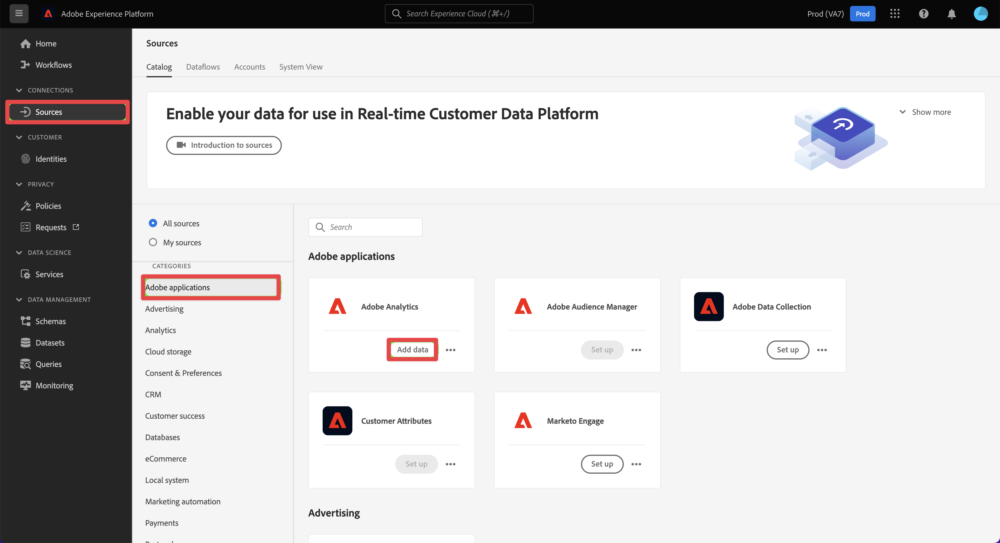
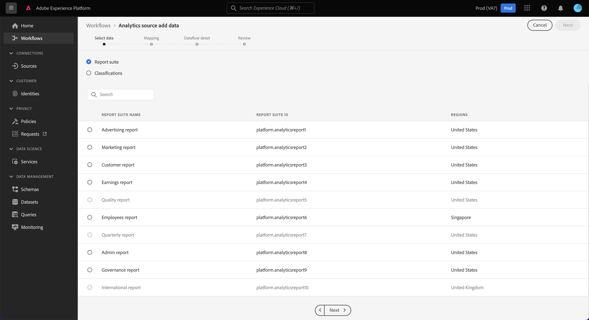
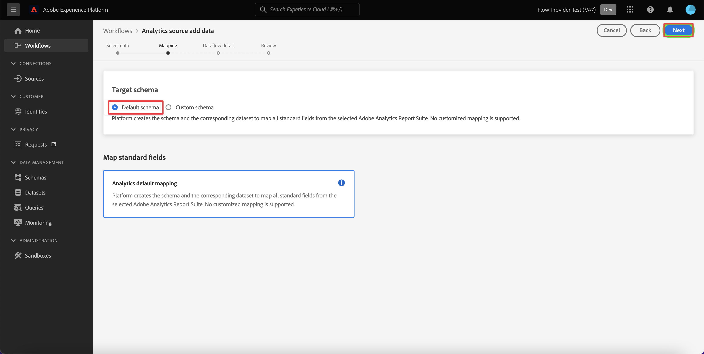
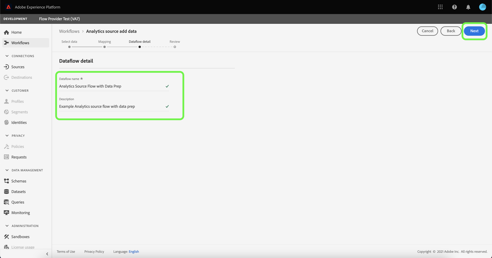
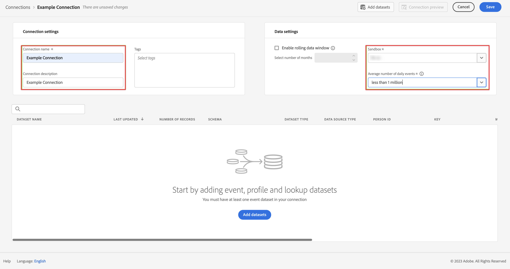
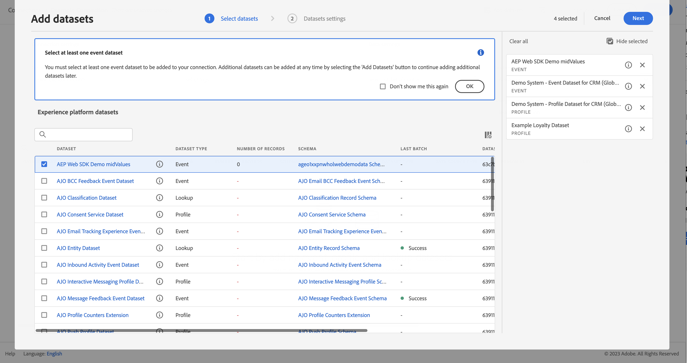
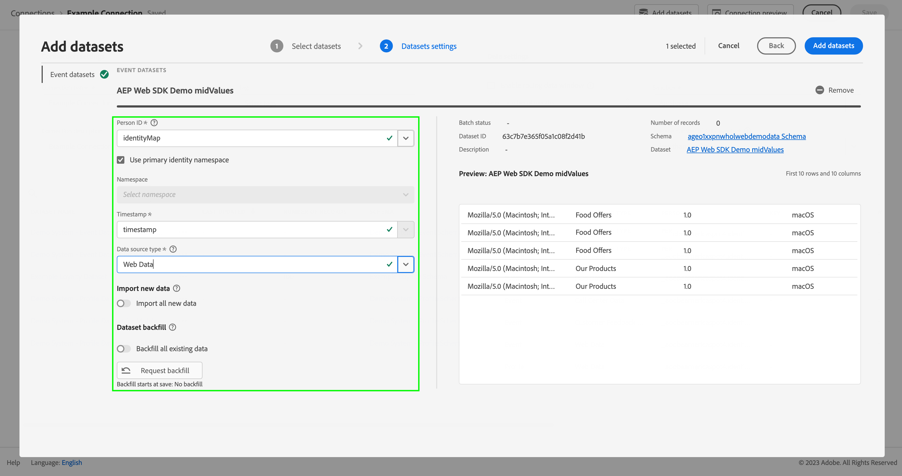
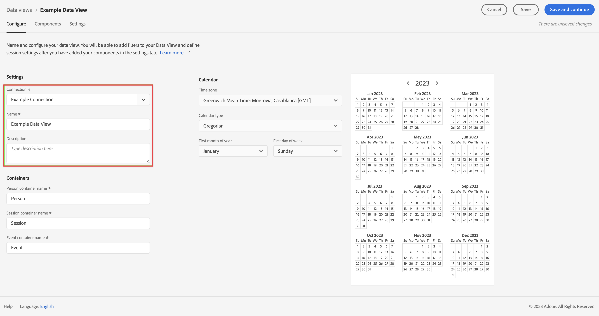
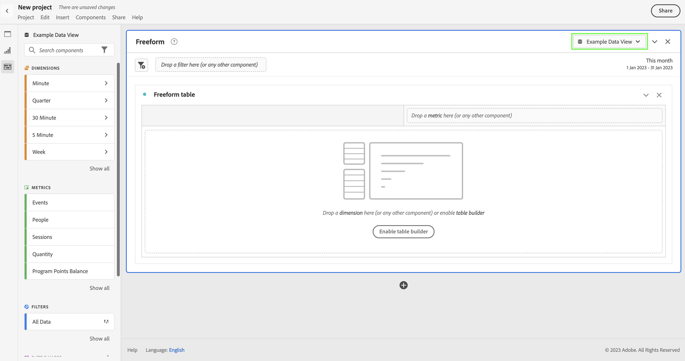
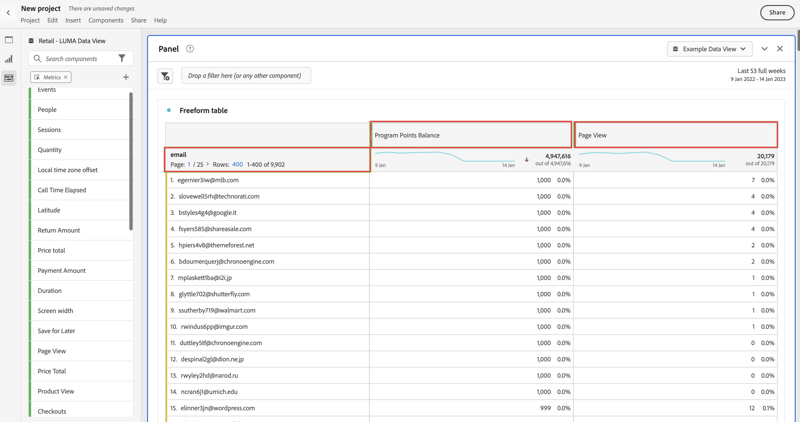

# 从Adobe Analytics引入和使用数据

本快速入门指南介绍了如何在 Customer Journey Analytics 中使用 Adobe Analytics 收集的数据。

>[!PREREQUISITES]
>
>您已使用任何记录的实施方法，在一个或多个网站上许可和部署Adobe Analytics：
>
>- [使用 Experience Platform Edge 实施 Analytics](https://experienceleague.adobe.com/docs/analytics/implementation/aep-edge/overview.html?lang=zh-Hans)
>- [使用 Adobe Analytics 扩展实现分析](https://experienceleague.adobe.com/docs/analytics/implementation/launch/overview.html?lang=zh-Hans)
>- [使用 JavaScript 实施 Analytics](https://experienceleague.adobe.com/docs/analytics/implementation/js/overview.html?lang=zh-Hans)

要完成此实施，您需要：

- 在 Adobe Experience Platform 中&#x200B;**设置 Adobe Analytics 源连接器**。 源连接器负责将您当前的Adobe Analytics数据摄取到Adobe Experience Platform中的数据集。

- 在 Customer Journey Analytics 中&#x200B;**设置连接**。 该连接应该（至少）包含您的Adobe Experience Platform数据集。

- 在 Customer Journey Analytics 中&#x200B;**设置数据视图**&#x200B;以定义要在 Analysis Workspace 中使用的量度和维度。

- 在 Customer Journey Analytics 中&#x200B;**设置一个项目**&#x200B;以构建报告和可视化图表。

>[!NOTE]
>
>本快速入门指南是一份关于如何使用Adobe Analytics源连接器摄取数据以及在Customer Journey Analytics中使用该数据的简化指南。 强烈建议在提及时查阅附加信息。

## 设置 Adobe Analytics 源连接器

Adobe Analytics 源连接器允许您将 Adobe Analytics 报告包数据导入 Adobe Experience Platform。

要创建 Adobe Analytics 源连接器：

1. 在平台 UI 中，从左边栏中选择&#x200B;**[!UICONTROL 源]**。

2. 从[!UICONTROL 分类]列表中选择 **[!UICONTROL Adobe 应用程序]**

3. 在 Adobe Analytics 互动程序中选择&#x200B;**[!UICONTROL 设置]**&#x200B;或&#x200B;**[!UICONTROL 添加数据]**。

   

4. 选择&#x200B;**[!UICONTROL 报告套件]** 从报表包列表中，选择要使用的报表包。  或者，您可以使用 **[!UICONTROL _搜索_]**&#x200B;来搜索报表包。

   

   选择&#x200B;**[!UICONTROL 下一步]**。

5. 选择&#x200B;**[!UICONTROL 默认架构]**&#x200B;作为[!UICONTROL 目标架构]。 Adobe Experience Platform 自动创建架构和相应的数据集，以映射所选 Adobe Analytics 报告包中的所有标准字段。

   已选择默认架构的

   选择&#x200B;**[!UICONTROL 下一步]**。

6. 命名数据流并（可选）提供描述。

   

   选择&#x200B;**[!UICONTROL 下一步]**。

7. 检查连接并选择&#x200B;**[!UICONTROL 完成]**。

   

创建连接后，将自动创建数据流以使用报表包中的Adobe Analytics数据填充数据集。 数据流会为生产沙盒摄取最多 13 个月的历史数据。 非生产沙盒的回填期限为三个月。

初始摄取完成后，您的 Adobe Analytics 报告包数据即可供 Customer Journey Analytics 使用。

有关更全面的教程，请参阅[在 UI 中创建 Adobe Analytics 源连接](https://experienceleague.adobe.com/docs/experience-platform/sources/ui-tutorials/create/adobe-applications/analytics.html?lang=zh-Hans)。

## 设置连接

要在 Customer Journey Analytics 中使用 Adobe Experience Platform 数据，您需要创建一个连接，其中包含因设置架构、数据集和工作流所产生的数据。

通过创建连接，您可以将 Adobe Experience Platform 中的数据集集成到工作区中。 要报告这些数据集，您必须首先在Adobe Experience Platform和Workspace中的数据集之间建立连接。

创建您的连接：

1. 在Customer Journey Analytics UI中，从顶部菜单中选择&#x200B;**[!UICONTROL 连接]** （可选）从&#x200B;**[!UICONTROL 数据管理]**。

2. 选择&#x200B;**[!UICONTROL 创建新连接]**。

3. 在[!UICONTROL 无标题连接]屏幕中：

   在[!UICONTROL 连接设置]中命名并描述您的连接。

   从[!UICONTROL 数据设置]中的[!UICONTROL 沙盒]列表中选择正确的沙盒，并从[!UICONTROL 平均每日事件数]列表中选定每日事件数。

   

   选择&#x200B;**[!UICONTROL 添加数据集]**。

   在[!UICONTROL 添加数据集]的[!UICONTROL 选择数据集]步骤中：

   - 选择由 Adobe Analytics 源连接器自动创建的数据集，以及要包含在连接中的任何其他数据集。

     

   - 选择&#x200B;**[!UICONTROL 下一步]**。

   在[!UICONTROL 添加数据集]的[!UICONTROL 设置数据集]步骤中：

   - 对于每个数据集：

     - 在 Adobe Experience Platform 中，从在数据集架构中定义的可用身份标识中选择[!UICONTROL 人员 ID]。

     - 从[!UICONTROL 数据源类型]列表中选择正确的数据源。 如果指定&#x200B;**[!UICONTROL 其他]**，则为您的数据源添加描述。

     - 根据您的首选项设置&#x200B;**[!UICONTROL 导入所有新数据]**&#x200B;和&#x200B;**[!UICONTROL 数据集回填现有数据]**。

     

   - 选择&#x200B;**[!UICONTROL 添加数据集]**。

   选择&#x200B;**[!UICONTROL 保存]**。

有关如何创建和管理连接以及如何选择和组合数据集的更多信息请参阅[连接概述](../connections/overview.md)。

## 设置数据视图

数据视图是 Customer Journey Analytics 专属的容器，通过它，可决定如何解释来自连接的数据。 它指定所有可在 Analysis Workspace 中找到的维度和量度，以及这些维度和量度从哪些列获取其数据。 为准备 Analysis Workspace 中的报告而定义数据视图。

创建您的数据视图：

1. 在Customer Journey Analytics UI中，从顶部菜单中选择&#x200B;**[!UICONTROL 数据视图]**（可选）从&#x200B;**[!UICONTROL 数据管理]**&#x200B;中选择。

2. 选择&#x200B;**[!UICONTROL 创建新数据视图]**。

3. 在[!UICONTROL 配置]步骤中：

   从[!UICONTROL 连接]列表中选择您的连接。

   为您的连接命名并（可选）添加描述。

   

   选择&#x200B;**[!UICONTROL 保存并继续]**。

4. 在[!UICONTROL 组件]步骤中：

   将要包含的任何架构字段和/或标准组件添加到[!UICONTROL 量度]或[!UICONTROL 维度]组件框中。

   

   选择&#x200B;**[!UICONTROL 保存并继续]**。

5. 在[!UICONTROL 设置]步骤中：

   

   保持设置不变并选择&#x200B;**[!UICONTROL 保存并完成]**。

有关如何创建和编辑数据视图、可在数据视图中使用的组件以及如何使用区段和会话设置的详细信息，请参阅[数据视图概述](../data-views/data-views.md)。

## 设置项目

Analysis Workspace 是一个灵活的浏览器工具，允许您快速构建分析并基于数据共享洞察。 您可以使用工作区项目来组合数据组件、表和可视化，以制作分析并与组织中的任何人共享。

要创建您的项目：

1. 在Customer Journey Analytics UI中，从顶部菜单中选择&#x200B;**[!UICONTROL 项目]**。

2. 选择左侧导航中的&#x200B;**[!UICONTROL 项目]**。

3. 选择&#x200B;**[!UICONTROL 创建项目]**。

   

   选择&#x200B;**[!UICONTROL 空白项目]**。

   

4. 从列表中选择您的数据视图。

   

5. 要创建您的第一个报告，请在[!UICONTROL 面板]中的[!UICONTROL 自由格式表]上开始拖放维度和量度。 例如，拖动 `Program Points Balance` 以及 `Page View` 作为量度和 `email` 作为维度，以快速查看访问过您的网站并已加入忠诚度计划收集忠诚度点的轮廓。

   

请参阅 [Analysis Workspace 概述](../analysis-workspace/home.md)，了解有关如何使用组件、可视化和面板创建项目和构建分析的更多信息。

>[!SUCCESS]
>
>您已完成所有步骤。 通过设置 Adobe Analytics 数据源连接器并为报告包配置该连接器，您的 Adobe Analytics 数据将自动上传到 Adobe Experience Platform。 您在Customer Journey Analytics中定义了一个连接，以使用摄取的Adobe Analytics数据和其他数据。 您的数据视图定义允许您指定要使用的维度和量度，最后您创建了您的第一个项目来可视化和分析您的数据。

