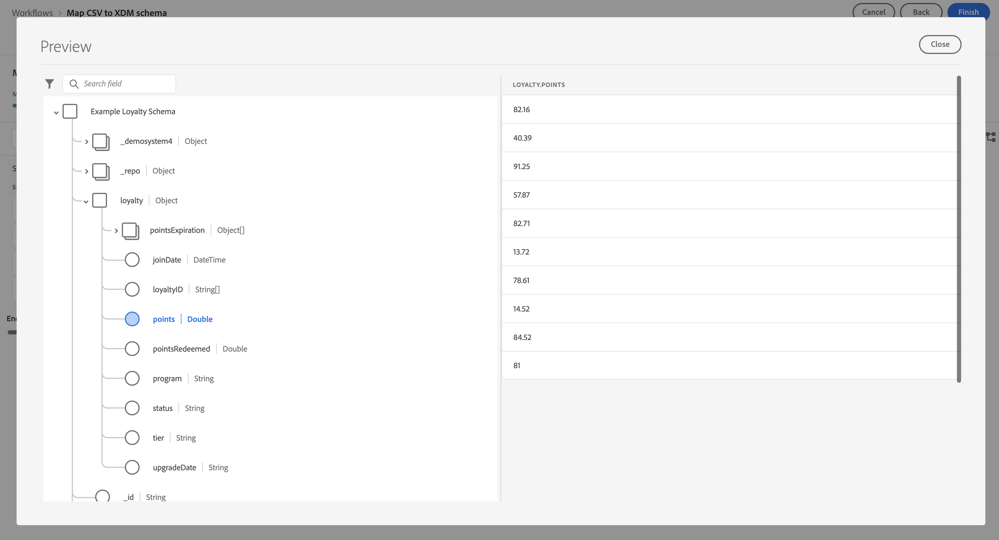

# 摄取和使用批量数据

本快速入门指南介绍了如何将批量数据摄取到Adobe Experience Platform中，然后在Customer Journey Analytics中使用该数据。

要实现此目的，您需要：

- **设置架构和数据集** 在Adobe Experience Platform中，定义要收集的数据的模型（模式）以及实际收集数据（数据集）的位置。

- **使用工作流** 以轻松将批量数据上传到在Adobe Experience Platform中配置的数据集。

- **设置连接** Customer Journey Analytics。 此连接应（至少）包含您的Adobe Experience Platform数据集。

- **设置数据视图** Customer Journey Analytics中定义要在Analysis Workspace中使用的量度和维度。

- **设置项目** Customer Journey Analytics构建报表和可视化。

>[!NOTE]
>
>这是有关如何将批量数据摄取到Adobe Experience Platform并在Customer Journey Analytics中使用的简化指南。 强烈建议在提及时研究附加信息。

## 设置架构和数据集

要将数据引入Adobe Experience Platform，您首先需要定义要收集的数据。 摄取到Adobe Experience Platform的所有数据都必须符合标准的异常结构，以便下游功能和特性能够识别并处理这些数据。 体验数据模型(XDM)是以模式形式提供此结构的标准框架。

定义架构后，您可以使用一个或多个数据集来存储和管理数据收集。 数据集是用于数据集合的存储和管理结构，通常是表格，其中包含架构（列）和字段（行）。

摄取到Adobe Experience Platform的所有数据都必须符合预定义的架构，然后才能作为数据集进行持久保留。

### 设置架构

对于此快速入门，您要收集一些忠诚度数据，例如忠诚度ID、忠诚度积分和忠诚度状态。
为此，您首先需要定义一个模型此数据的架构。

要设置架构，请执行以下操作：

1. 在Adobe Experience Platform UI的左边栏中，选择 **[!UICONTROL 模式]** within [!UICONTROL 数据管理].

2. 选择 **[!UICONTROL 创建架构]**. 选择 **[!UICONTROL XDM个人配置文件]** 列表。

   

   >[!INFO]
   >
   >    单个用户档案架构用于对用户档案进行建模 _属性_ （例如电子邮件、忠诚度状态、忠诚度积分）。 体验事件架构用于为 _行为_ （如页面查看、添加到购物车）。


3. 在 [!UICONTROL 无标题架构] 屏幕：

   1. 输入架构的显示名称和（可选）描述。

      

   2. 选择 **[!UICONTROL +添加]** in [!UICONTROL 字段组].

      

      字段组是对象和属性的可重用集合，允许您轻松扩展架构。

   3. 在 [!UICONTROL 添加字段组] 对话框，选择 **[!UICONTROL 忠诚度详细信息]** 字段组。

      

      您可以选择预览按钮，以查看属于此字段组的字段的预览。

      

      选择 **[!UICONTROL 返回]** 来关闭预览。

   4. 选择 **[!UICONTROL 添加字段组]**.

4. 选择 **[!UICONTROL +]** 的架构名称旁边 [!UICONTROL 结构] 的上界。

   

5. 在 [!UICONTROL 字段属性] 面板，输入 `Identification` 作为名称， **[!UICONTROL 标识]** 作为 [!UICONTROL 显示名称]，选择 **[!UICONTROL 对象]** 作为 [!UICONTROL 类型] 选择 **[!UICONTROL 配置文件核心v2]** 作为 [!UICONTROL 字段组].

   

   这会向架构中添加标识功能。 在您的用例中，您需要使用批量数据中的电子邮件地址来识别忠诚度信息。

   选择 **[!UICONTROL 应用]** 将此对象添加到架构中。

6. 选择 **[!UICONTROL 电子邮件]** 字段，然后选择 **[!UICONTROL 身份]** 和 **[!UICONTROL 电子邮件]** 从 [!UICONTROL 身份命名空间] 在 [!UICONTROL 字段属性] 的上界。

   

   您将指定电子邮件地址作为Adobe Experience Platform Identity服务可用于合并（拼合）用户档案的标识。

   选择 **[!UICONTROL 应用]**. 您会看到电子邮件属性中显示一个指纹图标。

   选择&#x200B;**[!UICONTROL 保存]**。

7. 选择架构的根级别（具有架构名称），然后选择 **[!UICONTROL 用户档案]** 切换。

   系统会提示您为用户档案启用架构。 启用后，当根据此架构将数据摄取到数据集时，该数据将合并到实时客户资料中。

   请参阅 [启用架构以在实时客户资料中使用](https://experienceleague.adobe.com/docs/experience-platform/xdm/tutorials/create-schema-ui.html?lang=en#profile) 以了解更多信息。

   >[!IMPORTANT]
   >
   >    保存为配置文件启用的架构后，便无法再为配置文件禁用该架构。

   

8. 选择 **[!UICONTROL 保存]** 以保存您的架构。

您已创建了一个最小架构，用于模型可摄取到Adobe Experience Platform中的忠诚度数据。 利用架构，可使用电子邮件地址识别用户档案。 通过启用配置文件架构，您可以确保将批处理文件中的数据添加到实时客户配置文件。

请参阅 [在UI中创建和编辑架构](https://experienceleague.adobe.com/docs/experience-platform/xdm/ui/resources/schemas.html) 有关向架构添加和删除字段组和单个字段的详细信息。

### 设置数据集

使用您的架构，您定义了数据模型。 现在，您必须定义结构才能存储和管理该数据。 这可通过数据集完成。

要设置数据集，请执行以下操作：

1. 在Adobe Experience Platform UI的左边栏中，选择 **[!UICONTROL 数据集]** within [!UICONTROL 数据管理].

2. 选择 **[!UICONTROL 创建数据集]**.

   

3. 选择 **[!UICONTROL 从架构创建数据集]**.

   

4. 选择之前创建的架构，然后选择 **[!UICONTROL 下一个]**.

5. 命名数据集，并（可选）提供描述。

   

6. 选择 **[!UICONTROL 完成]**.

7. 选择 **[!UICONTROL 用户档案]** 切换。

   系统会提示您为配置文件启用数据集。 数据集在启用后，会通过其摄取的数据来丰富实时客户用户档案。

   >[!IMPORTANT]
   >
   >    只有当数据集所附在的架构也为配置文件启用时，才能为配置文件启用数据集。

   

请参阅 [数据集UI指南](https://experienceleague.adobe.com/docs/experience-platform/catalog/datasets/user-guide.html?lang=zh-Hans) 有关如何查看、预览、创建和删除数据集的更多信息。 以及如何为实时客户用户档案启用数据集。


## 使用工作流

您可以使用工作流功能将批量数据上传到Adobe Experience Platform。 您使用的批处理文件示例是包含以下内容的CSV文件：

```
email,loyaltyID,points,status
abrocking0@blog.com,793406,82.16,Silver
wnichol1@ycombinator.com,988654,40.39,Gold
paisbett2@slideshare.net,444897,91.25,Bronze
bdiamant3@xinhuanet.com,239658,57.87,Gold
ppales4@nsw.gov.au,365384,82.71,Silver
...
```

要使用工作流，请执行以下操作：

1. 在平台UI中，选择 **[!UICONTROL 工作流]** 中。

2. 选择 **[!UICONTROL 将CSV映射到XDM架构]**. 选择 **[!UICONTROL Launch]**.

   

3. 在 [!UICONTROL 将CSV映射到XDM架构] 屏幕中 [!UICONTROL 数据流详细信息] 步骤：

   选择 **[!UICONTROL 现有数据集]**，从数据集列表中选择您的数据集，然后将 [!UICONTROL 数据流名称].

   

   选择&#x200B;**[!UICONTROL 下一步]**。

4. 在 [!UICONTROL 选择数据] 步骤：

   拖放或选择 **[!UICONTROL 选择文件]** ，以选择包含忠诚度数据的CSV文件。 您会看到忠诚度数据预览。

   

   选择&#x200B;**[!UICONTROL 下一步]**。

5. 在 [!UICONTROL 映射] 步骤：

   将您的数据从CSV文件映射到架构中的数据。 使用AI，工作流功能会尝试自动将您的批量数据字段映射到架构字段。

   

   您可以使用 **[!UICONTROL 预览数据]** 以查看映射数据的预览。

   

6. 选择 **[!UICONTROL 完成]** 开始将批量数据摄取到Adobe Experience Platform。

请参阅 [将CSV文件映射到现有XDM架构](https://experienceleague.adobe.com/docs/experience-platform/ingestion/tutorials/map-csv/existing-schema.html) 有关如何在传入数据与XDM架构不兼容时映射数据的更多信息，请使用映射模板，使用计算字段确保批量数据符合架构的预期内容，等等。


## 设置连接

要在Customer Journey Analytics中使用Adobe Experience Platform数据，请创建一个连接，其中包含设置架构、数据集和工作流后生成的数据。

通过创建连接，您可以将 Adobe Experience Platform 中的数据集集成到工作区中。要报告这些数据集，您必须首先在Adobe Experience Platform和工作区中的数据集之间建立连接。

要创建连接，请执行以下操作：

1. 在Customer Journey AnalyticsUI中，选择 **[!UICONTROL 连接]** 中。

2. 选择 **[!UICONTROL 创建新连接]**.

3. 在 [!UICONTROL 无标题连接] 屏幕：

   在中命名并描述您的连接 [!UICONTROL 连接设置].

   从 [!UICONTROL 沙盒] 列表 [!UICONTROL 数据设置] 并从 [!UICONTROL 平均每日事件数] 列表。

   

   选择 **[!UICONTROL 添加数据集]**.

   在 [!UICONTROL 选择数据集] 步骤 [!UICONTROL 添加数据集]:

   - 选择您之前创建的数据集(`Example Loyalty Dataset`)以及要包含在连接中的任何其他数据集。

      

   - 选择&#x200B;**[!UICONTROL 下一步]**。
   在 [!UICONTROL 数据集设置] 步骤 [!UICONTROL 添加数据集]:

   - 对于每个数据集：

      - 选择 [!UICONTROL 人员ID] 从Adobe Experience Platform的数据集架构中定义的可用标识。

      - 从 [!UICONTROL 数据源类型] 列表。 如果您指定 **[!UICONTROL 其他]**，然后为数据源添加描述。

      - 已设置 **[!UICONTROL 导入所有新数据]** 和 **[!UICONTROL 数据集回填现有数据]** 根据您的喜好。

      

   - 选择 **[!UICONTROL 添加数据集]**.
   选择&#x200B;**[!UICONTROL 保存]**。

请参阅 [连接概述](../connections/overview.md) 有关如何创建和管理连接以及如何选择和合并数据集的更多信息。

## 设置数据视图

数据视图 是 Customer Journey Analytics 专属的容器，通过它，可决定如何解释来自连接的数据。 它指定所有可在 Analysis Workspace 中找到的维度和指标，以及这些维度和指标从哪些列获取其数据。为准备 Analysis Workspace 中的报表而定义数据视图。

要创建数据视图，请执行以下操作：

1. 在Customer Journey AnalyticsUI中，选择 **[!UICONTROL 数据视图]** 中。

2. 选择 **[!UICONTROL 创建新数据视图]**.

3. 在 [!UICONTROL 配置] 步骤：

   从 [!UICONTROL 连接] 列表。

   名称和（可选）描述您的连接。

   

   选择 **[!UICONTROL 保存并继续]**.

4. 在 [!UICONTROL 组件] 步骤：

   将您要包含的任何架构字段和/或标准组件添加到 [!UICONTROL 量度] 或 [!UICONTROL Dimension] 组件框。

   

   选择 **[!UICONTROL 保存并继续]**.

5. 在 [!UICONTROL 设置] 步骤：

   

   保留设置原样，然后选择 **[!UICONTROL 保存并完成]**.

请参阅 [数据视图概述](../data-views/data-views.md) 有关如何创建和编辑数据视图的更多信息，可在数据视图中使用哪些组件，以及如何使用过滤器和会话设置。


## 设置项目

Analysis Workspace是一个灵活的浏览器工具，允许您快速构建分析并根据数据共享分析。 您可以使用工作区项目来组合数据组件、表格和可视化图表，以便进行分析并与组织中的任何人共享。

要创建项目，请执行以下操作：

1. 在Customer Journey AnalyticsUI中，选择 **[!UICONTROL 项目]** 中。

2. 选择 **[!UICONTROL 项目]** 中。

3. 选择 **[!UICONTROL 创建项目]**.

   

   选择 **[!UICONTROL 空白项目]**.

   

4. 从列表中选择数据视图。

   .

5. 开始在 [!UICONTROL 自由格式表] 在 [!UICONTROL 面板] 以创建您的第一个报表。 例如，拖动 `Program Points Balance` 和 `Page View` 作为量度和 `email` 作为维度，可快速查看访问过您的网站且属于收集会员积分的忠诚度计划一部分的用户档案。

   

请参阅 [Analysis Workspace概述](../analysis-workspace/home.md) 有关如何使用组件、可视化图表和面板创建项目和构建分析的更多信息。

>[!SUCCESS]
>
>您已完成所有步骤。 首先，定义要收集的忠诚度数据（架构）以及将其存储在Adobe Experience Platform中的位置（数据集），然后，您配置了一个工作流，以将忠诚度数据批量上传到数据集。 您在Customer Journey Analytics中定义了一个连接，以使用摄取的忠诚度数据和其他数据。 通过数据视图定义，您可以指定要使用的维度和量度，最后创建了您的第一个项目，并对数据进行可视化和分析。
