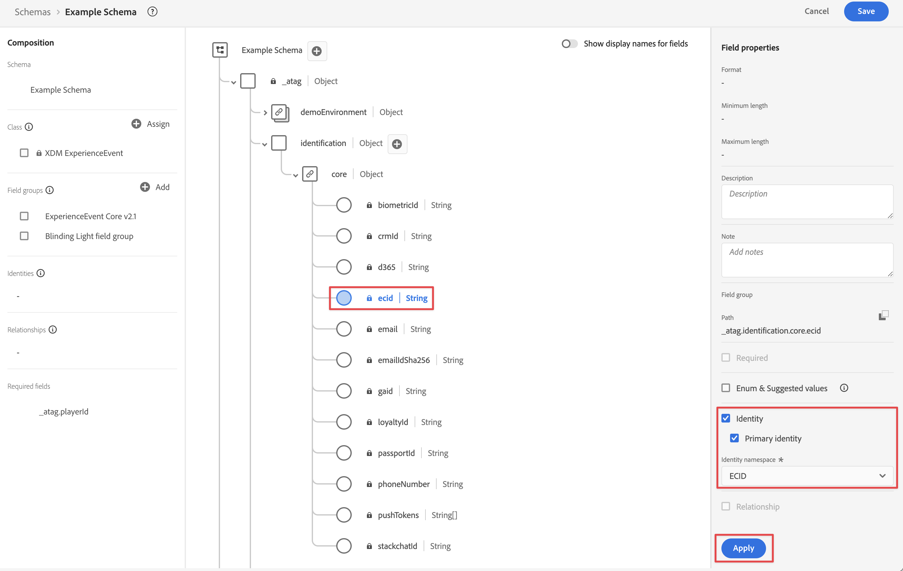
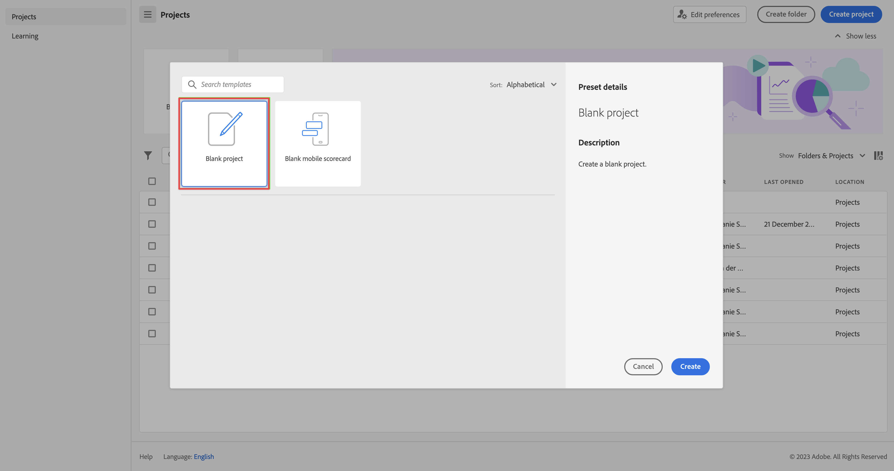

# 通过Edge Network服务器API引入数据

本快速入门指南介绍如何使用Adobe Experience Platform Edge Network Server API和Edge Network将跟踪数据从物联网设备、机顶盒、游戏控制台和桌面应用程序等设备直接摄取到Adobe Experience Platform。 然后在Customer Journey Analytics中使用该数据。

要完成此操作，您必须：

- 在 Adobe Experience Platform 中&#x200B;**设置架构和数据集** ，以定义要收集的数据的模型（架构）以及实际收集数据的位置（数据集）。

- **设置数据流** 以配置 Adobe Experience Platform Edge Network，将您收集的数据路由到您在 Adobe Experience Platform 中配置的数据集。

- **使用服务器API**&#x200B;将数据直接从桌面、游戏机、物联网设备或机顶盒上运行的应用程序或游戏发送到数据流。

- **部署和验证**。拥有一个可在其中进行迭代开发的环境，一旦一切通过验证，就将其实时发布到生产环境中。

- 在 Customer Journey Analytics 中&#x200B;**设置连接**。此连接应（至少）包含 Adobe Experience Platform 数据集。

- 在 Customer Journey Analytics 中&#x200B;**设置数据视图**&#x200B;以定义要在 Analysis Workspace 中使用的量度和维度。

- 在 Customer Journey Analytics 中&#x200B;**设置一个项目**&#x200B;以构建报告和可视化图表。

>[!NOTE]
>
>本快速入门指南是一份简化的指南，介绍了如何将从IoT设备、机顶盒、游戏控制台或桌面上运行的应用程序或游戏收集的数据摄取到Adobe Experience Platform中，并在Customer Journey Analytics中使用。 强烈建议参考时研究附加信息。


## 设置架构和数据集

要将数据摄取到Adobe Experience Platform，您必须首先定义要收集的数据。 引入 Adobe Experience Platform 的所有数据都必须符合标准的非规范化结构，以便下游功能和特性对其进行识别和操作。体验数据模型(XDM)是一种标准框架，它以架构的形式提供结构。

定义架构后，您可以使用一个或多个数据集来存储和管理数据集合。数据集是用于数据集合（通常是表）的存储和管理结构，其中包含架构（列）和字段（行）。

摄取到 Adobe Experience Platform 中的所有数据都必须符合预定义的架构，然后才能作为数据集保存。

### 设置架构

您希望跟踪在主机上玩游戏的配置文件中的某些最小数据，例如标识、分数、进度和其他信息。
您必须首先定义一个模式来模拟此数据。

设置您的架构：

1. 在 Adobe Experience Platform UI 的左边栏中，选择[!UICONTROL 数据管理]中的&#x200B;**[!UICONTROL 架构]**。

1. 选择&#x200B;**[!UICONTROL 创建架构]**。
.
1. 在“创建模式”向导的“选择类”步骤中：

   1. 选择&#x200B;**[!UICONTROL 体验事件]**。

      

      >[!INFO]
      >
      >    Experience Event 架构用于对轮廓的&#x200B;_行为_&#x200B;进行建模（如场景名称、添加到购物车的按钮）。个人轮廓架构用于对轮廓&#x200B;_属性_（如姓名、电子邮件、性别）进行建模。

   1. 选择&#x200B;**[!UICONTROL 下一步]**。


1. 在[!UICONTROL 创建架构]向导中的[!UICONTROL 命名和审查步骤]中：

   1. 输入架构的&#x200B;**[!UICONTROL 架构显示名称]**&#x200B;和（可选）**[!UICONTROL 描述]**。

      

   1. 选择&#x200B;**[!UICONTROL 完成]**。

1. 在示例架构的结构选项卡中：

   1. 在[!UICONTROL 字段组]中选择&#x200B;**[!UICONTROL + 添加]**。

      

      字段组是可重用的对象和属性集合，可让您轻松扩展架构。

   1. 在[!UICONTROL 添加字段组]对话框中，从列表中选择&#x200B;**[!UICONTROL 照明灯]**&#x200B;字段组。 创建此字段组是为了跟踪用户在主机上玩名为Blinding Light的虚构游戏的进度。

      

      您可以选择预览按钮，以查看属于该字段组的字段的预览，例如 `scores > afterMatch`。

      

      选择&#x200B;**[!UICONTROL 返回]**&#x200B;关闭预览。

   1. 选择&#x200B;**[!UICONTROL 添加字段组]**。

1. 选择架构名称旁边的&#x200B;**[!UICONTROL +]**。

   

1. 在[!UICONTROL 字段属性]面板中，输入`identification`作为[!UICONTROL 字段名称]，输入&#x200B;**[!UICONTROL 标识]**&#x200B;作为[!UICONTROL 显示名称]，选择&#x200B;**[!UICONTROL 对象]**&#x200B;作为[!UICONTROL 类型]，并选择&#x200B;**[!UICONTROL ExperienceEvent Core v2.1]**&#x200B;作为[!UICONTROL 字段组]。

   >[!NOTE]
   >
   >如果该字段组不可用，请寻找另一个包含身份标识字段的字段组。或者[创建一个新的字段组](https://experienceleague.adobe.com/docs/experience-platform/xdm/ui/resources/field-groups.html?lang=zh-Hans)，并[将新的身份标识字段](https://experienceleague.adobe.com/docs/experience-platform/xdm/ui/fields/identity.html?lang=zh-Hans#define-a-identity-field)（如 `ecid`、`crmId` 以及您需要的其他字段）添加到该字段组中，并选择该新字段组。

   

   识别对象为您的架构添加了识别功能。在您的案例中，您希望使用Experience Cloud ID和电子邮件地址来识别玩游戏的用户档案，这些用户档案用于登录游戏主机。 有许多其他属性可用于跟踪您的人员身份。

   选择&#x200B;**[!UICONTROL 应用]**&#x200B;将此对象添加到您的架构中。

1. 选择刚刚添加的身份标识对象中的&#x200B;**[!UICONTROL ecid]**&#x200B;字段，选择&#x200B;**[!UICONTROL 身份标识]**&#x200B;和&#x200B;**[!UICONTROL 主要身份标识]** 和 **[!UICONTROL ECID]** 来自右侧面板中的 [!UICONTROL 身份标识命名空间] 列表。

   

   您将 Experience Cloud Identity 指定为 Adobe Experience Platform Identity 服务可用于组合（缝合）具有相同 ECID 的轮廓行为的主要身份。

   选择 **[!UICONTROL 应用]**。您会看到 ecid 属性中出现指纹图标。

1. 选择刚刚添加的身份标识对象中的&#x200B;**[!UICONTROL 邮件]**&#x200B;字段，选择&#x200B;**[!UICONTROL 身份标识]**&#x200B;和&#x200B;**[!UICONTROL 邮件]** 和 [!UICONTROL 身份标识命名空间] 列表中的 [!UICONTROL 字段属性] 面板。

    

   您将电子邮件地址指定为 Adobe Experience Platform Identity 服务可用于组合（拼接）轮廓行为的另一个身份标识。

   选择 **[!UICONTROL 应用]**。您会看到电子邮件属性中显示指纹图标。

   选择&#x200B;**[!UICONTROL 保存]**。

1. 选择显示架构名称的架构的根元素，然后选择 **[!UICONTROL 轮廓]** 开关。

   系统会提示您启用轮廓的架构。一旦启用，当数据被引入基于此架构的数据集中时，该数据将合并到实时客户轮廓。

   有关详细信息，请参阅[启用架构以在实时客户轮廓中使用](https://experienceleague.adobe.com/docs/experience-platform/xdm/tutorials/create-schema-ui.html?lang=zh-Hans#profile)。

   >[!IMPORTANT]
   >
   >    一旦您保存了为轮廓启用的架构，就不能再为轮廓禁用它。

   

1. 选择&#x200B;**[!UICONTROL 保存]**&#x200B;以保存架构。

您创建了一个最小架构，用于模拟您可以从游戏中捕获的数据。 该架构允许使用 Experience Cloud Identity 和电子邮件地址来识别轮廓。通过启用配置文件的架构，您可以确保将从控制台游戏中捕获的数据添加到实时客户配置文件中。

除了行为数据之外，您还可以从控制台捕获配置文件属性数据（例如，登录到控制台的配置文件的详细信息）。

要捕获用户档案数据，您应：

- 基于 XDM 个人轮廓类创建架构。

- 将 Profile Core v2 字段组添加到架构中。

- 添加基于 Profile Core v2 字段组的身份标识对象。

- 将 Experience Cloud ID 定义为主要身份标识符，并将电子邮件定义为身份标识符。

- 为轮廓启用架构

请参阅[在 UI 中创建和编辑架构](https://experienceleague.adobe.com/docs/experience-platform/xdm/ui/resources/schemas.html?lang=zh-Hans)，了解有关向架构添加和删除字段组和单个字段的更多信息。

### 设置数据集

使用您的架构，您已经定义了数据模型。现在，您必须定义结构以使用数据集存储和管理这些数据。

设置您的数据集

1. 在 Adobe Experience Platform UI 的左边栏中，选择[!UICONTROL 数据管理]中的&#x200B;**[!UICONTROL 数据集]**。

2. 选择&#x200B;**[!UICONTROL 创建数据集]**。

   

3. 选择&#x200B;**[!UICONTROL 使用架构创建数据集]**。

   。

4. 选择您之前创建的架构，然后选择 **[!UICONTROL 下一个]**。

5. 为您的数据集命名并（可选）提供描述。

   

6. 选择&#x200B;**[!UICONTROL 完成]**。

7. 选择&#x200B;**[!UICONTROL 轮廓]**&#x200B;开关

   系统会提示您启用轮廓的数据集。启用后，数据集会使用其摄取的数据丰富实时客户轮廓。

   >[!IMPORTANT]
   >
   >    只有当数据集所依附的架构也为轮廓启用时，您才能为轮廓启用数据集。

   

有关如何查看、预览、创建和删除数据集的更多信息，请参阅[数据集 UI 指南](https://experienceleague.adobe.com/docs/experience-platform/catalog/datasets/user-guide.html?lang=zh-Hans)。以及如何为实时客户轮廓启用数据集。

## 设置数据流

数据流表示在实施Adobe Experience Platform Web SDK和Mobile SDK以及Adobe Experience Platform Edge Network服务器API时的服务器端配置。 使用Adobe Experience Platform SDK和Edge Network Server API收集数据时，数据会发送到Adobe Experience Platform Edge Network。 数据流决定将数据转发到哪些服务。

在设置中，您希望将从游戏中收集的数据发送到Adobe Experience Platform中的数据集。

设置您的数据流

1. 在 Adobe Experience Platform UI 的左边栏中，选择 [!UICONTROL 数据收藏集] 中的 **[!UICONTROL 数据流]**。

2. 选择&#x200B;**[!UICONTROL 新数据流]**。

3. 命名并描述您的数据流。从 [!UICONTROL 事件架构] 列表中选择您的架构。

   

4. 选择&#x200B;**[!UICONTROL 保存]**。

5. 选择 **[!UICONTROL 添加服务]**。

6. 在 [!UICONTROL 添加服务屏幕]：

   1. 从 [!UICONTROL 服务] 列表中选择 **[!UICONTROL Adobe Experience Platform]**。

   2. 确保选择 **[!UICONTROL Enabled]**。

   3. 从 [!UICONTROL 事件数据集] 列表中选择您的数据集。

      

   4. 保留其他设置并选择 **[!UICONTROL 保存]** 以保存数据流。

您的数据流现在配置为将从游戏中收集的数据转发到Adobe Experience Platform中的数据集。

有关如何配置数据流和如何处理敏感数据的更多信息，请参阅[数据流概述](https://experienceleague.adobe.com/docs/experience-platform/datastreams/overview.html?lang=zh-Hans)。

## 使用Edge Network服务器API

在游戏开发中，您可以根据需要向Adobe Experience Platform Edge Network服务器API添加相关调用。

例如，要更新播放器的得分，您将使用：

```
curl -X POST "https://server.adobedc.net/ee/v2/interact?dataStreamId={DATASTREAM_ID}"
-H "Authorization: Bearer {TOKEN}"
-H "x-gw-ims-org-id: {ORG_ID}"
-H "x-api-key: {API_KEY}"
-H "Content-Type: application/json"
-d '{
   "event": {
      "xdm": {
         "identityMap": {
            "Email_LC_SHA256": [
               {
                  "id": "0c7e6a405862e402eb76a70f8a26fc732d07c32931e9fae9ab1582911d2e8a3b",
                  "primary": true
               }
            ]
         },
         "eventType": "game.scoreUpdate",
         "{sandbox}": {
            "scores": {
               "afterMatch": 132391",
            }
         },
         "timestamp": "2021-08-09T14:09:20.859Z"
      }
   }
}'
```

在示例POST请求中，`{DATASTREAM_ID}`指向您之前配置的示例数据流的标识符。 `{sandbox}`是沙盒的唯一名称，用于标识自定义Blinding Light字段组的路径。

有关如何使用Edge Network Server API的更多信息，请参阅[交互式数据收集](https://experienceleague.adobe.com/docs/experience-platform/edge-network-server-api/data-collection/interactive-data-collection.html?lang=zh-Hans)和[非交互式数据收集](https://experienceleague.adobe.com/docs/experience-platform/edge-network-server-api/data-collection/non-interactive-data-collection.html?lang=zh-Hans)。

## 设置连接

要在 Customer Journey Analytics 中使用 Adobe Experience Platform 数据，您需要创建一个连接，其中包含因设置架构、数据集和工作流所产生的数据。

通过创建连接，您可以将 Adobe Experience Platform 中的数据集集成到工作区中。要报告这些数据集，您必须首先在Adobe Experience Platform和Workspace中的数据集之间建立连接。

创建您的连接：

1. 在Customer Journey Analytics UI中，从顶部菜单中选择&#x200B;**[!UICONTROL 连接]** （可选）从&#x200B;**[!UICONTROL 数据管理]**。

2. 选择&#x200B;**[!UICONTROL 创建新连接]**。

3. 在[!UICONTROL 无标题连接]屏幕中：

   在[!UICONTROL 连接设置]中命名并描述您的连接。

   从[!UICONTROL 数据设置]中的[!UICONTROL 沙盒]列表中选择正确的沙盒，并从[!UICONTROL 平均每日事件数]列表中选定每日事件数。

   

   选择&#x200B;**[!UICONTROL 添加数据集]**。

   在[!UICONTROL 添加数据集]的[!UICONTROL 选择数据集]步骤中：

   - 选择您之前创建的数据集和/或要包含在连接中的其他相关数据集

   - 选择&#x200B;**[!UICONTROL 下一步]**。

   在[!UICONTROL 添加数据集]的[!UICONTROL 设置数据集]步骤中：

   - 对于每个数据集：

      - 在 Adobe Experience Platform 中，从在数据集架构中定义的可用身份标识中选择[!UICONTROL 人员 ID]。

      - 从[!UICONTROL 数据源类型]列表中选择正确的数据源。如果指定&#x200B;**[!UICONTROL 其他]**，则为您的数据源添加描述。

      - 根据您的首选项设置&#x200B;**[!UICONTROL 导入所有新数据]**&#x200B;和&#x200B;**[!UICONTROL 数据集回填现有数据]**。

   - 选择&#x200B;**[!UICONTROL 添加数据集]**。

   选择&#x200B;**[!UICONTROL 保存]**。

有关如何创建和管理连接以及如何选择和组合数据集的更多信息请参阅[连接概述](../connections/overview.md)。

## 设置数据视图

数据视图是 Customer Journey Analytics 专属的容器，通过它，可决定如何解释来自连接的数据。 它指定所有可在 Analysis Workspace 中找到的维度和量度，以及这些维度和量度从哪些列获取其数据。为准备 Analysis Workspace 中的报告而定义数据视图。

创建您的数据视图：

1. 在Customer Journey Analytics UI中，从顶部菜单中选择&#x200B;**[!UICONTROL 数据视图]**（可选）从&#x200B;**[!UICONTROL 数据管理]**&#x200B;中选择。

2. 选择&#x200B;**[!UICONTROL 创建新数据视图]**。

3. 在[!UICONTROL 配置]步骤中：

   从[!UICONTROL 连接]列表中选择您的连接。

   名称并（可选）描述您的连接。

   

   选择&#x200B;**[!UICONTROL 保存并继续]**。

4. 在[!UICONTROL 组件]步骤中：

   将要包含的任何架构字段和/或标准组件添加到[!UICONTROL 量度]或[!UICONTROL 维度]组件框中。

   选择&#x200B;**[!UICONTROL 保存并继续]**。

5. 在[!UICONTROL 设置]步骤中：

   

   保持设置不变并选择&#x200B;**[!UICONTROL 保存并完成]**。

有关如何创建和编辑数据视图、可在数据视图中使用的组件以及如何使用区段和会话设置的详细信息，请参阅[数据视图概述](../data-views/data-views.md)。


## 设置项目

Analysis Workspace 是一个灵活的浏览器工具，允许您快速构建分析并基于数据共享见解。您可以使用工作区项目来组合数据组件、表和可视化，以制作分析并与组织中的任何人共享。

要创建您的项目：

1. 在Customer Journey Analytics UI中，从顶部菜单中选择&#x200B;**[!UICONTROL 项目]**。

2. 选择左侧导航中的&#x200B;**[!UICONTROL 项目]**。

3. 选择&#x200B;**[!UICONTROL 创建项目]**。

   

   选择&#x200B;**[!UICONTROL 空白项目]**。

   

4. 从列表中选择您的数据视图。

   

5. 要创建您的第一个报告，请在[!UICONTROL 面板]的[!UICONTROL 自由格式表]上开始拖放维度和量度。

请参阅 [Analysis Workspace 概述](../analysis-workspace/home.md)，了解有关如何使用组件、可视化和面板创建项目和构建分析的更多信息。

>[!SUCCESS]
>
>您已完成所有步骤。首先定义您要收集的数据（架构）以及在Adobe Experience Platform中存储这些数据（数据集）的位置。 您在Edge Network上配置了一个数据流，以确保可以将数据转发到该数据集。 然后，您使用Edge Network服务器API将该数据发送到您的数据流。 您在Customer Journey Analytics中定义了一个连接以使用您的游戏数据和其他数据。 通过数据视图定义，您可以指定要使用的维度和量度，最后，您创建了第一个项目，用于可视化和分析游戏数据。
