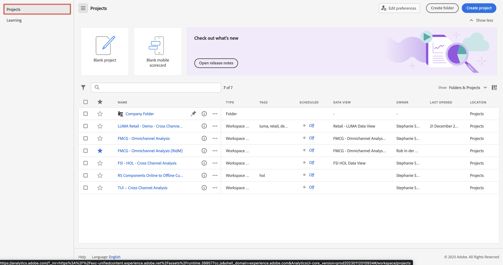

# 使用源连接器摄取和使用数据

本快速入门指南介绍了如何使用数据提供程序的源连接器将数据引入 Adobe Experience Platform，然后在 Customer Journey Analytics 中使用该数据。

要完成此实施，您需要：

- 在 Adobe Experience Platform 中&#x200B;**设置架构和数据集** ，以定义要收集的数据的模型（架构）以及实际收集数据的位置（数据集）。

- **在 Adobe Experience Platform 中使用源连接器** 将您的数据放入配置的数据集中。

- 在 Customer Journey Analytics 中&#x200B;**设置连接**。此连接应（至少）包含 Adobe Experience Platform 数据集。

- 在 Customer Journey Analytics 中&#x200B;**设置数据视图**&#x200B;以定义要在 Analysis Workspace 中使用的量度和维度。

- 在 Customer Journey Analytics 中&#x200B;**设置一个项目**&#x200B;以构建报告和可视化图表。

>[!NOTE]
>
>本快速入门指南是一份关于如何使用源连接器将数据摄取到Adobe Experience Platform并在Customer Journey Analytics中使用数据的简化指南。 强烈建议参考时研究附加信息。

## 设置架构和数据集

要将数据摄取到Adobe Experience Platform，您必须首先定义要收集的数据。 引入 Adobe Experience Platform 的所有数据都必须符合标准的非规范化结构，以便下游功能和特性对其进行识别和操作。体验数据模型(XDM)是以架构形式提供结构的标准框架。

定义架构后，您可以使用一个或多个数据集来存储和管理数据集合。数据集是用于数据集合（通常是表）的存储和管理结构，其中包含架构（列）和字段（行）。

摄取到 Adobe Experience Platform 中的所有数据都必须符合预定义的架构，然后才能作为数据集保存。

### 设置架构

为了快速开始，您需要收集一些忠诚度数据，例如忠诚度 id、忠诚度积分和忠诚度状态。您必须首先定义一个模式来模拟此数据。

设置您的架构：

1. 在 Adobe Experience Platform UI 的左边栏中，选择[!UICONTROL 数据管理]中的&#x200B;**[!UICONTROL 架构]**。

1. 选择&#x200B;**[!UICONTROL 创建架构]**。
.
1. 在“创建模式”向导的“选择类”步骤中：

   1. 选择&#x200B;**[!UICONTROL 个人资料]**。

      

      >[!INFO]
      >
      >    Experience Event 架构用于对轮廓的&#x200B;_行为_&#x200B;进行建模（如场景名称、添加到购物车的按钮）。个人轮廓架构用于对轮廓&#x200B;_属性_（如姓名、电子邮件、性别）进行建模。

   1. 选择&#x200B;**[!UICONTROL 下一步]**。

1. 在[!UICONTROL 创建架构]向导中的[!UICONTROL 命名和审查步骤]中：

   1. 输入架构的&#x200B;**[!UICONTROL 架构显示名称]**&#x200B;和（可选）**[!UICONTROL 描述]**。

      

   1. 选择&#x200B;**[!UICONTROL 完成]**。

1. 在示例架构的结构选项卡中：

   1. 在[!UICONTROL 字段组]中选择&#x200B;**[!UICONTROL + 添加]**。

      

      字段组是可重用的对象和属性集合，可让您轻松扩展架构。

   1. 在[!UICONTROL 添加字段组]对话框中，从列表中选择&#x200B;**[!UICONTROL 忠诚度详细信息]**&#x200B;字段组。

      

      您可以选择预览按钮，以查看属于该字段组的字段的预览。

      

      选择&#x200B;**[!UICONTROL 返回]**&#x200B;关闭预览。

   1. 选择&#x200B;**[!UICONTROL 添加字段组]**。

1. 在[!UICONTROL 结构]面板中选择架构名称旁边的 **[!UICONTROL +]**。

   

1. 在[!UICONTROL 字段属性]面板中，输入`Identification`作为名称，**[!UICONTROL 识别]**&#x200B;作为[!UICONTROL 显示名称]，选择&#x200B;**[!UICONTROL 对象]**&#x200B;作为[!UICONTROL 类型]和选择&#x200B;**[!UICONTROL 配置核心文件 v2]**&#x200B;作为[!UICONTROL 字段组]。

   

   此标识对象将标识功能添加到架构中。 在您的情况下，您希望使用批处理数据中的电子邮件地址来识别忠诚度信息。

   选择&#x200B;**[!UICONTROL 应用]**&#x200B;将此对象添加到您的架构中。

1. 选择刚刚添加的身份标识对象中的&#x200B;**[!UICONTROL 邮件]**&#x200B;字段，选择&#x200B;**[!UICONTROL 身份标识]**&#x200B;和&#x200B;**[!UICONTROL 邮件]**&#x200B;和[!UICONTROL 身份标识命名空间]中的[!UICONTROL 字段属性]面板。

   

   您将电子邮件地址指定为 Adobe Experience Platform 身份标识服务可用于组合（拼接）轮廓行为的标识。

   选择&#x200B;**[!UICONTROL 应用]**。您会看到电子邮件属性中显示指纹图标。

1. 选择架构的根级别（使用架构名称），然后选择&#x200B;**[!UICONTROL 配置]**&#x200B;开关。

   系统会提示您启用轮廓的架构。一旦启用，当数据被引入基于此架构的数据集中时，该数据将合并到实时客户轮廓。

   有关详细信息，请参阅[启用架构以在实时客户轮廓中使用](https://experienceleague.adobe.com/docs/experience-platform/xdm/tutorials/create-schema-ui.html#profile)。

   >[!IMPORTANT]
   >
   >    一旦您保存了为轮廓启用的架构，就不能再为轮廓禁用它。

   

1. 选择&#x200B;**[!UICONTROL 保存]**&#x200B;以保存架构。

您已经创建了一个最小的架构，它可以对可以引入 Adobe Experience Platform 的忠诚度数据进行建模。该架构允许使用电子邮件地址标识轮廓。通过为概要文件启用架构，可以确保流媒体源添加到实时客户轮廓中。

请参阅[在 UI 中创建和编辑架构](https://experienceleague.adobe.com/docs/experience-platform/xdm/ui/resources/schemas.html)，了解有关向架构添加和删除字段组和单个字段的更多信息。

### 设置数据集

使用您的架构，您已经定义了数据模型。现在，您必须定义构建来存储和管理这些数据，这通过数据集来完成。

设置您的数据集

1. 在 Adobe Experience Platform UI 的左边栏中，选择[!UICONTROL 数据管理]中的&#x200B;**[!UICONTROL 数据集]**。

2. 选择&#x200B;**[!UICONTROL 创建数据集]**。

   

3. 选择&#x200B;**[!UICONTROL 使用架构创建数据集]**。

   。

4. 选择您之前创建的架构，然后选择 **[!UICONTROL 下一个]**。

5. 为您的数据集命名并（可选）提供描述。

   

6. 选择&#x200B;**[!UICONTROL 完成]**。

7. 选择&#x200B;**[!UICONTROL 轮廓]**&#x200B;开关

   系统会提示您启用轮廓的数据集。启用后，数据集会使用其摄取的数据丰富实时客户轮廓。

   >[!IMPORTANT]
   >
   >    只有当数据集所依附的架构也为轮廓启用时，您才能为轮廓启用数据集。

   

有关如何查看、预览、创建和删除数据集的更多信息，请参阅[数据集 UI 指南](https://experienceleague.adobe.com/docs/experience-platform/catalog/datasets/user-guide.html?lang=zh-Hans)。以及如何为实时客户轮廓启用数据集。

## 使用源连接器

根据您从何处接收忠诚度数据，您可以选择 Adobe Experience Platform 中可用的相关源连接器。

您可以从各种来源摄取数据。 以下只是众多可用源中的几个：

- Adobe应用程序(源连接器包括[Adobe Analytics](https://experienceleague.adobe.com/zh-hans/docs/experience-platform/sources/connectors/adobe-applications/analytics)、[Adobe Audience Manager](https://experienceleague.adobe.com/en/docs/experience-platform/sources/connectors/adobe-applications/audience-manager)等)

- 云存储(源连接器包括[Amazon S3](https://experienceleague.adobe.com/en/docs/experience-platform/sources/connectors/cloud-storage/s3)、[Azure Blob](https://experienceleague.adobe.com/en/docs/experience-platform/sources/connectors/cloud-storage/blob)等)

- 数据库(源连接器包括[Snowflake](https://experienceleague.adobe.com/en/docs/experience-platform/sources/connectors/databases/snowflake)、[Microsoft SQL Server](https://experienceleague.adobe.com/en/docs/experience-platform/sources/connectors/databases/sql-server)等)

要设置源连接器：

1. 在Adobe Experience Platform中，从左边栏中的&#x200B;**[!UICONTROL CONNECTIONS]**&#x200B;中选择[!UICONTROL 源]。

1. 从可用源连接器列表中选择源连接器。

   每个连接器都遵循类似的工作流程：

   1. **[!UICONTROL 身份验证]**。您提供身份验证详细信息以访问数据源。

   1. **[!UICONTROL 选择数据]**： 您选择要摄取的源数据。

   1. **[!UICONTROL 数据流详细信息]**：提供有关数据流的更多详细信息，例如名称和要使用的数据集。

   1. **[!UICONTROL 映射]**：您将传入的源数据字段映射到与您选择的数据集关联的架构中的属性。

   1. **[!UICONTROL 计划]**：如果可用，您可以安排数据的摄取。

   1. **[!UICONTROL 回顾]**：您将看到源连接器定义的回顾。

1. 每个连接器都提供了详细的文档。 要访问此文档：

   1. 在连接器磁贴上，选择 [!UICONTROL 设置]或 [!UICONTROL 旁边的&#x200B;**[!UICONTROL ...]**&#x200B;添加数据]。

      

   1. 选择&#x200B;**[!UICONTROL 查看文档]**。

有关如何使用Adobe Analytics源连接器的信息，请参阅[从传统Adobe Analytics引入和使用数据](./analytics.md)。

有关如何使用HTTP API源连接器的信息，请参阅[摄取和使用流数据](./streaming.md)。

请参阅[源连接器概述](https://experienceleague.adobe.com/docs/experience-platform/sources/home.html#terms-and-conditions)了解源连接器的概述，包括指向每个连接器更多信息的链接。

## 设置连接

要在 Customer Journey Analytics 中使用 Adobe Experience Platform 数据，您需要创建一个连接，其中包含因设置架构、数据集和工作流所产生的数据。

通过创建连接，您可以将 Adobe Experience Platform 中的数据集集成到工作区中。要报告这些数据集，您必须首先在Adobe Experience Platform和Workspace中的数据集之间建立连接。

创建您的连接：

1. 在Customer Journey Analytics UI中，从顶部菜单中选择&#x200B;**[!UICONTROL 连接]** （可选）从&#x200B;**[!UICONTROL 数据管理]**。

1. 选择&#x200B;**[!UICONTROL 创建新连接]**。

1. 在&#x200B;**[!UICONTROL 无标题连接]**&#x200B;屏幕中：

   1. 在&#x200B;**[!UICONTROL 连接设置]**&#x200B;中命名并描述您的连接。

   1. 从&#x200B;**[!UICONTROL 数据设置]**&#x200B;中的&#x200B;**[!UICONTROL 沙盒]**&#x200B;列表中选择正确的沙盒，并从&#x200B;**[!UICONTROL 平均每日事件数]**&#x200B;列表中选定每日事件数。

      

   1. 选择&#x200B;**[!UICONTROL 添加数据集]**。

1. 在&#x200B;**[!UICONTROL 添加数据集]**&#x200B;的&#x200B;**[!UICONTROL 选择数据集]**&#x200B;步骤中：

   1. 选择先前(`Example Loyalty Dataset`)创建的数据集以及要包含在连接中的任何其他数据集。

      

   1. 选择&#x200B;**[!UICONTROL 下一步]**。

1. 在&#x200B;**[!UICONTROL 添加数据集]**&#x200B;的&#x200B;**[!UICONTROL 设置数据集]**&#x200B;步骤中：

   对于每个数据集：

   1. 在 Adobe Experience Platform 中，从在数据集架构中定义的可用身份标识中选择[!UICONTROL 人员 ID]。

   1. 从[!UICONTROL 数据源类型]列表中选择正确的数据源。如果指定&#x200B;**[!UICONTROL 其他]**，则为您的数据源添加描述。

   1. 根据您的首选项设置&#x200B;**[!UICONTROL 导入所有新数据]**&#x200B;和&#x200B;**[!UICONTROL 数据集回填现有数据]**。

      

   1. 选择&#x200B;**[!UICONTROL 添加数据集]**。

   1. 选择&#x200B;**[!UICONTROL 保存]**。

创建[连接](/help/connections/overview.md)后，您可以执行各种管理任务，如[选择和组合数据集](/help/connections/combined-dataset.md)、[检查连接的数据集的状态以及数据摄取的状态](/help/connections/manage-connections.md)等等。

## 设置数据视图

数据视图是 Customer Journey Analytics 专属的容器，通过它，可决定如何解释来自连接的数据。 它指定所有可在 Analysis Workspace 中找到的维度和量度，以及这些维度和量度从哪些列获取其数据。为准备 Analysis Workspace 中的报告而定义数据视图。

创建您的数据视图：

1. 在Customer Journey Analytics UI中，从顶部菜单中选择&#x200B;**[!UICONTROL 数据视图]**（可选）从&#x200B;**[!UICONTROL 数据管理]**&#x200B;中选择。

2. 选择&#x200B;**[!UICONTROL 创建新数据视图]**。

3. 在[!UICONTROL 配置]步骤中：

   从[!UICONTROL 连接]列表中选择您的连接。

   名称并（可选）描述您的连接。

   

   选择&#x200B;**[!UICONTROL 保存并继续]**。

4. 在[!UICONTROL 组件]步骤中：

   将要包含的任何架构字段和/或标准组件添加到[!UICONTROL 量度]或[!UICONTROL 维度]组件框中。

   

   选择&#x200B;**[!UICONTROL 保存并继续]**。

5. 在[!UICONTROL 设置]步骤中：

   

   保持设置不变并选择&#x200B;**[!UICONTROL 保存并完成]**。

有关如何创建和编辑数据视图、可在数据视图中使用的组件以及如何使用区段和会话设置的详细信息，请参阅[数据视图概述](../data-views/data-views.md)。

## 设置项目

Analysis Workspace 是一个灵活的浏览器工具，允许您快速构建分析并基于数据共享见解。您可以使用工作区项目来组合数据组件、表和可视化，以制作分析并与组织中的任何人共享。

要创建您的项目：

1. 在Customer Journey Analytics UI中，从顶部菜单中选择&#x200B;**[!UICONTROL 项目]**。

2. 选择左侧导航中的&#x200B;**[!UICONTROL 项目]**。

3. 选择&#x200B;**[!UICONTROL 创建项目]**。

   

   选择&#x200B;**[!UICONTROL 空白项目]**。

   

4. 从列表中选择您的数据视图。

   

5. 要创建您的第一个报告，请在[!UICONTROL 面板]中的[!UICONTROL 自由格式表]上开始拖放维度和量度。 例如，拖动 `Program Points Balance` 以及 `Page View` 作为量度和 `email` 作为维度，以快速查看访问过您的网站并已加入忠诚度计划收集忠诚度点的轮廓。

   

请参阅 [Analysis Workspace 概述](../analysis-workspace/home.md)，了解有关如何使用组件、可视化和面板创建项目和构建分析的更多信息。

>[!SUCCESS]
>
>您已完成所有步骤。从定义您要收集的忠诚度数据（架构）和在 Adobe Experience Platform 中存储该数据的位置（数据集）开始，您配置了适当的源连接器以向您提供忠诚度数据。您在 Customer Journey Analytics 中定义了一个连接以使用摄取的忠诚度数据和其他数据。您的数据视图定义允许您指定要使用的维度和量度，最后您创建了您的第一个项目来可视化和分析您的数据。
