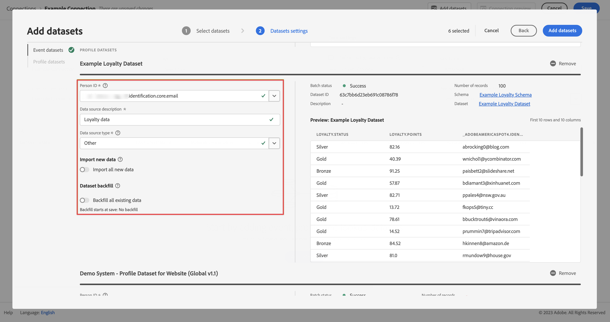

# 摄取和使用流式数据

本快速入门指南介绍了如何将流数据导入 Adobe Experience Platform，然后在 Customer Journey Analytics 中使用这些数据。

要完成此实施，您需要：

- 在 Adobe Experience Platform 中&#x200B;**设置模式和数据集** ，以定义要收集的数据的模型（模式）以及实际收集数据的位置（数据集）。

- 使用 **HTTP API 源连接器**&#x200B;可以轻松地将数据流到 Adobe Experience Platform 中配置的数据集中。

- 在 Customer Journey Analytics 中&#x200B;**设置连接**。此连接应（至少）包含 Adobe Experience Platform 数据集。

- **在 Customer Journey Analytics 中设置数据视图**&#x200B;以定义要在 Analysis Workspace 中使用的量度和维度。

- 在 Customer Journey Analytics 中&#x200B;**设置一个项目**&#x200B;以构建报告和可视化图表。


>[!NOTE]
>
>这是一个关于如何将流数据导入 Adobe Experience Platform 并在 Customer Journey Analytics 中使用的简化指南。强烈建议参考时研究附加信息。

## 设置模式和数据集

要将数据导入 Adobe Experience Platform，首先需要定义要收集的数据。引入 Adobe Experience Platform 的所有数据都必须符合标准的非规范化结构，以便下游功能和特性对其进行识别和操作。体验数据模型 (XDM) 是以模式形式提供此结构的标准框架。

定义模式后，您可以使用一个或多个数据集来存储和管理数据集合。数据集是用于数据集合的存储和管理结构，通常是表格，其中包含模式（列）和字段（行）。

摄取到 Adobe Experience Platform 中的所有数据都必须符合预定义的模式，然后才能作为数据集保存。

### 设置模式

为了快速开始，您需要收集一些忠诚度数据，例如忠诚度 id、忠诚度积分和忠诚度状态。为此，首先需要定义一个模型化该数据的模式。

设置您的模式：

1. 在 Adobe Experience Platform UI 的左边栏中，选择[!UICONTROL 数据管理]中的&#x200B;**[!UICONTROL 模式]**。

2. 选择&#x200B;**[!UICONTROL 创建模式]**。从选项列表中选择 **[!UICONTROL XDM 个人资料]**。

   

   >[!INFO]
   >
   >    个人配置档案模式用于对个人配置档案&#x200B;_属性_（如姓名、电子邮件、性别）建模。Experience Event 模式用于对配置文件的&#x200B;_行为_&#x200B;建模（如页面查看、添加到购物车）。


3. 在[!UICONTROL 无标题模式]屏幕中：

   1. 输入模式的显示名称和（可选）描述。

      

   2. 在[!UICONTROL 字段组]中选择&#x200B;**[!UICONTROL + 添加]**。

      

      字段组是可重用的对象和属性集合，可让您轻松扩展模式。

   3. 在[!UICONTROL 添加字段组]对话框中，从列表中选择&#x200B;**[!UICONTROL 忠诚度详细信息]**&#x200B;字段组。

      

      您可以选择预览按钮，以查看属于该字段组的字段的预览。

      

      选择&#x200B;**[!UICONTROL 返回]**&#x200B;关闭预览。

   4. 选择&#x200B;**[!UICONTROL 添加字段组]**。

4. 在[!UICONTROL 结构]面板中选择模式名称旁边的 **[!UICONTROL +]**。

   

5. 在[!UICONTROL 字段属性]面板中，输入`Identification`作为名称，**[!UICONTROL 识别]**&#x200B;作为[!UICONTROL 显示名称]，选择&#x200B;**[!UICONTROL 对象]**&#x200B;作为[!UICONTROL 类型]和选择&#x200B;**[!UICONTROL 配置核心文件 v2]**&#x200B;作为[!UICONTROL 字段组]。

   

   这会为您的模式添加识别功能。在您的情况下，您希望使用批处理数据中的电子邮件地址来识别忠诚度信息。

   选择&#x200B;**[!UICONTROL 应用]**&#x200B;将此对象添加到您的模式中。

6. 选择刚刚添加的标识对象中的&#x200B;**[!UICONTROL 邮件]**&#x200B;字段，选择&#x200B;**[!UICONTROL 标识]**&#x200B;和&#x200B;**[!UICONTROL 邮件]**&#x200B;和[!UICONTROL 标识命名空间]中的[!UICONTROL 字段属性]面板。

   

   您将电子邮件地址指定为 Adobe Experience Platform Identity 服务可用于组合（拼接）配置文件行为的标识。

   选择&#x200B;**[!UICONTROL 应用]**。您会看到电子邮件属性中显示指纹图标。

7. 选择模式的根级别（使用模式名称），然后选择&#x200B;**[!UICONTROL 配置]**&#x200B;开关。

   系统会提示您启用配置文件的模式。一旦启用，当数据被引入基于此模式的数据集中时，该数据将合并到实时客户配置文件。

   有关详细信息，请参阅[启用模式以在实时客户配置文件中使用](https://experienceleague.adobe.com/docs/experience-platform/xdm/tutorials/create-schema-ui.html?lang=zh-Hans#profile)。

   >[!IMPORTANT]
   >
   >    一旦您保存了为配置文件启用的模式，就不能再为配置文件禁用它。

   

8. 选择&#x200B;**[!UICONTROL 保存]**&#x200B;以保存模式。

您已经创建了一个最小的模式，它可以对可以引入 Adobe Experience Platform 的忠诚度数据进行建模。该模式允许使用电子邮件地址标识配置文件。通过为概要文件启用模式，可以确保流媒体源添加到实时客户配置文件中。

请参阅[在 UI 中创建和编辑模式](https://experienceleague.adobe.com/docs/experience-platform/xdm/ui/resources/schemas.html)，了解有关向模式添加和删除字段组和单个字段的更多信息。

### 设置数据集

使用您的模式，您已经定义了数据模型。您现在必须定义结构来存储和管理该数据。这是通过数据集完成的。

设置您的数据集

1. 在 Adobe Experience Platform UI 的左边栏中，选择[!UICONTROL 数据管理]中的&#x200B;**[!UICONTROL 数据集]**。

2. 选择&#x200B;**[!UICONTROL 创建数据集]**。

   

3. 选择&#x200B;**[!UICONTROL 使用模式创建数据集]**。

   。

4. 选择您之前创建的模式，然后选择 **[!UICONTROL 下一个]**。

5. 为您的数据集命名并（可选）提供描述。

   

6. 选择&#x200B;**[!UICONTROL 完成]**。

7. 选择&#x200B;**[!UICONTROL 配置文件]**&#x200B;开关

   系统会提示您启用配置文件的数据集。启用后，数据集会使用其摄取的数据丰富实时客户配置文件。

   >[!IMPORTANT]
   >
   >    只有当数据集所依附的模式也为配置文件启用时，您才能为配置文件启用数据集。

   

有关如何查看、预览、创建和删除数据集的更多信息，请参阅[数据集 UI 指南](https://experienceleague.adobe.com/docs/experience-platform/catalog/datasets/user-guide.html?lang=zh-Hans)。以及如何为实时客户配置文件启用数据集。


## 设置 HTTP API 流连接

您的源应用程序流式传输符合您创建的模式的数据，并且看起来像下面这样。

```json
{
    ...
    "_demosystem4": {
        "identification": {
            "core": {
                "email": "abrocking0@blog.com",
                "loyaltyId": "793406",
            }
        }
    },
    "loyalty": {
        "loyaltyID": [
            "793406"
        ],
        "points": 82.16,
        "status": "Silver"
    }
    ...
}
```

要将此数据流式传输到您创建的数据集中，您需要为要发送到的数据定义一个流式处理端点。您可以通过定义 HTTP API 源连接器来执行此操作。

要创建 HTTP API 源连接器：

1. 在 Experience Platform UI 的左边栏中，选择[!UICONTROL 源]中的&#x200B;**[!UICONTROL 连接]**。

2. 从 [!UICONTROL 类别] 列表中选择 **[!UICONTROL 数据流]**。

3. 在 [!UICONTROL HTTP API] 磁贴中选择&#x200B;**设置**。

   

4. 在[!UICONTROL 添加数据]屏幕的[!UICONTROL Authentication]步骤中：

   输入 HTTP API 连接的名称和描述。

   选择 **[!UICONTROL XDM 兼容性]**&#x200B;以指示流式传输的数据与现有 XDM 模式兼容。

   选择&#x200B;**[!UICONTROL 连接到源]**。连接成功后，您会看到[!UICONTROL Connected]。

   

   选择&#x200B;**[!UICONTROL 下一步]**&#x200B;以继续。

5. 在[!UICONTROL 添加数据]屏幕的[!UICONTROL 数据流详细信息]步骤中：

   选择&#x200B;**[!UICONTROL 现有数据集]**，从数据集列表中选择您的数据集，然后命名您的[!UICONTROL 数据流名称]。

   

   选择&#x200B;**[!UICONTROL 下一步]**。

6. [!UICONTROL 检查][!UICONTROL 添加数据]屏幕的步骤为您提供了 HTTP API 连接的概览。

   

   选择&#x200B;**[!UICONTROL 完成]**。

7. 您可以看到 HTTP API 流端点的最终定义。

   

您可以复制流式端点 URL 并使用它来配置您的忠诚度应用程序以将数据流式传输到 Adobe Experience Platform 忠诚度数据集中。

请参阅[使用 UI 创建 HTTP API 流链接](https://experienceleague.adobe.com/docs/experience-platform/sources/ui-tutorials/create/streaming/http.html?lang=zh-Hans)以获得更全面的教程，该教程解释了如何使用身份验证、如何在传入数据与您的不兼容时映射数据 XDM 模式以及如何在设置流连接器的过程中创建新数据集。


## 设置连接

要在 Customer Journey Analytics 中使用 Adobe Experience Platform 数据，您需要创建一个连接，其中包含因设置模式、数据集和工作流所产生的数据。

通过创建连接，您可以将 Adobe Experience Platform 中的数据集集成到工作区中。要报告这些数据集，您必须首先在 Adobe Experience Platform 和工作区中的数据集之间建立连接。

创建您的连接：

1. 在 Customer Journey Analytics UI 中，选择顶部导航中的&#x200B;**[!UICONTROL 连接]**。

2. 选择&#x200B;**[!UICONTROL 创建新连接]**。

3. 在[!UICONTROL 无标题连接]屏幕中：

   在[!UICONTROL 连接设置]中命名并描述您的连接。

   从[!UICONTROL 数据设置]中的[!UICONTROL 沙盒]列表中选择正确的沙盒，并从[!UICONTROL 平均每日事件数]列表中选定每日事件数。

   

   选择&#x200B;**[!UICONTROL 添加数据集]**。

   在[!UICONTROL 添加数据集]的[!UICONTROL 选择数据集]步骤中：

   - 选择先前(`Example Loyalty Dataset`)创建的数据集以及要包含在连接中的任何其他数据集。

      

   - 选择&#x200B;**[!UICONTROL 下一步]**。
   在[!UICONTROL 添加数据集]的[!UICONTROL 设置数据集]步骤中：

   - 对于每个数据集：

      - 在 Adobe Experience Platform 中，从在数据集模式中定义的可用身份中选择[!UICONTROL 人员 ID]。

      - 从[!UICONTROL 数据源类型]列表中选择正确的数据源。如果指定&#x200B;**[!UICONTROL 其他]**，则为您的数据源添加描述。

      - 根据您的首选项设置&#x200B;**[!UICONTROL 导入所有新数据]**&#x200B;和&#x200B;**[!UICONTROL 数据集回填现有数据]**。

      

   - 选择&#x200B;**[!UICONTROL 添加数据集]**。
   选择&#x200B;**[!UICONTROL 保存]**。

有关如何创建和管理连接以及如何选择和组合数据集的更多信息，请参阅[连接概述](../connections/overview.md)。

## 设置数据视图

数据视图是 Customer Journey Analytics 专属的容器，通过它，可决定如何解释来自连接的数据。 它指定所有可在 Analysis Workspace 中找到的维度和指标，以及这些维度和指标从哪些列获取其数据。为准备 Analysis Workspace 中的报表而定义数据视图。

创建您的数据视图：

1. 在 Customer Journey Analytics UI 中，选择顶部导航中的&#x200B;**[!UICONTROL 数据视图]**。

2. 选择&#x200B;**[!UICONTROL 创建新数据视图]**。

3. 在[!UICONTROL 配置]步骤中：

   从[!UICONTROL 连接]列表中选择您的连接。

   名称并（可选）描述您的连接。

   

   选择&#x200B;**[!UICONTROL 保存并继续]**。

4. 在[!UICONTROL 组件]步骤中：

   将要包含的任何模式字段和/或标准组件添加到[!UICONTROL 量度]或[!UICONTROL 维度]组件框中。

   

   选择&#x200B;**[!UICONTROL 保存并继续]**。

5. 在[!UICONTROL 设置]步骤中：

   

   保持设置不变并选择&#x200B;**[!UICONTROL 保存并完成]**。

请参阅[数据视图概述](../data-views/data-views.md)，了解有关如何创建和编辑数据视图、哪些组件可供您在数据视图中使用以及如何使用过滤器和会话的更多信息设置。


## 设置项目

Analysis Workspace 是一个灵活的浏览器工具，允许您快速构建分析并基于数据共享见解。您可以使用工作区项目来组合数据组件、表和可视化，以制作分析并与组织中的任何人共享。

要创建您的项目：

1. 在 Customer Journey Analytics UI 中，选择顶部导航中的&#x200B;**[!UICONTROL 项目]**。

2. 选择左侧导航中的&#x200B;**[!UICONTROL 项目]**。

3. 选择&#x200B;**[!UICONTROL 创建项目]**

   

   选择&#x200B;**[!UICONTROL 空白项目]**

   

4. 从列表中选择您的数据视图。

   

5. 开始将维度和量度拖放到[!UICONTROL 面板]中的[!UICONTROL 自由表格]上，以创建您的第一个报告。例如，拖动 `Program Points Balance` 以及 `Page View` 作为量度和 `email` 作为维度，以快速查看访问过您的网站并已加入忠诚度计划收集忠诚度点的个人资料。

   

请参阅 [Analysis Workspace 概述](../analysis-workspace/home.md)，了解有关如何使用组件、可视化和面板创建项目和构建分析的更多信息。

>[!SUCCESS]
>
>您已完成所有步骤。从定义要收集的忠诚度数据（模式）Adobe Experience Platform 中存储忠诚度数据的位置（数据集）开始，您配置了一个 HTTP API 源连接器，以将忠诚度数据直接流到数据集中。您的数据视图定义允许您指定要使用的维度和量度，最后您创建了您的第一个项目来可视化和分析您的数据。
