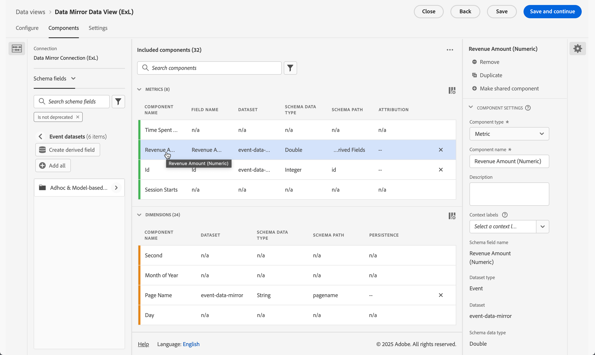

# 镜像并使用关系数据

{{release-limited-testing}}

本快速入门指南介绍如何使用[适用于Customer Journey Analytics的Experience Platform Data Mirror](data-mirror.md)，从Adobe Experience Platform中的Data Warehouse本机解决方案镜像关系数据。 然后在Customer Journey Analytics中使用该数据。

要完成此用例，您需要：

* **使用Data Warehouse本机解决方案**&#x200B;存储您要在Experience Platform中镜像的数据。 然后，将这些数据用于Customer Journey Analytics中的报告和分析。

* **在Experience Platform中设置架构**&#x200B;以定义要镜像的数据的模型（架构）。

* **在Experience Platform中使用源连接器**&#x200B;将镜像数据导入数据集。

* 在 Customer Journey Analytics 中&#x200B;**设置连接**。此连接应（至少）包含您的Experience Platform关系数据集。

* 在 Customer Journey Analytics 中&#x200B;**设置数据视图**&#x200B;以定义要在 Analysis Workspace 中使用的量度和维度。

* 在 Customer Journey Analytics 中&#x200B;**设置一个项目**&#x200B;以构建报告和可视化图表。

适用于Customer Journey Analytics的Experience Platform Data Mirror需要关系架构。


>[!NOTE]
>
>本快速入门指南是一份关于如何在Adobe Experience Platform中镜像关系数据以及在Customer Journey Analytics中使用该数据的简化指南。 强烈建议参考时研究附加信息。

{{relational-model-based}}

## 使用Data Warehouse本机解决方案

本快速入门指南使用[[!DNL Google BigQuery]](datawarehouse.md#google-bigquery)作为Data Warehouse本机解决方案。 其他[支持的解决方案](datawarehouse.md)为[[!DNL Snowflake]](datawarehouse.md#snowflake)和[[!DNL Azure Databricks]](datawarehouse.md#azure-databricks)。

在[!DNL Google BigQuery]内，以下示例数据在名为&#x200B;**[!UICONTROL eventdata]**&#x200B;的表中存储和定期更新。

+++ 示例事件数据的详细信息

| timestamp | id | pagename | 个性化 | trackingcode | 订单 | 收入金额 |
| :---                      |  ---: | :---              | :---            | :---          |   ---: | :---           |
| 2025-03-06T19:15:39+00:00 | 10001 | 主页 | person-1abc123 | abc123 |        |                |
| 2025-03-06T19:15:39+00:00 | 10002 | 确认页面 | person-1abc123 |               | 1 | 174.25 |
| 2025-03-06T19:15:39+00:00 | 10003 | 主页 | person-2def123 | def123 |        |                |
| 2025-03-06T19:15:39+00:00 | 10004 | 主页 | person-3ghi123 | ghi123 |        |                |
| 2025-03-06T19:15:39+00:00 | 10005 | 确认页面 | person-3ghi123 |               | 1 | 149.25 |
| 2025-03-06T19:15:39+00:00 | 10006 | 主页 | person-4abc456 | abc456 |        |                |
| 2025-03-06T19:15:39+00:00 | 10007 | 主页 | person-5def456 | def456 |        |                |
| 2025-03-06T19:15:39+00:00 | 10008 | 主页 | person-6ghi456 | ghi456 |        |                |
| 2025-03-06T19:15:39+00:00 | 10009 | 确认页面 | person-6ghi456 |               | 1 | 159.25 |
| 2025-03-06T19:15:39+00:00 | 10010 | 主页 | person-7abc789 | abc789 |        |                |
| 2025-03-06T19:15:39+00:00 | 10011 | 主页 | person-8def789 | def789 |        |                |
| 2025-03-06T19:15:39+00:00 | 10012 | 主页 | person-9ghi789 | ghi789 |        |                |
| 2025-03-06T19:15:39+00:00 | 10013 | 确认页面 | person-9ghi789 |               | 1 | 124.25 |
| 2025-03-06T19:15:39+00:00 | 10014 | 主页 | person-10abc987 | abc987 |        |                |
| 2025-03-06T19:15:39+00:00 | 10015 | 主页 | person-11def987 | def987 |        |                |
| 2025-03-06T19:15:39+00:00 | 10016 | 主页 | person-12ghi987 | ghi987 |        |                |
| 2025-03-06T19:15:39+00:00 | 10017 | 主页 | person-13abc654 | abc654 |        |                |
| 2025-03-06T19:15:39+00:00 | 10018 | 主页 | person-14def654 | def654 |        |                |
| 2025-03-06T19:15:39+00:00 | 10019 | 主页 | person-15ghi654 | ghi654 |        |                |
| 2025-03-06T19:15:39+00:00 | 10020 | 确认页面 | person-15ghi654 |               | 1 | 174.25 |

+++

该数据存储在具有关联模式的数据库表中。 检查数据库表：

1. 登录到Google BigQuery。
1. 选择&#x200B;**[!UICONTROL BigQuery]** > **[!UICONTROL 工作室]**。
1. 选择您的项目、数据集和表。 在&#x200B;**[!UICONTROL 架构]**&#x200B;选项卡中，您会看到事件数据的架构概述。

   

要检查数据：

1. 选择&#x200B;**[!UICONTROL 查询]**。
1. 在查询编辑器中运行示例查询，其中`project`是项目的名称，`datasets`是数据集的名称：

   ```sql
   SELECT * FROM `project.datasets.eventdata` LIMIT 100
   ```

   

对于Experience Platform Data Mirror for Customer Journey Analytics，必须为更改历史记录启用Data Warehouse本机解决方案中的表。 要验证是否已为更改历史记录启用该表，请执行以下操作：

1. 在查询编辑器中运行以下SQL语句以检查设置，其中`project`是项目的名称，`datasets`是数据集的名称：

   ```sql
   SELECT
      table_name,
      MAX(CASE WHEN option_name = 'enable_change_history' THEN option_value END) AS enable_change_history
   FROM `project.datasets.INFORMATION_SCHEMA.TABLE_OPTIONS`
   WHERE table_name = 'eventdata'
   GROUP BY table_name
   ORDER BY table_name;
   ```

1. 如果结果不是&#x200B;**[!UICONTROL TRUE]**，请使用以下SQL语句启用更改历史记录，其中`project`是项目的名称，`datasets`是数据集的名称：

   ```sql
   ALTER TABLE `project.datasets.eventdata` 
   SET OPTIONS (enable_change_history = TRUE);
   ```

您的Data Warehouse本机解决方案中的表中的数据已准备好用于Experience Platform Data Mirror for Customer Journey Analytics。


## 设置架构

要在Experience Platform中镜像数据，您必须首先定义数据的架构。 您要在Experience Platform中镜像并使用Experience Platform Data Mirror for Customer Journey Analytics的所有数据都必须符合关系架构。

定义用于对此数据进行建模的架构。 设置您的架构：

1. 在Adobe Experience Platform UI的左边栏中，选择&#x200B;**[!UICONTROL 数据管理]**&#x200B;中的&#x200B;**[!UICONTROL 架构]**。

1. 选择&#x200B;**[!UICONTROL 创建架构]**。
1. 从下拉菜单中选择&#x200B;**[!UICONTROL 关系]**。
1. 如果您看到一个弹出窗口，其中提供了在&#x200B;**[!UICONTROL 手动创建]**&#x200B;或&#x200B;**[!UICONTROL 上传DDL文件]**&#x200B;之间选择的选项：
   1. 选择&#x200B;**[!UICONTROL 选择手动创建]**。

      

   1. 选择&#x200B;**[!UICONTROL 下一步]**。
1. 在&#x200B;**[!UICONTROL 架构]** > **[!UICONTROL 创建关系架构]**&#x200B;界面中：
   1. 输入&#x200B;**[!UICONTROL 架构显示名称]**。 例如：`Sample Event Feed Schema`。
   1. 输入&#x200B;**[!UICONTROL 描述]**。 例如：`Sample event feed schema for a relational schema`。
   1. 选择&#x200B;**[!UICONTROL 时间序列]**&#x200B;作为&#x200B;**[!UICONTROL 架构行为]**。 您为基于时间序列的数据选择&#x200B;**[!UICONTROL 时间序列]**，为基于记录的数据选择&#x200B;**[!UICONTROL 记录]**。 行为定义架构的结构和包含的属性。

      适用于Customer Journey Analytics的Experience Platform Data Mirror主要用于时间序列数据（例如事件数据）。

      

   1. 选择&#x200B;**[!UICONTROL 完成]**。

1. 在&#x200B;**[!UICONTROL 架构]** > **[!UICONTROL 示例事件馈送架构]**&#x200B;界面中，您会看到一条警告，指出关系架构支持作为更改行的摄取。

   

   作为更改行的摄取也称为更改数据捕获(CDC)。 要支持变更数据捕获，架构需要：

   * 主键。
   * 版本描述符。
   * 时间序列数据的时间戳描述符。

1. 选择旁边的&#x200B;**[!UICONTROL AddCircle]**&#x200B;以开始向架构添加字段。 将以下具有数据类型和附加属性的字段添加到架构。

   | 字段名称 | 显示名称 | 类型 | 其他属性 |
   |---|---|---|---|
   | `id` | `Id` | **[!UICONTROL 整数]** | 版本描述符 |
   | `orders` | `Orders` | **[!UICONTROL 整数]** | |
   | `pagename` | `Page Name` | **[!UICONTROL 字符串]** | |
   | `personid` | `Person Id` | **[!UICONTROL 字符串]** | 主键<br/>标识<br/>为标识命名空间选择CRMID。 |
   | `revenueamount` | `Revenue Amount` | **[!UICONTROL 双精度]** | |
   | `timestamp` | `Timestamp` | **[!UICONTROL 日期时间]** | 时间戳描述符 |
   | `trackingcode` | `Tracking Code` | **[!UICONTROL 字符串]** | |


   * **[!UICONTROL id]**&#x200B;字段配置为&#x200B;**[!UICONTROL 版本描述符]**。

     

   * 已将&#x200B;**[!UICONTROL personid]**&#x200B;字段与&#x200B;**[!UICONTROL 时间戳]**&#x200B;一起配置为&#x200B;**[!UICONTROL 主键]**。 选择 **[!UICONTROL 创建组合主键]**&#x200B;以创建组合键。

     

     **[!UICONTROL personid]**&#x200B;字段也配置为&#x200B;**[!UICONTROL 标识]**，将&#x200B;**[!UICONTROL CRMID]**&#x200B;配置为&#x200B;**[!UICONTROL 标识命名空间]**。

     

   * 已将&#x200B;**[!UICONTROL timestamp]**&#x200B;字段与&#x200B;**[!UICONTROL personid]**&#x200B;字段一起配置为&#x200B;**[!UICONTROL 主键]**。 **[!UICONTROL 时间戳]**&#x200B;字段也配置为&#x200B;**[!UICONTROL 时间戳描述符]**。 您只需为时间序列关系数据将字段定义为&#x200B;**[!UICONTROL 时间戳描述符]**&#x200B;即可。

     


   如果您已正确定义&#x200B;**[!UICONTROL 主键]**、**[!UICONTROL 版本描述符]**&#x200B;和&#x200B;**[!UICONTROL 时间戳描述符]**，则架构定义顶部的警告将消失。

1. 选择&#x200B;**[!UICONTROL 保存]**&#x200B;以保存架构。


## 使用源连接器

使用源连接器将Data Warehouse本机解决方案连接到Experience Platform。

在Experience Platform界面中：

1. 选择&#x200B;**[!UICONTROL 源]**。
1. 选择或搜索&#x200B;**[!UICONTROL Google BigQuery]**。
1. 选择&#x200B;**[!UICONTROL 添加数据]**。

添加数据向导将指导您完成以下步骤，将数据从[!DNL Google BigQuery]中的表连接到Experience Platform。

### 身份验证

在&#x200B;**[!UICONTROL 身份验证]**&#x200B;步骤中，选择：

* **[!UICONTROL 现有帐户]**(您已设置Google BigQuery的帐户)。 继续执行[选择数据](#select-data)步骤。
* 需要连接到Google BigQuery时&#x200B;**[!UICONTROL 新帐户]**。
   1. 指定&#x200B;**[!UICONTROL 帐户名]**&#x200B;和（可选）**[!UICONTROL 描述]**。
   1. 选择您的&#x200B;**[!UICONTROL 身份验证类型]**： **[!UICONTROL 基本身份验证]**&#x200B;或&#x200B;**[!UICONTROL 服务身份验证]**。 根据您的选择，提供所需的输入。
   1. 选择&#x200B;**[!UICONTROL 连接到源]**

      

      已验证您的连接。  **[!UICONTROL Connected]**&#x200B;表示连接成功。

   1. 选择&#x200B;**[!UICONTROL 下一步]**。

  有关在使用[Azure Databricks](https://experienceleague.adobe.com/en/docs/experience-platform/sources/connectors/databases/databricks)或[Snowflake](https://experienceleague.adobe.com/en/docs/experience-platform/sources/connectors/databases/snowflake)连接器时如何连接和身份验证的详细信息，请参阅Experience Platform文档。


### 选择数据

在&#x200B;**[!UICONTROL 选择数据]**&#x200B;步骤中：

1. 从表列表中选择表。 例如： **[!UICONTROL eventdata]**。

   

   您会看到为验证而显示的数据示例。

1. 选择&#x200B;**[!UICONTROL 下一步]**&#x200B;以继续。


### 数据流详细信息

在&#x200B;**[!UICONTROL 数据流详细信息]**&#x200B;步骤中：

1. 选择&#x200B;**[!UICONTROL 启用变更数据捕获]**。 显示&#x200B;**[!UICONTROL 变更数据捕获要求]**&#x200B;信息框，其中包含更多信息。
1. 为&#x200B;**[!UICONTROL 目标数据集]**&#x200B;选择&#x200B;**[!UICONTROL 新数据集]**&#x200B;以创建包含镜像数据的新数据集。
1. 输入&#x200B;**[!UICONTROL 输出数据集名称]**。 例如：`event-data-mirror`。
1. 从&#x200B;**[!UICONTROL 架构]**&#x200B;下拉菜单中选择之前创建的关系架构。 例如：**[!UICONTROL 示例事件信息源架构]**。

   

1. 指定其他详细信息。
1. 选择&#x200B;**[!UICONTROL 下一步]**。


### 映射

在&#x200B;**[!UICONTROL 映射]**&#x200B;步骤中：

1. 映射字段。 从Google BigQuery中的架构(**[!UICONTROL Source数据]**)到您在Experience Platform中定义的架构中的字段（**[!UICONTROL 目标字段]**）。

   

1. 如果所有字段均正确映射，请选择&#x200B;**[!UICONTROL 下一步]**&#x200B;以继续。


### 日程计划

在&#x200B;**[!UICONTROL 计划]**&#x200B;步骤中：

1. 指定&#x200B;**[!UICONTROL 频率]**&#x200B;和&#x200B;**[!UICONTROL 间隔]**&#x200B;以计划镜像数据的同步。
1. 为计划指定&#x200B;**[!UICONTROL 开始时间]**。

   

1. 选择&#x200B;**[!UICONTROL 下一步]**&#x200B;以继续。


### 审核

在&#x200B;**[!UICONTROL 审核]**&#x200B;步骤中。

1. 查看源连接器的配置。

   

1. 选择&#x200B;**[!UICONTROL 完成]**。 您将被定向到配置的数据流。

   


## 设置连接

在本快速入门指南中，您将创建一个新连接以使用来自Experience Platform的镜像数据。 或者，可以将镜像数据添加到现有连接中。

在Customer Journey Analytics界面中：

1. 从&#x200B;**[!UICONTROL 数据管理]**&#x200B;菜单中选择&#x200B;**[!UICONTROL 连接]**。
1. 选择&#x200B;**[!UICONTROL 创建新连接]**。
1. 指定所需的&#x200B;**[!UICONTROL 连接名称]**、**[!UICONTROL 沙盒]**、**[!UICONTROL 平均每日事件数]**&#x200B;以及其他可选参数。
1. 选择&#x200B;**[!UICONTROL 添加数据集]**。

   1. 在&#x200B;**[!UICONTROL 添加数据集]**&#x200B;的&#x200B;**[!UICONTROL 选择数据集]**&#x200B;步骤中：

      1. 选择包含镜像数据的数据集。 例如： **[!UICONTROL event-data-mirror]**。 数据集具有&#x200B;**[!UICONTROL 关系]**&#x200B;作为&#x200B;**[!UICONTROL 数据集类型]**。

         

      1. 添加与连接相关的任何其他数据集。
      1. 选择&#x200B;**[!UICONTROL 下一步]**。

   1. 在&#x200B;**[!UICONTROL 添加数据集]**&#x200B;的&#x200B;**[!UICONTROL 数据集设置]**&#x200B;步骤中：

      对于&#x200B;**[!UICONTROL event-data-mirror]**&#x200B;关系数据集

      1. 选择&#x200B;**[!UICONTROL 事件]**&#x200B;作为&#x200B;**[!UICONTROL 数据集类型]**。
      1. 选择&#x200B;**[!UICONTROL 人员ID]**&#x200B;字段作为&#x200B;**[!UICONTROL 人员ID]**。
      1. **[!UICONTROL 时间戳]**&#x200B;自动填充为&#x200B;**[!UICONTROL 时间戳]**。
      1. 选择&#x200B;**[!UICONTROL 其他]**&#x200B;作为&#x200B;**[!UICONTROL 数据源类型]**。
      1. 输入`Google BigQuery Event Data`作为&#x200B;**[!UICONTROL 数据源描述]**。
      1. 指定其他详细信息，如&#x200B;**[!UICONTROL 导入所有新数据]**&#x200B;和&#x200B;**[!UICONTROL 回填所有现有数据]**。

         

      （可选）指定其他数据集的详细信息。

   1. 选择&#x200B;**[!UICONTROL 添加数据集]**。
1. 选择&#x200B;**[!UICONTROL 保存]**。

创建[连接](/help/connections/overview.md)后，您可以执行各种管理任务。 例如[选择和组合数据集](/help/connections/combined-dataset.md)、[检查连接数据集的状态以及数据摄取的状态](/help/connections/manage-connections.md)等等。


## 设置数据视图

创建您的数据视图：

1. 在Customer Journey Analytics界面中，从顶部菜单中选择&#x200B;**[!UICONTROL 数据视图]**（可选）从&#x200B;**[!UICONTROL 数据管理]**&#x200B;中选择。

2. 选择&#x200B;**[!UICONTROL 创建新数据视图]**。

3. 在&#x200B;**[!UICONTROL 配置]**&#x200B;步骤中：

   1. 从&#x200B;**[!UICONTROL 连接]**&#x200B;列表中选择您的连接。

   1. 名称并（可选）描述您的连接。

   1. 选择&#x200B;**[!UICONTROL 保存并继续]**。

4. 在&#x200B;**[!UICONTROL 组件]**&#x200B;步骤中：

   1. 将您要包含的任何架构字段和/或标准组件添加到&#x200B;**[!UICONTROL METRICS]**&#x200B;或&#x200B;**[!UICONTROL DIMENSIONS]**&#x200B;组件框中。 确保从包含镜像数据的数据集中添加相关字段。 要访问这些字段，请执行以下操作：

      1. 选择&#x200B;**[!UICONTROL 事件数据集]**。
      1. 选择&#x200B;**[!UICONTROL 临时和关系字段]**。
      1. 将关系架构中的字段拖放到&#x200B;**[!UICONTROL METRICS]**&#x200B;或&#x200B;**[!UICONTROL DIMENSIONS]**&#x200B;上。

         

   1. 为不具有相应类型、格式不正确或由于其他原因要修改的字段定义派生字段。 例如，对于&#x200B;**[!UICONTROL 收入金额]**。

      1. 选择&#x200B;**[!UICONTROL 创建派生字段。]**
      1. 在派生字段编辑器中：
         1. 定义新的`Revenue Amount (Numeric)`字段，如下所示。

            

         1. 选择&#x200B;**[!UICONTROL 保存]**。
      1. 将新的&#x200B;**[!UICONTROL 收入金额（数字）]**&#x200B;派生字段拖放到&#x200B;**[!UICONTROL METRICS]**&#x200B;中。

         

   1. 选择&#x200B;**[!UICONTROL 保存并继续]**。

5. 在&#x200B;**[!UICONTROL 设置]**&#x200B;步骤中：

   保持设置不变并选择&#x200B;**[!UICONTROL 保存并完成]**。

有关如何创建和编辑数据视图的更多信息，请参阅[数据视图概述](../data-views/data-views.md)。 以及在数据视图中使用哪些组件以及如何使用区段和会话设置。


## 设置项目

Analysis Workspace是一款灵活的浏览器工具，允许您快速构建分析并根据数据分享见解。 您可以使用工作区项目来组合数据组件、表和可视化，以制作分析并与组织中的任何人共享。

要创建您的项目：

1. 在Customer Journey Analytics界面中，从顶部菜单中选择&#x200B;**[!UICONTROL Workspace]**。

2. 选择左侧导航中的&#x200B;**[!UICONTROL 项目]**。

3. 选择&#x200B;**[!UICONTROL 创建项目]**。 在弹出窗口中：


   1. 选择&#x200B;**[!UICONTROL 空白Workspace项目]**。

   1. 选择&#x200B;**[!UICONTROL 创建]**。


4. 在&#x200B;**[!UICONTROL 新项目]**&#x200B;工作区中，确保已选择您的[数据视图](#set-up-a-data-view)。 该数据视图链接到包含镜像数据的[连接](#set-up-a-connection)。

5. 要创建您的第一个报表，请将维度和量度拖放到&#x200B;**[!UICONTROL 自由格式]**&#x200B;面板的&#x200B;**[!UICONTROL 自由格式表]**&#x200B;上。 例如，将&#x200B;**[!UICONTROL 收入金额（数字）]**&#x200B;拖动到&#x200B;**[!UICONTROL _将量度拖动到此处_]**。 并拖动&#x200B;**[!UICONTROL PersonId]**&#x200B;并将该字段放在第一列标题上。 根据需要进行其他调整。

   最终结果是基于源自Google BigQuery表的镜像数据的用户档案及其收入概述。

   

请参阅 [Analysis Workspace 概述](../analysis-workspace/home.md)，了解有关如何使用组件、可视化和面板创建项目和构建分析的更多信息。

>[!SUCCESS]
>
>您已完成所有步骤。您首先定义要从数据仓库本机解决方案中收集哪些镜像数据（架构）。 以及将该数据（数据集）存储在Experience Platform中的什么位置。 您已配置相应的源连接器，以便在Experience Platform中为您提供镜像数据。 您在Customer Journey Analytics中定义了一个连接，以使用镜像的事件数据和（可选）其他数据。 通过数据视图定义，可指定要从镜像数据中使用的维度和量度。 最后，您创建了第一个项目，用于可视化和分析镜像数据。
