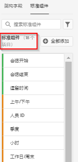

# 标准组件参考

CJA 中的大多数维度和指标都基于您 Adobe Experience Platform 数据集中的架构元素。但是，无论使用什么连接，都有若干组件可添加到数据视图。

[!UICONTROL 标准组件]不是从数据集架构字段生成的组件，而是由系统生成的组件。必须具有某些系统组件以利于 Analysis Workspace 中的报表功能，而其他系统组件为可选。

## 必需的标准组件

默认情况下，将这些必需的标准组件添加到每个数据视图。它们对于 Customer Journey Analytics 提供的报表功能不可或缺。

| 组件名称 | 维度或量度 | 注释 |
| --- | --- | --- |
| [!UICONTROL 人员] | 量度 | 基于在[!UICONTROL 连接]中指定的人员 ID。 |
| [!UICONTROL 会话] | 量度 | 基于数据视图的会话设置。 |
| [!UICONTROL 事件] | 量度 | 来自[!UICONTROL 连接]中所有事件数据集的行数。 |
| [!UICONTROL 分钟] | 维度 | 发生给定事件的那一分钟（已向下取整）。第一个维度项是日期范围中的第一分钟，最后一个维度项是日期范围中的最后一分钟。 |
| [!UICONTROL 小时] | 维度 | 发生给定事件的那一小时（已向下取整）。第一个维度项是日期范围中的第一小时，最后一个维度项是日期范围中的最后一小时。 |
| [!UICONTROL 日] | 维度 | 发生给定事件的那一天。第一个维度项是日期范围内的第一天，最后一个维度项是日期范围内的最后一天。 |
| [!UICONTROL 周] | 维度 | 发生给定事件的那一周。第一个维度项是日期范围内的第一周，最后一个维度项是日期范围内的最后一周。 |
| [!UICONTROL 月] | 维度 | 发生给定事件的那一个月。第一个维度项是日期范围内的第一个月，最后一个维度项是日期范围内的最后一个月。 |
| [!UICONTROL 季度] | 维度 | 发生给定事件的那一季。第一个维度项是日期范围内的第一个季度，最后一个维度项是日期范围内的最后一个季度。 |
| [!UICONTROL 年] | 维度 | 发生给定事件的那一年。第一个维度项是日期范围中的第一年，最后一个维度项是日期范围中的最后一年。 |

## 可选标准组件

可在&#x200B;**[!UICONTROL 数据视图]**>**[!UICONTROL 编辑数据视图]**>**[!UICONTROL 组件]**&#x200B;选项卡 >**[!UICONTROL 标准组件]**&#x200B;选项卡下找到可选标准组件。

| 组件名称 | 维度或量度 | 注释和值 |
| --- | --- | --- |
| [!UICONTROL 上午/下午] | 时间划分维度 | 上午或下午 |
| [!UICONTROL 批次 ID] | 维度 | 表示某个[!UICONTROL 事件]所属的 Experience Platform 批次。 |
| [!UICONTROL 数据集 ID] | 维度 | 表示某个[!UICONTROL 事件]所属的 Experience Platform 数据集。 |
| [!UICONTROL 日期] | 时间划分维度 | 1 日至 31 日 |
| [!UICONTROL 每周时间] | 时间划分维度 | 星期一、星期二、星期三、星期四、星期五、星期六、星期日 |
| [!UICONTROL 每年的某一天] | 时间划分维度 | 第 1 天至第 366 天 |
| [!UICONTROL 小时] | 时间划分维度 | 0 时至 23 时 |
| [!UICONTROL  月份] | 时间划分维度 | 一月 - 十二月 |
| [!UICONTROL 人员 ID] | 维度 | Experience Platform 中定义的每个数据集架构，可以拥有自己定义的一个或多个标识集，并与命名空间关联。其中任何标识都可用作人员 ID。示例包括 Cookie ID、拼接 ID、用户 ID、跟踪代码等。[!UICONTROL 个人 ID] 维度是合并数据集的基础，在 CJA 中标识独特访客。
可能的使用案例包括：<ul><li>对特定人员 ID 值创建筛选条件，以将所有内容向下筛选到该用户的行为。</li><li>调试：确保特定 Cookie ID（或特定客户 ID）的数据存在。</li><li>确定致电给呼叫中心的用户。</li></ul> |
| [!UICONTROL 人员 ID 命名空间] | 维度 | [!UICONTROL 人员 ID] 由哪种类型的 ID 组成。示例：`email address`、`cookie ID`、`Analytics ID` 等。 |
| [!UICONTROL 季度] | 时间划分维度 | 第一季度、第二季度、第三季度和第四季度 |
| [!UICONTROL 会话开始] | 量度 | 会话的第一个事件的事件数。用在筛选器定义（例如“[!UICONTROL 会话开始]”）中时，它会逐渐筛选以仅显示每个会话的第一个事件。 |
| [!UICONTROL 会话结束] | 量度 | 会话的最后一个事件的事件数。与[!UICONTROL 会话开始]类似，它也用在筛选器定义中，用以逐渐筛选以仅显示每个会话的最后一个事件。 |
| [!UICONTROL 逗留时间（秒）] | 量度 | 累计两个不同的维度值之间的时间。 |
| [!UICONTROL 每个事件逗留时间] | 维度 | 将[!UICONTROL 耗时]指标装入[!UICONTROL “事件”]桶。 |
| [!UICONTROL 每个会话逗留时间] | 维度 | 将[!UICONTROL 耗时]指标装入[!UICONTROL 会话]桶。 |
| [!UICONTROL 每人逗留时间] | 维度 | 将[!UICONTROL 耗时]指标装入[!UICONTROL 人员]桶。 |
| [!UICONTROL 周末]/[!UICONTROL 工作日] | 时间划分维度 | 周末或工作日 |
