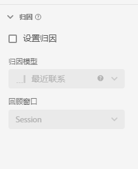

# 归因组件设置

通过“归因”，可设置指标的默认归因模型。在 Analysis Workspace 中工作时，可忽略给定指标的归因模型。

| 设置 | 描述/用例 |
| --- | --- |
| [!UICONTROL 设置归因] | 使用此指标时启用默认归因模型。可以在[!UICONTROL 自由格式表格]或计算量度中覆盖此默认值。 |
| [!UICONTROL 归因模型] | 使您可指定要使用哪个默认的[归因模型](/help/analysis-workspace/attribution/models.md)。默认为[!UICONTROL 最近联系]。选项有：最近联系、首次联系、线性、参与率、同一接触、U 形、J 曲线、反向 J、时间衰减、自定义、算法。其中一些选项会创建需要填写的其他字段，例如“自定义”或“时间衰减”。您可以使用同一字段创建多个量度，这意味着您可以基于架构中的同一收入字段创建一个[!UICONTROL 最近联系]收入量度和一个[!UICONTROL 首次联系]收入量度。 |
| [!UICONTROL 回顾时间范围] | 使您可指定某个指标的默认回溯时段。选项有：[!UICONTROL 人员]（报告窗口）、[!UICONTROL 会话]、[!UICONTROL 自定义]。选择[!UICONTROL 自定义]时，您还可以选择天数/周数/月数/等（最长为 90 天），和 [!UICONTROL Attribution IQ] 一样。可使用同一架构字段创建多个指标，但每个指标都具有单独的回溯时段。 |
