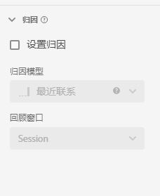

# 归因组件设置 {#attribution-component-settings}

<!-- markdownlint-disable MD034 -->

>[!CONTEXTUALHELP]
>id="dataview_component_metric_attribution"
>title="归因"
>abstract="配置应用于报告中某个量度的默认归因模型。"

<!-- markdownlint-enable MD034 -->

归因功能可让您自定义维度项如何获得成功事件的点数。

例如：

1. 网站访客单击指向您的某个产品页面的付费搜索链接。 他们将产品添加到购物车，但没有购买。
2. 第二天，他们在社交媒体上看到了一位朋友的帖子。 他们点击链接，然后完成购买。

在某些报告中，您可能希望将订单归因到“付费”搜索。 在其他报告中，您可能希望将订单归因到社交。 通过归因，您能够控制报告的这一方面。

## 设置组件的归因模型

您可以通过更新数据视图中给定组件的设置来更改该组件的默认归因模型。 只要在Analysis Workspace中使用组件，这样做就会覆盖该组件的归因模型。

>[!NOTE]
>
>对量度启用非默认归因模型时，请考虑以下事项：
>
>* **在具有&#x200B;*单个维度*：**&#x200B;的报表中使用量度时，该量度的归因将覆盖在维度上设置的分配模型。 例如，具有“首次接触”归因的量度将覆盖“最近”维度分配。
>
>* **在具有&#x200B;*多个维度的报表中使用量度时*：**&#x200B;该量度的归因将应用于每个维度的分配模型之上。 例如，具有“首次接触”归因的量度应用于“最近”维度分配。
>
> 有关分配的详细信息，请参阅[持久性组件设置](/help/data-views/component-settings/persistence.md)。

要更新组件的默认归因模型：

1. 转到包含您要更新其默认归因模型的组件的数据视图。

1. 选择组件，然后展开屏幕右侧的&#x200B;**[!UICONTROL 归因]**&#x200B;部分。

   

1. 选择&#x200B;[!UICONTROL **设置归因**]，然后选择[归因模型](#attribution-models)、[容器](#container)和[回顾](#lookback-window)窗口。

1. 选择&#x200B;[!UICONTROL **保存并继续**]。

>[!TIP]
>
>如果您的组织要求某个量度具有多个归因设置，您可以执行以下操作之一：
>
> * 使用每个所需的归因设置复制数据视图中的量度。 您可以在数据视图中多次加入相同的量度，以为每个量度提供不同的设置。 确保正确地为每个量度赋予标签，以便分析师在生成报告时了解这些量度之间的差异。
>
> * 覆盖 Analysis Workspace 中的量度。 在量度的[列设置](/help/analysis-workspace/visualizations/freeform-table/column-row-settings/column-settings.md)中，选择&#x200B;**[!UICONTROL 使用非默认归因模型]**&#x200B;来更改该特定报告的量度归因模型和回顾时间范围。

## 归因模型 {#attribution-models}

<!-- markdownlint-disable MD034 -->

>[!CONTEXTUALHELP]
>id="dataviews_component_attribution_attributionmodels"
>title="模型"
>abstract="选择量度的归因模型。"

<!-- markdownlint-enable MD034 -->

{{attribution-models-details}}

## 容器

{{attribution-container}}

## 回顾窗口

{{attribution-lookback-window}}

## 示例

{{attribution-example}}
