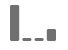

# 归因组件设置

通过归因，您可以自定义维度项目获得成功事件点数的方式。 例如：

1. 您网站的用户单击指向您的某个产品页面的付费搜索链接。 他们将产品添加到购物车，但不购买。
2. 第二天，他们看到了朋友的社交媒体帖子。 他们单击链接，然后完成购买。

在某些报告中，您可能希望将订单归因到“付费”搜索。在其他报告中，您可能希望将订单归因到社交。通过归因，您能够控制报告的这一方面。

通过此数据视图组件设置，可为量度设置默认归因模型。 在 Analysis Workspace 中工作时，可忽略给定指标的归因模型。

如果您的组织要求一个量度有多个归因设置，您可以执行以下操作之一：

* 使用每个所需的归因设置复制数据视图中的量度。 您可以在一个数据视图中包含多次相同的量度，从而为每个量度提供不同的设置。 确保适当地标记每个量度，以便分析师在生成报表时了解这些量度之间的差异。
* 覆盖Analysis Workspace中的量度。 在量度中 [列设置](/help/analysis-workspace/visualizations/freeform-table/column-row-settings/column-settings.md)，选择 **[!UICONTROL 使用非默认归因模型]** 以更改该特定报表的量度归因模型和回顾时间范围。

## 归因模型

归因模型确定在量度的回顾时间范围内看到多个值时哪些维度项目获得量度的点数。 仅当回顾时间范围内设置了多个维度项时，归因模型才适用。 如果仅设置单个维度项目，则无论使用何种归因模型，该维度项目都会获得100%的点数。

| 图标 | 归因模型 | 定义 |
| :---: | :--- | --- |
|  | 最后接触 | 将 100% 的点数分给转化前最近发生的接触点。此归因模型通常是未另外指定归因模型的任何量度的默认值。 组织通常在转化时间相对较短的情况下使用此模型，例如分析内部搜索关键词。 |
|  | 首次接触 | 将100%的点数分给在归因回顾时间范围中看到的首次接触点。 组织通常使用此模型来了解品牌知名度或客户获取。 |
|  | 线性 | 将相同的点数分给促成转化的每个接触点。当转化周期较长或需要更频繁的客户参与时，此功能非常有用。 组织通常使用此归因模型来衡量移动应用程序通知的有效性或用于基于订阅的产品。 |
|  | 参与率 | 将 100% 的点数分给所有独特的接触点。由于每个接触点获得100%的点数，因此量度数据相加通常超过100%。 如果某个维度项目出现多次，从而导致转化，则会删除重复值至100%。 如果您想要了解客户最容易接触到哪些接触点，则此归因模型非常理想。 媒体组织通常使用此模型来计算内容周转率。 零售组织通常使用此模型来了解其网站的哪些部分对转化至关重要。 |
|  | 同一接触 | 将100%的点数分给发生转化的同一事件。 如果接触点未在与转化相同的事件中发生，则它将存储在“无”下。 这种归因模型有时等于根本没有归因模型。 如果您不希望从影响量度如何向维度项目提供点数的其他事件中获得值，则此选项很有价值。 产品或设计团队可以使用此模型来评估发生转化的页面的有效性。 |
|  | U 型 | 将 40% 的点数分给首次交互，40% 的点数分给最后交互，并将剩余 20% 的点数分给这两次交互之间的任意接触点。对于具有单一接触点的转化，它将分得 100% 的点数。对于具有两个接触点的转化，两个接触点各分得 50% 的点数。此归因模型最适合以下场景：您最重视第一个和最后一个交互，但不希望完全消除两者之间的其他交互。 |
|  | J 曲线 | 将 60% 的点数分给最后一次交互，20% 的点数分给首次交互，并将剩余 20% 的点数分给这两次交互之间的任意接触点。对于具有单一接触点的转化，它将分得 100% 的点数。对于具有两个接触点的转化，将 75% 的点数分给最后一次交互，将 25% 的点数分给首次交互。与U型图类似，此归因模型更支持首次交互和最后交互，但更支持最后交互。 |
|  | 反向 J | 将 60% 的点数分给首次接触点，20% 的点数分给最后接触点，并将剩余 20% 的点数分给这两次接触点之间的任意接触点。对于具有单一接触点的转化，它将分得 100% 的点数。对于具有两个接触点的转化，将 75% 的点数分给首次交互，将 25% 的点数分给最后一次交互。与J形模型类似，此归因模型支持首次交互和最后一次交互，但更支持首次交互。 |
|  | 时间衰减 | 采用具有自定义半衰期参数的指数衰减，默认值为 7 天。每个渠道的权重，取决于在接触点启动与最终转化之间流逝的时间。用于确定点数的公式是 `2^(-t/halflife)`，其中 `t` 是接触点与转化之间流逝的时间。然后，所有接触点均被标准化为 100%。非常适用于要针对特定重要事件测量归因的情况。 发生此事件后发生转化的时间越长，获得的点数就越少。 |
|  | 自定义 | 允许您指定要赋予给第一个接触点、最后一个接触点以及两者之间的任何接触点的权重。 即便输入的自定义数字相加之和并不等于 100，指定的值也会被标准化为 100%。对于具有单一接触点的转化，它将分得 100% 的点数。对于具有两个接触点的交互，中间参数会被忽略。然后，首次接触点和最后接触点会被标准化为 100%，并相应地分配点数。此模型非常适用于希望完全控制归因模型并具有其他归因模型无法满足的特定需求的分析人员。 |
|  | 算法 | 使用统计技术动态确定所选量度的最佳点数分配。归因算法基于合作博弈理论中的 Harsanyi Dividend 算法。Harsanyi Dividend 算法是对“沙普利值”解决方案（以诺贝尔经济学奖获得者罗伊德·沙普利 (Lloyd Shapley) 命名）的推广形式，用于为对结果具有不同贡献的各参与者分配功能值（点数）。 在高层面上，归因的计算方式是各参与者组成联盟，盈余必须公平分配。 递归地，每个联盟的剩余价值分配取决于先前由每个子联盟（或先前参与的维度项目）产生的剩余价值。 有关更多详细信息，请参阅John Harsanyi和Lloyd Shapley的原文： 夏普利，劳埃德S（1953年）。 A value for n-person games. *Contributions to the Theory of Games, 2(28)*, 307-317. Harsanyi, John C. (1963). A simplified bargaining model for the n-person cooperative game. *International Economic Review 4(2)*, 194-220. |

{style="table-layout:auto"}

## 回顾时间范围

回顾时间范围是指转化应回顾以包含接触点所花费的时间。如果在回顾窗口之外设置维度项，则该值不会包含在任何归因计算中。

* **14天**：自转化发生之日起最多14天进行回顾。
* **30天**：自转化发生之日起最多30天内进行回顾。
* **60天**：自转化发生之日起最多60天内进行回顾。
* **90天**：自转化发生之日起最多90天进行回顾。
* **会话**：回顾到发生转化的会话之初。 会话回顾时间范围遵循修改后的时间范围 [会话超时](../create-dataview.md#session-settings).
* **人员（报告窗口）**：回顾到当前日期范围当月1日的所有访问。 例如，如果报表日期范围为 9 月 15 日到 9 月 30 日，则人员回顾日期范围将为 9 月 1 日到 9 月 30 日。如果您使用此回顾窗口，则有时可以看到维度项目归因到超出报告窗口的日期。
* **自定义时间：** 允许您从发生转化时设置自定义回顾时间范围。 您可以指定分钟数、小时数、天数、周数、月数或季度数。 例如，如果转化发生在2月20日，则五天的回顾时间范围将评估归因模型中2月15日至2月20日的所有维度接触点。

## 示例

请仔细研究下面的示例：

1. 9月15日，有人通过付费搜索广告访问您的网站，然后离开。
2. 9月18日，此人通过朋友提供的社交媒体链接再次访问您的网站。 他将多个物品添加到购物车，但没有购买任何物品。
3. 9 月 24 日，您的营销团队向他们发送一封电子邮件，其中包含购物车中某些物品的优惠券。他应用了优惠券，但访问了其他几个网站，查看是否有其他优惠券可用。他通过展示广告找到另一个网站，并最终购买了价值 50 美元的物品。

根据您的回顾窗口和归因模型，渠道会收到不同比例的点数。以下是一些典型的有趣示例：

* 使用 **首次接触** 和 **会话回顾窗口**，归因仅考虑第三次访问。 在电子邮件与展示广告之间，电子邮件是首次接触点，因此电子邮件在 50 美元的购买中获得 100% 的点数。
* 使用 **首次接触** 和 **人员回顾窗口**，归因会考虑所有三次访问。 付费搜索是首次接触点，因此它在 50 美元的购买中获得 100% 的点数。
* 使用 **线性** 和 **会话回顾窗口**，点数由电子邮件和展示广告平分。 这两个渠道各自获得贡献 25 美元的点数。
* 使用 **线性** 和 **人员回顾窗口**，点数由付费搜索、社交、电子邮件和展示广告平分。 每个渠道各自获得此次购买中贡献 12.50 美元的点数。
* 使用 **J型** 和 **人员回顾窗口**，点数由付费搜索、社交、电子邮件和展示广告平分。
   * 将 60% 的点数分给展示广告，其贡献价值是 30 美元。
   * 将 20% 的点数分给付费搜索，贡献价值是 10 美元。
   * 剩余的 20% 点数分给社交和电子邮件，二者的贡献价值均为 5 美元。
* 使用 **时间衰减** 和 **人员回顾窗口**，点数由付费搜索、社交、电子邮件和展示广告平分。 使用默认的 7 天半衰期：
   * 显示接触点与转化之间的间隔为0天。 `2^(-0/7) = 1`
   * 电子邮件接触点与转化之间的间隔为零天。 `2^(-0/7) = 1`
   * 社交接触点与转化之间的间隔为6天。 `2^(-6/7) = 0.552`
   * 付费搜索接触点与转化之间的间隔为9天。 `2^(-9/7) = 0.41`
   * 将这些值标准化处理之后得到以下结果：
      * 展示广告：33.8%，贡献价值是 16.88 美元
      * 电子邮件：33.8%，贡献价值是 16.88 美元
      * 社交：18.6%，贡献价值是 9.32 美元
      * 付费搜索：13.8%，贡献价值是 6.92 美元

如果点数属于多个渠道，则通常具有整数的转化事件会被划分。 例如，如果两个渠道使用线性归因模型贡献订单，则两个渠道都将获得该订单的0.5。 这些局部量度会在所有人员之间相加，然后四舍五入到最接近的整数以用于报表。
