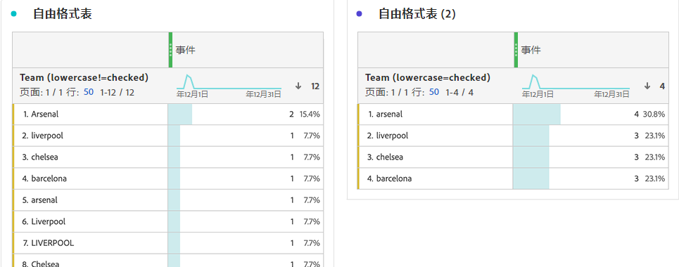

# 行为组件设置

在维度和指标上均可找到行为设置。可用的设置取决于组件类型和架构数据类型。

## 维度行为设置

| 设置 | 描述 |
| --- | --- |
| [!UICONTROL 小写] | 为具有相同的值但大小写不同的行去重。如果启用，则维度的所有具有相同值的实例均被报告为小写。例如，您的数据在字符串维度中包含 `"liverpool"`、`"Liverpool"` 和 `"LIVERPOOL"` 值。如果启用了[!UICONTROL 小写]，则所有三个值合并为 `"liverpool"`。如果禁用，则将所有三个值都视为不同。 |

>[!NOTE]
>
>如果在查找数据集维度上启用[!UICONTROL 小写]，则对于同一标识符可存在多个查找值。如果发生此冲突，则 CJA 使用第一个按 ASCII 整理的值（大写值在小写值之前）。Adobe 建议不要在启用[!UICONTROL 小写]后使用包含相同值的查找数据集。

## 指标行为设置

| 设置 | 描述/用例 |
| --- | --- |
| [!UICONTROL 计入值] | 在 Integer 和 Double 架构数据类型上可见。将指标增大指定的数量。例如，如果列的值为 `50`，则将某个指标增大 50。 |
| [!UICONTROL 计入实例] | 在 Integer 和 Double 架构数据类型上可见。无论值是什么，都将指标增大 1。存在任何值都将增大指标。例如，如果列的值为 `50`，则将某个指标增大 1。 |
| [!UICONTROL 要计入的值] | 在 Boolean 架构数据类型上可见。使您可决定通过计入 `true`、`false` 还是两者而增大指标。 |

可使用相同的事件数据集列配合不同的行为，在 Analysis Workspace 中生成“订单”和“收入”指标。将“收入”数据集列拖入数据视图两次，并将其中一个设置为“计入值”，将另一个设置为“计入实例”。“订单”指标计入实例，而“收入”指标计入值。
