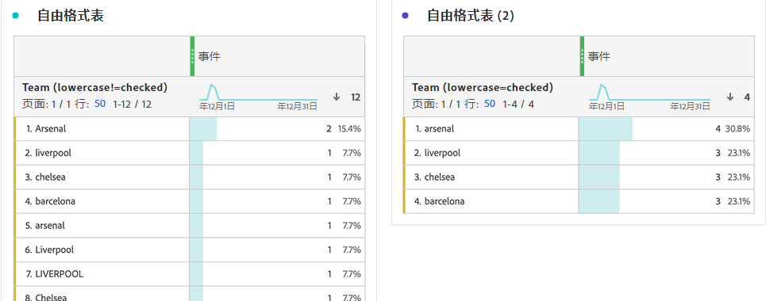

# 行为组件设置 {#behavior-component-settings}

<!-- markdownlint-disable MD034 -->

>[!CONTEXTUALHELP]
>id="dataview_component_dimension_behavior"
>title="行为"
>abstract="适用于维度和量度组件。 确定如何汇总此量度的各个明细项。 指定是否应将此维度的字符串值转换为小写。"

<!-- markdownlint-enable MD034 -->

在维度和量度上均可找到行为设置。 设置的可用性取决于组件类型和架构数据类型。

## 维度行为设置

| 设置 | 描述 |
| --- | --- |
| [!UICONTROL 小写] | 对具有相同值但大小写不同的行进行重复数据删除。 如果启用，则维度中所有具有相同值的实例都会以小写形式报告。 例如，您的数据在字符串维度中包含 `"liverpool"`、`"Liverpool"` 和 `"LIVERPOOL"` 值。 如果启用了[!UICONTROL 小写]，则所有三个值合并为 `"liverpool"`。 如果禁用，则将所有三个值都视为不同。 |

{style="table-layout:auto"}

>[!NOTE]
>
>如果在查找数据集维度上启用[!UICONTROL 小写]，则对于同一身份标识符可存在多个查找值。 如果发生此冲突，则 Customer Journey Analytics 会使用第一个按 ASCII 整理的值（大写值在小写值之前）。 Adobe 建议不要在启用[!UICONTROL 小写]后使用包含相同值的查找数据集。

## 指标行为设置

| 设置 | 描述/用例 |
| --- | --- |
| [!UICONTROL 计入值] | 在 Integer 和 Double 架构数据类型上可见。 将量度增大指定的数量。 例如，如果列的值为 `50`，则将某个指标增大 50。 |
| [!UICONTROL 计入实例] | 在 Integer 和 Double 架构数据类型上可见。 无论值是什么，都将量度增大 1。 存在任何值都将增大量度。 例如，如果列的值为 `50`，则将某个指标增大 1。 |
| [!UICONTROL 要计入的值] | 在 Boolean 架构数据类型上可见。 使您可决定通过计入 `true`、`false` 还是两者而增大指标。 |

{style="table-layout:auto"}

可使用相同的事件数据集列配合不同的行为，在 Analysis Workspace 中生成“订单”和“收入”指标。 将“收入”数据集列拖入数据视图两次，并将其中一个设置为“计入值”，将另一个设置为“计入实例”。 “订单”量度计入实例，而“收入”量度计入值。
