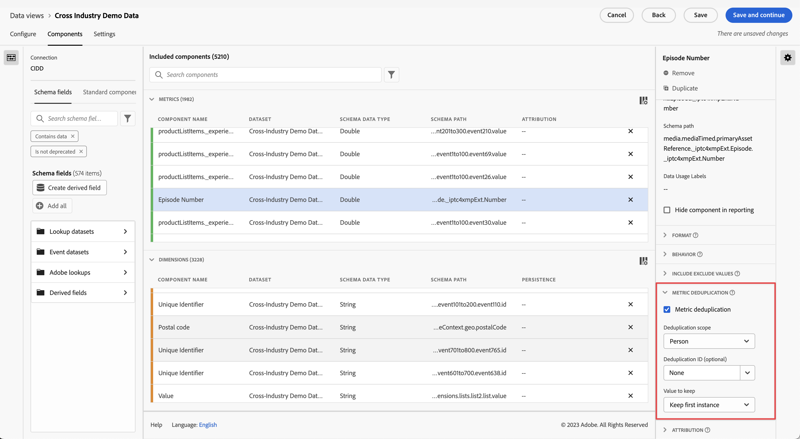

# 量度去重组件设置 {#metric-deduplication-component-settings}

<!-- markdownlint-disable MD034 -->

>[!CONTEXTUALHELP]
>id="dataview_component_metric_deduplication"
>title="量度去重"
>abstract="将量度配置为仅对不重复出现的值进行计数。"

<!-- markdownlint-enable MD034 -->

通过量度去重，可将量度配置为仅对不重复出现的值进行计数。

| 设置 | 描述 |
| --- | --- |
| [!UICONTROL 量度去重] | 一个复选框，通过它，可启用量度去重。默认禁用。 |
| [!UICONTROL 去重范围] | 使您可决定唯一检查回溯多远。 **会话**：仅计入会话第一次出现该量度的情况。 **人员**：仅计入报告时段中第一次出现该量度的情况。 |
| [!UICONTROL 去重 ID] | 并非对量度本身应用去重，而是使您可根据维度应用量度去重。对于“购买 ID”等维度应用去重很有用。 |
| [!UICONTROL 要保留的值] | <ul><li>**保留第一个实例**：如果量度的初始实例有效，则使用此项。最常见的情况可能是购买确认。即使有人无意中重新加载了页面，使我们得到的是购买确认的另一个实例，但初始事件仍有效。</li><li>**保留最后一个实例**：如果收集最后一个实例更有意义，则使用此项。示例：某人更新自己的在线轮廓。我们只需在每个会话中计算这些更新的其中之一。但是，他们可能会在会话期间多次更新自己的轮廓。如果我们保留第一个实例，则可能会有与该事件无关的活动。在这种情况下，保留最后一个实例更有意义。</li></ul> |

{style="table-layout:auto"}

>[!CAUTION]
>
>在 UTC 时间的足月前评估在&#x200B;_人员_&#x200B;范围的去重。如果某些实例发生在足月内但在报告日期外，则不足月报告时段可能并不显示所有第一个或最后一个实例。
