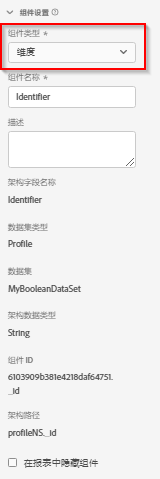

# 组件设置

组件使用的核心设置。

| 设置 | 描述/用例 |
| --- | --- |
| [!UICONTROL 组件类型] | 必需。使您可将组件从“量度”更改为“维度”，反之亦然。更改此下拉菜单会将组件移到其各自包含的组件区域。 |
| [!UICONTROL 组件名称] | 必需。用于指定在Analysis Workspace中显示的友好名称。 您可以重命名组件，以为其指定数据视图的特定名称。 |
| [!UICONTROL 描述] | 可选，但建议使用。 向其他用户提供有关组件的信息。 |
| [!UICONTROL 标记] | 可选。可让您使用自定义或现成标记为组件添加标签，以便于在 Analysis Workspace UI 中搜索/筛选。 |
| [!UICONTROL 字段名称] | 架构字段的名称。 |
| [!UICONTROL 数据集类型] | 必需。显示组件来自哪个数据集类型（事件、查询或个人资料）的不可编辑字段。 |
| [!UICONTROL 数据集] | 一个不可编辑的字段，其中显示了组件源自哪个数据集。 此字段可以包含多个数据集。 |
| [!UICONTROL 架构数据类型] | 显示组件数据类型的不可编辑字段。  虽然您可以在 Platform 中使用任何受支持的架构字段类型，但 CJA 并非支持所有字段类型。支持的数据类型有：`Integer`、`Int`、`Long`、`Double`、`Float`、`Number`、`Short`、`Byte`、`String` 和 `Boolean`。此时，Lookup数据集中仅允许使用`String`架构数据类型。 |
| [!UICONTROL 组件 ID] | 必需。[CJA API](https://adobe.io/cja-apis/docs) 使用此字段引用组件。数据视图中的每个组件必须是唯一的。 Adobe会自动为每个组件生成一个ID;但是，您可以单击编辑图标并修改组件ID。 更改组件ID会损坏包含此组件的所有现有工作区项目。 虽然每个组件在单个数据视图中需要一个唯一的ID，但您可以在其他数据视图中使用相同的组件ID。 如果您在其他数据视图中使用相同的组件ID，则可以使工作区项目在各个数据视图之间兼容。 |
| [!UICONTROL 架构路径] | 必需。显示组件来自的架构路径的不可编辑字段。 |
| [!UICONTROL 在报告中隐藏组件] | 允许您为非管理员用户在数据视图外部组织组件。 管理员仍可以访问该组件，只需在 Analysis Workspace 项目中单击[!UICONTROL 显示所有组件]即可。 |
