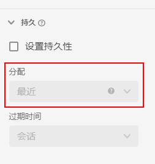

# [!UICONTROL 持久性]组件设置

[!UICONTROL 持久性]表示给定的维度值能否在从中设置它的事件之外与指标相关。它使用分配和到期的组合。

* 通过&#x200B;**分配**，可决定一次可在单个列中保留多个维度项时保留哪个值。
* 通过&#x200B;**到期**，可决定维度项在从中设置它的事件之外保持多久。

[!UICONTROL 持久性]仅在维度上可用，并可追溯至将它应用于的数据。它是紧接应用筛选或其他分析操作之前发生的数据转换。

| 设置 | 描述 |
| --- | --- |
| [!UICONTROL 设置持久性] | 为维度启用持久性。如果未启用持久性，则维度仅与同一事件中存在的指标相关。默认下禁用此设置。 |
| [!UICONTROL 分配] | 用于为持久性指定维度中使用的分配模型。选项有：[!UICONTROL 最近]、[!UICONTROL 原有]、[!UICONTROL 实例]、[!UICONTROL 全部]。截止 2021 年 10 月 28 日，最多 90 天的回溯时段将添加到[!UICONTROL 分配]设置。 |
| [!UICONTROL 到期] | 用于为维度指定持久性窗口。选项为：[!UICONTROL 会话]（默认值）、[!UICONTROL 人员]、[!UICONTROL 自定义时间]、[!UICONTROL 指标]。可能需要能够在购买（如内部搜索词或其他促销用例）时让维度到期。可设置的最长到期时间为 90 天。如果选择[!UICONTROL 全部]分配，则仅有[!UICONTROL 会话]或[!UICONTROL 人员]到期可用。 |

{style=&quot;table-layout:auto&quot;}

## [!UICONTROL 分配]设置

关于可用的分配设置的详细信息。

* **[!UICONTROL 最近]**：保留维度中现在的最新（按时间戳）值。在维度的有效期内任何后续出现的值均替换以前保留的值。如果在此维度上的[无值选项](no-value-options.md)下启用了“将‘无值’视为值”，则将用空值覆盖以前保留的值。例如，请考虑下表，其中具有[!UICONTROL 最近]的分配和[!UICONTROL 会话]的到期：

   | 维度 | 第 1 次点击 | 第 2 次点击 | 第 3 次点击 | 第 4 次点击 | 第 5 次点击 |
   | --- | --- | --- | --- | --- | --- |
   | 数据集值 |  | C | B |  | A |
   | 最近分配 |  | C | B | B | A |

* **[!UICONTROL 原有]**：在有效期持续时间内，按时间戳保留维度中现有的原有值。如果此维度有值，则在后续事件中看到不同的值时并不覆盖它。例如，请考虑下表，其中具有[!UICONTROL 原有]的分配和[!UICONTROL 会话]的到期：

   | 维度 | 第 1 次点击 | 第 2 次点击 | 第 3 次点击 | 第 4 次点击 | 第 5 次点击 |
   | --- | --- | --- | --- | --- | --- |
   | 数据集值 |  | C | B |  | A |
   | 原有分配 |  | C | C | C | C |

* **[!UICONTROL 全部]**：其行为方式类似于指标的[!UICONTROL 参与率]归因模型。同等地保留所有值，以使每个值都能对报表中的指标发挥完整的作用。例如，请考虑下表，其中具有[!UICONTROL 全部]的分配和[!UICONTROL 会话]的到期：

   | 维度 | 第 1 次点击 | 第 2 次点击 | 第 3 次点击 | 第 4 次点击 | 第 5 次点击 |
   | --- | --- | --- | --- | --- | --- |
   | 数据集值 | A | B | C |  | A |
   | 全部分配 | A | A、B | A、B、C | A、B、C | A、B、C |

* **[!UICONTROL 第一个已知]**&#x200B;和&#x200B;**[!UICONTROL 最后一个已知]**：（2022 年 1 月 19 日）这两个分配模型满足“进入”和“退出”维度用例。它们采用指定持久性范围（会话、人员或带回溯的自定义时间段）内某个维度的第一个或最后一个观察值，并将其应用于指定范围内的所有事件。示例：

   | 维度 | 第 1 次点击 | 第 2 次点击 | 第 3 次点击 | 第 4 次点击 | 第 5 次点击 |
   | --- | --- | --- | --- | --- | --- |
   | 时间戳（分钟） | 1 | 2 | 3 | 6 | 7 |
   | 原有值 |  | C | B |  | A |
   | 第一个已知 | C | C | C | C | C |
   | 最后一个已知 | A | A | A | A | A |

## [!UICONTROL 到期]设置

关于可用的到期设置的详细信息。

* **会话**：在给定会话后到期。默认到期时段。
* **人员**：在报表时段结束时到期。
* **自定义时间**：在指定时段（最多 90 天）后过期。仅对“原有”和“最近”分配模型有此到期选项。在使用基于时间的到期时，将考虑报告时段（最长 90 天）开始之前的值。
* **指标**：可在点击中看到此指标时，请让维度中的保留值立即到期。可将任何指标用作此维度的到期结束。仅对“原有”和“最近”分配设置有此到期选项。

## [!UICONTROL 绑定维度]

一个下拉列表，可让您将维度值的持久性绑定到另一个维度中的维度值。有效的下拉列表选项包括数据视图中包含的其他维度。

有关如何有效使用绑定维度的示例，请参见 CJA 中的 [使用绑定维度和量度](../../use-cases/binding-dimensions-metrics.md)。

## [!UICONTROL 绑定量度]

一个下拉列表，可让您选择充当绑定触发器的量度。有效的下拉列表选项包括数据视图中包含的量度。

此设置仅在对象数组中的绑定维度低于组件时显示。当绑定量度显示在事件中时，维度值会从事件级别维度向下复制到绑定维度的较低架构级别。

有关如何有效使用绑定量度的更多信息，请参阅 CJA 中 [使用绑定维度和量度下的第二个示例](../../use-cases/binding-dimensions-metrics.md)。
