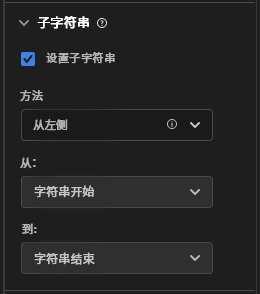

# [!UICONTROL 子字符串] 组件设置

[!UICONTROL 子字符串] 组件设置允许您执行多种字符串操作方法，以在报告中获取所需的维度项。

[!UICONTROL 子字符串]仅在维度上可用，并可追溯至应用该子字符串的数据。 它是紧接应用筛选或其他分析操作之前发生的数据转换。

## 从左/右

根据字符串开始或结束的位置提取字符串的一部分。**[!UICONTROL 从左]** 和 **[!UICONTROL 从右]** 两种方法提供两个下拉列表：**[!UICONTROL 从]**（输出开始的地方）和 **[!UICONTROL 至]**（输出结束的地方）。

* **[!UICONTROL 字符串开始]**：字符串的开始。
* **[!UICONTROL 字符串结束]**：字符串的结束。
* **[!UICONTROL 位置]**：从左或从右开始的静态字符数，具体取决于方法。
* **[!UICONTROL 字符串]**：匹配一个字符或字符序列以指示字符串的开始或结束。此下拉列表还显示其他选项：
   * **[!UICONTROL 匹配]**：要匹配的字符串。 如果输入内容与此字段不匹配，则应用 [无值选项](no-value-options.md)。
   * **[!UICONTROL 索引]**：**[!UICONTROL 匹配]** 条件可以在字符串中多次出现。 此整数确定开始或结束输出的匹配项，具体取决于方法。 例如，索引为 `1` 表示第一个匹配。 如果索引高于可用的匹配数，则应用 [无值选项](no-value-options.md)。
   * **[!UICONTROL 包括字符串]**：如果启用，则在输出中包括 **[!UICONTROL 匹配]** 字符串的复选框。
* **[!UICONTROL 长度]**：指定输出起始位置后要包含的字符数的整数。 仅在 **[!UICONTROL 至]** 下拉菜单下可用。

## 分隔符

对于使用分隔符分隔多个字符串值的字段，请使用此方法。 您可以提取单个元素用作输出，也可以将字符串转化为对象数组模式元素。

* **[!UICONTROL 标准]**：您希望如何处理分隔的值列表。
   * **[!UICONTROL 从左]**：从分隔列表的开头开始，向前计数。
   * **[!UICONTROL 从右]**：从分隔列表的结尾开始，向后计数。
   * **[!UICONTROL 转化为数组]**：将此维度视为对象数组模式元素。
* **[!UICONTROL 分隔符]**：字段使用的分隔符。
* **[!UICONTROL 索引]**：仅当标准为从左/右时才出现。 元素编号，就像它在一个数组中的编号一样。 例如，如果字符串输入是索引为 3 的 `"Fox,Turtle,Rabbit,Wolf"`，则输出是 `"Rabbit"`。 如果索引高于分隔元素的数量，则应用 [无值选项](no-value-options.md)。

## URL 解析

用于包含 URL 的字段。 使用示例 URL`https://example.com/store/index.html?cid=campaign#cart`，提供以下选项：

* **[!UICONTROL 获取协议]**：获取 URL 的协议。 例如：`"https://"`。
* **[!UICONTROL 获取主机]**：获取 URL 的主机。 例如：`"example.com"`。
* **[!UICONTROL 获取路径]**：获取 URL 的路径。 例如：`"store/index.html"`。
* **[!UICONTROL 获取查询字符串值]**：从单个查询字符串获取值。将所需的查询字符串参数放入 **[!UICONTROL 查询键]** 字段。 如果上述 URL 与`"cid"`查询键一起使用，则输出为 `"campaign"`。
* **[!UICONTROL 获取哈希值]**：获取 URL 的哈希值。 例如：`"cart"`。

如果输入内容非有效的 URL 或所需的 URL 组件不存在，则应用 [无值选项](no-value-options.md)。

## 修剪

从字符串中修剪空白或特殊字符。

* **[!UICONTROL 修剪空白]**：如果启用，将修剪字符串开始和结束位置的所有空白的复选框。
* **[!UICONTROL 修剪特殊字符]**：如果启用，则显示 **[!UICONTROL 特殊字符]** 输入字段的复选框。此字段中的所有字符都将从输出中删除。 不支持多字节字符。

## 正则表达式

将正则表达式应用于维度以检索所需的值。

* **[!UICONTROL 正则表达式]**：正则表达式公式。
* **[!UICONTROL 输出格式]**：一个可选字段，允许您添加文本或对正则表达式子组输出内容重新排序。 如果此字段为空，则字符串输出是经过计算的正则表达式。
* **[!UICONTROL 区分大小写]**：如果启用，强制正则表达式区分大小写的复选框。

CJA 使用 Perl 正则表达式语法的子集。 如果输入内容与正则表达式不匹配，并且 **[!UICONTROL 输出格式]** 为空，则应用[无值选项](no-value-options.md)。 支持以下表达式：

| 表达式 | 描述 |
| --- | --- |
| `a` | 单个字符 `a`。 |
| `a|b` | 单个字符 `a` 或者 `b`。 |
| `[abc]` | 单个字符 `a`、`b` 或者 `c`。 |
| `[^abc]` | 除 `a`、`b` 或者 `c` 之外的任意单个字符。 |
| `[a-z]` | 在 `a`–`z` 之间的任意单个字符。 |
| `[a-zA-Z0-9]` | 在 `a`–`z`、`A`–`Z` 或者数字 `0`–`9` 之间的任意单个字符。 |
| `^` | 匹配行的开头。 |
| `$` | 匹配行的结尾。 |
| `\A` | 字符串的开始。 |
| `\z` | 字符串的结束。 |
| `.` | 匹配任意字符。 |
| `\s` | 任意空白字符。 |
| `\S` | 任意非空白字符。 |
| `\d` | 任意数字。 |
| `\D` | 数字类型 |
| `\w` | 任意字母、数字或下划线。 |
| `\W` | 任意非单词字符。 |
| `\b` | 任意单词边界。 |
| `\B` | 任何不是单词边界的字符。 |
| `\<` | 单词的开头. |
| `\>` | 单词的结尾. |
| `(...)` | 捕获包含的任何内容。 |
| `(?:...)` | 无标记捕获。 防止在输出字符串中引用匹配项。 |
| `a?` | 零个或一个 `a`。 |
| `a*` | 零个或多个 `a`。 |
| `a+` | 一个或多个 `a`。 |
| `a{3}` | 恰好 3 个 `a`。 |
| `a{3,}` | 3 个或更多 `a`。 |
| `a{3,6}` | 3 到 6 个 `a`。 |

还支持输出占位符。 您可以在 **[!UICONTROL 输出格式]** 中使用这些序列，以任何次数和顺序来实现所需的字符串输出。

| 输出占位符序列 | 描述 |
| --- | --- |
| `$&` | 输出与整个表达式匹配的内容。 |
| `$n` | 输出与第 n 个子表达式匹配的内容。 例如，`$1` 输出第一个子表达式。 |
| ``$` `` | 输出上一个匹配的结束（如果没有找到上一个匹配，则输出文本的开始）和当前匹配的开始之间的文本。 |
| `$+` | 输出与正则表达式中最后标记的子表达式匹配的内容。 |
| `$$` | 输出字符串 `"$"`。 |

{style=&quot;table-layout:auto&quot;}

## 关于绑定维度的视频

以下是一段关于绑定维度的视频：

>[!VIDEO](https://video.tv.adobe.com/v/342694/?quality=12)
