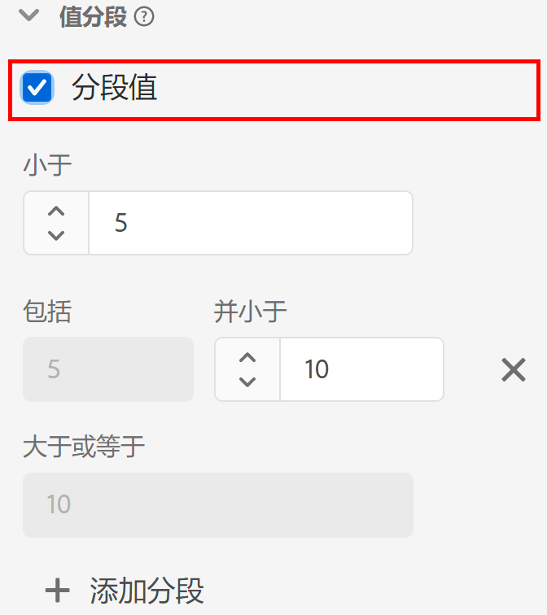

# [!UICONTROL 值分段]组件设置 {#value-bucketing-component-settings}

<!-- markdownlint-disable MD034 -->

>[!CONTEXTUALHELP]
>id="dataview_component_dimension_value_bucketing"
>title="值分段"
>abstract="将值划分到特定范围内。 这些范围在报告中显示为维度项目。"

<!-- markdownlint-enable MD034 -->

在创建或编辑数据视图时，通过值分段，可根据范围组合数值。 仅限使用 Integer 或 Double 架构数据类型的维度有此功能可用。

当要将多个范围组合在一起，而非将每个唯一的数字都视为一个单独的维度项时，值分段很有用。 例如，“从 5 直到 10”的分段在 Analysis Workspace 中显示为“5 到 10”行项。

如果要灵活地在分段维度和非分段维度上均可报告，请将组件的两个副本拖入可用维度列表。 在一个维度上启用分段，而在另一个维度上禁用它。

| 设置 | 描述 |
| --- | --- |
| [!UICONTROL 将值分段] | 一个使您可启用分段的复选框。 |
| [!UICONTROL 小于] | 第一个维度分段的上限。 |
| [!UICONTROL 包括] [!UICONTROL 并小于] | 后续分段的边界。 |
| [!UICONTROL 大于或等于] | 最后一个维度分段的下限。 |
| [!UICONTROL 添加分段] | 使您可将另一分段添加到数值维度分段。 在一个维度中可添加最多 20 个分段。 |

{style="table-layout:auto"}
