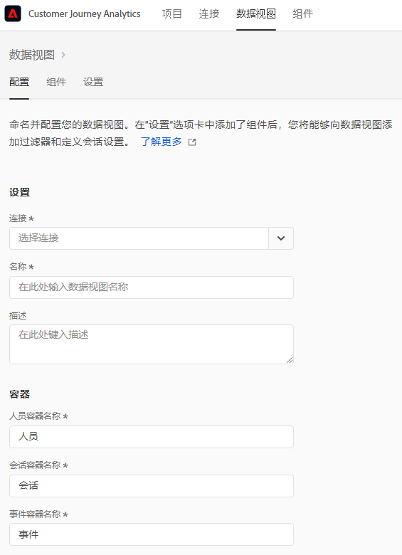
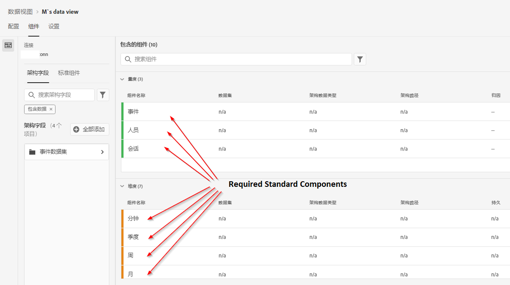
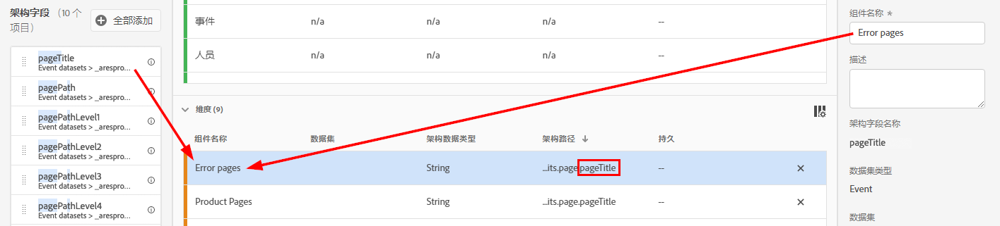
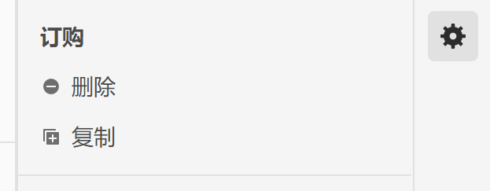
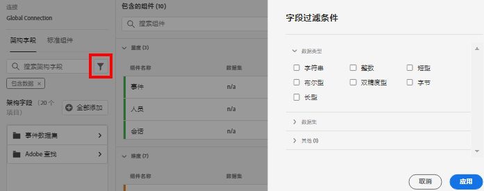
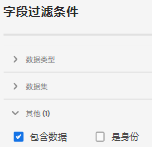

# 创建或编辑数据视图

创建数据视图涉及根据架构元素创建量度和维度或利用标准组件。大多数架构元素可以是维度或量度，具体取决于您企业的要求。 将架构元素拖动到数据视图后，右侧会显示相应选项，您可以在其中调整维度或量度在CJA中的操作方式。

## 配置数据视图

1. 登录到[Customer Journey Analytics](https://analytics.adobe.com)，然后转到&#x200B;**[!UICONTROL 数据视图]**&#x200B;选项卡。
2. 单击&#x200B;**[!UICONTROL 添加]**&#x200B;以创建数据视图，或单击现有数据视图以对其进行编辑。

### 设置

为数据视图提供总体设置。

| 设置 | 描述 |
| --- | --- |
| [!UICONTROL 连接] | 此字段会将数据视图链接到您之前已建立的连接，该连接包含一个或多个Adobe Experience Platform数据集。 |
| [!UICONTROL 名称] | 必需。数据视图的名称。 此值显示在Analysis Workspace的右上下拉菜单中。 |
| [!UICONTROL 描述] | 可选。Adobe建议提供详细描述，以便用户了解数据视图存在的原因以及数据视图的设计对象。 |

### 容器

指定数据视图的容器名称。 容器名称在[Filters](/help/components/filters/filters-overview.md#Filter-containers)中经常使用。

| 设置 | 描述 |
| --- | --- |
| [!UICONTROL 人员容器名称] | [!UICONTROL 人员]（默认）。[!UICONTROL Person]容器包含指定时间范围内访客的每个会话和事件。 如果贵组织使用不同的术语（例如“访客”或“用户”），则可以在此处重命名容器。 |
| [!UICONTROL 会话容器名称] | [!UICONTROL 会话]（默认）。通过[!UICONTROL 会话]容器可以识别页面交互、促销活动或特定会话的转化。您可以将此容器重命名为“访问”或贵组织喜欢的任何其他术语。 |
| [!UICONTROL 事件容器名称] | [!UICONTROL 事件]（默认）。[!UICONTROL Event]容器定义数据集中的单个事件。 如果贵组织使用不同的术语（例如“点击量”或“页面查看次数”），则可以在此处重命名容器。 |

### 日历

指示您希望数据视图遵循的日历格式。 您可以基于同一[连接](/help/connections/create-connection.md)拥有多个数据视图，并为它们提供不同的日历类型或时区。 这些数据视图允许使用不同日历类型的团队使用相同的基础数据来满足各自的需求。

| 设置 | 描述 |
| --- | --- |
| [!UICONTROL 时区] | 选择您要在哪个时区中显示您的数据。如果您选择在夏令时运行的时区，则会自动调整数据以反映该时区。 在春天，当时钟提前一小时调整时，会出现一小时的空档。 在秋季，当时钟在后面一小时调整时，夏令时时间会重复一小时。 |
| [!UICONTROL 日历类型] | 确定一个月中几周的分组方式。 **公历：** 标准日历格式。季度按月分组。 **4-5-4零售：** 标准化4-5-4售日历。季度的第一个月和最后一个月包含4周，而季度的第二个月包含5周。 **自定义(4-5-4):** 与4-5-4日历类似，不同之处在于您可以选择一年中的第一天以及出现“额外”周的年份。 **自定义(4-4-5):** 每个季度的第一个月和第二个月包含4周，而每个季度的最后一周包含5周。 **自定义(5-4-4):** 每季度的第一个月包含5周，而每季度的第二和第三个月包含4周。 |
| [!UICONTROL 每年的第一] 个月 [!UICONTROL 和每周的第一天] | 对于公历类型可见。 指定希望日历年开始的月份以及希望每周开始的日期。 |
| [!UICONTROL 当年的第一天] | 对于自定义日历类型可见。 指定希望当年开始的日期。 日历会根据此值自动设置每周第一天的格式。 |
| [!UICONTROL 多出一周的年份] | 由于大多有364天的日历（每天52周，每天7天），每年都会累积剩余的天数，直到它们形成一个额外的周。 这额外的一周将添加到该年最后一个月。 指定希望将额外的周添加到的年份。 |

## 设置数据视图的组件

接下来，您可以根据架构元素创建量度和维度。您也可以使用标准组件。

1. 登录到[Customer Journey Analytics](https://analytics.adobe.com)，然后转到&#x200B;**[!UICONTROL 数据视图]**&#x200B;选项卡。
1. 单击&#x200B;**[!UICONTROL 添加]**&#x200B;以创建数据视图，或单击现有数据视图以对其进行编辑。
1. 单击&#x200B;**[!UICONTROL Components]**&#x200B;选项卡。

   

   您可以在左上角看到[!UICONTROL 连接]，其中包含数据集及其下方的[!UICONTROL 架构字段]。请注意，已包含的组件是所有数据视图的标准必需组件（系统生成）。 Adobe还默认应用筛选器&#x200B;**[!UICONTROL 包含数据]**，以便仅显示包含数据的架构字段。 如果希望字段不包含数据，请删除此过滤器。

1. 将架构字段（如`pageTitle`）从左边栏拖到量度或Dimension部分。

   您可以将同一架构字段拖入“量度”或“维度”部分中多次，并以不同方式配置同一维度或量度。
例如，从`pageTitle`字段中，可以使用右侧的不同[组件设置](component-settings/overview.md)创建一个名为“Product Pages”的维度，和另一个名为“Error pages”的维度。

   

   如果从左边栏拖动架构字段文件夹，则这些文件夹会自动分类为典型部分。 字符串字段最后位于[!UICONTROL Dimension]部分，数字架构类型最后位于[!UICONTROL Metrics]部分。 您还可以单击&#x200B;**[!UICONTROL 添加所有]**，所有架构字段都将添加到其各自的位置。

1. 选择组件后，右侧会显示许多设置。 使用[组件设置](component-settings/overview.md)配置组件。 可用的组件设置取决于组件是维度/量度还是架构数据类型。 这些设置包括：

   * [[!UICONTROL 归因]](component-settings/attribution.md)
   * [[!UICONTROL 行为]](component-settings/behavior.md)
   * [[!UICONTROL 格式]](component-settings/format.md)
   * [[!UICONTROL 包含/排除值]](component-settings/include-exclude-values.md)
   * [[!UICONTROL 量度去重]](component-settings/metric-deduplication.md)
   * [[!UICONTROL 没有值选项]](component-settings/no-value-options.md)
   * [[!UICONTROL 持久性]](component-settings/persistence.md)
   * [[!UICONTROL 值分段]](component-settings/value-bucketing.md)

如果需要，您可以使用以下功能：

* **[!UICONTROL 复制]**:复制量度或维度，然后修改特定设置是从单个架构字段创建多个量度或维度的简便方法。选择右上方量度或维度名称下方的[!UICONTROL 复制]设置。 修改新维度或量度，并使用更具描述性的名称保存该维度或量度。

   

* **[!UICONTROL 过滤器]**:您可以按以下数据类型过滤左边栏中的架构字段：

   

   您还可以按数据集筛选，以及按某个架构字段是否包含数据或是否为标识筛选。默认情况下，Adobe最初会将&#x200B;**[!UICONTROL Contains data]**&#x200B;过滤器应用于所有数据视图。

   

## 设置

1. 登录到[Customer Journey Analytics](https://analytics.adobe.com)，然后转到&#x200B;**[!UICONTROL 数据视图]**&#x200B;选项卡。
1. 单击&#x200B;**[!UICONTROL 添加]**&#x200B;以创建数据视图，或单击现有数据视图以对其进行编辑。
1. 单击&#x200B;**[!UICONTROL Settings]**&#x200B;选项卡。

### 全局过滤器

您可以添加应用于整个数据视图的过滤器。 此过滤器适用于您在工作区中运行的任何报表。 将筛选器从左边栏中的列表拖到[!UICONTROL 添加筛选器]字段。

### 会话设置

确定在会话过期和启动新会话之前事件之间处于不活动状态的时间段。

需要一个时间段。 您还可以选择在事件包含特定量度时强制启动新会话。

指定所有所需设置后，单击&#x200B;**[!UICONTROL 保存并完成]**。
