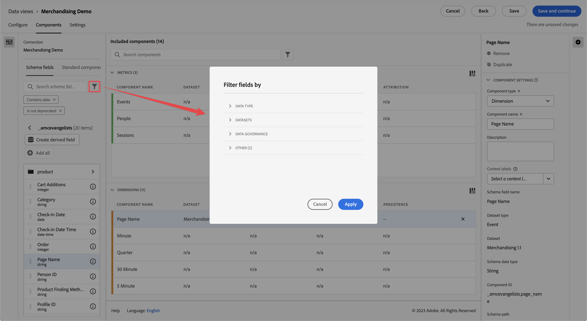

# 创建或编辑数据视图

创建数据视图涉及从架构元素创建量度和维度或使用标准组件。 大多数架构元素既可为维度，也可为指标，具体取决于您的业务要求。将架构元素拖入数据视图后，右侧即显示选项，从中可调整维度或指标在Customer Journey Analytics中的操作方式。

以下是一段关于该主题的视频：

>[!VIDEO](https://video.tv.adobe.com/v/35110/?quality=12&learn=on)

要创建或编辑数据视图，请执行以下操作：

1. 登录 [Customer Journey Analytics](https://analytics.adobe.com) 然后转到 **[!UICONTROL 数据视图]** 选项卡。
1. 要创建数据视图，请选择 **[!UICONTROL 创建新数据视图]**. 或者，您可以从数据视图列表中选择现有数据视图以对其进行编辑。

## 配置

要配置新的或现有的数据视图，请执行以下操作：

1. 选择 **[!UICONTROL 配置]** 选项卡（如果尚未处于活动状态）。

   
1. 指定 [!UICONTROL 设置]， [!UICONTROL 容器]、和 [!UICONTROL 日历] 详细信息（见下文）。
1. 选择 **[!UICONTROL 保存并继续]** 以继续配置新的或现有的数据视图。 选择 **[!UICONTROL 保存]** 以保存现有数据视图的配置。

### 设置

提供数据视图的总体设置。

| 设置 | 描述 |
| --- | --- |
| [!UICONTROL 连接] | 此字段将数据视图链接到您之前建立的连接，其中包含一个或多个 Adobe Experience Platform 数据集。 |
| [!UICONTROL 名称] | 必填。数据视图的名称。此值显示在Analysis Workspace的右上角下拉列表中。 |
| [!UICONTROL 描述] | 可选。Adobe 建议输入详细描述，以便用户了解为什么存在该数据视图以及为谁设计了它。 |

{style="table-layout:auto"}

### 容器

指定数据视图的容器的名称。经常在[过滤器](/help/components/filters/filters-overview.md#Filter-containers)中使用容器名称。

| 设置 | 描述 |
| --- | --- |
| [!UICONTROL 人员容器名称] | [!UICONTROL 人员]（默认）。此 [!UICONTROL 人员] 容器包括指定时间段内人员的每个会话和事件。 如果您的组织使用不同的用语（例如，“访客”或“用户”），可在此处将该容器重命名。 |
| [!UICONTROL 会话容器名称] | [!UICONTROL 会话]（默认）。通过[!UICONTROL 会话]容器可以识别页面交互、营销活动或特定会话的转化。可将此容器重命名为“访问”或您的组织更喜欢的任何其他用语。 |
| [!UICONTROL 事件容器名称] | [!UICONTROL 事件]（默认）。[!UICONTROL 事件]容器定义数据集中的个别事件。如果您的组织使用不同的用语（例如，“点击”或“页面查看”），可在此处将该容器重命名。 |

{style="table-layout:auto"}

### 日历

指示您希望数据视图遵循的日历格式。可有多个数据视图基于同一个[连接](/help/connections/create-connection.md)，并可为其赋予不同的日历类型或时区。这些数据视图可让使用不同日历类型的团队用相同的基础数据满足其各自的需求。

| 设置 | 描述 |
| --- | --- |
| [!UICONTROL 时区] | 选择要以哪个时区显示数据。 如果选择执行夏令时的时区，则将自动调整数据以反映这一点。春季将时钟向前调整一小时，产生一小时差距。秋季将时钟向后调整一小时，在夏令时转换期间将有一小时重复。 |
| [!UICONTROL 日历类型] | 决定每个月的周数如何分组。 **公历：**&#x200B;标准日历格式。季度按月分组。 **4-5-4 零售：**&#x200B;标准化的 4-5-4 零售日历。季度的第一个月和最后一个月包含4周，而季度的第二个月包含5周。 **自定义 (4-5-4)：**&#x200B;类似于 4-5-4 日历，但可选择一年的第一天以及哪年出现“额外的”一周。 **自定义(4-4-5)：** 每个季度的第一个月和第二个月包含4周，而每个季度的最后一个月包含5周。 **自定义 (5-4-4)：**&#x200B;每个季度的第一个包含为 5 周，而每个季度的第二个月和第三个月包含 4 周。 |
| [!UICONTROL 一年的第一个月]和[!UICONTROL 一周的第一天] | 对“公历”日历类型可见。指定您希望日历年从哪一个月开始，以及您希望每周从哪一天开始。 |
| [!UICONTROL 当年的第一天] | 对自定义日历类型可见。指定要让当年在一年中的哪一天开始。日历自动根据此值设置每周第一天的格式。 |
| [!UICONTROL 出现“额外的”一周的年份] | 对于大多数364天日历（52周，每周7天），每年都会积累剩余的天数，直到它们合计到额外的一周。 然后，将这额外的一周添加到当年的最后一个月。指定要将额外的一周添加到哪年。 |

{style="table-layout:auto"}

## 组件

接下来，您可以设置数据视图的组件，这意味着您可以从架构元素创建量度和维度。 您也可以使用标准组件。

1. 选择 **[!UICONTROL 组件]** 选项卡。

   

   可在左上角看到[!UICONTROL 连接]（其中包含数据集），并可在下方看到其[!UICONTROL 架构字段]。已包含的组件是所有数据视图（如事件、人员、会话量度以及分钟、季度、周维度）所需的标准组件（系统生成）。 Adobe还会应用过滤器 **[!UICONTROL 包含数据]** 和 **[!UICONTROL 未弃用]** 默认情况下，这样仅显示包含数据且未弃用的架构字段。

1. 使用以下方式搜索架构字段  **[!UICONTROL 搜索架构字段]** 或通过移动到任何数据集集合中查找字段，例如  **[!UICONTROL 事件数据集]**. 或者，您可以使用以下方式创建派生字段  **创建派生字段** . 参见 [派生字段](./derived-fields/derived-fields.md) 了解更多信息。

1. 找到特定架构字段或定义派生字段后，拖动该字段，例如  **[!UICONTROL 页面名称]**，从左边栏进入指标或Dimension部分。
可将同一架构字段拖入“维度”或“指标”部分多次，并可按不同方式配置同一维度或指标。例如，在pageName字段中，您可以使用不同的来创建一个名为“产品页面”的维度，并再创建一个名为“错误页面”的维度 [组件设置](component-settings/overview.md) 在右边。
如果从左边栏拖动架构字段文件夹，则自动将其归入典型部分。字符串字段最后落在[!UICONTROL 维度]部分中，而数值架构类型最后落在[!UICONTROL 指标]部分中。还可单击&#x200B;**[!UICONTROL 全部添加]**，即可将所有架构字段添加到其各自位置。

1. 选择组件后，设置将显示在右侧。

   

   请使用[组件设置](component-settings/overview.md)配置组件。可用的组件设置取决于组件是维度还是指标以及架构数据类型。这些设置包括：

   * [[!UICONTROL 归因]](component-settings/attribution.md)
   * [[!UICONTROL 行为]](component-settings/behavior.md)
   * [[!UICONTROL 格式]](component-settings/format.md)
   * [[!UICONTROL 包括排除值]](component-settings/include-exclude-values.md)
   * [[!UICONTROL 指标去重]](component-settings/metric-deduplication.md)
   * [[!UICONTROL 无值选项]](component-settings/no-value-options.md)
   * [[!UICONTROL 持久性]](component-settings/persistence.md)
   * [[!UICONTROL 值分段]](component-settings/value-bucketing.md)

1. 选择 **[!UICONTROL 保存并继续]** 以继续配置新的或现有的数据视图。 选择 **[!UICONTROL 保存]** 以保存现有数据视图的配置。

**重复的指标或维度**

复制指标或维度，然后修改特定设置，这是从单个架构字段创建多个指标或维度的简单方法。在指标或维度在右上角的名称下方选择[!UICONTROL 复制]设置。修改新维度或指标，并以更具描述性的名称保存它。

**筛选架构字段或数据集**

您可以筛选  左边栏中的架构字段 [!UICONTROL 数据类型]， [!UICONTROL 数据集]， [!UICONTROL 数据治理]、和 [!UICONTROL 其他] 标准([!UICONTROL 包含数据]， [!UICONTROL 为标识]、和 [!UICONTROL 未弃用])：

## 设置

1. 选择 **[!UICONTROL 设置]** 选项卡。
1. 配置要应用于整个数据视图的筛选器。 参见 [设置（过滤器）](#settings-filters) 下面的。
1. 配置会话超时和量度。 参见 [会话设置](#session-settings) 下面的。
1. 选择 **[!UICONTROL 保存并继续]** 以继续配置新的或现有的数据视图。 选择 **[!UICONTROL 保存]** 以保存现有数据视图的配置。

### 设置（过滤器）

可添加适用于整个数据视图的过滤器。此过滤器适用于您在 Workspace 中运行的任何报表。请将某个过滤器从左边栏中的列表拖至[!UICONTROL 添加过滤器]字段。

### 会话设置

决定在会话到期并开始新会话之前，事件之间无活动的时段。 时段为必填。还可选择在事件包含特定指标时强制开始新会话。

指定所有需要的设置后，单击&#x200B;**[!UICONTROL 保存并完成]**。
