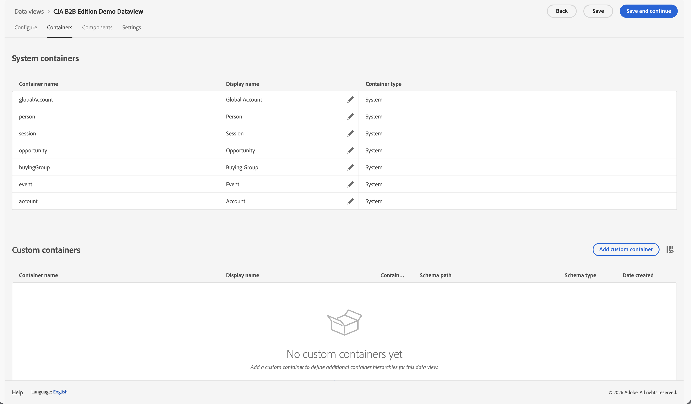
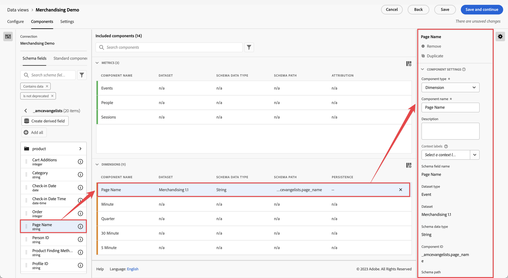
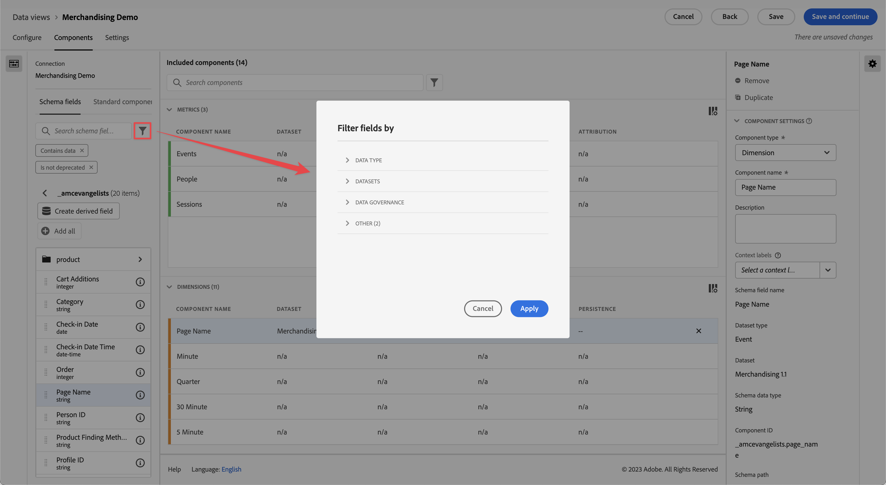
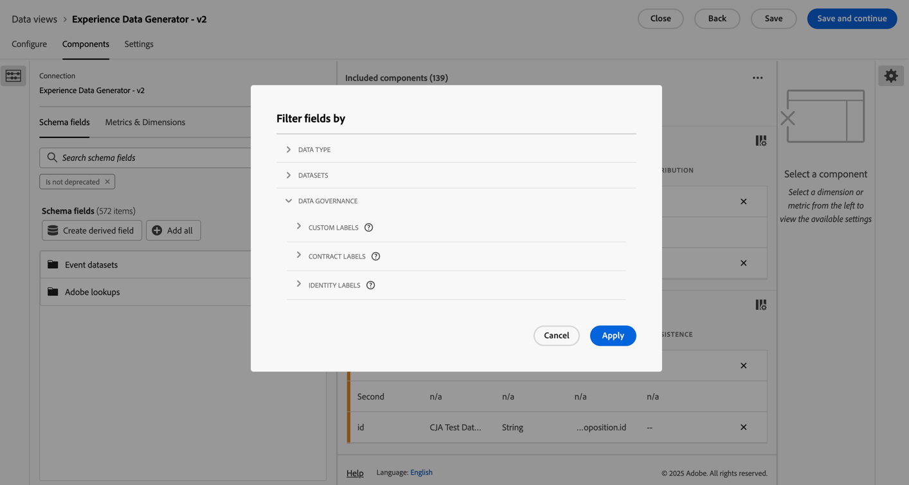
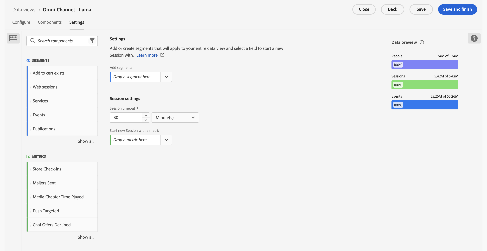

# 创建或编辑数据视图

创建数据视图涉及从架构元素创建量度和维度或利用标准组件。 大多数架构元素既可为维度，也可为量度，具体取决于您的业务要求。 将架构元素拖入数据视图后，右侧即显示选项，从中可调整维度或量度在 Customer Journey Analytics 中的操作方式。

>[!BEGINSHADEBOX]

请参阅  [创建或编辑数据视图](https://experienceleague.adobe.com/zh-hans/docs/customer-journey-analytics-learn/tutorials/data-views/overview-of-configuring-data-views-for-cja){target="_blank"}以获取演示视频。

>[!ENDSHADEBOX]

要创建或编辑数据视图：

1. 登录 [Customer Journey Analytics](https://analytics.adobe.com)，在顶部菜单中选择&#x200B;**[!UICONTROL 数据视图]**，也可以从&#x200B;**[!UICONTROL 数据管理]**&#x200B;中选择。
1. 要创建数据视图，请选择&#x200B;**[!UICONTROL “创建新的数据视图”。]** 或者，您可以从数据视图列表中选择现有数据视图进行编辑。

## 配置 {#configure}

要配置新的或现有的数据视图：

1. 选择&#x200B;**[!UICONTROL “配置”]**&#x200B;选项卡（如果尚未激活）。
1. 指定&#x200B;**[!UICONTROL 设置]**、**[!UICONTROL 兼容性]**、**[!UICONTROL AI设置]**&#x200B;和&#x200B;**[!UICONTROL 日历]**&#x200B;详细信息（请参阅下文）。
1. 选择&#x200B;**[!UICONTROL “保存并继续”]**，以继续配置新的或现有的数据视图。 选择&#x200B;**[!UICONTROL “保存”]**，以保存现有数据视图的配置。

### 设置 {#configure-settings}

>[!CONTEXTUALHELP]
>id="dataview_externalid"
>title="外部 ID"
>abstract="更改外部 ID 会影响数据视图名称在外部源（例如 Business Intelligence 工具）中的显示方式。"

提供数据视图的总体设置。

| 设置 | 描述 |
| --- | --- |
| **[!UICONTROL 连接]** | 此字段将数据视图链接到您之前建立的连接，其中包含一个或多个 Adobe Experience Platform 数据集。 |
| **[!UICONTROL 名称]** | 必填。 数据视图的名称。 此值显示在 Analysis Workspace 右上角的下拉菜单中。 |
| **[!UICONTROL 外部 ID]** | 必填。 您可以在外部源（例如商业智能工具）中使用的数据视图的名称。 默认值为 `unspecified`。 如果您未指定外部 ID，则名称将从数据视图的名称生成，并用下划线替换空格。 |
| **[!UICONTROL 描述]** | 可选。 Adobe 建议输入详细描述，以便用户了解为什么存在该数据视图以及为谁设计了它。 |

{style="table-layout:auto"}

### 兼容性 {#compatibility}

>[!CONTEXTUALHELP]
>id="dataview_dataviewsinadobejourneyoptimizer"
>title="Journey Optimizer 中的数据视图"
>abstract="Customer Journey Analytics 需要一个与 Adobe Journey Optimizer 兼容的连接和数据视图。 默认情况下，系统会创建一个连接和数据视图。 或者启用这个选项，将其设置为 Adobe Journey Optimizer 报告的默认数据视图，这会将必要的组件添加到数据视图，并将数据集添加到连接。"
>additional-url="https://experienceleague.adobe.com/zh-hans/docs/analytics-platform/using/integrations/ajo#connection" text="添加了哪些组件和数据集。"

提供在同时使用 Adobe Journey Optimizer 和 Customer Journey Analytics 时适用的设置。

此部分仅对已配置 Journey Optimizer 的管理员可见。

| 设置 | 描述 |
| --- | --- |
| [!UICONTROL **在 Adobe Journey Optimizer 中设置为默认数据视图**] | 此配置选项使 Journey Optimizer 和 Customer Journey Analytics 的报告标准化。 此外，它还允许您在 Customer Journey Analytics 中对 Adobe Journey Optimizer 的数据进行高级分析（在 Journey Optimizer 中选择 [!UICONTROL **在 CJA 中分析**]）。
进行此类分析时，Journey Optimizer 需要具有 Customer Journey Analytics 数据视图的访问权限。
启用此选项可使其成为您的沙盒 Journey Optimizer 报告中使用的默认数据视图。

此配置选项将自动执行以下操作：
<ul><li>在 Customer Journey Analytics 的相关连接中配置所有必需的 Journey Optimizer 数据集，以便与 Journey Optimizer 配合使用。</li><li>在数据视图中创建一组 Journey Optimizer 量度和维度（包括派生字段和计算量度）。 在所有这些量度和维度上自动设置上下文标签。</li><li>自动启用与此数据视图相关联的连接中的&#x200B;**[!UICONTROL 在 CJA 中使用]**&#x200B;选项。 （要了解有关此选项的更多信息，请参阅[在 Customer Journey Analytics 中使用 Journey Optimizer 连接](/help/connections/manage-connections.md)。）
如果在启用此设置后手动禁用此设置，连接和任何相关联的数据视图都会重置为其默认状态。 这可能会导致报告中的数据变化。
</li></ul>

启用此选项时，请考虑以下事项： <ul><li>您可以稍后更改默认数据视图，但这样做可能会更改您的 Journey Optimizer 报告数据。 如果启用此选项后选择禁用，系统将提示您选择新的默认数据视图。</li><li>如果您已经对 Customer Journey Analytics 数据视图中的数据集、维度或量度进行了手动自定义，则启用此配置选项时，您的手动自定义将保持不变。 此选项可以进行额外的自定义，以进一步标准化 Journey Optimizer 和 Customer Journey Analytics 之间的报告。 启用此选项后，您还可以进行手动自定义。</li><li>选择此选项时，无法删除与数据视图关联的连接。</li></ul>请参阅[将 Adobe Journey Optimizer 与 Adobe Customer Journey Analytics 集成](/help/integrations/ajo.md)，以了解详细信息。 |

{style="table-layout:auto"}

### AI 设置

选择&#x200B;**[!UICONTROL 启用Data Insights Agent]**&#x200B;以启用[Data Insights Agent](/help/data-analysis-ai.md)的数据视图。 Data Insights Agent是一个创新型人工智能会话代理，可从Customer Journey Analytics中的AI助手访问。 它可帮助您通过文本提示词快速分析数据。 代理使用数据视图中的组件并使用实际数据在Analysis Workspace中构建相关可视化图表。

### 日程表

指示您希望数据视图遵循的日历格式。 可有多个数据视图基于同一个[连接](/help/connections/create-connection.md)，并可为其赋予不同的日程表类型或时区。 这些数据视图可让使用不同日历类型的团队用相同的基础数据满足其各自的需求。

| 设置 | 描述 |
| --- | --- |
| [!UICONTROL **时区**] | 选择要用哪个时区表示数据。 如果选择执行夏令时的时区，则将自动调整数据以反映这一点。 春季将时钟向前调整一小时，产生一小时差距。 秋季将时钟向后调整一小时，在夏令时转换期间将有一小时重复。 |
| [!UICONTROL **日程表类型**] | 确定一个月中的周如何分组。 **公历：**&#x200B;标准日历格式。 季度按月分组。 **4-5-4零售业：**&#x200B;标准化的4-5-4零售日历。 季度的第一个月和最后一个月包含 4 周，而季度的第二个月包含 5 周。 **自定义 (4-5-4)：**&#x200B;类似于 4-5-4 日程表，但可选择一年的第一天以及哪年出现“额外的”一周。 **自定义 (4-4-5)：**&#x200B;每个季度的第一个月和第二个月包含 4 周，而每个季度的最后一个月包含 5 周。 **自定义 (5-4-4)：**&#x200B;每个季度的第一个包含为 5 周，而每个季度的第二个月和第三个月包含 4 周。 |
| [!UICONTROL **一年的第一个月**]&#x200B;和&#x200B;[!UICONTROL **一周的第一天**] | 对“公历”日程表类型可见。 指定要让日程表年从哪一个月开始，以及每周从哪一天开始。 |
| [!UICONTROL **当年的第一天**] | 对自定义日程表类型可见。 指定要让当年在一年中的哪一天开始。 日程表自动根据此值设置每周第一天的格式。 |
| [!UICONTROL **出现“额外的”一周的年份**] | 对于大多数 364 天日历（52 周，每周 7 天），每年都会积累多出的天数，直到它们加起来形成额外的一周。 然后，将额外的这一周添加到当年的最后一个月。 指定要将额外的一周添加到哪年。  **额外周和闰年** &#x200B;如果您选择自定义&#x200B;**[!UICONTROL 日历类型]**（**[!UICONTROL 自定义（4-5-4）]**、**[!UICONTROL 自定义（4-4-5）]**&#x200B;或&#x200B;**[!UICONTROL 自定义（5-4-4）]**），每年剩余的天数就会累计起来，直到这些天数加起来构成一个完整的额外周（7 天）。 这个额外周会添加到您在&#x200B;**[!UICONTROL “额外周”出现的年份]**&#x200B;中选择的年份。  **[!UICONTROL “额外周”出现的年份]**&#x200B;中特意不显示闰年。 不过，闰年仍然可以包含 53 周。 如要强制闰年包含 53 周，应从&#x200B;**[!UICONTROL “额外周”出现的年份]**&#x200B;中选择一个非闰年，以确保目标闰年的累计日期漂移达到 7 天。 例如：要在 2024 年有 53 周，请选择 **[!UICONTROL 2019]**。 从2019年到2024年，总日期漂移为7天(2020 (+2)、2021 (+1)、2022 (+1)、2023 (+1)和2024 (+2))，这将导致2024年出现第53周。  选择&#x200B;**[!UICONTROL 当前年份的第一天]**&#x200B;将影响额外一周的土地的位置。 使用日历预览确认您的配置。 |

{style="table-layout:auto"}

## 容器

{{release-limited-testing-section}}

>[!BEGINTABS]

>[!TAB 标准]

>[!TAB B2B Edition]

>[!ENDTABS]

在&#x200B;**[!UICONTROL 容器]**&#x200B;选项卡中，您可以重命名系统容器并添加自定义容器。

### 系统容器

指定数据视图的容器的名称。 容器名称经常在[区段](/help/components/segments/seg-overview.md#containers)中使用。

| 容器名称 | 显示名称（默认） | 描述 |
| --- | --- | --- |
| globalAccount | [!BADGE B2B edition]{type=Informative url="https://experienceleague.adobe.com/zh-hans/docs/analytics-platform/using/cja-overview/cja-b2b/cja-b2b-edition" newtab=true tooltip="Customer Journey Analytics B2B Edition"} **[!UICONTROL 全局帐户&#x200B;]** | [!UICONTROL 全球帐户]容器包括全球帐户在指定的时间范围内的每个会话和事件。 如果您的组织使用不同的术语，您可以在此处重命名容器。 |
| 人员 | **[!UICONTROL 人员]** | [!UICONTROL 人员]容器包括人员在指定的时间范围内的每个会话和事件。 如果您的组织使用不同的用语（例如，“访客”或“用户”），可在此处将该容器重命名。 |
| session | **[!UICONTROL 会话]** | 通过[!UICONTROL 会话]容器可以识别页面交互、营销活动或特定会话的转化。 可将此容器重命名为“访问”或您的组织更喜欢的任何其他用语。 |
| 机会 | [!BADGE B2B edition]{type=Informative url="https://experienceleague.adobe.com/zh-hans/docs/analytics-platform/using/cja-overview/cja-b2b/cja-b2b-edition" newtab=true tooltip="Customer Journey Analytics B2B Edition"} **[!UICONTROL 机会&#x200B;]** | [!UICONTROL 机会]容器包括在指定的时间范围内机会的每个会话和事件。 如果您的组织使用不同的术语，您可以在此处重命名容器。 |
| puringGroup | [!BADGE B2B edition]{type=Informative url="https://experienceleague.adobe.com/zh-hans/docs/analytics-platform/using/cja-overview/cja-b2b/cja-b2b-edition" newtab=true tooltip="Customer Journey Analytics B2B Edition"} **[!UICONTROL 购买群&#x200B;]** | [!UICONTROL 购买群组]容器包括在指定的时间范围内购买群组的每个会话和事件。 如果您的组织使用不同的术语，您可以在此处重命名容器。 |
| 事件 | **[!UICONTROL 事件]** | [!UICONTROL 事件]容器定义数据集中的个别事件。 如果您的组织使用不同的用语（例如，“点击”或“页面查看”），可在此处将该容器重命名。 |
| account | [!BADGE B2B edition]{type=Informative url="https://experienceleague.adobe.com/zh-hans/docs/analytics-platform/using/cja-overview/cja-b2b/cja-b2b-edition" newtab=true tooltip="Customer Journey Analytics B2B Edition"} **[!UICONTROL 帐户&#x200B;]** | [!UICONTROL 帐户]容器包括在指定的时间范围内帐户的每个会话和事件。 如果您的组织使用不同的术语，您可以在此处重命名容器。 |

要重命名系统容器，请执行以下操作：

1. 选择以编辑容器的&#x200B;**[!UICONTROL 显示名称]**。
1. 为容器定义新名称。
1. 选择&#x200B;**[!UICONTROL 保存]**。

### 自定义容器

您可以向数据视图添加自定义容器，以便使用这些容器进行[子事件分析](/help/components/segments/sub-event.md)。 自定义容器可从以下位置定义：

* 作为连接一部分的数据集内可用的对象或数组。 例如，**[!UICONTROL productListItems]**、**[!UICONTROL content_assets]**&#x200B;或&#x200B;**[!UICONTROL placeContext.activePOIs]**。
* 通过使用[Split](/help/data-views/derived-fields/derived-fields.md#split)函数返回数组的派生字段。
* 配置为使用带有[分隔符](/help/data-views/component-settings/substring.md#delimiter)选项的[子字符串](/help/data-views/component-settings/substring.md)组件设置返回数组的数据视图组件。

要添加自定义容器，请执行以下操作：

1. 选择&#x200B;**[!UICONTROL 添加自定义容器]**。
1. 在&#x200B;**[!UICONTROL 添加容器]**&#x200B;对话框中：
   1. 从&#x200B;**[!UICONTROL 容器]**&#x200B;下拉菜单中选择一个容器。 例如： **[!UICONTROL productListItems.productCategories]**。 选择后，您会看到&#x200B;**[!UICONTROL 架构路径]**&#x200B;和&#x200B;**[!UICONTROL 架构类型]**&#x200B;的更新值。

   1. 输入容器的&#x200B;**[!UICONTROL 显示名称]**。 例如：`Product Categories`。
   1. 选择&#x200B;**[!UICONTROL 保存]**。

要编辑自定义容器，请执行以下操作：

1. 为&#x200B;**[!UICONTROL 显示名称]**&#x200B;列中的自定义容器选择。
1. 从上下文菜单中选择**[!UICONTROL 编辑]**。
1. 在&#x200B;**[!UICONTROL 编辑容器]**&#x200B;对话框中：
   1. 修改&#x200B;**[!UICONTROL 容器]**&#x200B;或&#x200B;**[!UICONTROL 显示名称]**，或同时修改两者。
   1. 选择&#x200B;**[!UICONTROL 保存]**。

要删除自定义容器，请执行以下操作：

1. 在“显示名称”列中为自定义容器选择。
1. 从上下文菜单中选择 **[!UICONTROL 删除]**。

   >[!NOTE]
   >
   >自定义容器将被删除，恕不确认。
   >

要更改自定义容器的列表，请执行以下操作：

1. 选择。
1. 在&#x200B;**[!UICONTROL 自定义表]**&#x200B;中：
   1. 选择要显示的列。
   1. 选择&#x200B;**[!UICONTROL 保存]**。

## 组件

接下来，您可以设置数据视图的组件，也就是说您可以从架构元素创建量度和维度。 您也可以使用标准组件。

>[!IMPORTANT]
>
>可将最多 5000 个量度和 5000 个维度添加到单个数据视图。

1. 选择&#x200B;**[!UICONTROL “组件”]**&#x200B;选项卡。

   

   可在左上角看到[!UICONTROL 连接]（其中包含数据集），并可在下方看到其[!UICONTROL 架构字段]。  所有数据视图都包含标准组件，如事件、人员、会话量度和时间维度。<ul><li>定义[自定义容器](#containers-1)时，量度会自动添加为 **[!UICONTROL _自定义容器名称&#x200B;_发生次数]**。</li><li>默认情况下，系统应用&#x200B;**[!UICONTROL 不弃用]**&#x200B;筛选器，因此只显示未弃用的架构字段。</li></ul>

1. 使用 **[!UICONTROL 搜索架构字段]**&#x200B;来搜索架构字段，或者通过移动到任何数据集收藏集来查找字段，例如 **[!UICONTROL 事件数据集]**&#x200B;或 **[!UICONTROL 查找数据集]**。 对于事件数据集， **[!UICONTROL XDM字段]**&#x200B;和 **[!UICONTROL 临时和关系字段]**&#x200B;的单独集合可用。 或者，您可以使用 **创建派生字段**&#x200B;创建派生字段。 请参阅[派生字段](./derived-fields/derived-fields.md)，了解更多信息。

1. 找到特定架构字段或定义派生字段后，将该字段（如 **[!UICONTROL 页面名称]**）从左边栏拖动到&#x200B;**[!UICONTROL 包含的组件]**&#x200B;下的&#x200B;**[!UICONTROL 量度]**&#x200B;或&#x200B;**[!UICONTROL 维度]**&#x200B;部分。
可将同一架构字段拖入“维度”或“量度”部分多次，并可按不同方式配置同一维度或量度。 例如，从pageName字段，使用右侧不同的[组件设置](component-settings/overview.md)创建`Product Pages`和`Error pages`维度。
如果从左边栏拖动一个架构字段文件夹，文件夹中的字段会自动分类到相应的部分。 字符串字段最后落在[!UICONTROL 维度]部分中，而数值架构类型最后落在[!UICONTROL 量度]部分中。 您也可以点击&#x200B;**[!UICONTROL 全部添加]**，将所有架构字段添加到其相应的部分。

1. 选择组件后，右侧即会显示设置。

   

   请使用[组件设置](component-settings/overview.md)配置组件。 可用的组件设置取决于组件是维度还是量度以及架构数据类型。 这些设置包括：

   * [[!UICONTROL 归因]](component-settings/attribution.md)
   * [[!UICONTROL 行为]](component-settings/behavior.md)
   * [[!UICONTROL 格式]](component-settings/format.md)
   * [[!UICONTROL 包括排除值]](component-settings/include-exclude-values.md)
   * [[!UICONTROL 重复量度删除]](component-settings/metric-deduplication.md)
   * [[!UICONTROL 无值选项]](component-settings/no-value-options.md)
   * [[!UICONTROL 持久性]](component-settings/persistence.md)
   * [[!UICONTROL 值分段]](component-settings/value-bucketing.md)

1. 选择&#x200B;**[!UICONTROL “保存并继续”]**，以继续配置新的或现有的数据视图。 选择&#x200B;**[!UICONTROL “保存”]**，以保存现有数据视图的配置。

### 重复的指标或维度

复制量度或维度，然后修改特定设置，是从单个架构字段创建多个量度或维度的有效方法。 在指标或维度在右上角的名称下选择[!UICONTROL 复制]设置。 修改新维度或量度，并以更具描述性的名称保存它。

### 筛选架构字段或数据集

您可以根据[!UICONTROL 数据类型]、[!UICONTROL 数据集]、[!UICONTROL 数据治理]和[!UICONTROL 其他]标准（[!UICONTROL 包含数据]、[!UICONTROL 是身份标识]和[!UICONTROL 未弃用]），筛选左栏内的架构字段：

>[!TIP]
>
>如果组件未在数据视图中正确加载，并且您看到错误消息，请参阅[缺少权限](../troubleshooting/lack-of-permissions.md)以了解解决方法。

### 包含的组件 {#included-components}

>[!CONTEXTUALHELP]
>id="dataview_includedcomponents_filter_datagovernance_custom"
>title="自定义标签"
>abstract="除了 Adobe 提供的标签之外，您还可以为组织定义自己的自定义标签。"
>additional-url="https://experienceleague.adobe.com/zh-hans/docs/experience-platform/data-governance/labels/overview" text="数据使用标签概述"

>[!CONTEXTUALHELP]
>id="dataview_includedcomponents_filter_datagovernance_contract"
>title="合同标签"
>abstract="合同 (C) 标签用于对具有合同义务或与组织的数据治理策略相关的数据进行分类。"
>additional-url="https://experienceleague.adobe.com/zh-hans/docs/experience-platform/data-governance/labels/overview" text="数据使用标签概述"

>[!CONTEXTUALHELP]
>id="dataview_includedcomponents_filter_datagovernance_identity"
>title="身份标识标签"
>abstract="身份标识 (I) 标签用于对可用于识别或联系特定人员的数据进行分类。"
>additional-url="https://experienceleague.adobe.com/zh-hans/docs/experience-platform/data-governance/labels/overview" text="数据使用标签概述"

>[!CONTEXTUALHELP]
>id="dataview_includedcomponents_filter_datagovernance_sensitive"
>title="敏感标签"
>abstract="敏感 (S) 标签用于对您和您的组织认为敏感的数据进行分类。"
>additional-url="https://experienceleague.adobe.com/zh-hans/docs/experience-platform/data-governance/labels/overview" text="数据使用标签概述"

>[!CONTEXTUALHELP]
>id="dataview_includedcomponents_filter_datagovernance_partnerecosystem"
>title="合作伙伴生态系统"
>abstract="合作伙伴生态系统 (P) 标签用于对与第三方合作伙伴共享的数据进行分类。"
>additional-url="https://experienceleague.adobe.com/zh-hans/docs/experience-platform/data-governance/labels/overview" text="数据使用标签概述"

>[!CONTEXTUALHELP]
>id="dataview_includedcomponents_filter_datagovernance_policies"
>title="支持"
>abstract="要支持数据合规性，请实施数据使用策略。 这些策略描述了在 Experience Platform 中允许或限制对数据进行哪些营销操作。 策略过滤器将已启用的策略应用于数据视图。"
>additional-url="https://experienceleague.adobe.com/zh-hans/docs/experience-platform/data-governance/labels/overview" text="数据使用标签概述"

>[!CONTEXTUALHELP]
>id="dataview_includedcomponents_filter_datagovernance_responsibleengagement"
>title="负责任的参与标签"
>abstract="负责任的参与标签用于支持负责任的参与。"
>additional-url="https://experienceleague.adobe.com/zh-hans/docs/experience-platform/data-governance/labels/overview" text="数据使用标签概述"

**[!UICONTROL 包含的组件]**&#x200B;部分包含您为数据视图配置的&#x200B;**[!UICONTROL 量度]**&#x200B;和&#x200B;**[!UICONTROL 维度]**&#x200B;的列表。

* 如要搜索组件，使用 **[!UICONTROL _搜索组件_]**。
* 如要筛选列出的所包含的组件，选择。

  

  在&#x200B;**[!UICONTROL 字段筛选依据]**&#x200B;对话框中，您可以按以下类别进行筛选：

  * **[!UICONTROL 数据类型]** - 您可以选择以下一种或多种数据类型：[!UICONTROL 字符串]、[!UICONTROL 整数]、[!UICONTROL 短整数]、[!UICONTROL 布尔值]、[!UICONTROL 双精度浮点数]、[!UICONTROL 字节]、[!UICONTROL 长整数]、[!UICONTROL 日期]或[!UICONTROL 日期时间]。
  * **[!UICONTROL 数据集]** - 选择一个或多个数据集。
  * **[!UICONTROL 数据管理]**：从[!UICONTROL 自定义标签]、[!UICONTROL 合同标签]、[!UICONTROL 身份标签]、[!UICONTROL 敏感度标签]、[!UICONTROL 合作伙伴生态系统]或[!UICONTROL 策略]子类别中选择一个或多个标签。
  * **[!UICONTROL 其他]** - 选择一个或多个选项[!UICONTROL 包含数据]、[!UICONTROL 是身份标识]或[!UICONTROL 未弃用]。

  选择&#x200B;**[!UICONTROL 应用]**，应用过滤器。

## 设置 {#dataview-settings}

1. 选择&#x200B;**[!UICONTROL 设置]**&#x200B;选项卡。

   

1. 配置应用于整个数据视图的区段。 请参阅下面的[设置（区段）](#settings-filters)。
1. 配置会话超时和量度。 请参阅下列[会话设置。](#session-settings)

1. 选择&#x200B;**[!UICONTROL “保存并继续”]**，以继续配置新的或现有的数据视图。 选择&#x200B;**[!UICONTROL “保存”]**，以保存现有数据视图的配置。

### 设置（区段） {#segment-settings}

您可以添加要应用于整个数据视图的区段。 此区段应用于您在 Workspace 中运行的任何报告。 将一个区段从左边栏中的组件拖至&#x200B;**[!UICONTROL 添加区段]**&#x200B;字段。

### 会话设置

确定事件之间无活动的时段，在此时段后当前会话将过期并开始新会话。 时段为必填。 您可以选择在事件包含特定量度时强制启动新会话。 有关更多详细信息，请参阅[会话设置](session-settings.md)。

### 数据预览

数据预览中（为各种容器）将此数据视图的数据与连接的数据进行比较。 预览百分比基于过去 90 天连接中的总数。

如果未加载预览，则表示您的连接仍在回填。

指定所有需要的设置后，单击&#x200B;**[!UICONTROL 保存并完成]**。
