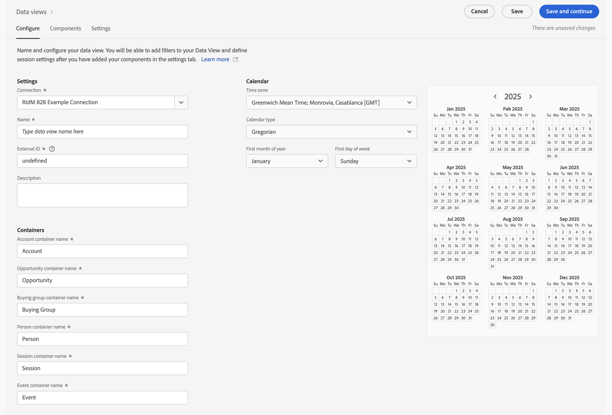

# 创建或编辑数据视图

创建数据视图涉及从架构元素创建量度和维度或利用标准组件。大多数架构元素既可为维度，也可为量度，具体取决于您的业务要求。将架构元素拖入数据视图后，右侧即显示选项，从中可调整维度或量度在 Customer Journey Analytics 中的操作方式。

>[!BEGINSHADEBOX]

请参阅  [创建或编辑数据视图](https://video.tv.adobe.com/v/35110/?quality=12&learn=on){target="_blank"}以获取演示视频。

>[!ENDSHADEBOX]

要创建或编辑数据视图：

1. 登录 [Customer Journey Analytics](https://analytics.adobe.com)，在顶部菜单中选择&#x200B;**[!UICONTROL 数据视图]**，也可以从&#x200B;**[!UICONTROL 数据管理]**&#x200B;中选择。
1. 要创建数据视图，请选择&#x200B;**[!UICONTROL “创建新的数据视图”。]**&#x200B;或者，您可以从数据视图列表中选择现有数据视图进行编辑。

## 配置 {#configure}

要配置新的或现有的数据视图：

>[!BEGINTABS]

>[!TAB 标准]

>[!TAB B2B Edition]

>[!ENDTABS]

1. 选择&#x200B;**[!UICONTROL “配置”]**&#x200B;选项卡（如果尚未激活）。

1. 指定[!UICONTROL “设置”]、[!UICONTROL “容器”]和[!UICONTROL “日程表”]详细信息（见下文）。
1. 选择&#x200B;**[!UICONTROL “保存并继续”]**，以继续配置新的或现有的数据视图。选择&#x200B;**[!UICONTROL “保存”]**，以保存现有数据视图的配置。

### 设置 {#configure-settings}

>[!CONTEXTUALHELP]
>id="dataview_externalid"
>title="外部 ID"
>abstract="更改外部 ID 可能会影响数据视图名称在外部源（例如商业智能工具）中的显示方式。"

提供数据视图的总体设置。

| 设置 | 描述 |
| --- | --- |
| **[!UICONTROL 连接]** | 此字段将数据视图链接到您之前建立的连接，其中包含一个或多个 Adobe Experience Platform 数据集。 |
| **[!UICONTROL 名称]** | 必填。数据视图的名称。此值显示在Analysis Workspace右上角的下拉菜单中。 |
| **[!UICONTROL 外部 ID]** | 必填。您可以在外部源（例如商业智能工具）中使用的数据视图的名称。默认值为 `unspecified`。如果您未指定外部 ID，则名称将从数据视图的名称生成，并用下划线替换空格。 |
| **[!UICONTROL 描述]** | 可选。Adobe 建议输入详细描述，以便用户了解为什么存在该数据视图以及为谁设计了它。 |

{style="table-layout:auto"}

### 兼容性 {#compatibility}

>[!CONTEXTUALHELP]
>id="dataview_dataviewsinadobejourneyoptimizer"
>title="Journey Optimizer 中的数据视图"
>abstract="Customer Journey Analytics 需要使用与 Adobe Journey Optimizer 兼容的连接和数据视图。默认情况下，系统会自动为此目的创建连接和数据视图。 或者，您可以启用此选项，使其成为 Adobe Journey Optimizer 报告中使用的默认数据视图。启用后，Journey Optimizer 所需的所有必要组件都将添加到此数据视图中，并且所有必要的 Journey Optimizer 数据集都将添加到与此数据视图关联的连接中。"
>additional-url="https://experienceleague.adobe.com/zh-hans/docs/analytics-platform/using/integrations/ajo#connection" text="添加了哪些组件和数据集。"

此设置适用于在使用 Adobe Journey Optimizer 的同时使用 Customer Journey Analytics。

此部分仅对配备 Journey Optimizer 的管理员可见。

| 设置 | 描述 |
| --- | --- |
| [!UICONTROL **在 Adobe Journey Optimizer 中设置为默认数据视图**] | 此配置选项使 Journey Optimizer 和 Customer Journey Analytics 的报告标准化。此外，它还允许您在 Customer Journey Analytics 中对 Adobe Journey Optimizer 的数据进行高级分析（在 Journey Optimizer 中选择 [!UICONTROL **在 CJA 中分析**]）。
进行此类分析时，Journey Optimizer 需要具有 Customer Journey Analytics 数据视图的访问权限。
启用此选项可使其成为您的沙盒 Journey Optimizer 报告中使用的默认数据视图。

此配置选项将自动执行以下操作：
<ul><li>在 Customer Journey Analytics 的相关连接中配置所有必需的 Journey Optimizer 数据集，以便与 Journey Optimizer 配合使用。</li><li>在数据视图中创建一组 Journey Optimizer 量度和维度（包括派生字段和计算量度）。在所有这些量度和维度上自动设置上下文标签。</li></ul>

启用此选项时，请考虑以下事项： <ul><li>您可以稍后更改默认数据视图，但这样做可能会更改您的 Journey Optimizer 报告数据。如果启用此选项后选择禁用，系统将提示您选择新的默认数据视图。</li><li>如果您已经对 Customer Journey Analytics 数据视图中的数据集、维度或量度进行了手动自定义，则启用此配置选项时，您的手动自定义将保持不变。此选项可以进行额外的自定义，以进一步标准化 Journey Optimizer 和 Customer Journey Analytics 之间的报告。启用此选项后，您还可以进行手动自定义。</li><li>选择此选项时，无法删除与数据视图关联的连接。</li></ul>请参阅[将 Adobe Journey Optimizer 与 Adobe Customer Journey Analytics 集成](/help/integrations/ajo.md)，以了解详细信息。 |

{style="table-layout:auto"}

### 容器

指定数据视图的容器的名称。容器名称经常在[区段](/help/components/filters/filters-overview.md#Filter-containers)中使用。

| 设置 | 描述 |
| --- | --- |
| [!BADGE B2B Edition]{type=Informative url="https://experienceleague.adobe.com/zh-hans/docs/analytics-platform/using/cja-overview/cja-b2b/cja-b2b-edition" newtab=true tooltip="Customer Journey Analytics B2B Edition"} **[!UICONTROL 全球帐户容器名称&#x200B;]** | `Global Account`（默认）。[!UICONTROL 全球帐户]容器包括全球帐户在指定的时间范围内的每个会话和事件。如果您的组织使用不同的术语，您可以在此处重命名容器。 |
| [!BADGE B2B Edition]{type=Informative url="https://experienceleague.adobe.com/zh-hans/docs/analytics-platform/using/cja-overview/cja-b2b/cja-b2b-edition" newtab=true tooltip="Customer Journey Analytics B2B Edition"} **[!UICONTROL 帐户容器名称&#x200B;]** | `Account`（默认）。[!UICONTROL 帐户]容器包括在指定的时间范围内帐户的每个会话和事件。如果您的组织使用不同的术语，您可以在此处重命名容器。 |
| [!BADGE B2B Edition]{type=Informative url="https://experienceleague.adobe.com/zh-hans/docs/analytics-platform/using/cja-overview/cja-b2b/cja-b2b-edition" newtab=true tooltip="Customer Journey Analytics B2B Edition"} **[!UICONTROL 机会容器名称&#x200B;]** | `Opportunity`（默认）。[!UICONTROL 机会]容器包括在指定的时间范围内机会的每个会话和事件。如果您的组织使用不同的术语，您可以在此处重命名容器。 |
| [!BADGE B2B Edition]{type=Informative url="https://experienceleague.adobe.com/zh-hans/docs/analytics-platform/using/cja-overview/cja-b2b/cja-b2b-edition" newtab=true tooltip="Customer Journey Analytics B2B Edition"} **[!UICONTROL 购买群组容器名称&#x200B;]** | `Buying Group`（默认）。[!UICONTROL 购买群组]容器包括在指定的时间范围内购买群组的每个会话和事件。如果您的组织使用不同的术语，您可以在此处重命名容器。 |
| **[!UICONTROL 人员容器名称]** | `Person`（默认）。[!UICONTROL 人员]容器包括人员在指定的时间范围内的每个会话和事件。如果您的组织使用不同的用语（例如，“访客”或“用户”），可在此处将该容器重命名。 |
| **[!UICONTROL 会话容器名称]** | `Session`（默认）。通过[!UICONTROL 会话]容器可以识别页面交互、营销活动或特定会话的转化。可将此容器重命名为“访问”或您的组织更喜欢的任何其他用语。 |
| **[!UICONTROL 事件容器名称]** | `Event`（默认）。[!UICONTROL 事件]容器定义数据集中的个别事件。如果您的组织使用不同的用语（例如，“点击”或“页面查看”），可在此处将该容器重命名。 |

{style="table-layout:auto"}

### 日程表

指示您希望数据视图遵循的日程表格式。可有多个数据视图基于同一个[连接](/help/connections/create-connection.md)，并可为其赋予不同的日程表类型或时区。这些数据视图可让使用不同日程表类型的团队用相同的基础数据满足其各自的需求。

| 设置 | 描述 |
| --- | --- |
| [!UICONTROL **时区**] | 选择要用哪个时区表示数据。如果选择执行夏令时的时区，则将自动调整数据以反映这一点。春季将时钟向前调整一小时，产生一小时差距。秋季将时钟向后调整一小时，在夏令时转换期间将有一小时重复。 |
| [!UICONTROL **日程表类型**] | 决定每个月的周数如何分组。 **公历：**&#x200B;标准日程表格式。季度按月分组。 **4-5-4 零售：**&#x200B;标准化的 4-5-4 零售日程表。季度的第一个月和最后一个月包含 4 周，而季度的第二个月包含 5 周。 **自定义 (4-5-4)：**&#x200B;类似于 4-5-4 日程表，但可选择一年的第一天以及哪年出现“额外的”一周。 **自定义 (4-4-5)：**&#x200B;每个季度的第一个月和第二个月包含 4 周，而每个季度的最后一个月包含 5 周。 **自定义 (5-4-4)：**&#x200B;每个季度的第一个包含为 5 周，而每个季度的第二个月和第三个月包含 4 周。 |
| [!UICONTROL **一年的第一个月**]&#x200B;和&#x200B;[!UICONTROL **一周的第一天**] | 对“公历”日程表类型可见。指定要让日程表年从哪一个月开始，以及每周从哪一天开始。 |
| [!UICONTROL **当年的第一天**] | 对自定义日程表类型可见。指定要让当年在一年中的哪一天开始。日程表自动根据此值设置每周第一天的格式。 |
| [!UICONTROL **出现“额外的”一周的年份**] | 对于大多数 364 天日程表（52 周，每周 7 天），每年都会积累多出的天数，直到它们加起来形成额外的一周。然后，将这额外的一周添加到当年的最后一个月。指定要将额外的一周添加到哪年。 |

{style="table-layout:auto"}

## 组件

接下来，您可以设置数据视图的组件，也就是说您可以从架构元素创建量度和维度。您也可以使用标准组件。

>[!IMPORTANT]
>
>可将最多 5000 个量度和 5000 个维度添加到单个数据视图。

1. 选择&#x200B;**[!UICONTROL “组件”]**&#x200B;选项卡。

   

   可在左上角看到[!UICONTROL 连接]（其中包含数据集），并可在下方看到其[!UICONTROL 架构字段]。已包含的组件是所有数据视图（如事件、人员、会话量度以及分钟、季度、周维度）所需的标准组件（系统生成）。默认情况下，Adobe 也会应用筛选条件&#x200B;**[!UICONTROL “包含数据”]**&#x200B;和&#x200B;**[!UICONTROL “未弃用”]**，以便仅显示包含数据且未弃用的架构字段。

1. 使用**[!UICONTROL “搜索”架构字段]**&#x200B;来搜索架构字段，或者通过移动到任何数据集收藏集来查找字段，例如**[!UICONTROL “事件”数据集。]** 或者，您可以使用**“创建”派生字段**&#x200B;创建派生字段。请参阅[派生字段](./derived-fields/derived-fields.md)，了解更多信息。

1. 找到特定架构字段或定义派生字段后，将该字段（如 **[!UICONTROL 页面名称]**）从左边栏拖动到&#x200B;**[!UICONTROL 包含的组件]**&#x200B;下的&#x200B;**[!UICONTROL 量度]**&#x200B;或&#x200B;**[!UICONTROL 维度]**&#x200B;部分。
可将同一架构字段拖入“维度”或“量度”部分多次，并可按不同方式配置同一维度或量度。例如，从pageName字段，您可以使用右侧不同的[组件设置](component-settings/overview.md)创建名为`Product Pages`的维度以及名为`Error pages`的维度。
如果从左边栏拖动架构字段文件夹，则该文件夹中的字段会自动排序到相应的部分中。 字符串字段最后落在[!UICONTROL 维度]部分中，而数值架构类型最后落在[!UICONTROL 量度]部分中。您还可以单击&#x200B;**[!UICONTROL 添加所有]**，并将所有架构字段添加到其各自的部分。

1. 选择组件后，右侧即会显示设置。

   

   请使用[组件设置](component-settings/overview.md)配置组件。可用的组件设置取决于组件是维度还是量度以及架构数据类型。这些设置包括：

   * [[!UICONTROL 归因]](component-settings/attribution.md)
   * [[!UICONTROL 行为]](component-settings/behavior.md)
   * [[!UICONTROL 格式]](component-settings/format.md)
   * [[!UICONTROL 包括排除值]](component-settings/include-exclude-values.md)
   * [[!UICONTROL 量度去重]](component-settings/metric-deduplication.md)
   * [[!UICONTROL 无值选项]](component-settings/no-value-options.md)
   * [[!UICONTROL 持久性]](component-settings/persistence.md)
   * [[!UICONTROL 值分段]](component-settings/value-bucketing.md)

1. 选择&#x200B;**[!UICONTROL “保存并继续”]**，以继续配置新的或现有的数据视图。选择&#x200B;**[!UICONTROL “保存”]**，以保存现有数据视图的配置。

### 重复的指标或维度

复制指标或维度，然后修改特定设置，这是从单个架构字段创建多个指标或维度的简单方法。在量度或维度在右上角的名称下方选择[!UICONTROL 复制]设置。修改新维度或量度，并以更具描述性的名称保存它。

### 筛选架构字段或数据集

您可以根据[!UICONTROL 数据类型]、[!UICONTROL 数据集]、[!UICONTROL 数据治理]和[!UICONTROL 其他]标准（[!UICONTROL 包含数据]、[!UICONTROL 是身份标识]和[!UICONTROL 未弃用]），筛选左栏内的架构字段：

>[!TIP]
>
>如果组件未在数据视图中正确加载，并且您看到错误消息，请参阅[缺乏权限](../troubleshooting/lack-of-permissions.md)，以获得解决方案。

### 包含的组件 {#included-components}

>[!CONTEXTUALHELP]
>id="dataview_includedcomponents_filter_datagovernance_custom"
>title="自定义标签"
>abstract="除了 Adobe 提供的标签之外，您还可以为组织定义自己的自定义标签。"
>additional-url="https://experienceleague.adobe.com/zh-hans/docs/experience-platform/data-governance/labels/overview" text="数据使用标签概述"

>[!CONTEXTUALHELP]
>id="dataview_includedcomponents_filter_datagovernance_contract"
>title="合同标签"
>abstract="合同(C)标签用于对具有合同义务或与组织的数据治理策略相关的数据进行分类。"
>additional-url="https://experienceleague.adobe.com/zh-hans/docs/experience-platform/data-governance/labels/overview" text="数据使用标签概述"

>[!CONTEXTUALHELP]
>id="dataview_includedcomponents_filter_datagovernance_identity"
>title="身份标识标签"
>abstract="身份(I)标签用于对可以识别或联系特定人员的数据进行分类。"
>additional-url="https://experienceleague.adobe.com/zh-hans/docs/experience-platform/data-governance/labels/overview" text="数据使用标签概述"

>[!CONTEXTUALHELP]
>id="dataview_includedcomponents_filter_datagovernance_sensitive"
>title="敏感标签"
>abstract="敏感标签用于对您和您的组织认为敏感的数据进行分类。"
>additional-url="https://experienceleague.adobe.com/zh-hans/docs/experience-platform/data-governance/labels/overview" text="数据使用标签概述"

>[!CONTEXTUALHELP]
>id="dataview_includedcomponents_filter_datagovernance_partnerecosystem"
>title="合作伙伴生态系统"
>abstract="合作伙伴生态系统(P)标签用于对与第三方合作伙伴共享的数据进行分类。"
>additional-url="https://experienceleague.adobe.com/zh-hans/docs/experience-platform/data-governance/labels/overview" text="数据使用标签概述"

>[!CONTEXTUALHELP]
>id="dataview_includedcomponents_filter_datagovernance_policies"
>title="支持"
>abstract="为了让数据使用标签能够有效地支持数据合规性，必须实施数据使用策略。数据使用策略是描述允许或限制在 Experience Platform 中对数据执行的营销操作类型的规则。策略过滤器将启用的策略应用于数据视图。"
>additional-url="https://experienceleague.adobe.com/zh-hans/docs/experience-platform/data-governance/labels/overview" text="数据使用标签概述"

>[!CONTEXTUALHELP]
>id="dataview_includedcomponents_filter_datagovernance_responsibleengagement"
>title="负责的参与标签"
>abstract="责任参与标签用于支持责任参与。"
>additional-url="https://experienceleague.adobe.com/zh-hans/docs/experience-platform/data-governance/labels/overview" text="数据使用标签概述"

**[!UICONTROL 包含的组件]**&#x200B;包含您为数据视图配置的&#x200B;**[!UICONTROL 量度]**&#x200B;和&#x200B;**[!UICONTROL 维度]**&#x200B;的列表。

* 若要搜索组件，请使用 **[!UICONTROL _搜索组件_]**。
* 要筛选列出的包含的组件，请选择。

  

  在&#x200B;**[!UICONTROL 按]**&#x200B;筛选字段中，可以按以下类别进行筛选：

   * **[!UICONTROL 数据类型]** — 您可以选择以下一种或多种数据类型：[!UICONTROL 字符串]、[!UICONTROL 整数]、[!UICONTROL 短]、[!UICONTROL 布尔值]、[!UICONTROL 双精度浮点数]、[!UICONTROL 字节]、[!UICONTROL 长]、[!UICONTROL 日期]或[!UICONTROL 日期时间]。
   * **[!UICONTROL 数据集]** — 选择一个或多个数据集。
   * **[!UICONTROL 数据管理]**：从[!UICONTROL 自定义标签]、[!UICONTROL 合同标签]、[!UICONTROL 身份标签]、[!UICONTROL 敏感度标签]、[!UICONTROL 合作伙伴生态系统]或[!UICONTROL 策略]子类别中选择一个或多个标签。
   * **[!UICONTROL 其他]** — 选择一个或多个选项[!UICONTROL 包含数据]、[!UICONTROL Is标识]或[!UICONTROL 不弃用]。

  选择&#x200B;**[!UICONTROL 应用]**&#x200B;以应用筛选器。

## 设置 {#dataview-settings}

1. 选择&#x200B;**[!UICONTROL 设置]**&#x200B;选项卡。
1. 配置应用于整个数据视图的区段。请参阅下面的[设置（区段）](#settings-filters)。
1. 配置会话超时和量度。请参阅下列[会话设置。](#session-settings)
1. 选择&#x200B;**[!UICONTROL “保存并继续”]**，以继续配置新的或现有的数据视图。选择&#x200B;**[!UICONTROL “保存”]**，以保存现有数据视图的配置。

### 设置（区段） {#segment-settings}

您可以添加要应用于整个数据视图的区段。此区段应用于您在 Workspace 中运行的任何报告。请将某个区段从左边栏中的列表拖至&#x200B;**[!UICONTROL 添加区段]**&#x200B;字段。

### 会话设置

决定在会话到期并开始新会话之前，事件之间无活动的时段。时段为必填。还可选择在事件包含特定量度时强制开始新会话。有关更多详细信息，请参阅[会话设置](session-settings.md)。

### 数据预览

数据预览中（为各种容器）将此数据视图的数据与连接的数据进行比较。预览百分比基于过去 90 天连接中的总数。

如果未加载预览，则您的连接有可能仍在进行回填。

指定所有需要的设置后，单击&#x200B;**[!UICONTROL 保存并完成]**。
