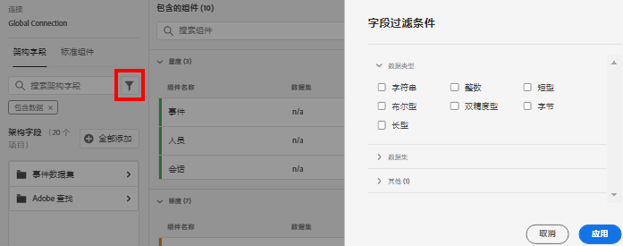

# 创建新数据视图

>[!IMPORTANT]
>
>此功能当前处于有限测试中。

创建视图涉及从模式元素创建量度和维度，或使用标准组件。 创建量度或维度为您提供了极大的灵活性。 以前，假设您在Adobe Experience Platform中有数据集，则字符串字段用作维度，数字字段用作量度。 要更改其中的任何字段，您必须在平台中编辑模式。 数据视图UI现在允许对量度和维度](/help/data-views/data-views.md)进行更多自由定义。[

## 1.配置视图设置和容器

1. 在 Customer Journey Analytics 中，转到&#x200B;**[!UICONTROL 数据视图]**&#x200B;选项卡。
2. 单击&#x200B;**[!UICONTROL 添加]**&#x200B;可创建新数据视图并配置其设置。

| 设置 | 描述/用例 |
| --- | --- |
| [!UICONTROL 连接] | 此字段将数据视图链接到您之前建立的连接，该连接包含一个或多个Adobe Experience Platform数据集。 |
| [!UICONTROL 名称] | 必须为数据视图命名。 |
| [!UICONTROL 描述] | 详细说明不是强制性的，但建议提供。 |
| [!UICONTROL 时区] | 选择要显示数据的时区。 |
| [!UICONTROL 标记] | 标记让您可以将数据视图组织成不同的类别。 |
| [!UICONTROL 容器] | 您可以在此处重命名容器，这就是它们在基于此数据视图的任何Workspace项目中的显示方式。 容器用于过滤器和流失/流，以定义范围或上下文的范围或范围。 [了解详情](https://experienceleague.adobe.com/docs/analytics-platform/using/cja-components/cja-filters/filters-overview.html?lang=en#filter-containers) |
| [!UICONTROL 人员容器名称是……] | [!UICONTROL Person] （默认）。[!UICONTROL Person]容器包括指定时间范围内访客的每次访问和页面视图。 您可以将其重命名为“用户”或您喜欢的任何其他术语。 |
| [!UICONTROL 会话容器名称为……] | [!UICONTROL 会话] （默认）。通过[!UICONTROL 会话]容器，可以识别特定会话的页面交互、活动或转换。 您可以将其重命名为“访问”或您喜欢的任何其他术语。 |
| [!UICONTROL 事件容器名称为……] | [!UICONTROL 事件] （默认）。[!UICONTROL 事件]容器定义要包括或从筛选器中排除的页面事件。 |

接下来，您可以从模式元素创建量度和维度。 您还可以使用标准组件。

## 2.从模式元素创建量度和维度

1. 在[!UICONTROL Customer Journey Analytics] > [!UICONTROL 视图]中，单击[!UICONTROL 组件]选项卡。

您可以在左上角看到[!UICONTROL Connection]，它包含数据集，并在下面看到其[!UICONTROL 模式字段]。

1. 现在，将模式字段（如[!UICONTROL pageTitle]）从左边栏拖动到“量度”或“Dimension”部分。

   您可以多次将同一模式字段拖入维度或量度部分，并以不同方式配置相同的维度或量度。 例如，从&#x200B;**[!UICONTROL pageTitle]**&#x200B;字段中，可以创建名为“Product Pages”的维度，以及另一个“Error pages”，等等。 从&#x200B;**[!UICONTROL pageTitle]**;字段中，您还可以根据字符串值创建量度。 例如，您可以创建一个或多个具有不同属性设置和不同包含/排除值的&#x200B;**[!UICONTROL Orders]**&#x200B;量度。

   

   >[!NOTE]
   >
   >您可以从左边栏拖入整个模式字段文件夹，这些文件夹将自动按传统部分进行排序。 字符串字段将在[!UICONTROL Dimension]部分结尾，在[!UICONTROL 量度]部分结尾。 或者，单击&#x200B;**[!UICONTROL 添加所有]**，将添加所有模式字段。

1. 选择组件后，您会看到许多设置显示在右侧。 使用下面描述的设置配置组件。

### 配置组件设置

| 设置 | 描述/用例 |
| --- | --- |
| [!UICONTROL 组件类型] | 必需. 允许您将组件从量度更改为Dimension，反之亦然。 |
| [!UICONTROL 组件名称] | 必需. 用于指定将在Analysis Workspace中显示的易记名称。 您可以重命名组件，为其指定特定于数据视图的名称。 |
| [!UICONTROL 描述] | （可选，但建议）为其他用户提供有关组件的信息。 |
| [!UICONTROL 标记] | 可选。允许您使用自定或现成的标签为组件添加标签，以便在Analysis Workspace UI中更轻松地搜索/筛选。 |
| [!UICONTROL 字段名称] | 模式字段的名称。 |
| [!UICONTROL 数据集类型] | 必需. 一个不可编辑的字段，显示组件来自哪个事件集类型(、查找或用户档案)。 |
| [!UICONTROL 数据集] | 必需. 一个不可编辑的字段，显示组件来自的字段类型（例如字符串、整数等）。 此字段可包含多个数据集，例如您组合多个报表包时。 |
| [!UICONTROL 架构类型] | 指组件是否为字符串、整数等。 |
| [!UICONTROL 组件 ID] | 必需. [CJA API](https://adobe.io/cja-apis/docs)使用此字段引用组件。 您可以单击编辑图标并修改此组件ID。 但是，更改此组件ID会中断包含此组件的所有现有Workspace项目。 如果您曾创建另一个对pageTitle维度使用不同字段的视图，则可以对其重命名，并使维度跨视图兼容。 |
| [!UICONTROL 路径] | 必需. 一个不可编辑的字段，显示组件来自的模式路径。 |
| [!UICONTROL 在报表中隐藏组件] | 默认=关闭。 用于在报告中使用时，可将组件从“视图”中管理出来。 这不会影响权限，只影响组件特选。 换言之，您可以在报告中对非管理员隐藏组件。 管理员仍可通过单击Analysis Workspace项目中的[!UICONTROL 显示所有组件]来访问它。 |

### 配置格式设置

格式设置仅适用于量度。

| 设置 | 描述/用例 |
| --- | --- |
| [!UICONTROL Format] | 允许您指定量度的格式，如小数、时间、%或货币。 |
| [!UICONTROL 小数位] | 允许您指定量度应显示的小数位数。 |
| [!UICONTROL 将上升趋势显示为] | 允许您指定此量度的向上趋势应被视为良好（绿色）还是坏（红色）。 |
| [!UICONTROL 货币] | 仅当选定的量度格式为[!UICONTROL Currency]时，才显示此设置。 提供一列表货币选项。 默认为无货币。 这样，您就可以在报告中以您选择的货币表示收入。 这不是货币兑换，只是UI格式选项。 |

### 配置归因设置

| 设置 | 描述/用例 |
| --- | --- |
| [!UICONTROL 设置归因] | 允许您指定要在使用此量度时默认应用的属性设置。 此默认值可在自由格式表或计算量度中覆盖。 |
| [!UICONTROL 归因模型] | 允许您指定默认归因模型 — 仅在打开[!UICONTROL 使用非默认归因模型]设置时处于活动状态。 默认为[!UICONTROL 上次触摸]。 选项有：上次触摸，首次触摸，线性，参与，同一触摸， U形， J曲线，逆J，时间衰减，定制，算法。 其中一些选项会创建需要填写的其他字段 — 如“自定义”或“时间衰减”。 您可以使用相同的字段创建多个量度 — 这意味着您可以有一个[!UICONTROL 最近联系]收入量度和一个[!UICONTROL 首次联系]收入量度，但基于模式中的相同收入字段。 |
| [!UICONTROL 回顾窗口] | 允许您为量度指定默认回顾窗口 — 仅在打开[!UICONTROL 使用非默认归因模型]设置时处于活动状态。 选项有：人员(报告窗口)、会话、自定义。 选择“自定义”后，我们还为您提供选择任意天数/周/月/等的选项。 （最多90天），就像Attribution IQ。 您可以使用相同的模式字段来拥有多个量度，但每个量度都具有单独的回顾窗口。 |

### 配置“包含/排除值”设置

此设置允许您在报告时修改要查询的基础数据。 它与过滤器（以前称为区段）不同。 但过滤器会尊重这一新维度，路径和归因也会如此。

例如，您可以在pageTitle字段中创建一个维度，但将其命名为“error pages”，并包含[!UICONTROL 包含短语]“error”的任何页面。

| 设置 | 描述/用例 |
| --- | --- |
| [!UICONTROL 区分大小写] | 默认=开启。 此设置与“量度”的Dimension略有不同。<ul><li>**量度**:此设置仅适用于“包 [!UICONTROL 含/排除值”] 部分。它允许您确定要应用的过滤器是否应区分大小写。</li><li>**Dimension** :此设置确定应以区分大小写还是不区分大小写的方式聚集此维中的数据。这会更改为字符串字段运行报表/过滤器/属性设置的方式。</li></ul> |
| [!UICONTROL 匹配] | 允许您指定在归因和分段之前要考虑的报告值（例如，仅使用包含短语“error”的值）。 您可以指定：**[!UICONTROL 如果所有条件均满足]**，或&#x200B;**[!UICONTROL 如果任何条件均满足]**。 |
| [!UICONTROL 标准] | 允许您指定应应用于特定筛选器规则的匹配逻辑。<ul><li>**字符串**:包含短语、包含任何术语、包含所有术语、不包含任何术语、不包含短语、等号、不等于、开始和结尾</li><li>**多次/整数**:等于、不等于、大于、小于、大于或等于、小于或等于</li><li>**日期**:等于，不等于，晚于，是之前，发生在</li></ul> |
| [!UICONTROL 匹配操作数] | 允许您指定应应用匹配运算符的匹配操作数。<ul><li>**字符串**:文本字段</li><li>**多次/整数**:带有数值向上/向下箭头的文本字段</li><li>**日期**:日粒度选择器（日历）</li><li>**日期时间**:日期和时间粒度选择器</li></ul> |
| [!UICONTROL 添加规则] | 允许您指定附加的匹配运算符和操作数。 |

### 配置行为设置

| 设置 | 描述/用例 |
| --- | --- |
| [!UICONTROL 对值计数] | 这样，您就可以创建布尔字段设置为`true`的次数的计数；作为量度。 例如，将名为`isPage`的布尔字段设置为`true`的[!UICONTROL 页视图]的数量。 |
| [!UICONTROL 对实例计数] | 允许您指定用作量度的数字或日期类型字段是否应计算其设置的时间，而不是值本身。  如果要将数字字段的实例相加，并且只想将某个字段与内部实际值相 ** 加的次数相加。 这对于从Revenuefield创  建Ordersmetric  （例如）很有用。如果已设置收入，则我们要计入1个订单，而不是数值收入额。 |

### 配置[!UICONTROL 无值选项]设置

[!UICONTROL “无值选] 项”设置类似于“未  指定”或“  未求值”报告。在数据视图UI中，您可以逐个组件决定在报告中如何处理这些值。 您还可以将[!UICONTROL No value]重命名为更适合您的环境的内容，如[!UICONTROL Null]、[!UICONTROL Not set]或其他。

>[!NOTE]
>
>将此字段更改为自定义值时，自定义值将被视为合法字符串值。 因此，如果在此字段中输入值“Red”，则数据本身中出现的字符串“Red”的任何实例也将滚动到您指定的同一行项目下。

另请注意，无论您在此字段中指定什么，都可用于报告中[!UICONTROL 无值]行项的特殊UI处理，如[!UICONTROL 无值选项]设置中所述。

| 设置 | 描述/用例 |
| --- | --- |
| [!UICONTROL 如果显示，请调用“无值]...” | 您可以在此处将&#x200B;**[!UICONTROL 无值]**&#x200B;重命名为其他值。 |
| [!UICONTROL 默认情况下不显示无值] | 不在报告中显示此值。 |
| [!UICONTROL 默认情况下显示无值] | 在报告中显示此值。 |
| [!UICONTROL 将无值视为值] | 例如，如果您将移动设备类型作为维度，则可以将&#x200B;**[!UICONTROL No value]**&#x200B;项重命名为“Desktop”。 |

### 配置持久性设置

这些设置类似于传统Adobe Analytics中的eVar设置。

| 设置 | 描述/用例 |
| --- | --- |
| [!UICONTROL 设置持久性] | 切换键 |
| [!UICONTROL 分配] | 允许您指定用于持久性的维的分配模型。 选项有：最近，原始，实例，全部。 如果您希望某个值持续存在（与传统Analytics中的eVar类似），您将在此处设置它。 唯一的关键区别是您可以设置的最大持久性为90天。 此外，[!UICONTROL 不过期]不是选项。 |
| [!UICONTROL 过期] | 用于指定维的持久性窗口。 选项有：[!UICONTROL 会话]（默认）、[!UICONTROL 人员]、[!UICONTROL 时间]、[!UICONTROL 量度]。 您可能需要使购买时的维度过期（例如内部搜索词或其他促销用例）。 [!UICONTROL 量] 度允许您将任何定义的量度指定为此维度的过期时间(例如，  购买量度)。 |

### 配置值分段设置

| 设置 | 描述/用例 |
| --- | --- |
| [!UICONTROL 分段值] | 允许您创建数字维度的分时段版本。 这允许您将收入时段或其他数值作为报告中的维度进行报告。 最多可创建5个桶。 |
| [!UICONTROL 最高] | 允许您指定第一个数字维度时段的边界。 这仅适用于数字维。 |
| [!UICONTROL 介于] | 允许您指定后续数字维度时段的边界。 |
| [!UICONTROL 添加分段] | 允许您向数字维度分段添加另一个时段。 |

### 使用[!UICONTROL 标准组件]

除了从模式元素创建量度和维度之外，您还可以在数据视图中使用标准组件。

[!UICONTROL 标准] 组件是不是从数据集模式字段生成，而是系统生成的组件。任何数据视图都需要某些系统组件，以便在Analysis Workspace中实现报告功能，而其他系统组件是可选的。

所需的标准组件

| 组件名称 | Dimension或量度 | 注释 |
| --- | --- | --- |
| [!UICONTROL 人员] | 指标 | 传统Analytics中以前称为[!UICONTROL 唯一访客]。 此量度基于在连接中指定的人员ID。 |
| [!UICONTROL Sessions] | 指标 | 传统Analytics中以前称为[!UICONTROL 访问]。 此量度基于以下指定的会话化设置。 |
| [!UICONTROL 事件] | 指标 | 在传统Analytics中，以前称为[!UICONTROL Occurrences]。 此量度表示连接中所有事件数据集的行数。 |
| [!UICONTROL 日] | 维度 |  |
| [!UICONTROL 周] | 维度 |  |
| [!UICONTROL 月] | 维度 |  |
| [!UICONTROL 季度] | 维度 |  |
| [!UICONTROL 年] | 维度 |  |
| [!UICONTROL 小时] | 维度 |  |
| [!UICONTROL 分钟] | 维度 |  |

### 可选标准组件

任何数据视图都需要某些系统组件，以促进Analysis Workspace中的报告功能，而以下组件是可选的。

| 组件名称 | Dimension或量度 | 注释 |
| --- | --- | --- |
| [!UICONTROL 会话开始] | 指标 | 此量度计算作为会话第一个事件的事件数。 当在筛选器定义中使用时(例如“[!UICONTROL 会话开始]存在”)，它向下过滤器到每个会话的第一个事件。 请注意，这与[!UICONTROL Entries]不同，因为它始终计算会话的第一个事件，而不是会话中某个维度存在的第一个值。 |
| [!UICONTROL 会话结束] | 指标 | 此量度计算作为会话最后事件的事件数。 与[!UICONTROL 会话开始]类似，它还可用于过滤器定义中，以将事项筛选到每个会话的最后一个事件。 请注意，这与[!UICONTROL 退出]不同，因为它始终计算会话的最后事件，而不是会话中某个维度存在的最后一个值。 |
| [!UICONTROL 逗留时间] | 指标 | [!UICONTROL 逗留时间]量度的工作方式与传统Adobe Analytics中类似 — 将维度的两个不同值之间的时间相加。 但是，使用“会话开始”和“会话结束”量度，客户可以自行构建[!UICONTROL 每人逗留时间]和[!UICONTROL 每会话逗留时间]计算量度(请参阅下面的OOTB过滤器和计算量度)。 |
| [!UICONTROL 每个事件逗留时间] | 维度 | 从功能上讲，这实际上只是上述量度的一次运算。 我们提供默认存储段，但允许您将存储段更改为您喜欢的任何内容。 |
| [!UICONTROL 每个会话逗留时间] | 维度 |  |
| [!UICONTROL 每人逗留时间] | 维度 |  |
| [!UICONTROL 批ID] | 维度 |  |
| [!UICONTROL 数据集 ID] | 维度 |  |

### 筛选模式字段和维度/量度

您可以按以下模式类型过滤左边栏中的数据字段：

您还可以按数据集以及模式字段是否包含数据或是否是标识进行筛选：

## 3.为您添加全局过滤器数据视图

您可以添加应用于整个视图的过滤器（以前称为区段），类似于虚拟报表包(传统的Adobe Analytics)中筛选的视图。

1. 单击[!UICONTROL 数据视图]中的[!UICONTROL 设置]选项卡。
1. 将滤镜从左边栏中的列表拖到[!UICONTROL 添加过滤器]字段。