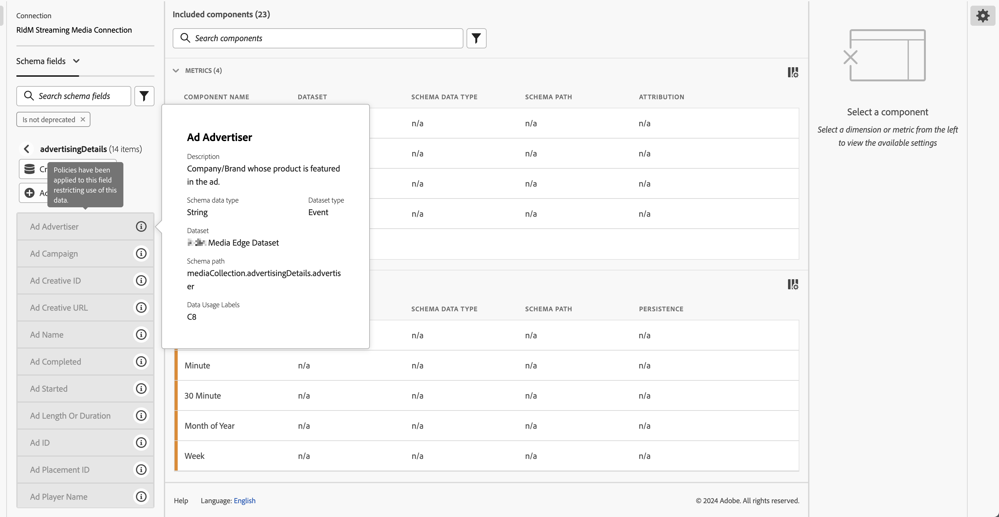

# 标签和策略

在 Experience Platform 中创建数据集时，可以为数据集中的部分或所有元素创建[数据使用标签](https://experienceleague.adobe.com/docs/experience-platform/data-governance/labels/reference.html?lang=zh-Hans)。 您可以在Customer Journey Analytics中查看这些标签和策略。

以下标签对Customer Journey Analytics有特殊意义：

* `C8`标签 – **[!UICONTROL 无测量]**。 此标签表示数据不能用于组织网站或应用程序上的分析。

* `C12`标签 – **[!UICONTROL 无一般数据导出]**。 以这种方式标记的架构字段无法从Customer Journey Analytics（通过报表、导出、API等）导出或下载

>[!NOTE]
>
>数据使用标签不会自动传播到拼接的数据集。 但是，可以手动添加它们。

标签本身并不意味着强制执行这些数据使用标签。 这就是政策的用途。 您可以通过 Experience Platform 中的 [策略服务 API](https://experienceleague.adobe.com/docs/experience-platform/data-governance/api/overview.html?lang=zh-Hans) 创建策略。

两个Adobe定义的策略出现在Customer Journey Analytics中，并影响报表和下载/共享：

* **[!UICONTROL 强制分析]**&#x200B;策略
* **[!UICONTROL 强制下载]**&#x200B;策略

## 在Customer Journey Analytics数据视图中查看数据标签

在 Experience Platform 中创建的数据标签显示在数据视图用户界面的三个位置：

| 位置 | 描述 |
| --- | --- |
| 架构字段上的信息按钮 | 单击此按钮表示当前应用于字段的[!UICONTROL 数据使用标签]：
 |
| 在[组件设置](/help/data-views/component-settings/overview.md)下的右边栏 | 此处列出了任何[!UICONTROL 数据使用标签]：
 |
| 将数据标签添加为列 | 您可以将[!UICONTROL 数据使用标签]作为列添加到数据视图中[!UICONTROL 包含的组件]列中。 只需单击列选择器图标并选择&#x200B;**[!UICONTROL 数据使用标签]**：
 |

{style="table-layout:auto"}

## 筛选数据视图中的数据管理标签

在数据视图编辑器中，单击 [!UICONTROL 过滤器] 图标，并按以下条件筛选数据视图组件 **[!UICONTROL 数据管理]** 和类型 **[!UICONTROL 标签]**：

单击&#x200B;**[!UICONTROL 应用]**&#x200B;查看哪些组件附有标签。

## 筛选数据视图中的数据管理策略

您可以检查是否启用了阻止使用某些Customer Journey Analytics数据视图元素进行分析或导出的策略。

再次，单击 [!UICONTROL 过滤器] 图标（位于左边栏和下） **[!UICONTROL 数据管理]**，单击 **[!UICONTROL 策略]**：

单击&#x200B;**[!UICONTROL 应用]**&#x200B;查看已启用的策略。

## 启用的策略如何影响数据视图

如果启用&#x200B;**[!UICONTROL 强制分析]**&#x200B;或&#x200B;**[!UICONTROL 强制下载]**&#x200B;策略，则无法将具有特定数据标签（如 C8 或 C12）的架构组件添加到数据视图中。

这些组件在左边栏[!UICONTROL 架构字段]列表中显示为灰色：

您也无法保存包含阻止字段的数据视图。

>[!MORELIKETHIS]
>[下载敏感数据](/help/analysis-workspace/curate-share/download-send.md)

>[!MORELIKETHIS]
>[Report Builder 中受到限制的标签是什么?](https://experienceleague.adobe.com/docs/analytics-platform/using/cja-reportbuilder/restricted-labels.html?lang=zh-Hans)

