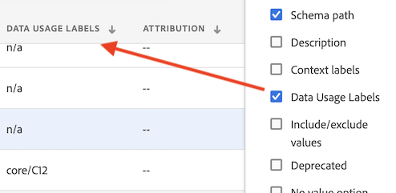
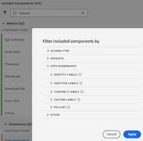
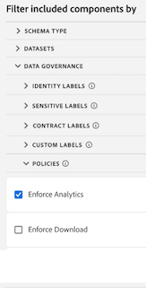
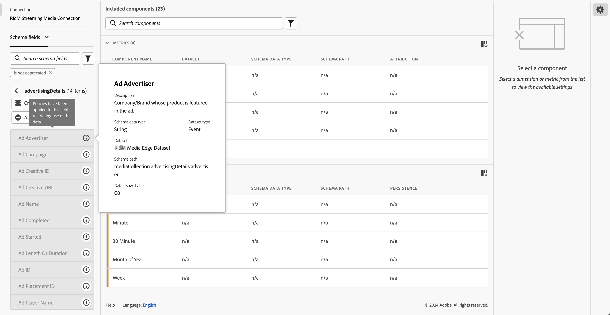

# 标签、策略和营销操作

在 Experience Platform 中创建数据集时，可以为数据集中的部分或所有元素创建[数据使用情况标签](https://experienceleague.adobe.com/zh-hans/docs/experience-platform/data-governance/labels/reference)。 可以在 Customer Journey Analytics 中查看这些标签和政策。

Customer Journey Analytics特别关注以下标签和营销操作：

| 标签 | 营销操作 | 定义 |
|---------|----------|---------|
| `C2` | [!UICONTROL 导出到第三方] | 标签和关联的营销操作表示，如果启用了相应的DULE策略，则数据无法导出到第三方。 |
| `C3` | [!UICONTROL 与可直接识别的数据合并] | 标签和关联的营销操作表示，如果启用了相应的DULE策略，则数据无法与直接可识别的信息组合或以其他方式使用。 |
| `C8` | [!UICONTROL Analytics] | 标签和关联的营销操作表示，如果启用了相应的DULE策略，则数据无法用于组织网站或应用程序上的分析。 |
| `C9` | [!UICONTROL 数据科学] | 标签和关联的营销操作意味着，如果启用了相应的DULE策略，则数据无法在数据科学工作流中使用。 |
| `C12` | [!UICONTROL 数据导出] | 标签和相关营销操作表明，如果启用了相应的DULE策略，则无法从Customer Journey Analytics（通过报表、导出、API等）导出或下载以这种方式标记的架构字段。 |

>[!NOTE]
>
>数据使用情况标签不会自动传播到拼合数据集。 但可以手动添加它们。

标签本身并不意味着强制执行这些数据使用情况标签。 这就是政策的用途。 您可以使用 [Experience Platform UI](https://experienceleague.adobe.com/zh-hans/docs/experience-platform/data-governance/policies/user-guide) 或通过 Experience Platform 中的[政策服务 API](https://experienceleague.adobe.com/zh-hans/docs/experience-platform/data-governance/api/overview) 创建政策。

Experience Platform中提供了五个Adobe定义的策略，这些策略可能会在Customer Journey Analytics中显示，并影响报表和数据导出：

| 策略 | 标签 |
|---------|----------|
| [!UICONTROL 限制第三方数据导出] | `C2` |
| [!UICONTROL 限制可直接识别的数据组合] | `C3` |
| [!UICONTROL 限制使用分析和基于用户的测量] | `C8` |
| [!UICONTROL 限制数据科学] | `C9` |
| [!UICONTROL 限制数据导出] | `C12` |

## 查看 Customer Journey Analytics 数据视图中的数据标签

您或他人在 Experience Platform 中创建的数据标签显示在数据视图用户界面的三个位置：

| 位置 | 描述 |
| --- | --- |
| 架构字段上的信息按钮 | 单击此按钮表示当前应用于字段的 [!UICONTROL 数据使用情况标签]：
 |
| 在[组件设置](/help/data-views/component-settings/overview.md)下的右边栏 | 此处列出了任何[!UICONTROL 数据使用情况标签]：
 |
| 将数据标签添加为列 | 您可以将 [!UICONTROL 数据使用情况标签] 作为列添加到数据视图中 [!UICONTROL 包含的组件] 列中。 只需选择列选择器图标并选择 **[!UICONTROL 数据使用情况标签]**：
 |

{style="table-layout:auto"}

## 过滤数据视图中的数据治理标签

在数据视图编辑器中，选择左边栏中的 [!UICONTROL 过滤器] 图标，并按 **[!UICONTROL 数据治理]** 和 **[!UICONTROL 标签]** 类型过滤数据视图组件：

单击&#x200B;**[!UICONTROL 应用]**&#x200B;查看哪些组件附有标签。

## 筛选数据视图中的数据管理策略

您可以检查某个策略（例如，您创建的名为 **[!UICONTROL 强制分析]** 的策略）是否已启用。 以及该策略是否阻止使用某些 Customer Journey Analytics 数据视图元素进行分析或数据导出。

再次选择左边栏中的 [!UICONTROL 过滤器] 图标，在 **[!UICONTROL 数据治理]** 下，选择 **[!UICONTROL 策略]**：

单击 **[!UICONTROL 应用]** 查看已启用的策略。

## 启用的策略如何影响数据视图

如果一个或多个策略使用C1、C2、C3、C8、C9或C12标签打开，则无法将应用了某些数据标签的架构组件添加到数据视图。

这些组件在左边栏 [!UICONTROL 架构字段] 列表中显示为灰色：

您还无法保存其中有被阻止的字段的数据视图。

请谨慎尝试在 Experience Platform 中的字段或字段组上应用访问和数据治理标签（通过策略），因为您已经在数据视图中定义了这些组件。 您可能会看到此对话框。

您首先需要解决违规问题（例如，从数据视图中移除组件）。

>[!MORELIKETHIS]
>
>[下载敏感数据](/help/analysis-workspace/export/download-send.md)

>[!MORELIKETHIS]
>
>[Report Builder 中受到限制的标签是什么？](https://experienceleague.adobe.com/zh-hans/docs/analytics-platform/using/cja-reportbuilder/restricted-labels)

