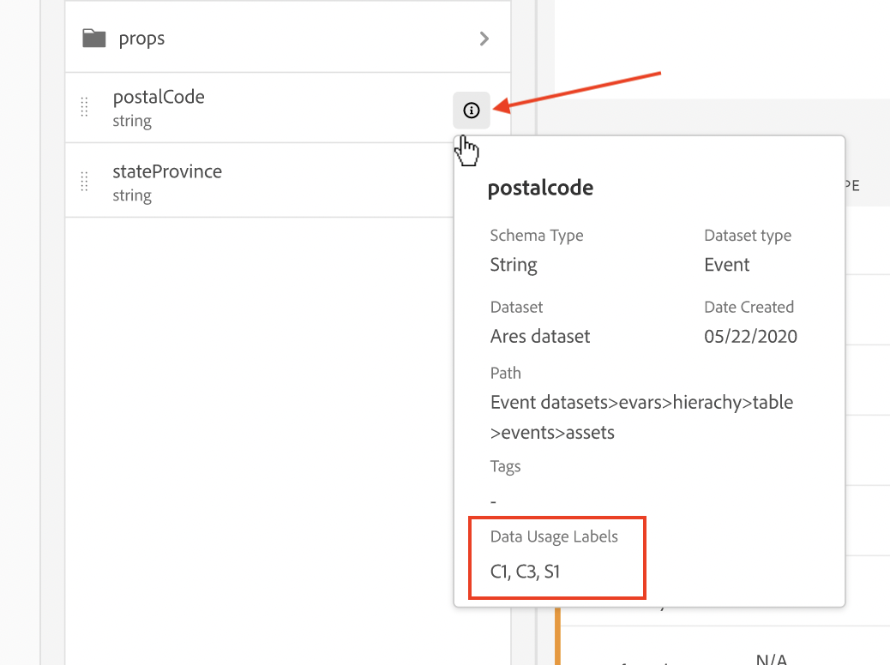

# CJA支持Adobe Experience Platform数据管理

>[!NOTE]
>
>此功能当前正在进行[小范围测试](/help/release-notes/releases.md)。

CJA与 [Adobe Experience Platform数据管理](https://experienceleague.adobe.com/docs/experience-platform/data-governance/home.html?lang=en) 允许为敏感CJA数据设置标签并强制执行隐私政策。

在CJA数据视图工作流中，可以显示在由Experience Platform使用的数据集上创建的隐私标签和策略。 这些标签可阻止或警告从敏感字段创建量度和/或维度的用户。

此外，在从CJA导出数据（通过报表、导出、API等）时，会添加警告或标签，以通知用户报表包含需要以特定方式处理的敏感信息。

此集成使您能够更轻松地管理法规遵从性。 贵组织中的数据管理员可以设置策略以限制使用。 因此，您的CJA用户可以更自信地使用数据，因为他们知道数据符合数据管理者定义的策略。

## Adobe Experience Platform标签和政策

在Experience Platform中创建数据集时，您可以创建 [数据使用标签](https://experienceleague.adobe.com/docs/experience-platform/data-governance/labels/reference.html?lang=en) ，用于数据集中的部分或全部元素。 迄今为止，CJA中尚未公开这些标签。 在此版本中，您可以在CJA中查看这些标签。 CJA特别感兴趣的是以下标签：

* 的 `C8` 标签 —  **[!UICONTROL 无测量]**. 此标签表示数据不能用于贵组织网站或应用程序上的分析。

* 的 `C12` 标签 —  **[!UICONTROL 无常规数据导出]**. 无法从CJA导出或下载标记为此方式的架构字段（通过报表、导出、API等）

标签本身并不意味着强制使用这些数据。 这就是政策的用途。 您可以通过 [策略服务API](https://experienceleague.adobe.com/docs/experience-platform/data-governance/api/overview.html?lang=en) Experience Platform。

策略有两个组成部分：数据标签和营销操作，数据消费者可在受限数据使用策略的上下文中执行此操作。 在CJA中，定义了两个Adobe [营销行动](https://experienceleague.adobe.com/docs/experience-platform/data-governance/policies/overview.html?lang=en#appendix) 很重要：

* Analytics — 将数据用于分析目的，例如测量、分析和报告贵组织网站或应用程序的消费者使用情况。

* 将数据导出到第三方 — 即在Adobe环境之外。

将标签和营销操作与策略绑定，然后打开策略。 该策略将标签和营销操作标记为：强制执行此限制。 CJA中显示了两个Adobe定义的策略，这些策略会影响报表和下载/共享：

* 强制实施Analytics策略
* 强制下载策略

### 在CJA数据视图中查看数据标签

在Experience Platform中创建的数据标签显示在数据视图用户界面的三个位置：

| 位置 | 描述 |
| --- | --- |
| 架构字段上的“信息”按钮 | 单击此按钮可指示当前应用于字段的数据使用标签：
 |
| 下方的右边栏 [组件设置](/help/data-views/component-settings/overview.md) | 此处列出了所有数据使用情况标签：
 |
| 将数据标签添加为列 | 您可以将数据标签作为列添加到数据视图的“已包括组件”列中。 只需单击列选择器图标，然后选择数据使用情况标签：
 |

### 在数据视图中过滤“数据管理”标签

在数据视图编辑器中，单击左侧跟踪中的过滤器图标，然后按“数据管理”标签过滤数据视图组件：

单击 **[!UICONTROL 应用]** 以了解哪些组件附加了标签。

### 在数据视图中过滤数据管理策略

您可以检查是否开启了阻止将某些CJA数据视图元素用于分析或导出目的的策略。

再次单击左边栏中的过滤器图标，在“数据管理”下单击策略：

单击 **[!UICONTROL 应用]** 查看启用了哪些策略 _?_

### 如何 [!UICONTROL 强制Analytics] 策略影响工作区项目

如果打开此策略，则与这些架构字段关联某些数据标签（如C8）的字段将无法用于CJA工作区中的分析目的。

对于报表，这意味着

* 您无法将这些字段添加到数据视图，它们在左边栏中呈灰显状态 [!UICONTROL 架构字段] 列表。
* 无法保存已阻止其中字段的数据视图。

如果您尝试对包含禁止进行分析的项目的数据视图执行工作区分析，则会收到类似以下内容的通知：

在单个组件上，消息将类似于以下内容：

### 如何 [!UICONTROL 强制下载] 策略影响工作区项目

如果打开此策略，则任何Workspace项目的下载（例如通过电子邮件发送或共享pdf）都将对敏感字段进行哈希处理。 您仍可以在工作区中对这些字段进行分析，但如果您尝试通过电子邮件发送或以其他方式共享项目，则阻止的字段将在.pdf文件中显示为经过哈希处理的项目。

在此处添加屏幕截图。

### 在Report Builder中查看标签

请参阅 _此部分_ 以了解更多信息。 （Christine的文档链接）
