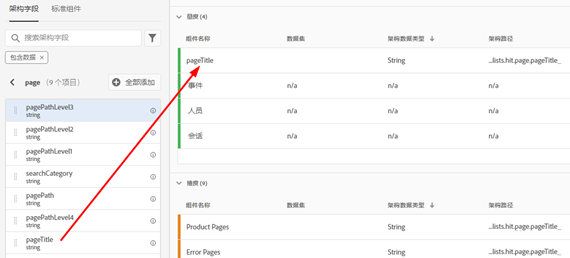
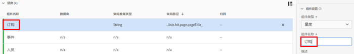
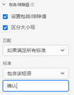
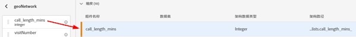
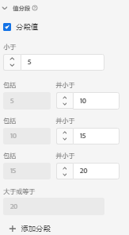
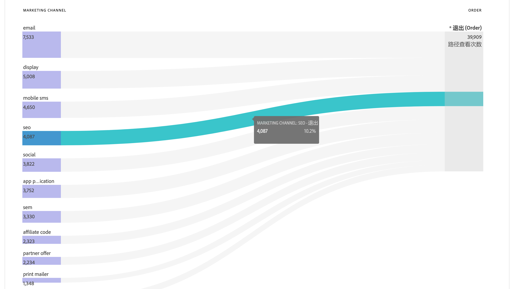
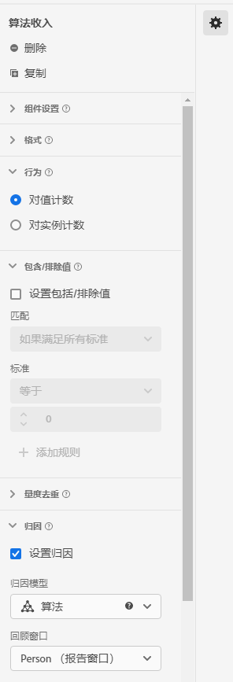

# 数据视图用例

这些用例显示了 Customer Journey Analytics 中数据视图的灵活性和强大功能。

## 1. 根据字符串架构字段创建量度

例如，在创建数据视图时，您可以根据字符串形式的 [!UICONTROL pageTitle] 架构字段创建一个[!UICONTROL 订单]量度。步骤如下：

1. 在“组件”选项卡上，将 [!UICONTROL pageTitle] 拖入[!UICONTROL 包含的组件]下的[!UICONTROL 量度]部分中。
   
1. 现在，突出显示您刚才拖入的量度，并在右侧的[!UICONTROL 组件设置]下重命名它：
   
1. 打开右侧的[!UICONTROL 添加/排除值]对话框，并指定以下内容：
   

   “确认”短语指示这是个订单。查看满足这些条件的所有页面标题后，系统会为每个实例统计“1”。结果是一个新量度（而非计算量度）。具有已添加/排除值的量度可用在可使用任何其他量度的任意位置。它可与 Attribution IQ、筛选器配合使用，以及用在可使用标准量度的任何其他位置。
1. 您可以进一步为此量度指定归因模型，例如[!UICONTROL 回顾时间范围]为[!UICONTROL 会话]的[!UICONTROL 最近联系]。
您还可以根据同一字段创建另一个[!UICONTROL 订单]量度，并为其指定不同的归因模型（例如[!UICONTROL 首次联系]）和不同的[!UICONTROL 回顾时间范围]（例如 [!UICONTROL 30 天]）。

另一个例子是使用访客 ID（一个维度）作为量度来确定您的公司有多少访客 ID。

## 2. 使用整数作为维度

以前，整数会被自动视为 CJA 中的量度。现在，数字（包括 Adobe Analytics 中的自定义事件）可被视为维度。示例如下：

1. 将 [!UICONTROL call_length_min] 整数拖入[!UICONTROL 包含的组件]下的[!UICONTROL 维度]部分中：

   

1. 您现在可以添加[!UICONTROL 值分段]以分段方式在报告中表示此维度。（若不添加分段，此维度的每个实例都会显示为 Workspace 报告中的一个行项目。）

   

## 3. 在流量图中将数值维度作为“量度”

您可以使用数值维度将“量度”引入[!UICONTROL 流量]可视化图表中。

1. 在数据视图[组件](https://experienceleague.adobe.com/docs/analytics-platform/using/cja-dataviews/create-dataview.html?lang=zh-Hans#configure-component-settings)选项卡上，将[!UICONTROL 营销渠道]架构字段拖动到[!UICONTROL [!UICONTROL 已包含组件]下的量度]区域。
2. 在工作区报表中，此流程显示[!UICONTROL 营销渠道]流入[!UICONTROL 订单]:

## 4. 子事件筛选

具体来说，此功能适用于基于数组的字段。包含/排除功能允许您在子事件层进行筛选，而内置在筛选器构建器中的筛选器（区段）仅允许您在事件层上筛选。因此，您可以使用数据视图中的包含/排除进行子事件筛选，然后在事件层筛选器中引用这一新的量度/维度。

例如，使用数据视图中的包含/排除功能仅得到销售额超过 50 美元的产品。如果您有一个订单，包括 50 美元的产品购买和 25 美元的产品购买，那么就只删除 25 美元的产品购买，而不是整个订单。

1. 在数据视图[组件](https://experienceleague.adobe.com/docs/analytics-platform/using/cja-dataviews/create-dataview.html?lang=en#configure-component-settings)选项卡上，将[!UICONTROL 收入]架构字段拖动到[!UICONTROL 量度]区域中[!UICONTROL 已包含的组件]下。
1. 选择量度并在右侧配置以下内容：
a.在[!UICONTROL Format]下，选择[!UICONTROL Currency]。
b.在[!UICONTROL 货币]下，选择USD。
c.在[!UICONTROL Include/Exclude Values]下，选中[!UICONTROL Set include/exclude values]旁边的复选框。
d.在[!UICONTROL Match]下，选择[!UICONTROL 如果满足所有条件]。
e.在[!UICONTROL 标准]下，选择[!UICONTROL 大于或等于]。
f. 指定“50”为值。

这些新设置允许您仅查看高价值收入，筛选掉任何低于 50 美元的收入。

## 5. 利用[!UICONTROL “没有值”选项]设置

您的公司可能已花时间培训了用户，所以报告中预计是“未指定”。数据视图中的默认值为“没有值”。现在，您可以在数据视图 UI 中[将“没有值”重命名为“未指定”](https://experienceleague.adobe.com/docs/analytics-platform/using/cja-dataviews/create-dataview.html?lang=zh-Hans#configure-no-value-options-settings)。

另一个例子是关于会员资格计划注册的一个维度。在这种情况下，您可以将“没有值”重命名为“无会员资格计划注册”。

## 6. 使用不同[!UICONTROL 归因]设置创建多个量度。

使用右上方的[!UICONTROL 复制]功能，创建多个具有不同归因设置的收入量度，如[!UICONTROL 首次联系]、[!UICONTROL 最近联系]和[!UICONTROL 算法]。

不要忘记重命名每个量度以反映差异，例如“算法收入”：

有关数据视图设置的更多信息，请参阅[创建数据视图](/help/data-views/create-dataview.md)。
有关数据视图的概念性概述，请参阅[数据视图概述](/help/data-views/data-views.md)。
