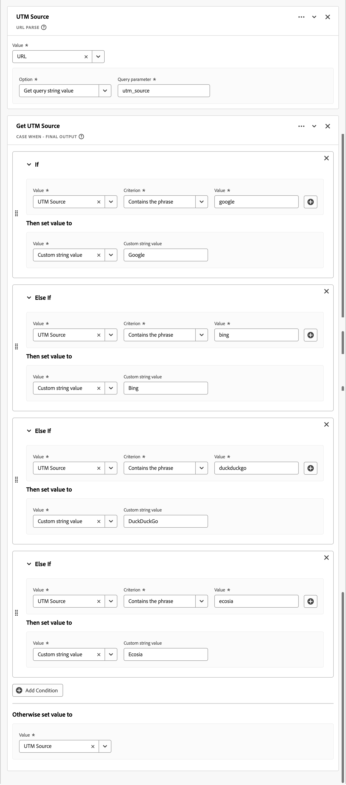
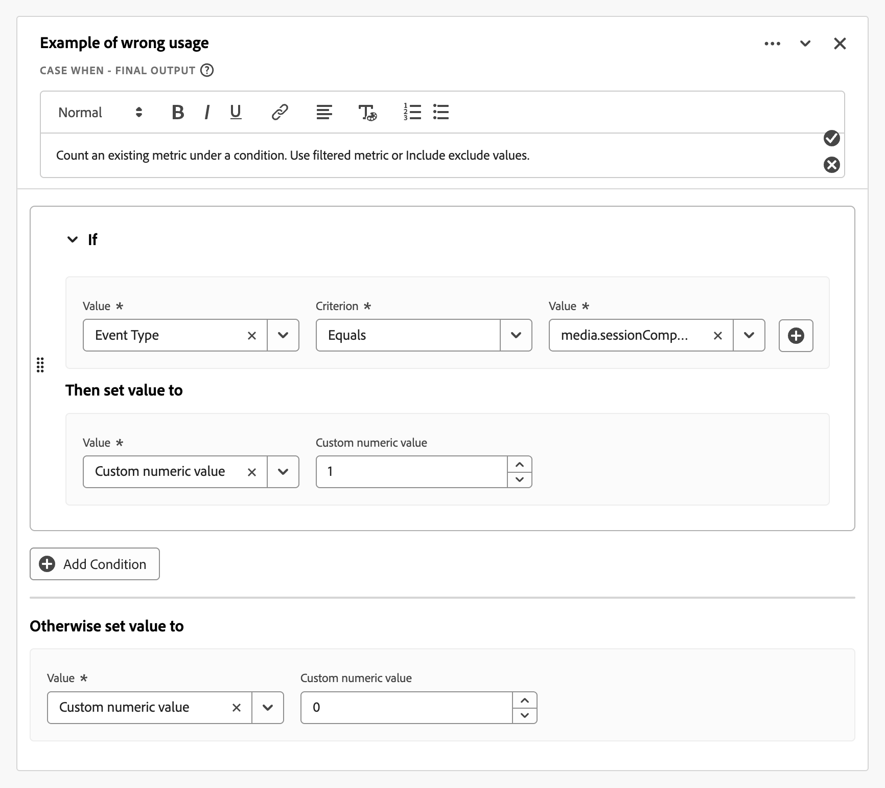

# 派生字段准则

Customer Journey Analytics [派生字段](./derived-fields.md)允许您在查询时转换、分类和扩充数据，而无需修改源数据集。 如果没有纪律性的应用，这种灵活性可能会带来复杂性、性能问题和维护开销。

本文提供了使用派生字段的准则（最佳实践、护栏和常见隐患）。 目标受众是数据架构师、产品管理员和分析师，他们需要：

* **优化性能**：识别降低查询执行速度或达到系统限制的模式，为作业选择正确的工具：

   * [派生字段](./derived-fields.md)
   * [数据视图设置](/help/data-views/component-settings/overview.md)
   * [数据准备](https://experienceleague.adobe.com/zh-hans/docs/experience-platform/data-prep/home)
   * [计算量度](/help/components/calc-metrics/calc-metr-overview.md)
   * [查找数据集](/help/getting-started/cja-upgrade/cja-upgrade-dataset-lookup.md)

* **改进可维护性**：生成清晰、模块化且易于更新的派生字段逻辑。
* **确保正确性**：避免分类、归因和数据转换中常见的逻辑错误。

本文中的部分按主题组织。 从过于复杂的规则链到误用[Lookup](./derived-fields.md#lookup)、[Regex Replace](./derived-fields.md#regex-replace)和[Next或Previous](./derived-fields.md#next-or-previous)之类的函数。 每个部分包括：

* 要检测的&#x200B;**模式**：派生字段定义中的可观察信号。
* **风险诊断**：为什么模式有问题。 可能的原因是对&#x200B;**性能**、**数据质量**&#x200B;或&#x200B;**维护**&#x200B;有负面影响。
* **建议**：重构或改进实施的具体步骤。

这些准则可帮助您在Customer Journey Analytics中创建高效、可扩展且语义正确的实施。 在审核现有数据视图、设计新的派生字段或构建治理工具时，请应用这些准则。

## 高基数派生字段

此部分讨论引用高基数派生字段的数据视图默认区段。

### 模式

* 数据视图引用基于高基数维度（大约100万或更多不同值）构建的派生字段的默认区段。 例如：整页URL。
* 简单操作(如[小写](./derived-fields.md#lowercase)、[Trim](./derived-fields.md#trim)或[Case When](./derived-fields.md#case-when)对页面URL的检查通常比在低基数字段上的相同逻辑（如页面名称、网站区域或URL组）更加昂贵。

### 风险诊断：性能

* 根据接触页面URL或其他高基数维度的派生字段进行过滤的默认区段，会为针对数据视图的每个查询添加延迟。

### 建议

* 避免直接在数据视图默认区段中引用整页URL或类似的高基数组件。 将繁重的URL逻辑（复杂的[大小写条件](./derived-fields.md#case-when)，[正则表达式替换](./derived-fields.md#regex-replace)，多个字符串函数）推送到上游的[数据准备](https://experienceleague.adobe.com/zh-hans/docs/experience-platform/data-prep/home)或[查找数据集](/help/getting-started/cja-upgrade/cja-upgrade-dataset-lookup.md)，以便生成的分类基于更简单、低基数维度。
* 首选低基数键，例如规范化的页面名称、网站区域或预分类的URL组。
* 定期审核现有数据视图默认区段和派生字段，以引用高基数维度（页面URL、促销活动ID、原始查询字符串），并重构为规范化键值或分组键。

## 规则链时过度复杂的大小写

本节讨论[Case When](./derived-fields.md#case-when)规则的过于复杂的链。

Customer Journey Analytics为每个派生字段强制实施显式[函数和运算符限制](derived-fields.md#limitations)（例如，运算符最大数、每种类型的函数最大数）。 过于复杂的函数和函数中的链更难维护，且容易出错。

### 模式

* 具有复杂[If](./derived-fields.md#case-when)和&#x200B;**[!UICONTROL Else If]**&#x200B;链的&#x200B;**[!UICONTROL 函数时的大小写]** Case：
   * 许多条件（例如：超过20个运算符）或深层嵌套（超过3或4个级别的嵌套[Case When](./derived-fields.md#case-when) **[!UICONTROL If]**&#x200B;和&#x200B;**[!UICONTROL Else If]**&#x200B;逻辑）。
   * 相同字段上具有不同值的重复条件。
* 重复的常量字符串匹配。

  +++ 示例

  

  +++

### 风险诊断：性能、数据质量、高维护

* 可维护性和错误风险：编码为单块规则块的逻辑难以调试和更新。
* 潜在性能和限制风险：您可能会达到或接近[运算符或函数限制](./derived-fields.md#limitations)，尤其是对于类分类模式。

### 建议

* 拆分为多个派生字段。 例如，将&#x200B;*营销活动标准化*（将不一致的营销活动标识符映射到规范值）与渠道分段分开，而不是在一个巨大的规则中组合所有内容。
* 使用查找数据集。 许多&#x200B;**[!UICONTROL 如果值&#x200B;_值_条件&#x200B;_条件_然后将&#x200B;_值_设置为值]**&#x200B;条件可以更好地作为[查找数据集](/help/getting-started/cja-upgrade/cja-upgrade-dataset-lookup.md)与[Lookup](./derived-fields.md#lookup)函数结合使用，而不是使用长[Case When](./derived-fields.md#case-when)链。
* 使用数据视图组件筛选器。 如果部分逻辑只是过滤掉错误值，请在数据视图组件级别使用[包括排除](/help/data-views/component-settings/include-exclude-values.md)，而不是将该逻辑嵌入派生字段中。

## 使用错误

本节讨论派生字段的错误使用。 尤其是当替代方案是更好的解决方案时。

>[!NOTE]
>
>将逻辑从派生字段移动到数据视图组件设置中本身不会改善查询性能。 这两种方法都编译为相同的底层派生逻辑。 本节中的建议与清晰度、治理和重复使用有关，而不是与速度有关。

### 模式

* 派生字段复制组件设置中已有的行为：
   * 大小写标准化、修剪或简单筛选（例如：不包括`unknown`、`undefined`或`null`），不增加复杂性。
   * 数字范围的基本分段。

     +++ 示例

     

     +++

     请改为对数据视图中的维度使用[值分段](/help/data-views/component-settings/value-bucketing.md)。
   * 使用[下一个或上一个](./derived-fields.md#next-or-previous)编码的持久性或归因逻辑，或数据视图[归因](/help/data-views/component-settings/attribution.md)和[到期](/help/data-views/component-settings/persistence.md)设置足以满足要求的手动序列逻辑。
   * 一种派生的量度，它只计算某个条件下的现有量度。

     +++ 示例

     

     +++

     这会复制筛选量度或[包括排除值](/help/data-views/component-settings/include-exclude-values.md)所能达到的目标。

### 风险诊断：数据质量、高维护性

* 冗余复杂性：在存在更简单的内置数据视图功能的情况下，使用派生字段。
* 治理风险：其他用户可能不了解为什么存在派生字段而非本机设置。 在派生字段管理中，该模式会增加混乱。
* 降低了可重用性：将条件标志编码为派生字段使得跨项目使用不同过滤器的基本量度更难重用。

### 建议

* 修剪/小写：使用[Substring](/help/data-views/component-settings/substring.md)和[Behavior](/help/data-views/component-settings/behavior.md)组件设置，除非您需要组合的多步转换。
* 值排除：在数据视图组件级别，而不是在派生字段中对量度或维度值使用[包括排除值](/help/data-views/component-settings/include-exclude-values.md)。
* 归因和持久性：避免在具有[下一个或上一个](./derived-fields.md#next-or-previous)或其他顺序逻辑的派生字段中模拟维度。 使用维度数据视图[归因](/help/data-views/component-settings/attribution.md)和[持久性](/help/data-views/component-settings/persistence.md)设置。
* 数值分段：保留派生字段的数值，并让数据视图在顶部创建分段维度，而不是在[Case When](./derived-fields.md#case-when)链中硬编码范围标签。
* 条件逻辑：将简单的0或1标志逻辑转换为：
   * Analysis Workspace中应用的具有包含或排除值过滤器逻辑的原始指标。
   * 使用数据视图组件设置配置的过滤量度。

## 指标和维度的分类错误

此部分讨论量度和维度的分类错误。

### 模式

* 派生字段会清楚地生成：
   * 数字输出（计数、比率或算术），但组件配置为维度。
   * 分类输出（标签或字符串），但组件配置为量度。
* 派生的字段将0/1标记编码为字符串。

Customer Journey Analytics允许将数值字段强制为维度，将字符串字段强制为数据视图级别的量度，但若不一致，可能会导致报表混乱。

### 风险诊断：数据质量

* 语义不匹配：组件类型与派生结果的性质不匹配，这使得组件类型更难以正确分析或聚合。

### 建议

* 如果输出是数字：
   * 在数据视图中将组件类型设置为&#x200B;**[!UICONTROL 量度]**。
   * 如果该组件表示一个子集量度（例如，**[!UICONTROL 结账页面查看次数]**），请在数据视图中使用过滤量度，而不是使用派生字符串加上顶部计算量度。
* 如果输出是标签：
   * 将组件类型设置为&#x200B;**[!UICONTROL Dimension]**&#x200B;并相应地配置[归因](/help/data-views/component-settings/attribution.md)和[持久性](/help/data-views/component-settings/persistence.md)设置。

## 营销渠道和营销活动逻辑隐患

此部分讨论营销渠道和营销活动逻辑缺陷。

>[!NOTE]
>
>考虑上游简化：使用[数据准备](https://experienceleague.adobe.com/zh-hans/docs/experience-platform/data-prep/home)、[查找数据集](/help/getting-started/cja-upgrade/cja-upgrade-dataset-lookup.md)或派生字段函数（如[分类](./derived-fields.md#classify)）来合并类似的营销渠道规则，并减少[Case When](./derived-fields.md#case-when)逻辑中的运算符数量。 此外，限制在渠道分类逻辑中引用的高基数字段的数量（例如：多个不同的查询参数键），因为这些字段会增加基数和查询成本。

### 模式

* Customer Journey Analytics营销渠道通常使用派生字段实施。

   * 根据URL参数、反向链接、登陆页面等实施营销渠道或营销活动分段的派生字段。
   * 可疑排序：在应用更具体的规则之前，将显示一个通用的“全部捕获”规则。
   * 未完成处理所有可能的选项：未设置&#x200B;**[!UICONTROL 反向链接域的显式分支]**&#x200B;或未设置&#x200B;**[!UICONTROL 查询参数]**。

### 风险诊断：数据质量

* 逻辑排序错误：链中后面的规则可能会覆盖特定渠道并导致分类错误的流量。
* 直接流量标签错误：不匹配的流量进入非预期渠道或标记为`Other`。

### 建议

* 强制实施自上而下的优先级排序。 将最强的信号放在最前（例如：用于排除付费促销活动参数的内部域）。
* 包括最终显式&#x200B;**[!UICONTROL 否则将值设置为]**&#x200B;大小写。 将回退设置为&#x200B;**[!UICONTROL 没有值]**&#x200B;以避免覆盖以前的渠道。 请勿在此捕获所有步骤中将该值设置为&#x200B;**[!UICONTROL 自定义字符串值]**，然后将&#x200B;**[!UICONTROL 自定义字符串值]**&#x200B;设置为`Direct`、`None`或`Unclassified`。
* 使用模板。 尽可能利用营销渠道派生字段模板。 或者至少将逻辑与Adobe推荐的营销渠道最佳实践保持一致。

## 在查找中使用的非规范化字符串键

本节讨论在查找中使用非规范化字符串键值的问题。

### 模式

* 针对事件或配置文件字段的[查找](./derived-fields.md#lookup)函数，用于提供查找数据集。
* 没有前面的[小写](./derived-fields.md#lowercase)、[Trim](./derived-fields.md#trim)或[Regex Replace](./derived-fields.md#regex-replace)标准化键。
* 常见候选项：URL、促销活动ID、电子邮件、帐户ID。

### 风险诊断：数据质量、高维护性

* 数据质量风险：当关键大小写或空格与查找表不同时，查找会失败，导致&#x200B;*不匹配*&#x200B;值，并且报表中存在间隙。

### 建议

* 在[Lookup](./derived-fields.md#lowercase)函数之前添加[小写](./derived-fields.md#trim)和[Trim](./derived-fields.md#lookup)函数，除非有文档说明保留大写或小写的原因。
* 如果已链接多个转换，请验证其顺序：先标准化，然后查找。

## 正则表达式滥用或伸手过长

此部分讨论派生字段的正则表达式功能滥用或过度覆盖问题。

### 模式

* [Regex Replace](./derived-fields.md#regex-replace)或基于regex的条件使用非常广泛的模式，其中simple [Case When](./derived-fields.md#case-when)函数与&#x200B;**[!UICONTROL Contains]**&#x200B;或&#x200B;**[!UICONTROL Starts with]**&#x200B;是更简单且更好的替代方案。

  +++ 示例

  

  

  +++

* 多个正则表达式条件重叠或冲突。
* 大量使用正则表达式来解析URL，而不是使用[URL Parse](./derived-fields.md#url-parse)函数。

### 风险诊断：性能、数据质量、高维护性

* 性能和可维护性风险：复杂的正则表达式模式更难调试，并且速度可能较慢。
* 正确性风险：过于宽泛的正则表达式可能会捕获意外的价值。

### 建议

* 首选标准URL元素（域、路径、查询参数）的[URL解析](./derived-fields.md#url-parse)而不是[正则表达式替换](./derived-fields.md#regex-replace)。
* 对于简单模式检查，使用[Case When](./derived-fields.md#case-when)和&#x200B;**[!UICONTROL Contains]**、**[!UICONTROL Starts with]**&#x200B;或&#x200B;**[!UICONTROL Ends with]**&#x200B;逻辑，而不是使用[Regex Replace](./derived-fields.md#regex-replace)的正则表达式。
* 标记使用多个嵌套组或简单模式替代的正则表达式。 或使用派生字段字符串函数替换的正则表达式。

## 派生字段中的计算量度样式逻辑

本节讨论在派生字段中计算样式逻辑的用法。

>[!NOTE]
>
>派生字段在聚合之前在事件（行）级别进行评估，而Analysis Workspace计算量度对已聚合的值发挥作用。 因此，比率、平均值和不同样式的计算可能会产生不同的结果，具体取决于这些计算是作为派生字段还是作为计算量度实施。 要仔细考虑算术的存留位置，因为评估的粒度会改变答案。

### 模式

* 类似于计算量度的派生字段（和、减、除）中的数值字段的纯算术。

  +++ 示例

  

  。

  +++

* 不使用字符串操作或分类；逻辑是纯数字的。

### 风险诊断：数据质量

* 治理和设计问题：算法可能更适合：
   * 派生字段量度（如果您希望派生字段作为所有用户的受管标准量度）。
   * Analysis Workspace中的计算量度（如果计算量度特定于分析）。

### 建议

* 如果算术结果通常在用户和项目中很有用，请将结果作为派生的字段量度保留。 确保组件类型为量度，并在数据视图级别配置格式（货币、百分比）。
* 如果结果属于小范围或特定于分析师，请将结果移至计算量度并简化数据视图。

## 过度使用下一个或上一个或顺序函数

本节讨论[Next或Previous](./derived-fields.md#next-or-previous)或顺序函数的过度使用。

### 模式

* 派生字段多次使用[Next或Previous](./derived-fields.md#next-or-previous)函数（接近记录的每个字段限制）。
* [Next或Previous](./derived-fields.md#next-or-previous)用于实现类似持久性的逻辑（例如：向前执行活动），而不是使用数据视图持久性。

### 风险诊断：数据质量、高维护性

* 复杂性和脆弱性：沉重的顺序逻辑更难推理，并且如果会话规则或排序更改可能会中断。
* 具有归因或持久性的冗余：数据视图归因设置可以更好地涵盖某些用例（例如，会话中的最近联系渠道归因）。

### 建议

* 对于与标准归因相似的模式，请在数据视图中使用维度[归因](/help/data-views/component-settings/attribution.md)和[持久性](/help/data-views/component-settings/persistence.md)设置，而不是使用[下一个或上一个](./derived-fields.md#next-or-previous)来模拟它们。
* 保留[Next或Previous](./derived-fields.md#next-or-previous)，用于仅归因无法实现的高级多步骤路径或funnel标记（例如：渠道序列连接）。

## 忽略会话和人员级别上下文

本节讨论在定义派生字段时忽略会话和人员级别上下文。

>[!NOTE]
>
>在某些情况下，在Analysis Workspace中，在会话或人员级别设定范围的区段可以比派生字段更简单地建模行为。 在适当时，请考虑使用区段而不是复杂的跨范围派生字段。

### 模式

* 派生字段隐式假定特定[容器级别](/help/getting-started/cja-b2b-concepts-features.md#containers)（事件、会话或人员），但：

   * 派生字段不引用会话或人员级别属性。
   * 数据视图会话设置与预期逻辑冲突。

### 风险诊断：数据质量

* 概念不匹配：派生字段语义可能与分析人员预期的聚合级别不匹配（例如：可随每个事件更改的基于角色的字段）。

### 建议

* 如果逻辑旨在为会话级别：请验证[会话设置](/help/data-views/session-settings.md)是否已正确配置，并考虑在Analysis Workspace或[集成的BI工具](/help/data-views/bi-extension.md)中使用会话范围的组件或摘要。
* 如果逻辑旨在用于人员级别：使用用户档案数据集或查找数据集，并在派生字段中引用这些数据集。
* 评估Analysis Workspace中会话范围或人员范围的区段能否比派生字段更简单地获得相同的结果。

## 达到或接近记录的函数限制

本节讨论达到或接近记录的派生字段函数限制的影响。

>[!NOTE]
>
>尽可能减少对复杂派生字段内高基数字段的依赖（例如：使用规范化键值或分组分类）以限制查询成本和达到[运算符或函数限制](./derived-fields.md#limitations)的可能性。

Customer Journey Analytics [文档](./derived-fields.md#limitations)每个派生字段的最大函数和运算符数，包括每个函数类型的限制（[Lookup](./derived-fields.md#lookup)、[Date Math](./derived-fields.md#date-math)、[Deduplicate](./derived-fields.md#deduplicate)、[Math](./derived-fields.md#math)、[Split](./derived-fields.md#split)、[URL Parse](./derived-fields.md#url-parse)等）。

### 模式

* 派生字段使用多个[查找](./derived-fields.md#lookup)、[Math](./derived-fields.md#math)操作、[拆分](./derived-fields.md#split)或其他函数。
* 运算符的数量接近[记录的限制](./derived-fields.md#limitations)（例如：超过70% - 80%的允许计数）。

### 风险诊断：性能、高维护性

* 可扩展性风险：如果字段达到其函数限制，则未来的添加操作可能会失败或出现意外行为。

### 建议

* 在使用量超过阈值时主动标记（例如：大于任何函数或运算符限制的70%）。
* 将逻辑拆分为链接在一起的多个派生字段（例如：将查找键规范化的派生字段A，以及派生字段Band normalize_key，然后lookup_label）。
* 在需要特别大的分类的情况下，使用外部数据准备或查找数据集。

## 数据视图特定的优化规则

此部分讨论派生字段的数据视图特定的优化规则。

同时检查每个派生组件的数据视图配置。

### 模式

* 派生维度具有默认归因（例如：最近联系且会话到期），但派生字段名称暗示不同的语义（例如： `First Campaign of Visit`， `Original Source`）。

### 风险诊断：数据质量

* 语义不匹配：维度的标签建议的[归因](/help/data-views/component-settings/attribution.md)或[到期](/help/data-views/component-settings/persistence.md)行为与实际配置的不同（例如：首次联系或原始源）。
* 这种不匹配增加了分析人员误解报表或比较名称相似但使用不同归因模型的组件的风险。

### 建议

* 调整该维度上的[分配模型和过期时间](/help/data-views/component-settings/persistence.md)以调整名称和行为。 例如，名为`Original Source`的派生字段维度应使用到期设置为“人员”的首次接触归因。
